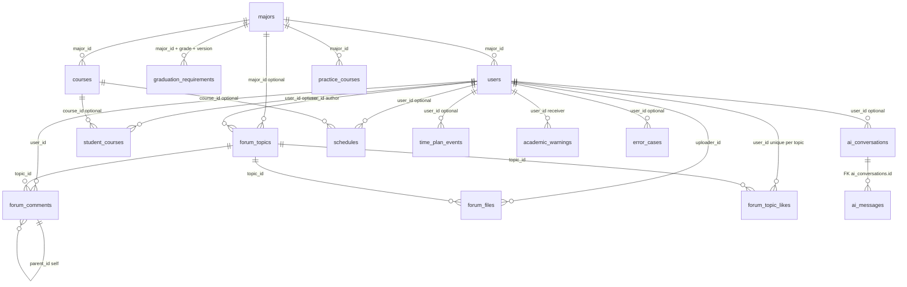

# 表模型说明（关联关系与字段）

本文档与 `app/models/` 下 SQLAlchemy 模型代码一致，说明各表字段、主外键及表间关系，便于建表、联调与后续迭代。

---

## 1. 公共约定

### 1.1 时间戳混入 `TimestampMixin`

凡继承 `TimestampMixin` 的表均包含：

| 字段 | 类型 | 说明 |
|------|------|------|
| `created_at` | `DATETIME` | 创建时间，`server_default=now()` |
| `updated_at` | `DATETIME` | 更新时间，`server_default=now()`，`onupdate=now()` |

### 1.2 主键与类型

- 主键与外键整型字段在模型中多为 `BigInteger`，对应 MySQL `BIGINT`。
- 学分类字段为 `Numeric(5,1)` 或 `Numeric(4,1)`，对应 MySQL `DECIMAL`。
- `JSON` 类型对应 MySQL `JSON`（或等价存储）。

---

## 2. 表间关系总览（ER）

---

## 3. 核心业务链：专业 → 培养方案 → 学生学业

### 3.1 `majors`（专业）

| 字段 | 类型 | 约束 | 说明 |
|------|------|------|------|
| `id` | BIGINT | PK，自增 | 专业主键 |
| `major_code` | VARCHAR(30) | UNIQUE，NOT NULL，索引 | 专业代码 |
| `major_name` | VARCHAR(100) | NOT NULL，索引 | 专业名称 |
| `major_category` | VARCHAR(100) | 可空 | 专业类别 |
| `degree` | VARCHAR(100) | 可空 | 授予学位 |
| `school_system` | VARCHAR(50) | 可空 | 学制 |
| `source_file` | VARCHAR(255) | 可空 | 数据来源文件 |
| `needs_review` | BOOL | NOT NULL，默认 false | 是否需人工复核 |
| `raw_json` | JSON | 可空 | 原始结构化 JSON |
| `created_at` / `updated_at` | DATETIME | 见混入 | 时间戳 |

**关系**：

- 一对多 → `users`（`users.major_id` → `majors.id`）
- 一对多 → `graduation_requirements`（按 `major_id + grade + version` 区分不同年级/版本培养方案）
- 一对多 → `courses`、`practice_courses`
- 一对多 → `forum_topics`（可选归属专业）

---

### 3.2 `graduation_requirements`（毕业要求宽表）

| 字段 | 类型 | 约束 | 说明 |
|------|------|------|------|
| `id` | BIGINT | PK | 主键 |
| `major_id` | BIGINT | FK → `majors.id`，NOT NULL | 所属专业 |
| `grade` | VARCHAR(20) | NOT NULL，默认 `通用` | 适用年级，例如 `2021级` |
| `version` | VARCHAR(50) | NOT NULL，默认 `default` | 培养方案版本 |
| `total_credits` … `major_optional_credits` | DECIMAL | 可空 | 各模块学分要求 |
| `other_requirements` | TEXT | 可空 | 其他文字要求 |
| `source_file` / `needs_review` / `raw_json` | 同 majors | | 溯源与复核 |
| `created_at` / `updated_at` | DATETIME | | |

**约束**：`UNIQUE(major_id, grade, version)`：同一专业、年级和版本只保留一套毕业要求。

**关系**：多对一 → `majors`（`major` 反向属性 `graduation_requirements`）。

---

### 3.3 `courses`（理论课程，按专业归属）

| 字段 | 类型 | 约束 | 说明 |
|------|------|------|------|
| `id` | BIGINT | PK | 主键 |
| `major_id` | BIGINT | FK → `majors.id`，NOT NULL，索引 | 所属专业 |
| `course_code` | VARCHAR(50) | NOT NULL，默认空字符串，索引 | 课程代码；无代码时以空字符串参与去重 |
| `course_name` | VARCHAR(150) | NOT NULL，索引 | 课程名 |
| `course_category` / `course_nature` | VARCHAR | 可空 | 类别、性质 |
| `module` | VARCHAR(100) | NOT NULL，默认空字符串 | 课程模块；无模块时以空字符串参与去重 |
| `credits` | DECIMAL(4,1) | NOT NULL，默认 0 | 学分 |
| `theory_hours` / `practice_hours` | DECIMAL(6,1) | 可空 | 学时 |
| `suggested_semester` / `assessment_type` | VARCHAR | 可空 | 建议学期、考核方式 |
| `source_file` / `raw_json` | | 可空 | 溯源 |
| `created_at` / `updated_at` | DATETIME | | |

**约束**：

- `UNIQUE(major_id, course_code, course_name, module)`：`uk_major_course_module`，用于导入去重
- 索引 `idx_courses_major_category(major_id, course_category)`

**关系**：

- 多对一 → `majors`
- 一对多 → `student_courses`、`schedules`（`course_id` 均可空，允许仅快照排课）

---

### 3.4 `practice_courses`（实践教学环节）

| 字段 | 类型 | 说明 |
|------|------|------|
| `id` | BIGINT PK | |
| `major_id` | BIGINT FK → `majors.id`，NOT NULL | 所属专业 |
| `item_name` | VARCHAR(150)，NOT NULL | 实践项目名称 |
| `module` / `suggested_semester` | VARCHAR，NOT NULL，默认空字符串 | 模块、建议学期；无数据时以空字符串参与去重 |
| `credits` / `weeks` / `hours` | | 学分、周数、学时 |
| `requirement_note` | | 要求说明 |
| `source_file` / `raw_json` | | 溯源 |
| `created_at` / `updated_at` | | |

**约束**：`UNIQUE(major_id, item_name, module, suggested_semester)`：`uk_major_practice_item`，用于实践环节导入去重。

**关系**：多对一 → `majors`。

---

### 3.5 `student_courses`（学生已修/在修课程）

| 字段 | 类型 | 约束 | 说明 |
|------|------|------|------|
| `id` | BIGINT | PK | |
| `user_id` | BIGINT | FK → `users.id`，可空，索引 | 关联登录用户（可选） |
| `student_id` | VARCHAR(30) | NOT NULL，索引 | **业务学号**，查询主入口 |
| `course_id` | BIGINT | FK → `courses.id`，可空 | 能关联则关联，否则仅快照 |
| `course_name` / `course_category` / `credits` | | NOT NULL（学分为 0 起） | **成绩快照**，防课程表变更影响历史 |
| `score` / `grade_point` | DECIMAL | 可空 | 成绩、绩点 |
| `semester` | VARCHAR(50) | 可空 | 修读学期 |
| `status` | VARCHAR(30) | NOT NULL，默认 `passed` | `passed/failed/in_progress/withdrawn` |
| `is_passed` | BOOL | NOT NULL，默认 true | 是否通过 |
| `created_at` / `updated_at` | | | |

**索引**：`idx_student_course_semester(student_id, course_name, semester)`。

**关系**：

- 多对一 → `users`（可选）
- 多对一 → `courses`（可选）

---

## 4. 用户与认证

### 4.1 `users`（统一用户，学生为主）

| 字段 | 类型 | 约束 | 说明 |
|------|------|------|------|
| `id` | BIGINT | PK | |
| `username` | VARCHAR(50) | UNIQUE，NOT NULL，索引 | 登录名，与学号一致 |
| `password_hash` | VARCHAR(255) | NOT NULL | 密码哈希 |
| `real_name` | VARCHAR(50) | 可空 | 真实姓名 |
| `student_id` | VARCHAR(30) | **UNIQUE**，NOT NULL，索引 | 学号，一个学号只能绑定一个账号 |
| `email` | VARCHAR(120) | 可空 | 邮箱 |
| `role` | VARCHAR(20) | NOT NULL，默认 `student` | `student` / `admin` |
| `major_id` | BIGINT | FK → `majors.id`，可空，索引 | 所属专业 |
| `grade` / `avatar_url` | | 可空 | 年级、头像 |
| `is_active` | BOOL | NOT NULL，默认 true | 是否启用 |
| `created_at` / `updated_at` | | | |

**关系**：

- 多对一 → `majors`（`major`）
- 被引用：`student_courses.user_id`、`ai_conversations.user_id`、`schedules.user_id`、`time_plan_events.user_id`、`academic_warnings.user_id`、`forum_topics.user_id`、`forum_comments.user_id`、`forum_files.uploader_id`、`error_cases.user_id`（均为可选或按业务必填，见各表）

**约束**：`CHECK(username = student_id)`，后端注册/登录按“登录名就是学号”处理。

---

## 5. AI 问询与会话

### 5.1 `ai_conversations`（会话头）

| 字段 | 类型 | 约束 | 说明 |
|------|------|------|------|
| `id` | BIGINT | PK | **数据库内部会话主键** |
| `conversation_id` | VARCHAR(100) | **UNIQUE**，NOT NULL，索引 | **前端/业务层会话 ID**（字符串，可与 Dify 对齐命名） |
| `dify_conversation_id` | VARCHAR(100) | 可空，索引 | Dify 返回的会话 ID |
| `user_id` | BIGINT | FK → `users.id`，可空 | 登录用户 |
| `student_id` | VARCHAR(30) | 可空，索引 | 学号快照 |
| `title` / `last_intent` | | 可空 | 会话标题、最近意图 |
| `inputs_json` | JSON | 可空 | 调用 Dify 时的业务变量快照 |
| `created_at` / `updated_at` | | | |

**关系**：一对多 → `ai_messages`（`cascade="all, delete-orphan"`：删会话会删消息）。

---

### 5.2 `ai_messages`（会话消息）

| 字段 | 类型 | 约束 | 说明 |
|------|------|------|------|
| `id` | BIGINT | PK | |
| `conversation_id` | BIGINT | FK → **`ai_conversations.id`**，NOT NULL，索引 | **注意：ORM 属性名为 `conversation_id`，存的是整型外键，指向会话表主键 `id`，不是 `ai_conversations.conversation_id` 字符串字段** |
| `role` | VARCHAR(20) | NOT NULL | `user` / `assistant` / `system` |
| `content` | TEXT | NOT NULL | 消息正文 |
| `intent` | VARCHAR(50) | 可空 | 意图 |
| `sources_json` | JSON | 可空 | 知识来源列表 |
| `need_personal_data` | BOOL | NOT NULL，默认 false | 是否需要个人数据 |
| `raw_response` | JSON | 可空 | 原始响应 |
| `created_at` / `updated_at` | | | |

**关系**：多对一 → `ai_conversations`（`messages` / `conversation`）。

---

## 6. 课表与时间规划

### 6.1 `schedules`（课表格子 + 备注）

| 字段 | 类型 | 约束 | 说明 |
|------|------|------|------|
| `id` | BIGINT | PK | |
| `user_id` | BIGINT | FK → `users.id`，可空 | 可选关联用户 |
| `student_id` | VARCHAR(30) | NOT NULL，索引 | 学号 |
| `course_id` | BIGINT | FK → `courses.id`，可空 | 可选关联培养方案课程 |
| `course_name` | VARCHAR(150) | NOT NULL | 课程名称（展示） |
| `teacher` / `location` | VARCHAR | 可空 | 教师、地点 |
| `semester` | VARCHAR(50) | NOT NULL，索引 | 学期 |
| `weeks_text` | VARCHAR(100) | 可空 | 如「1-16周」 |
| `start_week` / `end_week` | INT | NOT NULL，默认 1 / 20 | 结构化周次范围，用于按“第 N 周”精准过滤 |
| `week_pattern` | VARCHAR(20) | NOT NULL，默认 `all` | 周次规则：`all` / `odd` / `even` / `custom` |
| `day_of_week` | INT | NOT NULL | 周一到周日 1–7 |
| `start_section` / `end_section` | INT | NOT NULL | 节次区间 |
| `note` | TEXT | 可空 | 用户备注 |
| `created_at` / `updated_at` | | | |

**索引**：`idx_schedule_week_query(student_id, semester, start_week, end_week)` 支持周次过滤；`idx_schedule_grid(student_id, semester, day_of_week, start_section)` 支持课表格子查询。

**关系**：多对一 → `users`（可选）；多对一 → `courses`（可选，`relationship()` 未写 `back_populates`，仅为单向引用）。

---

### 6.2 `time_plan_events`（时间规划）

| 字段 | 类型 | 说明 |
|------|------|------|
| `id` | BIGINT PK | |
| `user_id` | BIGINT FK → `users.id`，可空 | |
| `student_id` | VARCHAR(30)，NOT NULL，索引 | 学号 |
| `title` | VARCHAR(150)，NOT NULL | 标题 |
| `event_type` | VARCHAR(30)，NOT NULL | 课程/考试/作业/个人 |
| `start_time` / `end_time` | DATETIME | 开始必填；结束可空 |
| `location` / `description` | 可空 | 地点、描述 |
| `reminder_time` | DATETIME，可空 | 提醒 |
| `status` | VARCHAR(30)，默认「待开始」 | |
| `source_type` | VARCHAR(30)，可空 | `manual` / `schedule_sync` |
| `source_id` | BIGINT，可空 | 若来自课表，可填 `schedules.id` |
| `created_at` / `updated_at` | | |

**关系**：多对一 → `users`（可选）。与 `schedules` 无强制外键，通过 `source_type` + `source_id` 软关联。

---

## 7. 论坛

### 7.1 `forum_topics`（话题）

| 字段 | 类型 | 约束 | 说明 |
|------|------|------|------|
| `id` | BIGINT | PK | |
| `user_id` | BIGINT | FK → `users.id`，NOT NULL | 发布者 |
| `major_id` | BIGINT | FK → `majors.id`，可空 | 所属专业 |
| `title` / `summary` / `content` | VARCHAR / TEXT | title、content NOT NULL | 标题、摘要、正文 |
| `tags_json` | JSON | 可空 | 标签数组 |
| `view_count` / `like_count` / `comment_count` | INT | NOT NULL，默认 0 | 计数 |
| `status` | VARCHAR(30) | NOT NULL，默认 `normal` | |
| `created_at` / `updated_at` | | | |

**关系**：

- 一对多 → `forum_comments`、`forum_files`、`forum_topic_likes`（均 `cascade="all, delete-orphan"`：删话题删评论、附件记录与点赞记录）

---

### 7.2 `forum_comments`（评论，支持二级）

| 字段 | 类型 | 约束 | 说明 |
|------|------|------|------|
| `id` | BIGINT | PK | |
| `topic_id` | BIGINT | FK → `forum_topics.id`，NOT NULL | 所属话题 |
| `user_id` | BIGINT | FK → `users.id`，NOT NULL | 评论人 |
| `parent_id` | BIGINT | FK → **`forum_comments.id`**，可空 | 空=一级评论；非空=回复某条评论 |
| `content` | TEXT | NOT NULL | 内容 |
| `like_count` / `status` | | | |
| `created_at` / `updated_at` | | | |

**关系**：

- 多对一 → `forum_topics`（`topic`）
- 自关联：`parent`（`remote_side=[id]`）↔ `replies`（子评论，`cascade="all, delete-orphan"`）

---

### 7.3 `forum_files`（附件元数据）

| 字段 | 类型 | 约束 | 说明 |
|------|------|------|------|
| `id` | BIGINT | PK | |
| `topic_id` | BIGINT | FK → `forum_topics.id`，NOT NULL | |
| `uploader_id` | BIGINT | FK → `users.id`，NOT NULL | 上传者 |
| `original_name` | VARCHAR(255) | NOT NULL | 原始文件名 |
| `storage_path` | VARCHAR(500) | NOT NULL | 存储路径（由上传服务填写） |
| `file_size` | BIGINT | 可空 | 字节 |
| `mime_type` | VARCHAR(100) | 可空 | |
| `download_count` | INT | NOT NULL，默认 0 | |
| `created_at` / `updated_at` | | | |

**关系**：多对一 → `forum_topics`（`topic`）。

---

### 7.4 `forum_topic_likes`（话题点赞）

| 字段 | 类型 | 约束 | 说明 |
|------|------|------|------|
| `id` | BIGINT | PK | |
| `topic_id` | BIGINT | FK → `forum_topics.id`，NOT NULL，索引 | 被点赞话题 |
| `user_id` | BIGINT | FK → `users.id`，NOT NULL，索引 | 点赞用户 |
| `created_at` / `updated_at` | | | |

**约束**：`UNIQUE(topic_id, user_id)`：`uk_forum_topic_user_like`，保证同一用户对同一话题只能点赞一次。

**关系**：多对一 → `forum_topics`（`topic`）。`like_count` 作为列表展示计数缓存，业务层应与本表增删保持一致。

---

## 8. 管理员预警：`academic_warnings`

| 字段 | 类型 | 说明 |
|------|------|------|
| `id` | BIGINT PK | |
| `user_id` | BIGINT FK → `users.id`，NOT NULL，索引 | 接收预警的用户 |
| `student_id` | VARCHAR(30)，NOT NULL，索引 | 接收预警的学号快照 |
| `title` | VARCHAR(150)，NOT NULL | 预警标题 |
| `content` | TEXT，NOT NULL | 预警内容 |
| `shown_at` | DATETIME，可空，索引 | 登录弹窗展示时间；为空表示下次登录待展示 |
| `created_at` / `updated_at` | | |

**关系**：多对一 → `users`。管理员发送后写入本表；学生登录时 `/api/auth/login` 返回未展示记录并写入 `shown_at`，保证只弹一次。

---

## 9. 扩展：`error_cases`（AI 错题）

| 字段 | 类型 | 说明 |
|------|------|------|
| `id` | BIGINT PK | |
| `user_id` | BIGINT FK → `users.id`，可空 | 反馈人 |
| `question` | TEXT，NOT NULL | 用户问题 |
| `wrong_answer` / `expected_answer` / `reason` | TEXT，可空 | 错误答案、期望、原因 |
| `status` | VARCHAR(30)，默认 `pending` | 处理状态 |
| `created_at` / `updated_at` | | |

**关系**：多对一 → `users`（可选）。

---

## 10. 级联删除一览（实现层行为）

| 父表 | 子表 | 行为 |
|------|------|------|
| `ai_conversations` | `ai_messages` | `cascade="all, delete-orphan"` |
| `forum_topics` | `forum_comments`、`forum_files` | `cascade="all, delete-orphan"` |
| `forum_topics` | `forum_topic_likes` | `cascade="all, delete-orphan"` |
| `forum_comments` | `forum_comments`（`replies`） | `cascade="all, delete-orphan"` |

**注意**：`majors`、`users` 等被多处 FK 引用，默认**不**级联删除；生产环境删除专业或用户前需在业务层处理子数据或改用软删除。

---

## 11. 代码入口

- 基类：`app/db/base.py` → `Base`
- 模型汇总：`app/models/__init__.py`（导入全部模型以便 `Base.metadata.create_all` 注册表）

若模型字段有调整，请同步更新本 README。
