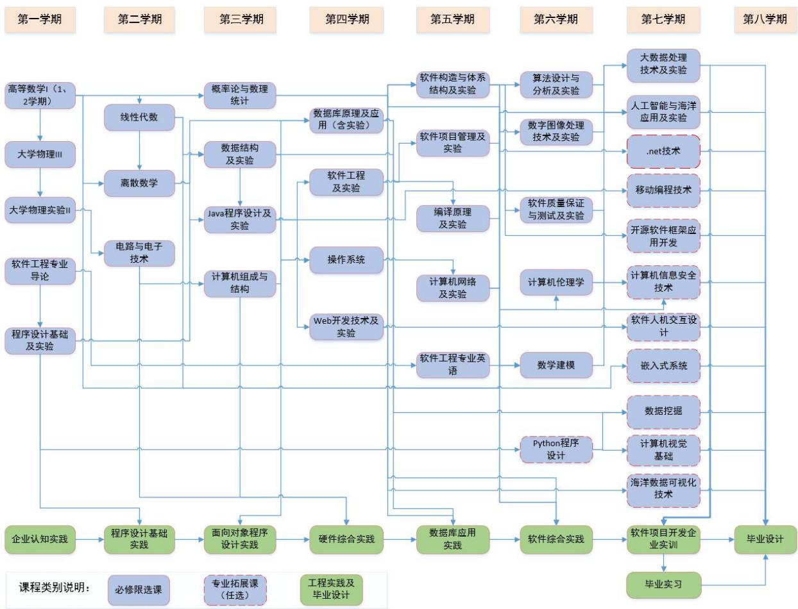

# （三）软件工程专业基础课程设置

<table><tr><td>课程模块</td><td>课程编号</td><td>课程名称</td><td>学分</td><td>学时</td><td>讲授</td><td>实验</td><td>开设学期/周学时</td><td>考核方式</td><td>备注</td></tr><tr><td rowspan="11">专业基础课31.5学分504学时</td><td>19221101</td><td>高等数学IHigher Mathematics I</td><td>9.5</td><td>152</td><td>72+80</td><td></td><td>1/6,2/5</td><td>考试</td><td rowspan="4">数学类</td></tr><tr><td>32411102</td><td>线性代数Linear Algebra</td><td>2</td><td>32</td><td>32</td><td></td><td>2/4</td><td>考试</td></tr><tr><td>19221302</td><td>概率论与数理统计Probability Theory and Mathematical Statistics</td><td>3.5</td><td>56</td><td>56</td><td></td><td>3/4</td><td>考试</td></tr><tr><td>32110306</td><td>数学建模Mathematical Modeling</td><td>2.5</td><td>40</td><td>40</td><td></td><td>6/4</td><td>考试</td></tr><tr><td>19121103</td><td>大学物理IIICollege Physics III</td><td>3.5</td><td>56</td><td>56</td><td></td><td>1/4</td><td>考试</td><td>物理类</td></tr><tr><td>32110305</td><td>经济学原理Principles of Economy</td><td>1.5</td><td>24</td><td>24</td><td></td><td>4/2</td><td>考查</td><td>管理学类</td></tr><tr><td>32110301</td><td>软件工程专业导论Introduction to Software Engineering</td><td>1</td><td>16</td><td>16</td><td></td><td>1/2</td><td>考查</td><td rowspan="4">学科基础类</td></tr><tr><td>32111612</td><td>程序设计基础Programming Basis</td><td>2</td><td>32</td><td>32</td><td></td><td>1/4</td><td>考试</td></tr><tr><td>32110303</td><td>电路与电子技术Circuit and Electronic Technology</td><td>4.5</td><td>72</td><td>60</td><td>12</td><td>2/4</td><td>考试</td></tr><tr><td>32351501</td><td>计算机伦理学Computer Ethics</td><td>1.5</td><td>24</td><td>24</td><td></td><td>6/2</td><td>考查</td></tr><tr><td colspan="2">小计</td><td>31.5</td><td>504</td><td>492</td><td>12</td><td></td><td></td><td></td></tr></table>

（四）软件工程专业课程设置  

<table><tr><td colspan="2">课程模块</td><td>课程编号</td><td>课程名称</td><td>学分</td><td>学时</td><td>讲授</td><td>实验</td><td>开设学期/周学时</td><td>考核方式</td><td>备注</td></tr><tr><td rowspan="20">专业课48学分768学时</td><td rowspan="11">必修</td><td>32111603</td><td>离散数学Discrete Mathematics</td><td>3.5</td><td>56</td><td>56</td><td></td><td>2/4</td><td>考试</td><td></td></tr><tr><td>32111602</td><td>数据结构Data Structure</td><td>3</td><td>48</td><td>48</td><td></td><td>3/6</td><td>考试</td><td></td></tr><tr><td>32111604</td><td>Java 程序设计Java Programming</td><td>2</td><td>32</td><td>32</td><td></td><td>3/4</td><td>考试</td><td></td></tr><tr><td>32111605</td><td>计算机组成与结构Computer Organization and Architecture</td><td>4</td><td>64</td><td>52</td><td>12</td><td>3/4</td><td>考试</td><td></td></tr><tr><td>32111606</td><td>数据库原理及应用Database Principle and Application</td><td>3</td><td>48</td><td>48</td><td></td><td>4/6</td><td>考试</td><td></td></tr><tr><td>32111607</td><td>操作系统Operating System</td><td>3</td><td>48</td><td>38</td><td>10</td><td>4/4</td><td>考试</td><td></td></tr><tr><td>32141106</td><td>软件工程Software Engineering</td><td>2.5</td><td>40</td><td>40</td><td></td><td>4/4</td><td>考试</td><td></td></tr><tr><td>32111610</td><td>软件构造与体系结构Software Construction and Architecture</td><td>3</td><td>48</td><td>48</td><td></td><td>5/4</td><td>考试</td><td></td></tr><tr><td>32141107</td><td>计算机网络Computer Networks</td><td>3</td><td>48</td><td>48</td><td></td><td>5/4</td><td>考试</td><td></td></tr><tr><td>32121606</td><td>软件项目管理Software Project Management</td><td>3</td><td>48</td><td>48</td><td></td><td>5/4</td><td>考试</td><td></td></tr><tr><td>32121609</td><td>软件质量保证与测试Software Quality Assurance and Testing</td><td>2.5</td><td>40</td><td>40</td><td></td><td>6/2</td><td>考试</td><td></td></tr><tr><td></td><td colspan="2">小计</td><td>32.5</td><td>520</td><td>498</td><td>22</td><td></td><td></td><td></td></tr><tr><td rowspan="8">限选</td><td>32121602</td><td>Web 开发技术Web Development Technology</td><td>1.5</td><td>24</td><td>24</td><td>49.5</td><td>4/4</td><td>考试</td><td></td></tr><tr><td>32121601</td><td>软件工程专业英语Specialized English of Software Engineering</td><td>1.5</td><td>24</td><td>24</td><td>49.5</td><td>5/2</td><td>考试</td><td></td></tr><tr><td>32111614</td><td>编译原理Compiler Principle</td><td>2</td><td>32</td><td>32</td><td>66</td><td>5/4</td><td>考试</td><td></td></tr><tr><td>32121604</td><td>算法设计与分析Algorithm Design and Analysis</td><td>2</td><td>32</td><td>32</td><td>66</td><td>6/4</td><td>考试</td><td></td></tr><tr><td>32121607</td><td>数字图像处理技术Digital Image Processing Technology</td><td>1.5</td><td>24</td><td>24</td><td>49.5</td><td>6/4</td><td>考查</td><td></td></tr><tr><td>32131606</td><td>大数据处理技术Big Data Processing Technology</td><td>1.5</td><td>24</td><td>24</td><td>49.5</td><td>7/4</td><td>考查</td><td></td></tr><tr><td>32121608</td><td>人工智能与海洋应用Artificial Intelligence and Ocean Applications</td><td>1.5</td><td>24</td><td>24</td><td>49.5</td><td>7/4</td><td>考查</td><td></td></tr><tr><td colspan="2">小计</td><td>11.5</td><td>184</td><td>184</td><td></td><td></td><td></td><td></td></tr><tr><td rowspan="11"></td><td rowspan="11">专业任选</td><td>32141603</td><td>Python程序设计
Python Programming</td><td>2</td><td>32</td><td>20</td><td>12</td><td>6/4</td><td>考查</td><td>任选</td></tr><tr><td>32141601</td><td>.net 技术
.net Technology</td><td>2</td><td>32</td><td>20</td><td>12</td><td>7/4</td><td>考查</td><td>任选</td></tr><tr><td>32141602</td><td>移动编程技术
Mobile Programming Technology</td><td>2</td><td>32</td><td>20</td><td>12</td><td>7/4</td><td>考查</td><td>任选</td></tr><tr><td>32141604</td><td>开源软件框架应用开发
Open Source Framework Application Development</td><td>2</td><td>32</td><td>20</td><td>12</td><td>7/4</td><td>考查</td><td>任选</td></tr><tr><td>32141610</td><td>软件人机交互设计
Human-Computer Interaction Design in Software Engineering</td><td>2</td><td>32</td><td>20</td><td>12</td><td>7/4</td><td>考查</td><td>任选</td></tr><tr><td>32141605</td><td>计算机信息安全技术
Computer Information Security Technology</td><td>2</td><td>32</td><td>20</td><td>12</td><td>7/4</td><td>考查</td><td>任选</td></tr><tr><td>32141606</td><td>嵌入式系统
Embedded Systems</td><td>2</td><td>32</td><td>20</td><td>12</td><td>7/4</td><td>考查</td><td>任选</td></tr><tr><td>32141607</td><td>数据挖掘
Data Mining</td><td>2</td><td>32</td><td>20</td><td>12</td><td>7/4</td><td>考查</td><td>任选</td></tr><tr><td>32141608</td><td>计算机视觉基础
Fundamentals of Computer Vision</td><td>2</td><td>32</td><td>20</td><td>12</td><td>7/4</td><td>考查</td><td>任选</td></tr><tr><td>32141609</td><td>海洋数据可视化技术
Ocean Data Visualization Technology</td><td>2</td><td>32</td><td>20</td><td>12</td><td>7/4</td><td>考查</td><td>任选</td></tr><tr><td colspan="2">小计</td><td>4</td><td>64</td><td>40</td><td>24</td><td></td><td></td><td>最低学分学时</td></tr><tr><td colspan="4">合计</td><td>48</td><td>768</td><td>722</td><td>46</td><td></td><td></td><td></td></tr></table>

（五）软件工程专业实践教学环节课程设置  

<table><tr><td colspan="2">课程模块</td><td>课程编号</td><td>实践环节名称及内容</td><td>学分</td><td>学时</td><td>周数</td><td>学期</td><td>组织形式</td></tr><tr><td colspan="2" rowspan="8">通识实践与创新训练7学分</td><td>j2861701</td><td>军事技能Military Skills</td><td>0</td><td></td><td>2</td><td>1</td><td>校内外集中进行</td></tr><tr><td>j5600102</td><td>入学教育Entrance Education</td><td>0</td><td></td><td>1</td><td>1</td><td>校内集中进行</td></tr><tr><td>j3211701</td><td>劳动教育Labour Education</td><td>0</td><td>32</td><td></td><td>1,3,5,7</td><td>校内集中进行</td></tr><tr><td>j1211000</td><td>社会调查与思想政治课社会实践The Social Investigations and Social Practice of Ideology- Politics Theory Course</td><td>2</td><td></td><td>2</td><td>5-6</td><td>校内外分散进行</td></tr><tr><td>j5600109</td><td>文体艺术综合素质实践Practice of Comprehensive Quality of Style and Art</td><td>2</td><td></td><td>4</td><td>1-8</td><td>校内外分散进行</td></tr><tr><td>j5600104</td><td>毕业教育Graduation Education</td><td>0</td><td></td><td>1</td><td>8</td><td>校内集中进行</td></tr><tr><td>j3241701</td><td>专业综合创新创业训练Professional Comprehensive Innovation and Entrepreneurship Training</td><td>3</td><td></td><td>6</td><td>1-8</td><td>校内外分散进行</td></tr><tr><td colspan="2">小计</td><td>7</td><td>32</td><td>16</td><td></td><td></td></tr><tr><td rowspan="12">教学实验与实训9.5学分</td><td rowspan="10">必修</td><td>19123101</td><td>大学物理实验IIExperiment of College Physics II</td><td>1</td><td>32</td><td></td><td>1</td><td>校内集中进行</td></tr><tr><td>s321116120</td><td>程序设计基础实验Experiments for Programming Basis</td><td>1</td><td>32</td><td></td><td>1</td><td>校内集中进行</td></tr><tr><td>s321116020</td><td>数据结构实验Experiments for Data Structure</td><td>0.5</td><td>16</td><td></td><td>3</td><td>校内集中进行</td></tr><tr><td>s321116040</td><td>Java 程序设计实验Experiments for Java Programming</td><td>0.5</td><td>16</td><td></td><td>3</td><td>校内集中进行</td></tr><tr><td>s321116060</td><td>数据库原理及应用实验Experiments for Database Principle and Application</td><td>0.5</td><td>16</td><td></td><td>4</td><td>校内集中进行</td></tr><tr><td>s321411060</td><td>软件工程实验Experiments for Software Engineering</td><td>0.5</td><td>16</td><td></td><td>4</td><td>校内集中进行</td></tr><tr><td>s321116100</td><td>软件构造与体系结构实验Experiments for Software Construction and Architecture</td><td>1</td><td>32</td><td></td><td>5</td><td>校内集中进行</td></tr><tr><td>s321411070</td><td>计算机网络实验Experiments for Computer Network</td><td>0.5</td><td>16</td><td></td><td>5</td><td>校内集中进行</td></tr><tr><td>s321216030</td><td>软件项目管理实验Experiments for Software Project Management</td><td>0.5</td><td>16</td><td></td><td>5</td><td>校内集中进行</td></tr><tr><td>s321216050</td><td>软件质量保证与测试实验Experiments for Software Quality Assurance and Testing</td><td>0.5</td><td>16</td><td></td><td>6</td><td>校内集中进行</td></tr><tr><td rowspan="2">限选</td><td>s321216020</td><td>Web 开发技术实验Experiments for Web Development Technology</td><td>0.5</td><td>16</td><td></td><td>4</td><td>校内集中进行</td></tr><tr><td>s321116190</td><td>编译原理实验Experiments for Compiler Principle</td><td>0.5</td><td>16</td><td></td><td>5</td><td>校内集中进行</td></tr><tr><td rowspan="5"></td><td rowspan="5"></td><td>s321216040</td><td>算法设计与分析实验
Experiments for Algorithm Design and Analysis</td><td>0.5</td><td>16</td><td></td><td>6</td><td>校内集中进行</td></tr><tr><td>s321216070</td><td>数字图像处理技术实验
Experiments for Digital Image Processing Technology</td><td>0.5</td><td>16</td><td></td><td>6</td><td>校内集中进行</td></tr><tr><td>s321216060</td><td>大数据处理技术实验
Experiments for Big Data Processing Technology</td><td>0.5</td><td>16</td><td></td><td>7</td><td>校内集中进行</td></tr><tr><td>s321216080</td><td>人工智能与海洋应用实验
Experiments for Artificial Intelligence and Ocean Applications</td><td>0.5</td><td>16</td><td></td><td>7</td><td>校内集中进行</td></tr><tr><td colspan="2">小计</td><td>9.5</td><td>304</td><td></td><td></td><td></td></tr><tr><td colspan="2" rowspan="8">课程与专业实习18学分</td><td>j3211711</td><td>企业认知实践
Cognitive Practice in Enterprise</td><td>1</td><td></td><td>1</td><td>1</td><td>校内外集中进行</td></tr><tr><td>j1650112</td><td>程序设计基础实践
Foundation Programming Exercitation</td><td>2</td><td></td><td>2</td><td>2</td><td>校内集中进行</td></tr><tr><td>j1650405</td><td>面向对象程序设计实践
Advanced Programming Exercitation</td><td>2</td><td></td><td>2</td><td>3</td><td>校内集中进行</td></tr><tr><td>j3211712</td><td>硬件综合实践
Hardware Comprehensive Exercitation</td><td>2</td><td></td><td>2</td><td>4</td><td>校内集中进行</td></tr><tr><td>j1650120</td><td>数据库应用实践
Database Exercitation</td><td>2</td><td></td><td>2</td><td>5</td><td>校内集中进行</td></tr><tr><td>j3211713</td><td>软件综合实践
Software Comprehensive Exercitation</td><td>3</td><td></td><td>3</td><td>6</td><td>校内集中进行</td></tr><tr><td>j3211714</td><td>软件工程项目开发企业实训(含2周海洋信息处理相关实训)
Software engineering project development enterprise training</td><td>6</td><td></td><td>6</td><td>7</td><td>校内外集中进行</td></tr><tr><td colspan="2">小计</td><td>18</td><td></td><td>18</td><td></td><td></td></tr><tr><td colspan="2" rowspan="3">毕业实习与论文(设计)9学分</td><td>j1650122</td><td>毕业实习
Graduation Practice</td><td>2</td><td></td><td>4</td><td>7</td><td>校内外集中或分散进行</td></tr><tr><td>j3211715</td><td>毕业设计
Graduation Project</td><td>7</td><td></td><td>14</td><td>8</td><td>校内外分散进行</td></tr><tr><td colspan="2">小计</td><td>9</td><td></td><td>18</td><td></td><td></td></tr><tr><td colspan="4">合计</td><td>43.5</td><td>336</td><td>52</td><td></td><td></td></tr></table>

# 十一、毕业要求与课程体系关联度矩阵

毕业要求是课程体系构建的依据，课程体系是达成毕业要求的支撑，通过毕业要求的逐级分解，将相关要求落实于每一课程（模块、环节等）。关联度符号：H-高，M-中，L-低。

<table><tr><td rowspan="2">课程模块</td><td rowspan="2">课程名称</td><td colspan="3">1 工程知识</td><td colspan="3">2 问题分析</td><td colspan="3">3 设计/开发解决方案</td><td colspan="3">4 研究</td><td colspan="3">5 使用现代工具</td><td colspan="2">6 工程与社会</td><td colspan="2">7 环境和可持续发展</td><td colspan="2">8 职业规范</td><td colspan="2">9 个人和团队</td><td colspan="2">10 沟通</td><td colspan="3">11 项目管理</td><td colspan="2">12 终身学习</td></tr><tr><td>1</td><td>2</td><td>3</td><td>1</td><td>2</td><td>3</td><td>1</td><td>2</td><td>3</td><td>1</td><td>2</td><td>3</td><td>1</td><td>2</td><td>3</td><td>1</td><td>2</td><td>1</td><td>2</td><td>1</td><td>2</td><td>1</td><td>2</td><td>1</td><td>2</td><td>3</td><td>1</td><td>2</td><td></td><td></td></tr><tr><td rowspan="7">思想政治理论课</td><td>思想道德与法治</td><td></td><td></td><td></td><td></td><td></td><td></td><td></td><td></td><td></td><td></td><td></td><td></td><td></td><td></td><td></td><td>0.2</td><td></td><td>0.3</td><td></td><td></td><td></td><td></td><td></td><td></td><td></td><td></td><td></td><td></td><td></td><td></td></tr><tr><td>马克思主义中国化进程与青年学生使命担当</td><td></td><td></td><td></td><td></td><td></td><td></td><td></td><td></td><td></td><td></td><td></td><td></td><td></td><td></td><td></td><td></td><td></td><td></td><td></td><td></td><td>0.2</td><td></td><td></td><td></td><td></td><td></td><td></td><td>0.2</td><td></td><td></td></tr><tr><td>中国近现代史纲要</td><td></td><td></td><td></td><td></td><td></td><td></td><td></td><td></td><td></td><td></td><td></td><td></td><td></td><td></td><td></td><td></td><td></td><td></td><td></td><td>0.1</td><td></td><td></td><td></td><td></td><td></td><td></td><td></td><td></td><td></td><td></td></tr><tr><td>马克思主义基本原理</td><td></td><td></td><td></td><td></td><td></td><td></td><td></td><td></td><td></td><td></td><td></td><td></td><td></td><td></td><td></td><td></td><td></td><td></td><td></td><td>0.3</td><td></td><td></td><td></td><td></td><td></td><td></td><td></td><td></td><td></td><td></td></tr><tr><td>毛泽东思想和中国特色社会主义理论体系概论</td><td></td><td></td><td></td><td></td><td></td><td></td><td></td><td></td><td></td><td></td><td></td><td></td><td></td><td></td><td></td><td></td><td></td><td></td><td></td><td></td><td>0.3</td><td></td><td></td><td></td><td></td><td></td><td></td><td>0.3</td><td></td><td></td></tr><tr><td>形势与政策教育</td><td></td><td></td><td></td><td></td><td></td><td></td><td></td><td></td><td></td><td></td><td></td><td></td><td></td><td></td><td></td><td></td><td></td><td></td><td>0.2</td><td></td><td></td><td></td><td></td><td></td><td></td><td></td><td></td><td></td><td></td><td></td></tr><tr><td>改革开放史</td><td></td><td></td><td></td><td></td><td></td><td></td><td></td><td></td><td></td><td></td><td></td><td></td><td></td><td></td><td></td><td></td><td>0.2</td><td></td><td></td><td></td><td></td><td></td><td></td><td></td><td></td><td></td><td></td><td></td><td></td><td></td></tr><tr><td rowspan="8">通识教育课</td><td>青年学生健康教育</td><td></td><td></td><td></td><td></td><td></td><td></td><td></td><td></td><td></td><td></td><td></td><td></td><td></td><td></td><td></td><td></td><td>0.1</td><td></td><td></td><td></td><td></td><td></td><td></td><td></td><td></td><td></td><td></td><td></td><td></td><td></td></tr><tr><td>军事理论</td><td></td><td></td><td></td><td></td><td></td><td></td><td></td><td></td><td></td><td></td><td></td><td></td><td></td><td></td><td></td><td></td><td></td><td></td><td></td><td></td><td>0.2</td><td></td><td></td><td></td><td></td><td></td><td></td><td></td><td></td><td></td></tr><tr><td>大学生心理健康教育</td><td></td><td></td><td></td><td></td><td></td><td></td><td></td><td></td><td></td><td></td><td></td><td></td><td></td><td></td><td></td><td></td><td></td><td></td><td></td><td></td><td>0.1</td><td></td><td></td><td></td><td></td><td></td><td></td><td></td><td></td><td></td></tr><tr><td>大学生职业发展与就业指导</td><td></td><td></td><td></td><td></td><td></td><td></td><td></td><td></td><td></td><td></td><td></td><td></td><td></td><td></td><td></td><td></td><td></td><td></td><td></td><td></td><td></td><td></td><td></td><td></td><td></td><td></td><td></td><td>0.3</td><td></td><td></td></tr><tr><td>创新创业教育</td><td></td><td></td><td></td><td></td><td></td><td></td><td></td><td></td><td></td><td></td><td></td><td></td><td></td><td></td><td></td><td></td><td></td><td></td><td></td><td></td><td></td><td></td><td>0.3</td><td></td><td></td><td></td><td></td><td></td><td></td><td></td></tr><tr><td>体育</td><td></td><td></td><td></td><td></td><td></td><td></td><td></td><td></td><td></td><td></td><td></td><td></td><td></td><td></td><td></td><td></td><td></td><td></td><td></td><td>0.2</td><td></td><td></td><td></td><td></td><td></td><td></td><td></td><td></td><td></td><td></td></tr><tr><td>大学英语(日语)读写(I,II,III)</td><td></td><td></td><td></td><td></td><td></td><td></td><td></td><td></td><td></td><td></td><td></td><td></td><td></td><td></td><td></td><td></td><td></td><td></td><td></td><td></td><td></td><td></td><td></td><td>0.2</td><td></td><td></td><td></td><td></td><td></td><td></td></tr><tr><td>大学英语(日语)听说(I,II,III)</td><td></td><td></td><td></td><td></td><td></td><td></td><td></td><td></td><td></td><td></td><td></td><td></td><td></td><td></td><td></td><td></td><td></td><td></td><td></td><td></td><td></td><td></td><td></td><td>0.2</td><td></td><td></td><td></td><td></td><td></td><td></td></tr><tr><td rowspan="6">专业基础课</td><td>高等数学I</td><td>0.3</td><td></td><td></td><td>0.3</td><td></td><td></td><td></td><td></td><td></td><td></td><td></td><td></td><td></td><td></td><td></td><td></td><td></td><td></td><td></td><td></td><td></td><td></td><td></td><td></td><td></td><td></td><td></td><td></td><td></td><td></td></tr><tr><td>线性代数</td><td>0.2</td><td></td><td></td><td>0.1</td><td></td><td></td><td></td><td></td><td></td><td></td><td></td><td></td><td></td><td></td><td></td><td></td><td></td><td></td><td></td><td></td><td></td><td></td><td></td><td></td><td></td><td></td><td></td><td></td><td></td><td></td></tr><tr><td>概率论与数理统计</td><td></td><td>0.2</td><td></td><td>0.2</td><td></td><td></td><td></td><td></td><td></td><td></td><td></td><td></td><td></td><td></td><td></td><td></td><td></td><td></td><td></td><td></td><td></td><td></td><td></td><td></td><td></td><td></td><td></td><td></td><td></td><td></td></tr><tr><td>数学建模</td><td></td><td>0.3</td><td></td><td></td><td>0.2</td><td></td><td></td><td></td><td></td><td></td><td></td><td>0.2</td><td></td><td></td><td></td><td></td><td></td><td></td><td></td><td></td><td></td><td></td><td></td><td></td><td></td><td></td><td></td><td></td><td></td><td></td></tr><tr><td>大学物理 III</td><td>0.3</td><td></td><td></td><td>0.2</td><td></td><td></td><td></td><td></td><td></td><td></td><td></td><td></td><td></td><td></td><td></td><td></td><td></td><td></td><td></td><td></td><td></td><td></td><td></td><td></td><td></td><td></td><td></td><td></td><td></td><td></td></tr><tr><td>经济学原理</td><td></td><td></td><td></td><td></td><td></td><td></td><td></td><td></td><td>0.2</td><td></td><td></td><td></td><td></td><td></td><td></td><td></td><td></td><td></td><td></td><td></td><td></td><td></td><td></td><td></td><td>0.2</td><td></td><td></td><td></td><td></td><td></td></tr></table>

<table><tr><td rowspan="2">课程模块</td><td rowspan="2">课程名称</td><td colspan="3">1 工程知识</td><td colspan="3">2 问题分析</td><td colspan="3">3 设计/开发解决方案</td><td colspan="4">4 研究</td><td colspan="3">5 使用现代工具</td><td colspan="2">6 工程与 社会</td><td colspan="2">7 环境和 可持续 发展</td><td colspan="2">8 职业规范</td><td colspan="2">9 个人和 团队</td><td colspan="2">10 沟通</td><td colspan="3">11 项目管理</td><td colspan="2">12 终身学习</td></tr><tr><td>1</td><td>2</td><td>3</td><td>1</td><td>2</td><td>3</td><td>1</td><td>2</td><td>3</td><td>1</td><td>2</td><td>3</td><td>1</td><td>2</td><td>3</td><td>1</td><td>2</td><td>3</td><td>1</td><td>2</td><td>1</td><td>2</td><td>1</td><td>2</td><td>1</td><td>2</td><td>1</td><td>2</td><td>3</td><td>1</td><td>2</td></tr><tr><td rowspan="4"></td><td>软件工程专业导论</td><td></td><td></td><td></td><td></td><td></td><td></td><td></td><td></td><td></td><td></td><td></td><td></td><td></td><td></td><td></td><td></td><td></td><td></td><td></td><td></td><td></td><td></td><td></td><td></td><td></td><td></td><td></td><td>0.2</td><td></td><td>0.2</td><td></td></tr><tr><td>程序设计基础</td><td></td><td></td><td></td><td></td><td></td><td></td><td></td><td></td><td></td><td></td><td></td><td></td><td>0.2</td><td></td><td></td><td>0.2</td><td></td><td></td><td></td><td></td><td></td><td></td><td></td><td></td><td></td><td></td><td></td><td></td><td></td><td></td><td></td></tr><tr><td>电路与电子技术</td><td>0.2</td><td></td><td></td><td></td><td></td><td></td><td>0.2</td><td></td><td></td><td></td><td></td><td></td><td></td><td></td><td></td><td></td><td></td><td></td><td></td><td></td><td></td><td></td><td></td><td></td><td></td><td></td><td></td><td></td><td></td><td></td><td></td></tr><tr><td>计算机伦理学</td><td></td><td></td><td></td><td></td><td></td><td></td><td></td><td></td><td></td><td></td><td></td><td></td><td></td><td></td><td></td><td></td><td></td><td></td><td></td><td></td><td>0.2</td><td></td><td></td><td></td><td></td><td></td><td></td><td></td><td></td><td></td><td></td></tr><tr><td rowspan="18">专业课</td><td>离散数学</td><td></td><td>0.2</td><td></td><td>0.2</td><td></td><td></td><td></td><td></td><td></td><td></td><td></td><td></td><td></td><td></td><td></td><td></td><td></td><td></td><td></td><td></td><td></td><td></td><td></td><td></td><td></td><td></td><td></td><td></td><td></td><td></td><td></td></tr><tr><td>数据结构</td><td></td><td>0.3</td><td></td><td></td><td>0.3</td><td></td><td></td><td></td><td>0.2</td><td></td><td></td><td></td><td></td><td></td><td></td><td></td><td></td><td></td><td></td><td></td><td></td><td></td><td></td><td></td><td></td><td></td><td></td><td></td><td></td><td></td><td></td></tr><tr><td>Java 程序设计</td><td></td><td></td><td></td><td></td><td>0.3</td><td></td><td></td><td></td><td></td><td>0.2</td><td></td><td></td><td></td><td></td><td></td><td></td><td>0.3</td><td></td><td></td><td></td><td></td><td></td><td></td><td></td><td></td><td></td><td></td><td></td><td></td><td></td><td></td></tr><tr><td>计算机组成与结构</td><td></td><td></td><td>0.1</td><td></td><td></td><td>0.2</td><td></td><td>0.2</td><td></td><td></td><td></td><td></td><td></td><td></td><td></td><td></td><td></td><td></td><td></td><td></td><td></td><td></td><td></td><td></td><td></td><td></td><td></td><td></td><td></td><td></td><td></td></tr><tr><td>数据库原理及应用</td><td></td><td></td><td>0.3</td><td></td><td></td><td>0.3</td><td></td><td></td><td></td><td></td><td></td><td>0.3</td><td></td><td></td><td></td><td></td><td></td><td></td><td></td><td></td><td></td><td></td><td></td><td></td><td></td><td></td><td></td><td></td><td></td><td></td><td></td></tr><tr><td>操作系统</td><td></td><td></td><td>0.3</td><td></td><td></td><td>0.3</td><td>0.2</td><td></td><td></td><td></td><td></td><td></td><td></td><td></td><td></td><td></td><td></td><td></td><td></td><td></td><td></td><td></td><td></td><td></td><td></td><td></td><td>0.3</td><td></td><td></td><td></td><td></td></tr><tr><td>软件工程</td><td></td><td></td><td></td><td></td><td></td><td></td><td>0.2</td><td></td><td></td><td>0.3</td><td></td><td></td><td></td><td></td><td></td><td></td><td></td><td>0.2</td><td></td><td></td><td></td><td></td><td></td><td></td><td></td><td></td><td></td><td>0.3</td><td></td><td></td><td></td></tr><tr><td>软件构造与体系结构</td><td></td><td></td><td></td><td></td><td></td><td></td><td></td><td></td><td></td><td>0.3</td><td></td><td>0.3</td><td></td><td></td><td>0.2</td><td></td><td></td><td></td><td></td><td></td><td></td><td></td><td></td><td></td><td></td><td></td><td></td><td></td><td>0.3</td><td></td><td></td></tr><tr><td>计算机网络</td><td></td><td></td><td>0.2</td><td></td><td></td><td>0.2</td><td>0.1</td><td></td><td></td><td></td><td></td><td></td><td></td><td></td><td></td><td></td><td></td><td></td><td></td><td></td><td></td><td></td><td></td><td></td><td></td><td></td><td></td><td></td><td></td><td></td><td></td></tr><tr><td>软件项目管理</td><td></td><td></td><td></td><td></td><td></td><td></td><td></td><td></td><td></td><td></td><td></td><td></td><td></td><td></td><td></td><td></td><td></td><td></td><td></td><td>0.3</td><td></td><td></td><td></td><td>0.3</td><td></td><td></td><td></td><td></td><td>0.3</td><td></td><td></td></tr><tr><td>软件质量保证与测试</td><td></td><td></td><td></td><td></td><td></td><td></td><td></td><td></td><td></td><td>0.2</td><td></td><td></td><td></td><td></td><td></td><td></td><td>0.3</td><td></td><td></td><td></td><td></td><td></td><td></td><td></td><td></td><td></td><td></td><td>0.2</td><td></td><td></td><td></td></tr><tr><td>Web 开发技术</td><td></td><td></td><td></td><td></td><td></td><td></td><td></td><td></td><td></td><td>0.1</td><td></td><td></td><td></td><td></td><td></td><td></td><td>0.2</td><td></td><td></td><td></td><td></td><td></td><td></td><td></td><td></td><td></td><td></td><td></td><td></td><td></td><td></td></tr><tr><td>软件工程专业英语</td><td></td><td></td><td></td><td></td><td></td><td></td><td></td><td></td><td></td><td></td><td></td><td></td><td></td><td></td><td></td><td></td><td></td><td></td><td></td><td></td><td></td><td></td><td></td><td></td><td></td><td></td><td>0.3</td><td></td><td></td><td></td><td>0.2</td></tr><tr><td>编译原理</td><td></td><td></td><td></td><td></td><td>0.2</td><td></td><td></td><td></td><td></td><td></td><td>0.3</td><td></td><td></td><td></td><td></td><td></td><td></td><td></td><td></td><td></td><td></td><td></td><td></td><td></td><td></td><td></td><td></td><td></td><td></td><td></td><td></td></tr><tr><td>算法设计与分析</td><td></td><td></td><td></td><td></td><td></td><td></td><td>0.3</td><td></td><td></td><td></td><td></td><td></td><td>0.3</td><td></td><td></td><td></td><td></td><td></td><td></td><td></td><td></td><td></td><td></td><td></td><td></td><td></td><td></td><td></td><td></td><td></td><td></td></tr><tr><td>数字图像处理</td><td></td><td></td><td></td><td></td><td></td><td></td><td></td><td></td><td></td><td></td><td></td><td>0.2</td><td></td><td></td><td>0.2</td><td></td><td></td><td></td><td></td><td></td><td></td><td></td><td></td><td></td><td></td><td></td><td></td><td></td><td></td><td></td><td></td></tr><tr><td>大数据处理技术</td><td></td><td></td><td></td><td></td><td></td><td></td><td></td><td>0.1</td><td></td><td></td><td></td><td></td><td>0.3</td><td></td><td></td><td></td><td></td><td></td><td></td><td></td><td></td><td></td><td></td><td></td><td></td><td></td><td></td><td></td><td></td><td></td><td>0.3</td></tr><tr><td>人工智能与海洋应用</td><td></td><td></td><td></td><td></td><td></td><td></td><td></td><td></td><td></td><td></td><td></td><td>0.2</td><td></td><td></td><td></td><td></td><td></td><td></td><td></td><td></td><td></td><td></td><td></td><td></td><td>0.2</td><td></td><td></td><td></td><td></td><td></td><td>0.3</td></tr><tr><td rowspan="4">通识实践与创新训练</td><td>社会调查与思想政治课社会实践</td><td></td><td></td><td></td><td></td><td></td><td></td><td></td><td></td><td></td><td></td><td></td><td></td><td></td><td></td><td></td><td></td><td></td><td></td><td></td><td>0.2</td><td></td><td></td><td></td><td></td><td></td><td></td><td></td><td></td><td></td><td></td><td></td></tr><tr><td>劳动教育</td><td></td><td></td><td></td><td></td><td></td><td></td><td></td><td></td><td></td><td></td><td></td><td></td><td></td><td></td><td></td><td></td><td></td><td></td><td></td><td></td><td>0.2</td><td></td><td></td><td></td><td></td><td></td><td></td><td></td><td></td><td></td><td></td></tr><tr><td>文体艺术综合素质实践</td><td></td><td></td><td></td><td></td><td></td><td></td><td></td><td></td><td></td><td></td><td></td><td></td><td></td><td></td><td></td><td></td><td></td><td></td><td></td><td></td><td>0.2</td><td></td><td></td><td></td><td></td><td></td><td></td><td></td><td></td><td></td><td></td></tr><tr><td>专业综合创新创业训练</td><td></td><td></td><td></td><td></td><td></td><td></td><td></td><td></td><td></td><td></td><td></td><td></td><td></td><td></td><td></td><td></td><td></td><td>0.2</td><td></td><td></td><td></td><td></td><td></td><td></td><td></td><td></td><td></td><td>0.2</td><td></td><td></td><td></td></tr><tr><td rowspan="2">课程模块</td><td rowspan="2">课程名称</td><td colspan="3">1 工程知识</td><td colspan="3">2 问题分析</td><td colspan="3">3 设计/开发解决方案</td><td colspan="3">4 研究</td><td colspan="3">5 使用现代工具</td><td colspan="2">6 工程与社会</td><td colspan="2">7 环境和可持续发展</td><td colspan="2">8 职业规范</td><td colspan="2">9 个人和团队</td><td colspan="2">10 沟通</td><td colspan="3">11 项目管理</td><td colspan="3">12 终身学习</td></tr><tr><td>1</td><td>2</td><td>3</td><td>1</td><td>2</td><td>3</td><td>1</td><td>2</td><td>3</td><td>1</td><td>2</td><td>3</td><td>1</td><td>2</td><td>3</td><td>1</td><td>2</td><td>1</td><td>2</td><td>1</td><td>2</td><td>1</td><td>2</td><td>1</td><td>2</td><td>1</td><td>2</td><td>3</td><td>1</td><td colspan="2">2</td></tr><tr><td>教学实验与实训</td><td>大学物理实验Ⅱ</td><td></td><td></td><td>0.1</td><td></td><td></td><td></td><td></td><td></td><td></td><td></td><td></td><td></td><td></td><td></td><td></td><td></td><td></td><td></td><td></td><td></td><td></td><td></td><td></td><td></td><td></td><td></td><td></td><td></td><td></td><td colspan="2"></td></tr><tr><td rowspan="7">课程与专业实习</td><td>企业认知实践</td><td></td><td></td><td></td><td></td><td></td><td></td><td></td><td></td><td></td><td></td><td></td><td></td><td></td><td></td><td></td><td>0.1</td><td></td><td></td><td></td><td></td><td></td><td></td><td></td><td></td><td></td><td></td><td></td><td></td><td></td><td colspan="2">0.2</td></tr><tr><td>程序设计基础实践</td><td></td><td></td><td></td><td></td><td></td><td></td><td></td><td></td><td></td><td></td><td></td><td></td><td>0.2</td><td></td><td></td><td>0.2</td><td></td><td></td><td></td><td></td><td></td><td></td><td></td><td></td><td></td><td></td><td></td><td></td><td>0.3</td><td colspan="2"></td></tr><tr><td>面向对象程序设计实践</td><td></td><td></td><td></td><td></td><td></td><td></td><td></td><td></td><td></td><td></td><td></td><td></td><td>0.3</td><td></td><td></td><td></td><td></td><td></td><td></td><td></td><td></td><td>0.2</td><td></td><td>0.3</td><td></td><td></td><td></td><td></td><td></td><td colspan="2"></td></tr><tr><td>硬件综合实践</td><td></td><td></td><td></td><td></td><td></td><td></td><td></td><td></td><td></td><td>0.1</td><td></td><td></td><td>0.2</td><td></td><td></td><td></td><td></td><td></td><td></td><td></td><td></td><td>0.2</td><td></td><td></td><td></td><td></td><td></td><td></td><td></td><td colspan="2"></td></tr><tr><td>数据库应用实践</td><td></td><td></td><td></td><td></td><td></td><td></td><td></td><td></td><td></td><td></td><td></td><td></td><td>0.3</td><td></td><td></td><td></td><td></td><td></td><td></td><td></td><td></td><td></td><td>0.2</td><td></td><td></td><td></td><td></td><td>0.2</td><td></td><td colspan="2"></td></tr><tr><td>软件综合实践</td><td></td><td></td><td></td><td></td><td></td><td></td><td></td><td>0.2</td><td></td><td></td><td></td><td></td><td></td><td>0.3</td><td></td><td></td><td></td><td></td><td></td><td></td><td></td><td></td><td>0.2</td><td></td><td></td><td></td><td></td><td>0.2</td><td></td><td colspan="2"></td></tr><tr><td>软件工程项目开发企业实训</td><td></td><td></td><td></td><td></td><td></td><td></td><td></td><td></td><td></td><td></td><td></td><td></td><td></td><td></td><td></td><td></td><td>0.3</td><td></td><td>0.3</td><td></td><td>0.2</td><td></td><td>0.3</td><td></td><td></td><td>0.3</td><td></td><td></td><td></td><td colspan="2"></td></tr><tr><td rowspan="2">毕业实习与论文/设计</td><td>毕业实习</td><td></td><td></td><td></td><td></td><td></td><td></td><td></td><td></td><td></td><td></td><td></td><td></td><td></td><td>0.3</td><td></td><td>0.3</td><td></td><td>0.2</td><td></td><td></td><td></td><td>0.3</td><td></td><td>0.2</td><td></td><td></td><td></td><td></td><td></td><td colspan="2"></td></tr><tr><td>毕业设计</td><td></td><td></td><td></td><td></td><td></td><td></td><td></td><td>0.3</td><td></td><td>0.3</td><td></td><td></td><td></td><td></td><td></td><td></td><td>0.2</td><td></td><td>0.3</td><td></td><td></td><td></td><td></td><td>0.3</td><td></td><td></td><td></td><td>0.3</td><td></td><td colspan="2"></td></tr></table>

注：上述矩阵图中，专业课包含相应的课程实验。

# 十二、其他教学安排：

1. 一般每学期共 19周；  
2. 一般每学年寒假 6周，暑假 8周(最后一学年不安排暑假)；  
3. 社会实践一般安排在假期进行；理工科专业生产实习一般安排在暑假进行。  
4. 2021 级、2022 级、2023 级、2024 级学生参照此方案执行。

# 十三、附录：

1.教学日历  
2.主干课程关联图

附录：

# 1．教学日历

<table><tr><td>周次 学期</td><td>1</td><td>2</td><td>3</td><td>4</td><td>5</td><td>6</td><td>7</td><td>8</td><td>9</td><td>10</td><td>11</td><td>12</td><td>13</td><td>14</td><td>15</td><td>16</td><td>17</td><td>18</td><td>19</td><td>20</td><td>21</td><td>22</td><td>23</td><td>24</td><td>25</td><td>26</td><td>27</td><td>28</td><td>29</td><td></td></tr><tr><td>第一学期</td><td>$</td><td>◎</td><td>☆</td><td>☆</td><td></td><td></td><td></td><td></td><td></td><td></td><td></td><td></td><td></td><td></td><td></td><td></td><td>&amp;</td><td>:</td><td>:</td><td>$</td><td>=</td><td>=</td><td>=</td><td>=</td><td colspan="4"></td><td></td><td></td></tr><tr><td>第二学期</td><td></td><td></td><td></td><td></td><td></td><td></td><td></td><td></td><td></td><td></td><td></td><td></td><td></td><td></td><td></td><td></td><td>&amp;</td><td>&amp;</td><td>:</td><td>:</td><td>$</td><td>=</td><td>=</td><td>=</td><td>=</td><td>=</td><td>=</td><td></td><td></td><td></td></tr><tr><td>第三学期</td><td></td><td></td><td></td><td></td><td></td><td></td><td></td><td></td><td></td><td></td><td></td><td></td><td></td><td></td><td></td><td></td><td>&amp;</td><td>&amp;</td><td>:</td><td>:</td><td>$</td><td>=</td><td>=</td><td>=</td><td>=</td><td colspan="4"></td><td></td></tr><tr><td>第四学期</td><td></td><td></td><td></td><td></td><td></td><td></td><td></td><td></td><td></td><td></td><td></td><td></td><td></td><td></td><td></td><td></td><td>&amp;</td><td>&amp;</td><td>:</td><td>:</td><td>$</td><td>=</td><td>=</td><td>=</td><td>=</td><td>=</td><td>=</td><td>=</td><td></td><td></td></tr><tr><td>第五学期</td><td></td><td></td><td></td><td></td><td></td><td></td><td></td><td></td><td></td><td></td><td></td><td></td><td></td><td></td><td></td><td></td><td>&amp;</td><td>&amp;</td><td>:</td><td>:</td><td>$</td><td>=</td><td>=</td><td>=</td><td>=</td><td colspan="4"></td><td></td></tr><tr><td>第六学期</td><td></td><td></td><td></td><td></td><td></td><td></td><td></td><td></td><td></td><td></td><td></td><td></td><td></td><td></td><td></td><td></td><td>&amp;</td><td>&amp;</td><td>:</td><td>:</td><td>$</td><td>=</td><td>=</td><td>=</td><td>=</td><td>=</td><td>=</td><td>=</td><td></td><td></td></tr><tr><td>第七学期</td><td></td><td></td><td></td><td></td><td></td><td></td><td></td><td></td><td>※</td><td>※</td><td>※</td><td>※</td><td>※</td><td>※</td><td>○</td><td>○</td><td>○</td><td>○</td><td>:</td><td>:</td><td>$</td><td>=</td><td>=</td><td>=</td><td>=</td><td colspan="4"></td><td></td></tr><tr><td>第八学期</td><td>+</td><td>+</td><td>+</td><td>+</td><td>+</td><td>+</td><td>+</td><td>+</td><td>+</td><td>+</td><td>+</td><td>+</td><td>+</td><td>+</td><td>+</td><td>$</td><td>$</td><td>△</td><td></td><td colspan="11"></td></tr></table>

符号： $\circledcirc$ 入学教育

☆军事训练

# 志愿者活动

□理论教学

课程论文(设计)

&课程实习

～ 技能训练(水上训练)

金工实习

※生产实习

○毕业实习

十毕业论文(设计)

△毕业教育

$机动时间

$=$ 假期

# 2.主干课程关联图

执笔：陈小瀚

教学院长：肖来胜

# 信息与计算科学专业人才培养方案

专业代码：070102

专业类：数学类

授予学位：理学学位

# 一、专业培养目标

本专业立足国家经济建设和社会发展的需要，培养具有良好的数学基础和数学思维能力，掌握信息科学、计算科学的基本理论、方法与技能，具有解决信息技术和科学与工程计算中的实际问题的能力，具备实践创新的意识和自我提升的能力的应用型专门人才。毕业生能够在科技、教育、信息产业、经济金融、行政管理等领域从事科学与工程计算、数据分析与信息处理、软件开发及应用等工作或者继续深造。

具体培养目标细分如下：

目标 1（知识方面）：具有良好的数学基础和数学思维能力；掌握信息科学和计算科学的基本理论、方法与技能；掌握计算机应用与程序设计基础知识；掌握一门外语。  
目标 2（能力方面）：具有解决信息技术和科学与工程计算中的实际问题的能力；具有较好的团队合作精神和表达能力；能够较好地将所学的理论、方法和技能在科技、教育、信息产业、经济金融等领域加以运用。  
目标 3（素质方面）具备良好的思想品德、人文科学素养和正确的人生观、价值观，热爱国家和社会主义事业、甘于奉献；具备较好的科学素质和工程素质；具有良好的心理素质和身体素质；具备良好的人文科学素养和宽阔的国际化视野；具备良好的自主学习能力和终身学习的意识。

# 二、毕业要求

# 1．专业基础知识

掌握与本专业相关的自然科学知识，系统掌握信息与计算科学专业基础知识，能够将各类知识用于解决信息技术和科学与工程计算中的复杂问题。

1.1 掌握专业相关数学科学基础知识，为本专业的学习和拓展打下坚实的数学基础。  
1.2 掌握信息科学的基础理论与实践知识。  
1.3 掌握计算机科学程序设计与应用开发的基础理论与实践知识。

# 2．问题分析

能够应用数学、信息科学和工程科学的基本原理，识别、表达、分析信息技术和科学与工程计算问题，并具备通过文献检索和研究，进行论证的能力。

2.1 能够应用数学（逻辑思维）和自然科学（实证思维）等知识分析信息技术和科学与工程计算问题，并结合信息与计算科学专业知识对问题进行识别和表达。  
2.2 能够针对信息技术和科学与工程计算问题应用本专业基础知识进行推理和建模。  
2.3 能够在充分理解和掌握专业知识的基础上，通过文献研究，深入分析信息技术和科学与工程计算问题，以获得有效的结论。

# 3．设计/开发解决方案

能够针对信息技术和科学与工程计算问题，建立相关的数学模型进行求解，或设计相应的算法、满足特定需求的应用程序，并能够在建模或设计环节中体现创新意识，综合考虑经济、环境、法律、

安全、健康、伦理和文化等制约因素。

3.1 掌握解决信息技术和科学与工程计算问题所对应的学科知识。  
3.2 具有一定的信息计算、计算机科学与技术的实践训练经验，了解实际应用问题的解决方法。  
3.3 能够综合运用数理科学与计算机技术等专业知识，针对信息技术和科学与工程计算问题进行机理分析、建模求解。  
3.4 掌握计算机编程技能，具备开发应用程序的能力。

3.5 能够在数学建模或程序开发中，体现创新意识，并综合考虑经济、环境、法律、安全、健康、伦理和文化等制约因素。

# 4．研究

能够基于科学原理并采用专业科学方法对信息技术和科学与工程计算问题进行研究，包括设计实验，收集、分析与解释数据，并通过建立和求解模型得到合理有效的结论。

4.1 掌握信息技术和科学与工程计算问题的基本研究方法。  
4.2 能够基于科学原理并采用专业科学方法，针对信息技术和科学与工程计算问题进行实验设计。  
4.3 能够针对信息技术和科学与工程计算问题实验，进行数据收集、分析与解释。  
4.4 能够理解信息技术和科学与工程计算问题所涉及的各种多样化技术指标，并通过数学建模得到合理有效的结论。

# 5. 使用现代工具

能够针对信息技术和科学与工程计算问题，选择和使用恰当的信息技术和计算机技术，包括对信息技术和科学与工程计算问题的预测与仿真模拟，并能够理解其局限性。

5.1 理解信息技术和科学与工程计算问题活动中获取相关信息的必要性，能够运用图书馆、互联网、数据库等资源进行信息检索、资料查询和归纳总结。  
5.2 能够选择和使用恰当的信息技术和计算机技术，解决信息技术和科学与工程计算问题。  
5.3 能够使用现代工具对信息技术和科学与工程计算问题进行预测和仿真模拟，并对结果进行合理的评价。  
5.4 能够理解现代工具在信息和计算科学专业实践中的局限性。

# 6. 工程与社会

能够基于信息与计算科学专业相关背景知识进行合理分析，评价本专业相关的工程实践和信息技术和科学与工程计算问题解决方案对经济、环境、法律、安全、健康、伦理和文化等影响，并理解应承担的责任。

6.1 掌握基本的社会、身体和心理健康、安全、法律等方面的基础知识，了解信息与计算科学领域的专业活动与之相关性。  
6.2 针对信息技术和科学与工程计算问题的解决方案，能够基于专业相关背景知识进行合理分析、定位，并评价其对经济、环境、法律、安全、健康、伦理与文化所产生的影响，理解应承担的社会责任。

# 7. 环境和可持续发展

能够信息与计算科学专业实践对环境、社会可持续发展的影响。

7.1 理解信息与计算科学专业实践中，相关职业和行业的生产、设计、研究与开发在环境和社会可持续发展方面的方针政策和法律法规。  
7.2 能够正确认识信息与计算科学专业实践对环境、社会可持续发展所产生的影响，能对其进行分析、评价。

# 8. 职业规范

具备良好的思想品德、人文科学素养和正确的人生观、价值观，热爱国家和社会主义事业、甘于奉献；具备较好的科学素质和工程素质，能够在信息与计算科学专业实践中理解并遵守行业职业道德和规范，履行责任。  
8.1 具备良好的道德修养和社会责任感，能够脚踏实地、自强不息，为国家和民族持续奋斗、甘于奉献。  
8.2 能够掌握基本的人文社会科学知识，具有良好的人文社会科学素养。  
8.3 能够在信息与计算科学专业实践中自觉遵守行业职业道德和规范，并能履行责任。

# 9．个人和团队

能够在多学科背景下的团队中承担个体、团队成员以及负责人的角色，具备较强的协作、组织和管理能够力。

9.1 能够正确认识自我，具有较强的团队协作、人际交往和人际融合能力， 在信息与计算科学专业实践中，能理解个人在团队中的角色并承担相应的工作，能与团队成员有效沟通。  
9.2 在信息与计算科学专业实践中，能够以个人的专业知识与素养建立团队信任，具备一定的组织管理能力，能够综合团队成员的意见，并进行合理决策。

# 10．沟通

能够就信息技术和科学与工程计算问题与业界同行及社会公众进行有效沟通，并具备一定的国际视野，能够在跨文化背景下进行交流。

10.1 具有良好的英语听、说、读、写能力，具有本专业英语文献阅读能力。  
10.2 具备一定的国际视野，对本专业相关行业的国际发展趋势有一定的了解，能够就信息技术和科学与工程计算问题与业界同行及社会公众进行沟通和交流。

# 11．项目管理

理解并掌握信息技术和科学与工程计算领域的项目管理原理与经济决策方法，并能够在科技、教育、信息产业、经济金融等领域中应用。

11.1 理解并掌握信息技术和科学与工程计算领域的项目管理原理与经济决策方法。  
11.2 能够将本学科领域相关的项目管理原理与经济决策方法应用到科技、教育、信息产业、经济金融等领域。

# 12．终身学习

具有良好的自主学习的习惯、自由探索的精神和终身学习的意识，具有不断学习和适应信息与计算科学专业新知识的能力。

12.1 具有良好的自主学习的习惯和自由探索的精神；具有实事求是、勇于创新、追求卓越的精神  
12.2 能够主动持续学习信息与计算科学专业文献、知识和技术。

12.3 能够追踪信息与计算科学专业发展动态，具有不断学习和适应信息与计算科学专业新知识的能力。

# 三、毕业要求对培养目标的支撑关系

<table><tr><td>培养目标
毕业要求</td><td>培养目标1</td><td>培养目标2</td><td>培养目标3</td></tr><tr><td>毕业要求1</td><td>✓</td><td></td><td></td></tr><tr><td>毕业要求2</td><td></td><td>✓</td><td></td></tr><tr><td>毕业要求3</td><td></td><td>✓</td><td></td></tr><tr><td>毕业要求4</td><td></td><td>✓</td><td></td></tr><tr><td>毕业要求5</td><td></td><td>✓</td><td></td></tr><tr><td>毕业要求6</td><td></td><td></td><td>✓</td></tr><tr><td>毕业要求7</td><td></td><td></td><td>✓</td></tr><tr><td>毕业要求8</td><td></td><td></td><td>✓</td></tr><tr><td>毕业要求9</td><td></td><td>✓</td><td>✓</td></tr><tr><td>毕业要求10</td><td>✓</td><td>✓</td><td>✓</td></tr><tr><td>毕业要求11</td><td></td><td>✓</td><td></td></tr><tr><td>毕业要求12</td><td></td><td></td><td>✓</td></tr></table>

# 四、主干学科与专业核心课程

主干学科：数学、计算机科学与技术、信息科学

专业核心课程：数学分析、高等代数与解析几何、常微分方程、概率论与数理统计、离散数学、数学建模、数值分析、数据结构与算法、信息论基础、运筹学、数字图像处理、 $\mathrm { C } { + } { + }$ 程序设计课程设计、数据分析基础

# 五、主要实践性教学环节

数学建模课程设计、数值分析课程设计、专业认知实习、毕业设计、程序设计综合实践、算法设计与分析综合实践、数据分析综合实践、专业实习、毕业实习

# 六、主要专业实验

$\mathrm { C } { + } { + }$ 程序设计、JAVA 程序设计、数值分析、离散数学、数学软件、运筹学、数学建模、数据结构与算法、模式识别、数据分析基础、信息论基础、数据库基础、数字图像处理

# 七、学制

基本学制 4 年。实行弹性修业年限，学习期限 3-8 年。

# 八、毕业及授予学士学位学分要求

总学分：168

按规定修读完培养方案各模块课程，并获得相应学分，其中，思想政治理论课、通识教育必修课、专业基础课和专业必修（限选）课需按专业的指定要求修读。达到学士学位要求的全学程平均学分绩点 2.0及以上。

# 九、课程结构比例表

<table><tr><td>体系</td><td colspan="2">模 块</td><td>学分数</td><td>学分比(%)</td><td>学时数</td><td>实验实践学时
/占总学时比</td></tr><tr><td rowspan="8">理论
教学
(含实
验)</td><td>思想政治理论课</td><td>必修</td><td>16</td><td>9.52</td><td>294</td><td>24</td></tr><tr><td rowspan="2">通识教育课</td><td>必修</td><td>22.5</td><td>13.39</td><td>474</td><td>128</td></tr><tr><td>任选</td><td>10</td><td>5.96</td><td>160</td><td>/</td></tr><tr><td>专业基础课</td><td>必修</td><td>55</td><td>32.74</td><td>880</td><td>72</td></tr><tr><td rowspan="3">专业课</td><td>必修</td><td>16</td><td>9.52</td><td>256</td><td>72</td></tr><tr><td>限选</td><td>5.5</td><td>3.27</td><td>88</td><td>12</td></tr><tr><td>专业任选</td><td>15</td><td>8.93</td><td>240</td><td>/</td></tr><tr><td colspan="2">小 计</td><td>140</td><td>83.33</td><td>2392</td><td>308</td></tr><tr><td rowspan="5">实践
教学</td><td>通识实践与创新训练</td><td>必修</td><td>7</td><td>4.17</td><td>352</td><td>352</td></tr><tr><td>教学实验与实训</td><td>必修</td><td>3</td><td>1.79</td><td>60</td><td>60</td></tr><tr><td>课程与专业实习</td><td>必修</td><td>11</td><td>6.55</td><td>220</td><td>220</td></tr><tr><td>毕业实习与论文(设计)</td><td>必修</td><td>7</td><td>4.17</td><td>280</td><td>280</td></tr><tr><td colspan="2">小 计</td><td>28</td><td>16.67</td><td>912</td><td>912</td></tr><tr><td colspan="3">合 计</td><td>168</td><td>100</td><td>3304</td><td>1220 (36.92%)</td></tr></table>

# 十、课程设置和安排

（一）信息与计算科学思想政治理论课程设置  

<table><tr><td>课程模块</td><td>课程编号</td><td>课程名称</td><td>学分</td><td>学时</td><td>讲授</td><td>实验/专题辅导</td><td>开设学期/周学时</td><td>考核方式</td><td>备注</td></tr><tr><td rowspan="8">思想政治理论课16学分294学时</td><td>28111401</td><td>思想道德与法治Morality and Rule of Law</td><td>2.5</td><td>40</td><td>32</td><td>8</td><td>1/4</td><td>考试</td><td></td></tr><tr><td>28411401</td><td>中国近现代史纲要Outline of Modern and Contemporary History of China</td><td>2.5</td><td>40</td><td>34</td><td>6</td><td>2/2</td><td>考试</td><td></td></tr><tr><td>27111301</td><td>马克思主义基本原理Fundamental Principles of Marxism</td><td>2.5</td><td>40</td><td>40</td><td>0</td><td>3/4</td><td>考试</td><td></td></tr><tr><td>27111302</td><td>毛泽东思想和中国特色社会主义理论体系概论Mao Zedong Thought and Theoretical System of Chinese Characteristic Socialism</td><td>4.5</td><td>72</td><td>64</td><td>8</td><td>4/4</td><td>考试</td><td></td></tr><tr><td>28511401</td><td>形势与政策教育Current Situation and Policy</td><td>2</td><td>64</td><td>56</td><td>8学时自主学习</td><td>1-8/2</td><td>考查</td><td></td></tr><tr><td>28300000</td><td>马克思主义中国化进程与青年学生使命担当Sincicization of Marxism and the Mission of Young Students</td><td>1</td><td>22</td><td>20</td><td>2</td><td>1/2</td><td>考查</td><td></td></tr><tr><td>28411402</td><td>改革开放史History of Reform and Opening-up</td><td>1</td><td>16</td><td>16</td><td>0</td><td>2/2</td><td>考试</td><td></td></tr><tr><td colspan="2">小计</td><td>16</td><td>294</td><td>270</td><td>24</td><td></td><td></td><td></td></tr></table>

（二）信息与计算科学通识教育课程设置  

<table><tr><td colspan="2">课程模块</td><td>课程编号</td><td>课程名称</td><td>学分</td><td>学时</td><td>讲授</td><td>实验/专题辅导</td><td>开设学期/周学时</td><td>考核方式</td><td>备注</td></tr><tr><td rowspan="14">通识教育课34.5学分634学时</td><td rowspan="11">必修22.5学分474学时</td><td>56011106</td><td>军事理论
Military Theory</td><td>2</td><td>36</td><td>28</td><td>8</td><td>1/2</td><td>考试</td><td></td></tr><tr><td>56011107</td><td>青年学生健康教育
The Health Education of the Youth Students</td><td>0.5</td><td>8</td><td>8</td><td>0</td><td>1/2</td><td>考查</td><td></td></tr><tr><td>54011501</td><td>大学生心理健康教育
College Students&#x27; Mental Health Education</td><td>2</td><td>32</td><td>16</td><td>4+12</td><td>1,2/2</td><td>考查</td><td>学生自主学习12学时</td></tr><tr><td>56011103</td><td>大学生职业发展与就业指导
Career Development and Employment
Guidance for College Students</td><td>1</td><td>16</td><td>16</td><td>0</td><td>2,7/2</td><td>考查</td><td></td></tr><tr><td>57011500</td><td>创新创业教育
Innovation and Entrepreneurship Education</td><td>2</td><td>32</td><td>32</td><td>0</td><td>3,6/2</td><td>考查</td><td></td></tr><tr><td>25113106</td><td>体育
Physical Education</td><td>4</td><td>144</td><td>112</td><td>32</td><td>1-7/2</td><td>考查</td><td>体能测试24，学生自主学习8</td></tr><tr><td>23112301</td><td>大学英语读写（Ⅰ,Ⅱ,Ⅲ）
College English Reading &amp; Writing</td><td>8.5</td><td>136</td><td>136</td><td>0</td><td>1-4/4</td><td>考试</td><td></td></tr><tr><td>23112401</td><td>大学英语听说（Ⅰ,Ⅱ,Ⅲ）
College English Listening &amp; Speaking</td><td>2.5</td><td>70</td><td>0</td><td>70</td><td>1-4/2</td><td>考试</td><td></td></tr><tr><td>23411504</td><td>大学日语读写（Ⅰ,Ⅱ,Ⅲ）
College Japanese Reading &amp; Writing</td><td>8.5</td><td>136</td><td>136</td><td>0</td><td>1-4/4</td><td>考试</td><td rowspan="2">高考非英语语种学生选读，分别替换《大学英语读写》《大学英语听说》。</td></tr><tr><td>23411505</td><td>大学日语听说（Ⅰ,Ⅱ,Ⅲ）
College Japanese Listening &amp; Speaking</td><td>2.5</td><td>70</td><td>0</td><td>70</td><td>1-4/2</td><td>考试</td></tr><tr><td colspan="2">小计</td><td>22.5</td><td>474</td><td>348</td><td>126</td><td></td><td></td><td></td></tr><tr><td rowspan="3">选修10学分160学时</td><td colspan="2">模块</td><td>学分</td><td colspan="2">学期</td><td colspan="4">备注</td></tr><tr><td colspan="2">人文艺术类、外语拓展类、科研与创新教育类、科技文明与海洋科学类、农业发展与生态文明类、道德法律与经济管理类</td><td>10</td><td colspan="2">2-7</td><td colspan="4">原则上，艺术类课程最低2学分；外语拓展类最低1.5学分；科研与创新教育类至少选修1门课程并获得学分。各模块课程由学生自主选修。</td></tr><tr><td colspan="2">小计</td><td>10</td><td colspan="6"></td></tr><tr><td colspan="4">合计</td><td>32.5</td><td colspan="6"></td></tr></table>

# （三）信息与计算科学专业基础课程设置

<table><tr><td>课程模块</td><td>课程编号</td><td>课程名称</td><td>学分</td><td>学时</td><td>讲授</td><td>实验</td><td>开设学期/周学时</td><td>考核方式</td><td>备注</td></tr><tr><td rowspan="14">专业基础课55学分880学时</td><td>19221406</td><td>数学分析Mathematical Analysis</td><td>4+5+4</td><td>208</td><td>64+80+64</td><td>0</td><td>1/6,2/6,3/6</td><td>考试</td><td>统考</td></tr><tr><td>32410301</td><td>高等代数与解析几何Higher Algebra and Analytic Geometry</td><td>4+4.5</td><td>136</td><td>64+72</td><td>0</td><td>1/6,2/6</td><td>考试</td><td>统考</td></tr><tr><td>32410304</td><td>专业导论Professional Introduction</td><td>1</td><td>16</td><td>16</td><td>0</td><td>1/2</td><td>考查</td><td></td></tr><tr><td>27331303</td><td>社会人类学Social Anthropology</td><td>3</td><td>48</td><td>48</td><td>0</td><td>2/4</td><td>考试</td><td>社会学类</td></tr><tr><td>32410302</td><td>常微分方程Ordinary Differential Equations</td><td>4</td><td>64</td><td>64</td><td>0</td><td>3/4</td><td>考试</td><td>统考</td></tr><tr><td>19232205</td><td>运筹学IOperations Research I</td><td>3</td><td>48</td><td>40</td><td>8</td><td>3/4</td><td>考试</td><td></td></tr><tr><td>32410303</td><td>数值分析Numerical Analysis</td><td>4</td><td>64</td><td>48</td><td>16</td><td>4/6</td><td>考试</td><td>统考</td></tr><tr><td>19231303</td><td>概率论与数理统计Probability Theory and Mathematical Statistics</td><td>4</td><td>64</td><td>64</td><td>0</td><td>4/6</td><td>考试</td><td></td></tr><tr><td>32410304</td><td>数学建模Mathematical Modeling</td><td>4</td><td>64</td><td>32</td><td>32</td><td>4/4</td><td>考查</td><td></td></tr><tr><td>32442403</td><td>数据分析基础Basic of Data Analysis</td><td>3</td><td>48</td><td>32</td><td>16</td><td>5/4</td><td>考试</td><td></td></tr><tr><td>31421101</td><td>公共管理学Public Management Study</td><td>2</td><td>32</td><td>32</td><td>0</td><td>5/4</td><td>考试</td><td>管理学类</td></tr><tr><td>29121105</td><td>数学物理方法Methods of Mathematical Physics</td><td>3.5</td><td>56</td><td>56</td><td>0</td><td>5/4</td><td>考试</td><td>海洋学类</td></tr><tr><td>35221501</td><td>海洋环境学Marine Environmental Science</td><td>2</td><td>32</td><td>32</td><td>0</td><td>5/4</td><td>考试</td><td>海洋学类</td></tr><tr><td colspan="2">小计</td><td>55</td><td>880</td><td>808</td><td>72</td><td></td><td></td><td></td></tr></table>

# （四）信息与计算科学专业课程设置

<table><tr><td colspan="2">课程模块</td><td>课程编号</td><td>课程名称</td><td>学分</td><td>学时</td><td>讲授</td><td>实验</td><td>开设学期/周学时</td><td>考核方式</td><td>备注</td></tr><tr><td rowspan="23">专业课36.5学分584学时</td><td rowspan="6">必修</td><td>32531108</td><td>C++程序设计C++Program Design</td><td>3</td><td>48</td><td>32</td><td>16</td><td>1/4</td><td>考试</td><td></td></tr><tr><td>19242603</td><td>离散数学Discrete Mathematics</td><td>3</td><td>48</td><td>40</td><td>8</td><td>2/4</td><td>考试</td><td></td></tr><tr><td>32410306</td><td>数学软件Mathematical Software</td><td>4</td><td>64</td><td>32</td><td>32</td><td>3/4</td><td>考试</td><td></td></tr><tr><td>32452501</td><td>数据结构与算法Data Structure and Algorithm</td><td>3</td><td>48</td><td>40</td><td>8</td><td>4/4</td><td>考试</td><td></td></tr><tr><td>19242510</td><td>信息论基础Fundamentals of Information Theory</td><td>3</td><td>48</td><td>40</td><td>8</td><td>6/4</td><td>考试</td><td></td></tr><tr><td colspan="2">小计</td><td>16</td><td>256</td><td>184</td><td>72</td><td></td><td></td><td></td></tr><tr><td rowspan="4">限选</td><td>32431601</td><td>文献检索及科技论文写作Literature Retrieval and Scientific Paper Writing</td><td>1</td><td>16</td><td>16</td><td>0</td><td>4/2</td><td>考查</td><td></td></tr><tr><td>32431101</td><td>专业英语Specialized English</td><td>1.5</td><td>24</td><td>24</td><td>0</td><td>7/2</td><td>考查</td><td></td></tr><tr><td>32452502</td><td>数字图像处理Digital Image Processing</td><td>3</td><td>48</td><td>36</td><td>12</td><td>7/4</td><td>考试</td><td></td></tr><tr><td colspan="2">小计</td><td>5.5</td><td>88</td><td>76</td><td>12</td><td></td><td></td><td></td></tr><tr><td rowspan="12">专业任选</td><td>32642105</td><td>数据库基础Fundamentals of Database</td><td>3</td><td>48</td><td>32</td><td>16</td><td>4/4</td><td>考试</td><td rowspan="2">至少选修一门</td></tr><tr><td>19231403</td><td>复变函数与积分变换Functions of Complex Variables</td><td>3</td><td>48</td><td>48</td><td>0</td><td>4/4</td><td>考试</td></tr><tr><td>32352204</td><td>Web开发技术Web Development Technology</td><td>3</td><td>48</td><td>32</td><td>16</td><td>5/4</td><td>考查</td><td rowspan="3">至少选修一门</td></tr><tr><td>32452504</td><td>现代密码学Modern Cryptography</td><td>3</td><td>48</td><td>32</td><td>16</td><td>5/4</td><td>考试</td></tr><tr><td>16232122</td><td>JAVA 程序设计Java Language Programming</td><td>3</td><td>48</td><td>32</td><td>16</td><td>5/4</td><td>考试</td></tr><tr><td>19252202</td><td>模式识别Pattern Recognition</td><td>3</td><td>48</td><td>36</td><td>12</td><td>6/4</td><td>考查</td><td></td></tr><tr><td>32342206</td><td>软件工程Software Engineering</td><td>3</td><td>48</td><td>32</td><td>16</td><td>6/4</td><td>考试</td><td></td></tr><tr><td>19242503</td><td>计算机图形学Computer Graphics</td><td>3</td><td>48</td><td>36</td><td>12</td><td>64</td><td>考试</td><td></td></tr><tr><td>32452507</td><td>决策方法与应用Methods and Applications for Decision Making</td><td>3</td><td>48</td><td>36</td><td>12</td><td>6/4</td><td>考查</td><td></td></tr><tr><td>32451506</td><td>微分方程数值解Numerical Solution of Differential Equation</td><td>3</td><td>48</td><td>48</td><td>0</td><td>6/4</td><td>考试</td><td></td></tr><tr><td>16242217</td><td>大数据与云计算Big Data and Cloud Computing</td><td>3</td><td>48</td><td>40</td><td>8</td><td>6/4</td><td>考查</td><td></td></tr><tr><td colspan="2">小计</td><td>15</td><td>240</td><td></td><td></td><td></td><td></td><td></td></tr><tr><td colspan="3">合计</td><td>36.5</td><td>584</td><td></td><td></td><td></td><td></td><td></td></tr></table>

（五）信息与计算科学专业实践教学环节课程设置  

<table><tr><td>课程模块</td><td>课程编号</td><td>实践环节名称及内容</td><td>学分</td><td>学时</td><td>周数</td><td>学期</td><td>组织形式</td></tr><tr><td rowspan="8">通识实践与创新训练7学分</td><td>j2861701</td><td>军事技能Military Skills</td><td>0</td><td></td><td>2</td><td>1</td><td>校内外集中进行</td></tr><tr><td>j5600102</td><td>入学教育Entrance Education</td><td>0</td><td></td><td>1</td><td>1</td><td>校内集中进行</td></tr><tr><td>j3211701</td><td>劳动教育Labour Education</td><td>0</td><td>32</td><td></td><td>1,3,5,7</td><td>校内集中进行</td></tr><tr><td>j1211000</td><td>社会调查与思想政治课社会实践The Social Investigations and Social Practice of Ideology- Politics Theory Course</td><td>2</td><td></td><td>2</td><td>5-6</td><td>校内外分散进行</td></tr><tr><td>j5600109</td><td>文体艺术综合素质实践Practice of Comprehensive Quality of Style and Art</td><td>2</td><td></td><td>4</td><td>1-8</td><td>校内外分散进行</td></tr><tr><td>j5600104</td><td>毕业教育Graduation Education</td><td>0</td><td></td><td>1</td><td>8</td><td>校内集中进行</td></tr><tr><td>j3241701</td><td>专业综合创新创业训练Professional Comprehensive Innovation and Entrepreneurship Training</td><td>3</td><td></td><td>6</td><td>1-8</td><td>校内外分散进行</td></tr><tr><td colspan="2">小计</td><td>7</td><td>32</td><td>16</td><td></td><td></td></tr><tr><td rowspan="4">教学实验与实训3学分</td><td>j3241702</td><td>C++程序设计课程设计Course Project for C++ Programming</td><td>1</td><td></td><td>1</td><td>1</td><td>校内集中进行</td></tr><tr><td>j3241703</td><td>数学建模课程设计Course Design of Mathematical Modeling</td><td>1</td><td></td><td>1</td><td>4</td><td>校内集中进行</td></tr><tr><td>j3241704</td><td>数值分析课程设计Course Design of Numerical Analysis</td><td>1</td><td></td><td>1</td><td>4</td><td>校内集中进行</td></tr><tr><td colspan="2">小计</td><td>3</td><td></td><td>3</td><td></td><td></td></tr><tr><td rowspan="6">课程与专业实习11学分</td><td>j3241705</td><td>专业认知实习Professional Cognitive Practice</td><td>1</td><td></td><td>1</td><td>1</td><td>校内外集中进行</td></tr><tr><td>j3241706</td><td>程序设计综合实践Comprehensive Course of Program Design</td><td>2</td><td></td><td>2</td><td>6</td><td>校内集中进行</td></tr><tr><td>j3241707</td><td>专业实习Professional Practice</td><td>4</td><td></td><td>4</td><td>6</td><td>校外集中进行</td></tr><tr><td>j1920113</td><td>算法设计与分析综合实践Course Design of Algorithm Design and Analysis</td><td>2</td><td></td><td>2</td><td>7</td><td>校内集中进行</td></tr><tr><td>j1920114</td><td>数据分析综合实践Course Design of Data Analysis</td><td>2</td><td></td><td>2</td><td>7</td><td>校内集中进行</td></tr><tr><td colspan="2">小计</td><td>11</td><td></td><td>11</td><td></td><td></td></tr><tr><td rowspan="3">毕业实习与论文(设计)7学分</td><td>j1920115</td><td>毕业实习Graduation practice</td><td>2</td><td></td><td>4</td><td></td><td>校外分散进行</td></tr><tr><td>j3241708</td><td>毕业论文(设计)Graduation thesis (project)</td><td>5</td><td></td><td>10</td><td></td><td>校内外分散进行</td></tr><tr><td colspan="2">小计</td><td>7</td><td></td><td>14</td><td></td><td></td></tr><tr><td colspan="3">合计</td><td>28</td><td>32</td><td>44</td><td></td><td></td></tr></table>

# 十一、毕业要求与课程体系关联度矩阵

毕业要求是课程体系构建的依据，课程体系是达成毕业要求的支撑，通过毕业要求的逐级分解，将相关要求落实于每一课程（模块、环节等）。关联度符号：H-高，M-中，L-低。

<table><tr><td rowspan="2">课程模块</td><td rowspan="2">课程名称</td><td colspan="3">1.专业基础知识</td><td colspan="3">2.问题分析</td><td colspan="4">3.设计/开发解决方案</td><td colspan="5">4.研究</td><td colspan="4">5.使用现代工具</td><td colspan="2">6.工程与社会</td><td colspan="2">7.环境</td><td colspan="3">8.职业规范</td><td colspan="2">9.个人和团队</td><td colspan="2">10.沟通</td><td colspan="2">11.项目管理</td><td colspan="2">12.终身学习</td><td></td></tr><tr><td>1</td><td>2</td><td>3</td><td>1</td><td>2</td><td>3</td><td>1</td><td>2</td><td>3</td><td>4</td><td>5</td><td>1</td><td>2</td><td>3</td><td>4</td><td>1</td><td>2</td><td>3</td><td>4</td><td>1</td><td>2</td><td>1</td><td>2</td><td>1</td><td>2</td><td>3</td><td>1</td><td>2</td><td>1</td><td>2</td><td>1</td><td>2</td><td>1</td><td>2</td><td>3</td></tr><tr><td rowspan="7">思想政治理论课</td><td>思想道德与法治</td><td></td><td></td><td></td><td></td><td></td><td></td><td></td><td></td><td></td><td></td><td></td><td></td><td></td><td></td><td></td><td></td><td></td><td></td><td></td><td>H</td><td></td><td></td><td></td><td>H</td><td>M</td><td></td><td></td><td></td><td></td><td></td><td></td><td></td><td></td><td></td><td></td></tr><tr><td>中国近现代史纲要</td><td></td><td></td><td></td><td></td><td></td><td></td><td></td><td></td><td></td><td></td><td></td><td></td><td></td><td></td><td></td><td></td><td></td><td></td><td></td><td></td><td></td><td></td><td></td><td></td><td>H</td><td></td><td></td><td></td><td></td><td></td><td></td><td></td><td></td><td></td><td></td></tr><tr><td>马克思主义基本原理</td><td></td><td></td><td></td><td></td><td></td><td></td><td></td><td></td><td></td><td></td><td></td><td></td><td></td><td></td><td></td><td></td><td></td><td></td><td></td><td></td><td></td><td></td><td></td><td>H</td><td>M</td><td></td><td></td><td></td><td></td><td></td><td></td><td></td><td></td><td></td><td></td></tr><tr><td>毛泽东思想和中国特色社会主义理论体系概论</td><td></td><td></td><td></td><td></td><td></td><td></td><td></td><td></td><td></td><td></td><td></td><td></td><td></td><td></td><td></td><td></td><td></td><td></td><td></td><td></td><td></td><td></td><td>H</td><td>M</td><td></td><td></td><td></td><td></td><td></td><td></td><td></td><td></td><td></td><td></td><td></td></tr><tr><td>形势与政策教育</td><td></td><td></td><td></td><td></td><td></td><td></td><td></td><td></td><td></td><td></td><td></td><td></td><td></td><td></td><td></td><td></td><td></td><td></td><td></td><td>H</td><td>M</td><td>L</td><td></td><td>M</td><td></td><td></td><td></td><td></td><td></td><td></td><td></td><td></td><td></td><td></td><td></td></tr><tr><td>马克思主义中国化进程与青年学生使命担当</td><td></td><td></td><td></td><td></td><td></td><td></td><td></td><td></td><td></td><td></td><td></td><td></td><td></td><td></td><td></td><td></td><td></td><td></td><td></td><td></td><td></td><td></td><td>H</td><td></td><td></td><td></td><td></td><td></td><td></td><td></td><td></td><td></td><td></td><td></td><td></td></tr><tr><td>改革开放史</td><td></td><td></td><td></td><td></td><td></td><td></td><td></td><td></td><td></td><td></td><td></td><td></td><td></td><td></td><td></td><td></td><td></td><td></td><td></td><td></td><td></td><td></td><td>H</td><td></td><td></td><td></td><td></td><td></td><td></td><td></td><td></td><td></td><td></td><td></td><td></td></tr><tr><td rowspan="9">通识教育课</td><td>军事理论</td><td></td><td></td><td></td><td></td><td></td><td></td><td></td><td></td><td></td><td></td><td></td><td></td><td></td><td></td><td></td><td></td><td></td><td></td><td></td><td></td><td></td><td></td><td></td><td></td><td>H</td><td>M</td><td></td><td></td><td></td><td></td><td></td><td></td><td></td><td></td><td></td></tr><tr><td>青年学生健康教育</td><td></td><td></td><td></td><td></td><td></td><td></td><td></td><td></td><td></td><td></td><td></td><td></td><td></td><td></td><td></td><td></td><td></td><td></td><td></td><td>M</td><td></td><td></td><td></td><td></td><td></td><td></td><td></td><td></td><td></td><td></td><td></td><td></td><td></td><td></td><td></td></tr><tr><td>大学生心理健康教育</td><td></td><td></td><td></td><td></td><td></td><td></td><td></td><td></td><td></td><td></td><td></td><td></td><td></td><td></td><td></td><td></td><td></td><td></td><td></td><td>M</td><td></td><td></td><td></td><td></td><td></td><td></td><td></td><td></td><td></td><td></td><td></td><td></td><td></td><td></td><td></td></tr><tr><td>大学生职业发展与就业指导</td><td></td><td></td><td></td><td></td><td></td><td></td><td></td><td></td><td></td><td></td><td></td><td></td><td></td><td></td><td></td><td></td><td></td><td></td><td>H</td><td>M</td><td></td><td></td><td></td><td></td><td>H</td><td></td><td></td><td></td><td></td><td></td><td></td><td></td><td>M</td><td>M</td><td></td></tr><tr><td>创新创业教育</td><td></td><td></td><td></td><td></td><td></td><td></td><td></td><td></td><td></td><td></td><td></td><td></td><td></td><td></td><td></td><td></td><td></td><td></td><td></td><td></td><td></td><td></td><td></td><td></td><td></td><td></td><td></td><td></td><td></td><td></td><td></td><td></td><td>H</td><td>H</td><td></td></tr><tr><td>体育</td><td></td><td></td><td></td><td></td><td></td><td></td><td></td><td></td><td></td><td></td><td></td><td></td><td></td><td></td><td></td><td></td><td></td><td></td><td>H</td><td></td><td></td><td></td><td></td><td></td><td></td><td></td><td></td><td></td><td></td><td></td><td></td><td></td><td></td><td></td><td></td></tr><tr><td>大学英语读写(I,II,III)</td><td></td><td></td><td></td><td></td><td></td><td></td><td></td><td></td><td></td><td></td><td></td><td></td><td></td><td></td><td></td><td></td><td></td><td></td><td></td><td></td><td></td><td></td><td></td><td></td><td></td><td></td><td>H</td><td></td><td></td><td></td><td></td><td></td><td></td><td></td><td></td></tr><tr><td>大学英语听说(I,II,III)</td><td></td><td></td><td></td><td></td><td></td><td></td><td></td><td></td><td></td><td></td><td></td><td></td><td></td><td></td><td></td><td></td><td></td><td></td><td></td><td></td><td></td><td></td><td></td><td></td><td></td><td></td><td>H</td><td></td><td></td><td></td><td></td><td></td><td></td><td></td><td></td></tr><tr><td>大学日语读写(I,II,III)</td><td></td><td></td><td></td><td></td><td></td><td></td><td></td><td></td><td></td><td></td><td></td><td></td><td></td><td></td><td></td><td></td><td></td><td></td><td></td><td></td><td></td><td></td><td></td><td></td><td></td><td></td><td>H</td><td></td><td></td><td></td><td></td><td></td><td></td><td></td><td></td></tr></table>

<table><tr><td rowspan="2">课程模块</td><td rowspan="2">课程名称</td><td colspan="2">1.专业基础知识</td><td colspan="2">2.问题分析</td><td colspan="4">3.设计/开发解决方案</td><td colspan="4">4.研究</td><td colspan="4">5.使用现代工具</td><td colspan="2">6.工程与社会</td><td colspan="2">7.环境</td><td colspan="2">8.职业规范</td><td colspan="2">9.个人和团队</td><td colspan="2">10.沟通</td><td colspan="2">11.项目管理</td><td colspan="3">12.终身学习</td><td></td><td></td></tr><tr><td>1</td><td>2</td><td>3</td><td>1</td><td>2</td><td>3</td><td>1</td><td>2</td><td>3</td><td>4</td><td>5</td><td>1</td><td>2</td><td>3</td><td>4</td><td>1</td><td>2</td><td>3</td><td>4</td><td>1</td><td>2</td><td>1</td><td>2</td><td>1</td><td>2</td><td>3</td><td>1</td><td>2</td><td>1</td><td>2</td><td>1</td><td>2</td><td>3</td></tr><tr><td rowspan="3"></td><td>大学日语听说（I,II,III）</td><td></td><td></td><td></td><td></td><td></td><td></td><td></td><td></td><td></td><td></td><td></td><td></td><td></td><td></td><td></td><td></td><td></td><td></td><td></td><td></td><td></td><td></td><td></td><td></td><td></td><td>H</td><td></td><td></td><td></td><td></td><td></td><td></td><td></td></tr><tr><td>人文艺术类选修课</td><td></td><td></td><td></td><td></td><td></td><td></td><td></td><td></td><td></td><td></td><td></td><td></td><td></td><td></td><td></td><td></td><td></td><td></td><td></td><td></td><td></td><td>M</td><td></td><td></td><td></td><td></td><td></td><td></td><td></td><td></td><td></td><td></td><td></td></tr><tr><td>外语类选修课</td><td></td><td></td><td></td><td></td><td></td><td></td><td></td><td></td><td></td><td></td><td></td><td></td><td></td><td></td><td></td><td></td><td></td><td></td><td></td><td></td><td></td><td></td><td></td><td></td><td></td><td>M</td><td></td><td></td><td></td><td></td><td>L</td><td></td><td></td></tr><tr><td rowspan="13">专业基础课</td><td>数学分析</td><td>H</td><td></td><td></td><td></td><td></td><td></td><td></td><td></td><td></td><td></td><td></td><td></td><td></td><td></td><td></td><td></td><td></td><td></td><td></td><td></td><td></td><td></td><td></td><td></td><td></td><td></td><td></td><td></td><td></td><td></td><td></td><td></td><td></td></tr><tr><td>高等代数与解析几何</td><td>H</td><td></td><td></td><td></td><td></td><td></td><td></td><td></td><td></td><td></td><td></td><td></td><td></td><td></td><td></td><td></td><td></td><td></td><td></td><td></td><td></td><td></td><td></td><td></td><td></td><td></td><td></td><td></td><td></td><td></td><td></td><td></td><td></td></tr><tr><td>专业导论</td><td></td><td></td><td></td><td></td><td></td><td></td><td></td><td></td><td></td><td></td><td></td><td></td><td></td><td></td><td></td><td></td><td>M</td><td>H</td><td></td><td></td><td></td><td></td><td></td><td></td><td></td><td></td><td>M</td><td></td><td>M</td><td>M</td><td>H</td><td></td><td></td></tr><tr><td>社会人类学</td><td></td><td></td><td></td><td></td><td></td><td></td><td></td><td></td><td></td><td></td><td></td><td></td><td></td><td></td><td></td><td></td><td></td><td>M</td><td></td><td></td><td></td><td>H</td><td></td><td></td><td></td><td></td><td></td><td></td><td></td><td></td><td></td><td></td><td></td></tr><tr><td>常微分方程</td><td>H</td><td></td><td></td><td></td><td></td><td></td><td></td><td></td><td></td><td></td><td></td><td></td><td></td><td></td><td></td><td></td><td></td><td></td><td></td><td></td><td></td><td></td><td></td><td></td><td></td><td></td><td></td><td></td><td></td><td></td><td></td><td></td><td></td></tr><tr><td>运筹学I</td><td>H</td><td></td><td></td><td></td><td></td><td></td><td></td><td></td><td>M</td><td></td><td></td><td></td><td></td><td></td><td></td><td></td><td></td><td></td><td></td><td></td><td></td><td></td><td></td><td></td><td></td><td></td><td></td><td></td><td></td><td></td><td></td><td></td><td></td></tr><tr><td>数值分析</td><td>H</td><td></td><td></td><td>H</td><td></td><td></td><td></td><td></td><td></td><td></td><td>M</td><td></td><td></td><td></td><td></td><td>H</td><td></td><td></td><td></td><td></td><td></td><td></td><td></td><td></td><td></td><td></td><td></td><td></td><td></td><td></td><td></td><td></td><td></td></tr><tr><td>概率论与数理统计</td><td>H</td><td></td><td></td><td></td><td></td><td></td><td></td><td></td><td></td><td></td><td></td><td></td><td></td><td></td><td></td><td></td><td></td><td></td><td></td><td></td><td></td><td></td><td></td><td></td><td></td><td></td><td></td><td></td><td></td><td></td><td></td><td></td><td></td></tr><tr><td>数学建模</td><td>L</td><td></td><td></td><td>M</td><td>H</td><td></td><td></td><td></td><td>M</td><td>L</td><td>L</td><td>M</td><td>H</td><td></td><td></td><td></td><td></td><td></td><td></td><td></td><td></td><td></td><td></td><td></td><td></td><td></td><td></td><td></td><td></td><td></td><td></td><td></td><td></td></tr><tr><td>数据分析基础</td><td></td><td>M</td><td></td><td></td><td></td><td></td><td>H</td><td>M</td><td>M</td><td></td><td>M</td><td>M</td><td></td><td></td><td></td><td></td><td></td><td></td><td></td><td></td><td></td><td></td><td></td><td></td><td></td><td></td><td></td><td></td><td></td><td></td><td></td><td></td><td></td></tr><tr><td>公共管理学</td><td></td><td></td><td></td><td></td><td></td><td></td><td></td><td></td><td></td><td></td><td></td><td></td><td></td><td></td><td></td><td></td><td></td><td></td><td></td><td></td><td></td><td></td><td></td><td>L</td><td></td><td>H</td><td></td><td></td><td></td><td></td><td></td><td></td><td></td></tr><tr><td>数学物理方法</td><td>M</td><td></td><td></td><td>M</td><td></td><td></td><td></td><td></td><td>M</td><td></td><td>L</td><td></td><td></td><td></td><td></td><td></td><td></td><td></td><td></td><td></td><td></td><td></td><td></td><td></td><td></td><td></td><td></td><td></td><td></td><td></td><td></td><td></td><td></td></tr><tr><td>海洋环境学</td><td></td><td></td><td></td><td></td><td></td><td></td><td></td><td></td><td></td><td></td><td></td><td></td><td></td><td></td><td></td><td></td><td></td><td></td><td>M</td><td></td><td></td><td></td><td></td><td></td><td></td><td></td><td></td><td></td><td></td><td></td><td></td><td></td><td></td></tr><tr><td rowspan="5">专业课</td><td>C++程序设计</td><td></td><td></td><td>H</td><td></td><td></td><td></td><td></td><td></td><td>H</td><td>M</td><td></td><td></td><td></td><td></td><td></td><td></td><td></td><td></td><td></td><td></td><td></td><td></td><td></td><td></td><td></td><td></td><td></td><td></td><td></td><td></td><td></td><td></td><td></td></tr><tr><td>离散数学</td><td>M</td><td></td><td></td><td></td><td></td><td></td><td></td><td></td><td></td><td></td><td></td><td></td><td></td><td></td><td></td><td></td><td></td><td></td><td></td><td></td><td></td><td></td><td></td><td></td><td></td><td></td><td></td><td></td><td></td><td></td><td></td><td></td><td></td></tr><tr><td>数学软件</td><td></td><td>L</td><td></td><td></td><td></td><td></td><td></td><td></td><td></td><td></td><td></td><td>M</td><td>L</td><td>M</td><td>M</td><td>H</td><td></td><td></td><td></td><td></td><td></td><td></td><td></td><td></td><td></td><td></td><td></td><td></td><td></td><td></td><td></td><td></td><td></td></tr><tr><td>数据结构与算法</td><td></td><td></td><td>H</td><td></td><td></td><td></td><td></td><td></td><td>M</td><td></td><td></td><td></td><td></td><td></td><td></td><td></td><td></td><td></td><td></td><td></td><td></td><td></td><td></td><td></td><td></td><td></td><td></td><td></td><td></td><td></td><td></td><td></td><td></td></tr><tr><td>信息论基础</td><td></td><td>H</td><td></td><td></td><td></td><td></td><td>H</td><td>M</td><td></td><td></td><td>M</td><td></td><td></td><td></td><td></td><td></td><td></td><td></td><td></td><td></td><td></td><td></td><td></td><td></td><td></td><td></td><td></td><td></td><td></td><td></td><td></td><td></td><td></td></tr></table>

<table><tr><td rowspan="2">课程模块</td><td rowspan="2">课程名称</td><td colspan="3">1.专业基础知识</td><td colspan="3">2.问题分析</td><td colspan="5">3.设计/开发解决方案</td><td colspan="5">4.研究</td><td colspan="4">5.使用现代工具</td><td colspan="2">6.工程与社会</td><td colspan="2">7.环境</td><td colspan="3">8.职业规范</td><td colspan="2">9.个人和团队</td><td colspan="2">10.沟通</td><td colspan="2">11.项目管理</td><td colspan="2">12.终身学习</td></tr><tr><td>1</td><td>2</td><td>3</td><td>1</td><td>2</td><td>3</td><td>1</td><td>2</td><td>3</td><td>4</td><td>5</td><td>1</td><td>2</td><td>3</td><td>4</td><td>1</td><td>2</td><td>3</td><td>4</td><td>1</td><td>2</td><td>1</td><td>2</td><td>1</td><td>2</td><td>3</td><td>1</td><td>2</td><td>1</td><td>2</td><td>1</td><td>2</td><td>1</td><td>2</td><td>3</td></tr><tr><td rowspan="14"></td><td>数据库基础</td><td></td><td></td><td>H</td><td></td><td></td><td></td><td></td><td></td><td></td><td>M</td><td></td><td></td><td></td><td></td><td></td><td></td><td></td><td></td><td></td><td></td><td></td><td></td><td></td><td></td><td></td><td></td><td></td><td></td><td></td><td></td><td></td><td></td><td></td><td></td><td></td></tr><tr><td>文献检索及科技论文写作</td><td></td><td></td><td></td><td></td><td></td><td>M</td><td></td><td></td><td></td><td></td><td></td><td></td><td></td><td></td><td></td><td>H</td><td></td><td></td><td></td><td></td><td></td><td></td><td></td><td></td><td></td><td></td><td></td><td></td><td>M</td><td></td><td></td><td></td><td>M</td><td></td><td></td></tr><tr><td>专业英语</td><td></td><td></td><td></td><td></td><td></td><td></td><td></td><td></td><td></td><td></td><td></td><td></td><td></td><td></td><td></td><td></td><td></td><td></td><td></td><td></td><td></td><td></td><td></td><td></td><td></td><td></td><td></td><td></td><td>H</td><td></td><td></td><td></td><td>M</td><td></td><td></td></tr><tr><td>数字图像处理</td><td></td><td>M</td><td></td><td></td><td></td><td></td><td></td><td></td><td>M</td><td></td><td></td><td></td><td></td><td></td><td></td><td></td><td></td><td></td><td></td><td></td><td></td><td></td><td></td><td></td><td></td><td></td><td></td><td></td><td></td><td></td><td></td><td></td><td></td><td></td><td></td></tr><tr><td>复变函数与积分变换</td><td>H</td><td></td><td></td><td></td><td></td><td></td><td></td><td></td><td></td><td></td><td></td><td></td><td></td><td></td><td></td><td></td><td></td><td></td><td></td><td></td><td></td><td></td><td></td><td></td><td></td><td></td><td></td><td></td><td></td><td></td><td></td><td></td><td></td><td></td><td></td></tr><tr><td>Web开发技术</td><td></td><td></td><td></td><td></td><td></td><td></td><td></td><td></td><td>H</td><td></td><td></td><td></td><td></td><td></td><td></td><td></td><td></td><td></td><td></td><td></td><td></td><td></td><td></td><td></td><td></td><td></td><td></td><td></td><td></td><td></td><td></td><td></td><td></td><td></td><td></td></tr><tr><td>现代密码学</td><td>M</td><td></td><td></td><td></td><td></td><td></td><td></td><td></td><td></td><td>M</td><td></td><td></td><td></td><td></td><td></td><td>L</td><td></td><td></td><td></td><td></td><td></td><td></td><td></td><td></td><td></td><td></td><td></td><td></td><td></td><td></td><td></td><td></td><td></td><td></td><td></td></tr><tr><td>JAVA程序设计</td><td></td><td></td><td>H</td><td></td><td></td><td></td><td></td><td></td><td>M</td><td></td><td></td><td></td><td></td><td></td><td></td><td></td><td></td><td></td><td></td><td></td><td></td><td></td><td></td><td></td><td></td><td></td><td></td><td></td><td></td><td></td><td></td><td></td><td></td><td></td><td></td></tr><tr><td>模式识别</td><td></td><td></td><td></td><td></td><td></td><td></td><td></td><td>M</td><td></td><td></td><td></td><td></td><td></td><td></td><td></td><td>M</td><td></td><td></td><td></td><td></td><td></td><td></td><td></td><td></td><td></td><td></td><td></td><td></td><td></td><td></td><td></td><td></td><td></td><td></td><td></td></tr><tr><td>软件工程</td><td></td><td></td><td>H</td><td></td><td></td><td></td><td></td><td></td><td>M</td><td></td><td></td><td></td><td></td><td></td><td></td><td></td><td></td><td></td><td></td><td></td><td></td><td></td><td></td><td></td><td></td><td></td><td></td><td></td><td></td><td></td><td></td><td></td><td></td><td></td><td></td></tr><tr><td>计算机图形学</td><td></td><td></td><td></td><td></td><td></td><td></td><td></td><td>M</td><td></td><td></td><td></td><td></td><td></td><td></td><td></td><td>M</td><td></td><td></td><td></td><td></td><td></td><td></td><td></td><td></td><td></td><td></td><td></td><td></td><td></td><td></td><td></td><td></td><td></td><td></td><td></td></tr><tr><td>决策方法与应用</td><td></td><td></td><td></td><td></td><td></td><td></td><td></td><td>M</td><td>M</td><td></td><td>M</td><td></td><td></td><td>M</td><td></td><td>M</td><td></td><td></td><td></td><td></td><td></td><td></td><td></td><td></td><td></td><td></td><td></td><td></td><td></td><td></td><td>M</td><td></td><td></td><td></td><td></td></tr><tr><td>微分方程数值解</td><td>M</td><td></td><td></td><td>L</td><td>M</td><td></td><td></td><td></td><td></td><td></td><td></td><td></td><td></td><td></td><td></td><td>M</td><td></td><td></td><td></td><td></td><td></td><td></td><td></td><td></td><td></td><td></td><td></td><td></td><td></td><td></td><td></td><td></td><td></td><td></td><td></td></tr><tr><td>大数据与云计算</td><td></td><td>M</td><td></td><td></td><td></td><td>M</td><td></td><td></td><td></td><td></td><td>M</td><td>M</td><td></td><td>M</td><td></td><td>M</td><td></td><td></td><td></td><td></td><td></td><td></td><td></td><td></td><td></td><td></td><td></td><td></td><td></td><td></td><td></td><td></td><td></td><td></td><td></td></tr><tr><td rowspan="7">通识实践与创新训练</td><td>军事技能</td><td></td><td></td><td></td><td></td><td></td><td></td><td></td><td></td><td></td><td></td><td></td><td></td><td></td><td></td><td></td><td></td><td></td><td></td><td></td><td></td><td></td><td></td><td></td><td></td><td>H</td><td></td><td></td><td></td><td></td><td></td><td></td><td></td><td></td><td></td><td></td></tr><tr><td>入学教育</td><td></td><td></td><td></td><td></td><td></td><td></td><td></td><td></td><td></td><td></td><td></td><td></td><td></td><td></td><td></td><td></td><td></td><td></td><td></td><td>H</td><td></td><td></td><td></td><td></td><td></td><td></td><td></td><td></td><td></td><td></td><td></td><td></td><td></td><td></td><td></td></tr><tr><td>劳动教育</td><td></td><td></td><td></td><td></td><td></td><td></td><td></td><td></td><td></td><td></td><td></td><td></td><td></td><td></td><td></td><td></td><td></td><td></td><td></td><td></td><td>M</td><td></td><td></td><td></td><td></td><td>H</td><td>L</td><td></td><td></td><td></td><td></td><td></td><td></td><td></td><td></td></tr><tr><td>社会调查与思想政治课社会实践</td><td></td><td></td><td></td><td></td><td></td><td></td><td></td><td></td><td></td><td></td><td></td><td></td><td></td><td></td><td></td><td></td><td></td><td>H</td><td></td><td></td><td></td><td></td><td></td><td></td><td></td><td></td><td></td><td></td><td></td><td></td><td></td><td></td><td></td><td></td><td></td></tr><tr><td>文体艺术综合素质实践</td><td></td><td></td><td></td><td></td><td></td><td></td><td></td><td></td><td></td><td></td><td></td><td></td><td></td><td></td><td></td><td></td><td></td><td></td><td>H</td><td></td><td></td><td></td><td></td><td></td><td></td><td></td><td></td><td></td><td></td><td></td><td></td><td></td><td></td><td></td><td></td></tr><tr><td>毕业教育</td><td></td><td></td><td></td><td></td><td></td><td></td><td></td><td></td><td></td><td></td><td></td><td></td><td></td><td></td><td></td><td></td><td></td><td></td><td></td><td></td><td></td><td></td><td></td><td></td><td></td><td></td><td></td><td></td><td></td><td>H</td><td></td><td></td><td></td><td></td><td></td></tr><tr><td>专业综合创新创业训练</td><td></td><td></td><td></td><td></td><td></td><td></td><td></td><td></td><td></td><td>H</td><td></td><td></td><td></td><td></td><td></td><td></td><td></td><td></td><td></td><td></td><td></td><td></td><td></td><td></td><td></td><td>M</td><td>M</td><td></td><td>M</td><td></td><td></td><td></td><td></td><td></td><td></td></tr><tr><td rowspan="3">课程与专业实习</td><td>C++程序设计课程设计</td><td></td><td></td><td></td><td></td><td></td><td></td><td></td><td></td><td></td><td></td><td></td><td></td><td></td><td></td><td></td><td></td><td></td><td>H</td><td></td><td></td><td></td><td></td><td></td><td></td><td></td><td></td><td></td><td></td><td></td><td></td><td></td><td></td><td></td><td></td><td></td></tr><tr><td>数学建模课程设计</td><td></td><td></td><td></td><td></td><td>H</td><td>M</td><td></td><td></td><td></td><td></td><td></td><td></td><td></td><td></td><td></td><td></td><td></td><td></td><td></td><td>M</td><td></td><td></td><td></td><td></td><td></td><td></td><td></td><td>M</td><td></td><td></td><td></td><td></td><td></td><td></td><td></td></tr><tr><td>数值分析课程设计</td><td></td><td></td><td></td><td></td><td>M</td><td>M</td><td></td><td></td><td></td><td></td><td></td><td></td><td></td><td></td><td></td><td></td><td></td><td></td><td></td><td>M</td><td></td><td></td><td></td><td></td><td></td><td></td><td></td><td></td><td></td><td></td><td></td><td></td><td></td><td></td><td></td></tr><tr><td rowspan="5">教学实验与实训</td><td>专业认知实习</td><td></td><td></td><td></td><td></td><td></td><td></td><td></td><td></td><td></td><td></td><td></td><td></td><td></td><td></td><td></td><td></td><td></td><td></td><td></td><td></td><td></td><td></td><td></td><td></td><td></td><td></td><td></td><td></td><td></td><td></td><td></td><td></td><td></td><td></td><td></td></tr><tr><td>程序设计综合实践</td><td></td><td></td><td></td><td></td><td></td><td></td><td></td><td></td><td></td><td>H</td><td>M</td><td></td><td></td><td></td><td></td><td></td><td></td><td></td><td></td><td>M</td><td></td><td></td><td></td><td></td><td></td><td></td><td></td><td></td><td></td><td></td><td>M</td><td></td><td></td><td></td><td></td></tr><tr><td>专业实习</td><td></td><td></td><td></td><td></td><td></td><td></td><td></td><td></td><td>M</td><td>M</td><td>M</td><td></td><td></td><td></td><td></td><td></td><td></td><td></td><td></td><td></td><td></td><td></td><td></td><td></td><td></td><td></td><td></td><td></td><td></td><td></td><td></td><td></td><td></td><td></td><td></td></tr><tr><td>算法设计与分析综合实践</td><td></td><td></td><td></td><td></td><td></td><td></td><td></td><td></td><td>M</td><td>M</td><td>M</td><td></td><td></td><td></td><td></td><td></td><td></td><td></td><td>H</td><td>M</td><td></td><td></td><td></td><td></td><td></td><td></td><td></td><td></td><td></td><td></td><td></td><td></td><td></td><td></td><td></td></tr><tr><td>数据分析综合实践</td><td></td><td></td><td></td><td></td><td></td><td></td><td></td><td>H</td><td>M</td><td></td><td>M</td><td></td><td></td><td></td><td></td><td></td><td></td><td></td><td></td><td>M</td><td></td><td></td><td></td><td></td><td></td><td></td><td></td><td></td><td></td><td></td><td></td><td></td><td></td><td></td><td></td></tr><tr><td rowspan="2">毕业实习与论文(设计)</td><td>毕业实习</td><td></td><td></td><td></td><td></td><td></td><td></td><td></td><td></td><td>M</td><td>M</td><td>M</td><td>M</td><td>M</td><td>M</td><td>M</td><td></td><td></td><td></td><td></td><td></td><td></td><td></td><td>H</td><td></td><td></td><td></td><td></td><td></td><td></td><td></td><td></td><td></td><td></td><td></td><td></td></tr><tr><td>毕业设计</td><td></td><td></td><td></td><td></td><td></td><td>M</td><td></td><td></td><td></td><td></td><td></td><td></td><td></td><td></td><td>M</td><td></td><td></td><td>M</td><td></td><td></td><td></td><td>H</td><td></td><td></td><td></td><td></td><td></td><td></td><td></td><td></td><td></td><td></td><td></td><td></td><td></td></tr></table>

# 十二、其他教学安排

1. 一般每学期共 19周；  
2. 一般每学年寒假 6周，暑假 8周(最后一学年不安排暑假)；  
3. 社会实践一般安排在假期进行；理工科专业生产实习一般安排在暑假进行。  
4. 2021 级、2022 级、2023 级、2024 级学生参照此方案执行。

执笔：李升

教学院长：肖来胜

# 物联网工程专业人才培养方案

专业代码：080905

专业类：计算机类

授予学位：工学学士

# 一、专业培养目标

本专业面向物联网产业发展需求，培养具有良好的人文科学素养和职业道德，具备数学、自然科学等基本知识以及物联网工程领域的基本理论、基本知识、基本技能与基本方法，能够在物联网工程领域从事软硬件产品开发，物联网应用系统设计、开发及维护以及科学研究等工作的高级工程技术应用人才。

学生毕业后可在海洋相关及各类单位从事复杂物联网工程应用系统的设计、开发和维护等工作；可进入国内外高等院校、科研院所继续深造。

毕业生工作五年左右，可在其研发团队中担任项目经理或骨干，能够解决物联网工程实践中的关键问题。

本专业学生毕业后通过五年的锻炼实践，应达到如下目标：

1、道德修养方面：能够在社会中表现出良好的人文素养、科学素质、职业道德和社会责任感，践行社会主义核心价值观；  
2、工程知识方面：能够综合运用科学知识、专业知识、专业技术解决物联网工程领域复杂工程问题。了解本行业的国内外发展现状和发展趋势；  
3、工程能力方面：能够提炼、分析和解决本领域复杂工程项目实施过程中遇到的关键问题，具备独立从事物联网及相关领域工程项目的创新实践能力；  
4、团队合作方面：具有良好的团队合作精神以及组织协调和交流沟通能力，能够在实际工作中适应不同角色；  
5、终身学习方面：能够积极主动适应社会环境、技术的发展变化，拥有终身学习的习惯和自主学习的能力。

# 二、毕业要求

# 1．工程知识

能够将数学、自然科学知识，物联网工程专业知识等用于解决物联网工程领域复杂工程问题。

1.1 能够将数学、自然科学、物联网工程基础和专业知识用于物联网工程问题的表述；  
1.2 能够针对具体的物联网工程对象建立适当的数学模型并求解；  
1.3 能够将数学、自然科学、物联网工程专业相关知识用于推演、分析物联网工程领域复杂工程问题；  
1.4 能够将数学、自然科学、物联网工程专业相关知识用于物联网工程领域复杂工程问题解决方案的评价、对比分析、尝试改进等。

# 2．问题分析

能够应用数学、自然科学和工程科学的基本原理，识别、表达、分析复杂物联网工程问题，并具备通过文献检索和研究，进行论证的能力。

2.1 能够应用数学和自然科学等知识分析复杂物联网工程问题，并结合物联网工程专业知识对问题进行识别和表达。  
2.2 能够针对复杂物联网工程问题选择恰当的数学、自然科学等相关知识进行推理和建模。

2.3 在充分理解和掌握专业知识的基础上，能够通过文献研究，深入分析复杂物联网工程问题，以获得有效的结论。

# 3．设计/开发解决方案

能够设计针对物联网工程领域复杂工程问题的解决方案，设计满足特定需求的系统、模块或开发流程，并能够在设计环节中体现创新意识，综合考虑经济、环境、法律、安全、健康、伦理和文化等制约因素。

3.1 掌握物联网工程领域工程设计的原理和方法，能够针对本领域复杂工程问题设计解决方案，并对其进行评价。  
3.2 能够针对本领域特定的需求进行分析，基于工程规范设计及实施相应的系统或模块，能够在设计中综合利用专业知识和新技术，体现创新意识。  
3.3 能够在物联网系统设计/开发中综合考虑经济、环境、法律、安全、健康、伦理和文化等制约因素。

# 4．研究

能够基于科学原理并采用专业科学方法对物联网工程领域复杂工程问题进行研究，包括规划研究路线、设计实验和调试，收集、分析与解释数据，并通过信息综合得到合理有效的结论。

4.1 能够基于物联网工程科学原理，通过文献研究或相关方法，对物联网工程领域复杂工程问题的解决方案进行分析及科学原理论证。  
4.2 能够根据物联网工程领域硬件设计与实施、软件设计与实施等复杂工程问题的特征，选择适当的研究路线和方法，设计合理的实验方案。  
4.3 能够针对复杂物联网工程问题构建实验系统或测试平台，科学地收集、分析与解释实验数据。  
4.4 能够对复杂物联网工程问题所涉及的实验结果、技术指标进行分析与解释，并通过信息综合得到合理有效的结论。

# 5．使用现代工具

能够针对复杂物联网工程问题，选择、使用与开发恰当的物联网技术、资源、现代工程工具和信息技术工具，包括对复杂物联网工程问题的预测与仿真模拟，并能够理解其局限性。

5.1 理解复杂物联网工程问题活动中获取相关信息的必要性，能够运用图书馆、互联网、数据库等资源进行信息检索、资料查询和归纳总结。  
5.2 能够选择、使用恰当的物联网技术、工具和资源，对物联网工程领域复杂工程问题进行建模、分析，并对相关问题进行设计。  
5.3 能够使用现代工具对复杂物联网工程问题进行预测和仿真模拟，并对结果进行合理评价，并能够分析在具体工程实践中的局限性。

# 6．工程与社会

能够基于物联网工程相关背景知识进行合理分析，评价专业工程实践和复杂物联网工程问题解决方案对经济、环境、法律、安全、健康、伦理和文化等影响，并理解应承担的责任。

6.1 掌握基本的社会、身体和心理健康、安全、法律等方面的基础知识，了解物联网工程领域的专业活动与之相关性。

6.2 针对特定的工程技术实践和复杂物联网工程问题解决方案，能够基于专业相关背景知识进行合理分析、定位，并评价其对经济、环境、法律、安全、健康、伦理与文化所产生的影响，理解应承担的社会责任。

# 7．环境和可持续发展

能够理解和评价复杂物联网工程实践对环境、社会可持续发展的影响。

7.1 理解复杂物联网工程实践中，相关职业和行业的生产、设计、研究与开发在环境和社会可持续发展方面的方针政策和法律法规。  
7.2 能够正确认识复杂物联网工程实践对环境、社会可持续发展所产生的影响，能对其进行分析、评价。

# 8．职业规范

具有人文社会科学素养、社会责任感，能够在复杂物联网工程实践中理解并遵守行业职业道德和规范，理解个人与社会的关系，了解中国国情。

8.1 具有一定的人文社会科学素养，树立社会主义核心价值观，理解个人与社会的关系，了解中国国情。  
8.2 能够在复杂物联网工程实践中自觉遵守行业职业道德和规范，并能履行责任；工程实践中能够脚踏实地、具备社会责任感和良好的道德修养。

# 9．个人和团队

在物联网工程实践中，能够适应多学科背景下的团队合作方式，并在团队中胜任多种角色的工作。

9.1 能够正确认识自我，具有较强的团队协作、人际交往和人际融合能力， 在物联网工程实践中，能理解个人在团队中的角色并承担相应的工作，能与团队成员有效沟通。  
9.2 在物联网工程实践中，能够以个人的专业知识与素养建立团队信任，具备一定的组织管理能力，能够综合团队成员的意见，并进行合理决策。

# 10．沟通

能够就复杂物联网工程问题与业界同行及社会公众进行有效沟通，并具备一定的国际视野，能够在跨文化背景下进行交流。

10.1 具有良好的英语听、说、读、写能力，针对物联网专业领域具有一定的交际能力  
10.2 具备一定的国际视野，对物联网行业的国际发展趋势有一定的了解，能够就复杂物联网工程问题与业界同行及社会公众进行沟通和交流。

# 11．项目管理

理解并掌握物联网工程项目管理原理与经济决策方法，并能在多学科环境中应用。

11.1 理解并掌握物联网工程项目管理基本原理和经济决策方法。  
11.2 能够将物联网工程管理原理与经济决策方法应用于多学科环境中。

# 12．终身学习

具有自主学习和终身学习的意识，有不断学习新知识和适应物联网技术快速发展的能力。

12.1 具有自主学习和终身学习的意识，能够阅读和理解物联网专业文献，主动学习专业知识

和技术。

12.2 能够追踪物联网专业发展动态，具有不断学习和适应物联网技术快速发展的能力。

# 三、毕业要求对培养目标的支撑关系

<table><tr><td>培养目标
毕业要求</td><td>目标1
道德修养</td><td>目标2
工程知识</td><td>目标3
工程能力</td><td>目标4
团队合作</td><td>目标5
终身学习</td></tr><tr><td>毕业要求1</td><td></td><td>✓</td><td></td><td></td><td></td></tr><tr><td>毕业要求2</td><td></td><td>✓</td><td></td><td></td><td></td></tr><tr><td>毕业要求3</td><td></td><td></td><td>✓</td><td></td><td></td></tr><tr><td>毕业要求4</td><td></td><td>✓</td><td>✓</td><td></td><td></td></tr><tr><td>毕业要求5</td><td></td><td></td><td>✓</td><td></td><td></td></tr><tr><td>毕业要求6</td><td>✓</td><td>✓</td><td></td><td></td><td></td></tr><tr><td>毕业要求7</td><td>✓</td><td>✓</td><td></td><td></td><td></td></tr><tr><td>毕业要求8</td><td>✓</td><td></td><td></td><td></td><td></td></tr><tr><td>毕业要求9</td><td></td><td></td><td></td><td>✓</td><td></td></tr><tr><td>毕业要求10</td><td></td><td></td><td>✓</td><td>✓</td><td></td></tr><tr><td>毕业要求11</td><td></td><td></td><td>✓</td><td>✓</td><td></td></tr><tr><td>毕业要求12</td><td></td><td></td><td></td><td></td><td>✓</td></tr></table>

# 四、主干学科与专业核心课程

主干学科：计算机科学与技术、电子科学与技术

专业核心课程：数据结构与算法、计算机组成原理、数据库原理及应用、计算机网络、操作系统、物联网通信技术、RFID 原理及应用、嵌入式系统原理与开发、物联网控制技术。

# 五、主要实践性教学环节

程序设计基础综合实践（2 周）、工程训练（1 周）、物联网硬件基础综合实践（2 周）、物联网传输层综合实践（2 周）、物联网数据分析综合实践（2 周）、物联网工程设计与实践（4 周）、企业项目实践（4 周）、毕业实习（4 周）、毕业设计（10周）。

# 六、主要专业实验

程序设计基础实验、数据结构与算法实验、计算机组成原理实验、数据库原理及应用实验、操作系统实验、计算机网络实验、嵌入式系统原理与开发实验、物联网通信技术实验、物联网控制技术实验等。

# 七、学制

基本学制 4 年。实行弹性修业年限，学习期限 3-8 年。

# 八、毕业及授予学士学位学分要求

总学分：170

按规定修读完培养方案各模块课程，并获得相应学分，其中，思想政治理论课、通识教育必修课、

专业基础课和专业必修（限选）课需按专业的指定要求修读。达到学士学位要求的全学程平均学分绩点2.0及以上。

# 九、课程结构比例表

表（一）  

<table><tr><td>体系</td><td colspan="2">模 块</td><td>学分数</td><td>学分比(%)</td><td>学时数</td><td>实验实践学时
/占总学时比</td></tr><tr><td rowspan="8">理论
教学
(含实验)</td><td>思想政治理论课</td><td>必修</td><td>16</td><td>9.41</td><td>294</td><td>24</td></tr><tr><td rowspan="2">通识教育课</td><td>必修</td><td>22.5</td><td>13.24</td><td>474</td><td>126</td></tr><tr><td>任选</td><td>10</td><td>5.88</td><td>160</td><td>/</td></tr><tr><td>专业基础课</td><td>必修</td><td>33</td><td>19.41</td><td>544</td><td>56</td></tr><tr><td rowspan="3">专业课</td><td>必修</td><td>31.5</td><td>18.52</td><td>504</td><td>116</td></tr><tr><td>限选</td><td>16</td><td>9.41</td><td>256</td><td>64</td></tr><tr><td>专业任选</td><td>10</td><td>5.88</td><td>160</td><td>/</td></tr><tr><td colspan="2">小 计</td><td>139</td><td>81.75</td><td>2392</td><td>386</td></tr><tr><td rowspan="5">实践
教学</td><td>通识实践与创新训练</td><td>必修</td><td>7</td><td>4.12</td><td>352</td><td>352</td></tr><tr><td>教学实验与实训</td><td>必修</td><td>12</td><td>7.06</td><td>240</td><td>240</td></tr><tr><td>课程与专业实习</td><td>必修</td><td>5</td><td>2.94</td><td>100</td><td>100</td></tr><tr><td>毕业实习与论文(设计)</td><td>必修</td><td>7</td><td>4.12</td><td>280</td><td>280</td></tr><tr><td colspan="2">小 计</td><td>31</td><td>18.24</td><td>972</td><td>972</td></tr><tr><td colspan="3">合 计</td><td>170</td><td>100</td><td>3364</td><td>1358 (40.37%)</td></tr></table>

表（二）  

<table><tr><td rowspan="2">课程类别</td><td rowspan="2">占总学分比例的标准</td><td colspan="2">学分</td><td colspan="4">占总学分比例</td></tr><tr><td>必修</td><td>选修</td><td>必修</td><td>选修</td><td colspan="2">比例小计</td></tr><tr><td>数学与自然科学类</td><td>≥15%</td><td>30</td><td>2</td><td>17.6%</td><td>1.2%</td><td colspan="2">18.8%</td></tr><tr><td>工程基础类</td><td rowspan="3">≥30%</td><td>3</td><td>0</td><td>1.8%</td><td>0.0%</td><td>1.8%</td><td rowspan="3">34.4%</td></tr><tr><td>专业基础类</td><td>31.5</td><td>0</td><td>18.5%</td><td>0.0%</td><td>18.5%</td></tr><tr><td>专业类</td><td>16</td><td>8</td><td>9.4%</td><td>4.7%</td><td>14.1%</td></tr><tr><td>工程实践与毕业设计(论文)</td><td>≥20%</td><td>31</td><td>0</td><td></td><td>0.0%</td><td>22.3%</td><td>22.3%</td></tr><tr><td>人文社会科学类</td><td>≥15%</td><td>37.5</td><td>11</td><td>22.1%</td><td>6.5%</td><td>24.1%</td><td>27.7%</td></tr><tr><td>小计</td><td>/</td><td>149</td><td>21</td><td>87.6%</td><td>12.4%</td><td rowspan="2" colspan="2">/</td></tr><tr><td>合计</td><td>/</td><td colspan="2">170</td><td colspan="2">100%</td></tr></table>

# 十、课程设置和安排

（一）物联网工程思想政治理论课程设置  

<table><tr><td>课程模块</td><td>课程编号</td><td>课程名称</td><td>学分</td><td>学时</td><td>讲授</td><td>实验/专题辅导</td><td>开设学期/周学时</td><td>考核方式</td><td>备注</td></tr><tr><td rowspan="8">思想政治理论课16学分294学时</td><td>28111401</td><td>思想道德与法治Morality and Rule of Law</td><td>2.5</td><td>40</td><td>32</td><td>8</td><td>1/4</td><td>考试</td><td></td></tr><tr><td>28411401</td><td>中国近现代史纲要Outline of Modern and Contemporary History of China</td><td>2.5</td><td>40</td><td>34</td><td>6</td><td>2/2</td><td>考试</td><td></td></tr><tr><td>27111301</td><td>马克思主义基本原理Fundamental Principles of Marxism</td><td>2.5</td><td>40</td><td>40</td><td>0</td><td>3/4</td><td>考试</td><td></td></tr><tr><td>27111302</td><td>毛泽东思想和中国特色社会主义理论体系概论Mao Zedong Thought and Theoretical System of Chinese Characteristic Socialism</td><td>4.5</td><td>72</td><td>64</td><td>8</td><td>4/4</td><td>考试</td><td></td></tr><tr><td>28511401</td><td>形势与政策教育Current Situation and Policy</td><td>2</td><td>64</td><td>56</td><td>8学时自主学习</td><td>1-8/2</td><td>考查</td><td></td></tr><tr><td>28300000</td><td>马克思主义中国化进程与青年学生使命担当Sincicization of Marxism and the Mission of Young Students</td><td>1</td><td>22</td><td>20</td><td>2</td><td>1/2</td><td>考查</td><td></td></tr><tr><td>28411402</td><td>改革开放史History of Reform and Opening-up</td><td>1</td><td>16</td><td>16</td><td>0</td><td>2/2</td><td>考试</td><td></td></tr><tr><td colspan="2">小计</td><td>16</td><td>294</td><td>270</td><td>24</td><td></td><td></td><td></td></tr></table>

（二）物联网工程通识教育课程设置  

<table><tr><td colspan="2">课程模块</td><td>课程编号</td><td>课程名称</td><td>学分</td><td>学时</td><td>讲授</td><td>实验/专题辅导</td><td>开设学期/周学时</td><td>考核方式</td><td>备注</td></tr><tr><td rowspan="14">通识教育课34.5学分634学时</td><td rowspan="11">必修22.5学分474学时</td><td>56011106</td><td>军事理论Military Theory</td><td>2</td><td>36</td><td>28</td><td>8</td><td>1/2</td><td>考试</td><td></td></tr><tr><td>56011107</td><td>青年学生健康教育The Health Education of the Youth Students</td><td>0.5</td><td>8</td><td>8</td><td>0</td><td>1/2</td><td>考查</td><td></td></tr><tr><td>54011501</td><td>大学生心理健康教育College Students&#x27; Mental Health Education</td><td>2</td><td>32</td><td>16</td><td>4+12</td><td>1,2/2</td><td>考查</td><td>学生自主学习12学时</td></tr><tr><td>56011103</td><td>大学生职业发展与就业指导Career Development and Employment Guidance for College Students</td><td>1</td><td>16</td><td>16</td><td>0</td><td>2,7/2</td><td>考查</td><td></td></tr><tr><td>57011500</td><td>创新创业教育Innovation and Entrepreneurship Education</td><td>2</td><td>32</td><td>32</td><td>0</td><td>3,6/2</td><td>考查</td><td></td></tr><tr><td>25113106</td><td>体育Physical Education</td><td>4</td><td>144</td><td>112</td><td>32</td><td>1-7/2</td><td>考查</td><td>体能测试24，学生自主学习8</td></tr><tr><td>23112301</td><td>大学英语读写（Ⅰ,Ⅱ,Ⅲ）College English Reading &amp; Writing</td><td>8.5</td><td>136</td><td>136</td><td>0</td><td>1-4/4</td><td>考试</td><td></td></tr><tr><td>23112401</td><td>大学英语听说（Ⅰ,Ⅱ,Ⅲ）College English Listening &amp; Speaking</td><td>2.5</td><td>70</td><td>0</td><td>70</td><td>1-4/2</td><td>考试</td><td></td></tr><tr><td>23411504</td><td>大学日语读写（Ⅰ,Ⅱ,Ⅲ）College Japanese Reading &amp; Writing</td><td>8.5</td><td>136</td><td>136</td><td>0</td><td>1-4/4</td><td>考试</td><td rowspan="2">高考非英语语种学生选读，分别替换《大学英语读写》《大学英语听说》。</td></tr><tr><td>23411505</td><td>大学日语听说（Ⅰ,Ⅱ,Ⅲ）College Japanese Listening &amp; Speaking</td><td>2.5</td><td>70</td><td>0</td><td>70</td><td>1-4/2</td><td>考试</td></tr><tr><td colspan="2">小计</td><td>22.5</td><td>474</td><td>348</td><td>126</td><td></td><td></td><td></td></tr><tr><td rowspan="3">选修10学分160学时</td><td colspan="2">模块</td><td>学分</td><td colspan="2">学期</td><td colspan="4">备注</td></tr><tr><td colspan="2">人文艺术类、外语拓展类、科研与创新教育类、科技文明与海洋科学类、农业发展与生态文明类、道德法律与经济管理类</td><td>10</td><td colspan="2">2-7</td><td colspan="4">原则上，艺术类课程最低2学分；外语拓展类最低1.5学分；科研与创新教育类至少选修1门课程并获得学分。各模块课程由学生自主选修。</td></tr><tr><td colspan="2">小计</td><td>10</td><td colspan="6"></td></tr><tr><td colspan="4">合计</td><td>32.5</td><td colspan="6"></td></tr></table>

（三）物联网工程专业基础课程设置  

<table><tr><td>课程模块</td><td>课程编号</td><td>课程名称</td><td>学分</td><td>学时</td><td>讲授</td><td>实验</td><td>开设学期/周学时</td><td>考核方式</td><td>备注</td></tr><tr><td rowspan="11">专业基础课33学分544学时</td><td>32260017</td><td>物联网专业导论Introduction to IoT</td><td>1</td><td>16</td><td>16</td><td>0</td><td>1/2</td><td>考查</td><td>限选</td></tr><tr><td>19221101</td><td>高等数学IHigher Mathematics I</td><td>9.5</td><td>152</td><td>152</td><td>0</td><td>1-2/6</td><td>考试</td><td>数学类</td></tr><tr><td>32411102</td><td>线性代数Linear Algebra</td><td>2</td><td>32</td><td>32</td><td>0</td><td>2/4</td><td>考试</td><td>数学类</td></tr><tr><td>19221302</td><td>概率论与数理统计Probability and MathematicsStatistic</td><td>3.5</td><td>56</td><td>56</td><td>0</td><td>3/4</td><td>考试</td><td>数学类</td></tr><tr><td>32260018</td><td>离散数学Discrete Mathematics</td><td>3.5</td><td>56</td><td>56</td><td>0</td><td>2/4</td><td>考试</td><td>数学类</td></tr><tr><td>19121103</td><td>大学物理IIIPhysics III</td><td>3.5</td><td>56</td><td>56</td><td>0</td><td>2/4</td><td>考试</td><td>物理类</td></tr><tr><td>19123101</td><td>大学物理实验IIPhysics Experiments II</td><td>1</td><td>32</td><td></td><td>32</td><td>3/4</td><td>考查</td><td>物理类</td></tr><tr><td>32260019</td><td>电路分析Circuit Analysis</td><td>3</td><td>48</td><td>40</td><td>8</td><td>2/4</td><td>考试</td><td>物理类</td></tr><tr><td>32260020</td><td>电子技术基础Fundamentals of ElectronicTechnology</td><td>4</td><td>64</td><td>48</td><td>16</td><td>3/4</td><td>考试</td><td>物理类</td></tr><tr><td>32260021</td><td>工程伦理与工程管理Engineering Ethics andEngineering Management</td><td>2</td><td>32</td><td>32</td><td>0</td><td>6/4</td><td>考查</td><td>管理类</td></tr><tr><td colspan="2">小计</td><td>33</td><td>544</td><td>488</td><td>56</td><td></td><td></td><td></td></tr></table>

（四）物联网工程专业课程设置  

<table><tr><td colspan="2">课程模块</td><td>课程编号</td><td>课程名称</td><td>学分</td><td>学时</td><td>讲授</td><td>实验</td><td>开设学期/周学时</td><td>考核方式</td><td>备注</td></tr><tr><td rowspan="21">专业课57.5学分920学时</td><td rowspan="11">必修</td><td>32360001</td><td>程序设计基础（C）Programming Basis</td><td>4</td><td>64</td><td>48</td><td>16</td><td>1/6</td><td>考试</td><td></td></tr><tr><td>32260002</td><td>数据结构与算法Data Structures and Algorithms</td><td>3.5</td><td>56</td><td>40</td><td>16</td><td>3/4</td><td>考试</td><td></td></tr><tr><td>32260003</td><td>计算机组成原理Computer Organization</td><td>3</td><td>48</td><td>40</td><td>8</td><td>3/4</td><td>考试</td><td></td></tr><tr><td>32260004</td><td>数据库原理及应用Principle and Application of Database</td><td>3</td><td>48</td><td>36</td><td>12</td><td>4/4</td><td>考试</td><td></td></tr><tr><td>32260005</td><td>计算机网络Computer Network</td><td>3.5</td><td>56</td><td>44</td><td>12</td><td>4/4</td><td>考试</td><td></td></tr><tr><td>32260006</td><td>操作系统Operating System</td><td>3.5</td><td>56</td><td>44</td><td>12</td><td>4/4</td><td>考试</td><td></td></tr><tr><td>32260007</td><td>RFID 原理及应用Principle and Application of RFID</td><td>2.5</td><td>40</td><td>32</td><td>8</td><td>4/4</td><td>考试</td><td></td></tr><tr><td>32260008</td><td>物联网通信技术Communication Technology of IoT</td><td>2.5</td><td>40</td><td>32</td><td>8</td><td>5/4</td><td>考试</td><td></td></tr><tr><td>32260009</td><td>嵌入式系统原理与开发The Principle and Development of Embedded System</td><td>3.5</td><td>56</td><td>40</td><td>16</td><td>5/4</td><td>考试</td><td></td></tr><tr><td>32260010</td><td>物联网控制技术IoT Control Technology</td><td>2.5</td><td>40</td><td>32</td><td>8</td><td>6/4</td><td>考试</td><td></td></tr><tr><td colspan="2">小计</td><td>31.5</td><td>504</td><td>388</td><td>116</td><td></td><td></td><td></td></tr><tr><td rowspan="7">限选</td><td>32260011</td><td>单片机与接口技术Microcontroller and Interface Technology</td><td>3</td><td>48</td><td>32</td><td>16</td><td>4/4</td><td>考试</td><td></td></tr><tr><td>32260012</td><td>传感器与传感网Wireless Sensor Network</td><td>3.5</td><td>56</td><td>40</td><td>16</td><td>5/4</td><td>考试</td><td></td></tr><tr><td>32260013</td><td>高级程序设计语言Advanced Programming Language</td><td>2.5</td><td>40</td><td>32</td><td>8</td><td>5/4</td><td>考试</td><td></td></tr><tr><td>32260014</td><td>大数据技术基础Fundamentals of Big Data Technology</td><td>2.5</td><td>40</td><td>28</td><td>12</td><td>6/4</td><td>考试</td><td></td></tr><tr><td>32260015</td><td>物联网安全技术Information Security of IoT</td><td>2.5</td><td>40</td><td>28</td><td>12</td><td>7/4</td><td>考试</td><td></td></tr><tr><td>32260016</td><td>海洋信息技术与应用Marine Information Technology and Application</td><td>2</td><td>32</td><td>32</td><td>0</td><td>7/4</td><td>考查</td><td></td></tr><tr><td colspan="2">小计</td><td>16</td><td>256</td><td>192</td><td>64</td><td></td><td></td><td></td></tr><tr><td rowspan="3">专业任选</td><td>32260022</td><td>信息资源检索与应用Information Resources Retrieval and Application</td><td>2</td><td>32</td><td>20</td><td>12</td><td>5/4</td><td>考查</td><td>模块1、2</td></tr><tr><td>32260023</td><td>物联网专业英语Special English</td><td>2</td><td>32</td><td>32</td><td>0</td><td>6/4</td><td>考查</td><td>模块1、2</td></tr><tr><td>32360024</td><td>物联网前沿讲座Lectures on IoT</td><td>2</td><td>32</td><td>20</td><td>12</td><td>6/4</td><td>考查</td><td>模块1、2</td></tr><tr><td rowspan="15"></td><td rowspan="15"></td><td>32360025</td><td>Web开发技术
Web Development Technology</td><td>2</td><td>32</td><td>20</td><td>12</td><td>6/4</td><td>考查</td><td>模块1</td></tr><tr><td>32360026</td><td>电子线路 CAD
Electronic Circuit Computer Aided Design</td><td>2</td><td>32</td><td>20</td><td>12</td><td>6/4</td><td>考查</td><td>模块1</td></tr><tr><td>32360027</td><td>物联网中间件技术
Middleware Technology of IOT</td><td>2</td><td>32</td><td>20</td><td>12</td><td>7/4</td><td>考查</td><td>模块1</td></tr><tr><td>32360028</td><td>移动终端软件开发
Mobile Phone Development</td><td>2</td><td>32</td><td>20</td><td>12</td><td>7/4</td><td>考查</td><td>模块1</td></tr><tr><td>32360029</td><td>基于轻量型架构的WEB开发
Lightweight Architecture for Web Development</td><td>2</td><td>32</td><td>20</td><td>12</td><td>7/4</td><td>考查</td><td>模块1</td></tr><tr><td>32360030</td><td>软件工程
Software Engineering</td><td>2</td><td>32</td><td>20</td><td>12</td><td>7/4</td><td>考查</td><td>模块1</td></tr><tr><td>32360031</td><td>物联网操作系统
IoT Operating System</td><td>2</td><td>32</td><td>20</td><td>12</td><td>7/4</td><td>考查</td><td>模块1</td></tr><tr><td>32360032</td><td>MATLAB语言与应用
MATLAB Language and Applications</td><td>2</td><td>32</td><td>20</td><td>12</td><td>4/4</td><td>考查</td><td>模块2</td></tr><tr><td>32360033</td><td>物联网与人工智能
IoT and Artificial Intelligence</td><td>2</td><td>32</td><td>20</td><td>12</td><td>6/4</td><td>考查</td><td>模块2</td></tr><tr><td>32360034</td><td>并行编程原理与实践
Parallel Programming Principle and Practice</td><td>2</td><td>32</td><td>20</td><td>12</td><td>6/4</td><td>考查</td><td>模块2</td></tr><tr><td>32260035</td><td>算法设计与分析
Design and Analysis of Algorithms</td><td>2</td><td>32</td><td>20</td><td>12</td><td>6/4</td><td>考查</td><td>模块2</td></tr><tr><td>32260036</td><td>数字图像处理
Digital Image Processing</td><td>2</td><td>32</td><td>20</td><td>12</td><td>7/4</td><td>考查</td><td>模块2</td></tr><tr><td>32260037</td><td>数学建模
Mathematics Modeling</td><td>2</td><td>32</td><td>20</td><td>12</td><td>7/4</td><td>考查</td><td>模块2</td></tr><tr><td>32260038</td><td>自然语言处理
Natural Language Processing</td><td>2</td><td>32</td><td>20</td><td>12</td><td>7/4</td><td>考查</td><td>模块2</td></tr><tr><td colspan="2">小计</td><td>10</td><td>160</td><td></td><td></td><td></td><td></td><td></td></tr><tr><td colspan="4">合计</td><td>57.5</td><td>920</td><td></td><td></td><td></td><td></td><td></td></tr></table>

注：为培养专业方向系统能力、拓展专业知识与技能，专业任选课程采用方向模块方式实施。学生先选定某个模块的至少 5 门课程，总计 10 学分以上。课程模块分组如下：模块 1 为物联网系统方向模块；模块 2 为智能信息处理方向模块

（五）物联网工程专业实践教学环节课程设置  

<table><tr><td>课程模块</td><td>课程编号</td><td>实践环节名称及内容</td><td>学分</td><td>学时</td><td>周数</td><td>学期</td><td>组织形式</td></tr><tr><td rowspan="8">通识实践与创新训练7学分</td><td>j2861701</td><td>军事技能Military Skills</td><td>0</td><td></td><td>2</td><td>1</td><td>校内外集中进行</td></tr><tr><td>j5600102</td><td>入学教育Entrance Education</td><td>0</td><td></td><td>1</td><td>1</td><td>校内集中进行</td></tr><tr><td>j3211701</td><td>劳动教育Labour Education</td><td>0</td><td>32</td><td></td><td>1,3,5,7</td><td>校内集中进行</td></tr><tr><td>j1211000</td><td>社会调查与思想政治课社会实践Social Investigation and Social Practice of Ideological and Political Course</td><td>2</td><td></td><td>2</td><td>5-6</td><td>校内外分散进行</td></tr><tr><td>j5600108x0</td><td>文体艺术综合素质实践Practice of Comprehensive Quality of Style and Art</td><td>2</td><td></td><td>4</td><td>1-8</td><td>校内外分散进行</td></tr><tr><td>j5600104</td><td>毕业教育Graduation Education</td><td>0</td><td></td><td>1</td><td>8</td><td>校内集中进行</td></tr><tr><td>j3226701</td><td>专业综合创新创业训练Comprehensive Professional Training in Innovation and Entrepreneurship</td><td>3</td><td></td><td>6</td><td>1-8</td><td>在本系专业老师的指导下，通过参加比赛获取</td></tr><tr><td colspan="2">小计</td><td>7</td><td>32</td><td>16</td><td></td><td></td></tr><tr><td rowspan="6">教学实验与实训12学分</td><td>j3226702</td><td>程序设计基础综合实践Comprehensive Practice of Programming</td><td>2</td><td></td><td>2</td><td>3</td><td>校内集中进行</td></tr><tr><td>j3226703</td><td>物联网硬件基础综合实践Comprehensive Practice of Hardware Foundation of IoT</td><td>2</td><td></td><td>2</td><td>4</td><td>校内集中进行</td></tr><tr><td>j3226704</td><td>物联网传输层综合实践Comprehensive Practice of Transport Layer of IoT</td><td>2</td><td></td><td>2</td><td>5</td><td>校内集中进行</td></tr><tr><td>j3226705</td><td>物联网数据分析综合实践Comprehensive Practice of Data Analysis of IoT</td><td>2</td><td></td><td>2</td><td>6</td><td>校内集中进行</td></tr><tr><td>j3226706</td><td>物联网工程设计与实践Design and Practice of IoT</td><td>4</td><td></td><td>4</td><td>7</td><td>校内集中进行</td></tr><tr><td colspan="2">小计</td><td>12</td><td></td><td>12</td><td></td><td></td></tr><tr><td rowspan="3">课程与专业实习5学分</td><td>j1410231</td><td>工程训练IEngineering Training I</td><td>1</td><td></td><td>1</td><td>3</td><td>校内集中进行</td></tr><tr><td>j3226707</td><td>企业项目实践Enterprise Project Practice</td><td>4</td><td></td><td>4</td><td>7</td><td>校内外集中进行</td></tr><tr><td colspan="2">小计</td><td>5</td><td></td><td>5</td><td></td><td></td></tr><tr><td rowspan="3">毕业实习与论文（设计）7学分</td><td>j3226708</td><td>毕业实习Graduate Practice</td><td>2</td><td></td><td>4</td><td>8</td><td>校外分散进行</td></tr><tr><td>j3226709</td><td>毕业设计Graduate Project</td><td>5</td><td></td><td>10</td><td>8</td><td>校内集中进行</td></tr><tr><td colspan="2">小计</td><td>7</td><td></td><td>14</td><td></td><td></td></tr><tr><td colspan="3">合计</td><td>31</td><td></td><td>47</td><td></td><td></td></tr></table>

# 十一、毕业要求与课程体系关联度矩阵

毕业要求是课程体系构建的依据，课程体系是达成毕业要求的支撑，通过毕业要求的逐级分解，将相关要求落实于每一课程（模块、环节等）。关联度符号：H-高，M-中，L-低。

<table><tr><td rowspan="2">课程模块</td><td rowspan="2">课程名称</td><td colspan="4">1 工程知识</td><td colspan="3">2 问题分 析</td><td colspan="3">3 设计/开 发解决方 案</td><td colspan="3">4 研究</td><td colspan="3">5 使用现 代工具</td><td colspan="2">6 工 程与 社会</td><td colspan="2">7 环 境</td><td colspan="2">8 职 业规 范</td><td colspan="2">9 个人 和团 队</td><td colspan="2">10 沟 通</td><td colspan="2">11 项 目管 理</td><td colspan="2">12 终 身学 习</td></tr><tr><td>1</td><td>2</td><td>3</td><td>4</td><td>1</td><td>2</td><td>3</td><td>1</td><td>2</td><td>3</td><td>1</td><td>2</td><td>3</td><td>1</td><td>2</td><td>3</td><td>1</td><td>2</td><td>1</td><td>2</td><td>1</td><td>2</td><td>1</td><td>2</td><td>1</td><td>2</td><td>1</td><td>2</td><td>1</td><td>2</td></tr><tr><td rowspan="6">思想政治理 论课</td><td>思想道德修养与法律基础</td><td></td><td></td><td></td><td></td><td></td><td></td><td></td><td></td><td></td><td></td><td></td><td></td><td></td><td></td><td></td><td></td><td>H</td><td></td><td></td><td></td><td></td><td></td><td></td><td></td><td></td><td></td><td></td><td></td><td></td><td></td></tr><tr><td>中国近现代史纲要</td><td></td><td></td><td></td><td></td><td></td><td></td><td></td><td></td><td></td><td></td><td></td><td></td><td></td><td></td><td></td><td></td><td></td><td></td><td></td><td></td><td>H</td><td></td><td></td><td></td><td></td><td></td><td></td><td></td><td></td><td></td></tr><tr><td>马克思主义基本原理</td><td></td><td></td><td></td><td></td><td></td><td></td><td></td><td></td><td></td><td></td><td></td><td></td><td></td><td></td><td></td><td></td><td></td><td></td><td></td><td></td><td></td><td>M</td><td></td><td></td><td></td><td></td><td></td><td></td><td></td><td></td></tr><tr><td>毛泽东思想和中国特色社会主义理 论体系概论</td><td></td><td></td><td></td><td></td><td></td><td></td><td></td><td></td><td></td><td></td><td></td><td></td><td></td><td></td><td></td><td></td><td></td><td></td><td></td><td></td><td></td><td>M</td><td></td><td></td><td></td><td></td><td></td><td></td><td></td><td></td></tr><tr><td>形势与政策教育</td><td></td><td></td><td></td><td></td><td></td><td></td><td></td><td></td><td></td><td></td><td></td><td></td><td></td><td></td><td></td><td></td><td></td><td></td><td>H</td><td></td><td></td><td></td><td></td><td></td><td></td><td></td><td></td><td></td><td></td><td></td></tr><tr><td>马克思主义中国化进程与青年学生 使命担当</td><td></td><td></td><td></td><td></td><td></td><td></td><td></td><td></td><td></td><td></td><td></td><td></td><td></td><td></td><td></td><td></td><td></td><td></td><td></td><td>H</td><td></td><td></td><td></td><td></td><td></td><td></td><td></td><td></td><td></td><td></td></tr><tr><td rowspan="8">通识教育课</td><td>军事理论</td><td></td><td></td><td></td><td></td><td></td><td></td><td></td><td></td><td></td><td></td><td></td><td></td><td></td><td></td><td></td><td></td><td></td><td></td><td></td><td></td><td></td><td></td><td>M</td><td></td><td></td><td></td><td></td><td></td><td></td><td></td></tr><tr><td>青年学生健康教育</td><td></td><td></td><td></td><td></td><td></td><td></td><td></td><td></td><td></td><td></td><td></td><td></td><td></td><td></td><td></td><td></td><td>M</td><td></td><td></td><td></td><td></td><td></td><td></td><td></td><td></td><td></td><td></td><td></td><td></td><td></td></tr><tr><td>大学生心理健康教育</td><td></td><td></td><td></td><td></td><td></td><td></td><td></td><td></td><td></td><td></td><td></td><td></td><td></td><td></td><td></td><td></td><td>M</td><td></td><td></td><td></td><td></td><td></td><td></td><td></td><td></td><td></td><td></td><td></td><td></td><td></td></tr><tr><td>大学生职业发展与就业指导</td><td></td><td></td><td></td><td></td><td></td><td></td><td></td><td></td><td></td><td></td><td></td><td></td><td></td><td></td><td></td><td></td><td></td><td></td><td></td><td></td><td></td><td></td><td></td><td></td><td></td><td></td><td></td><td></td><td></td><td>M</td></tr><tr><td>创新创业教育</td><td></td><td></td><td></td><td></td><td></td><td></td><td></td><td></td><td></td><td></td><td></td><td></td><td></td><td></td><td></td><td></td><td></td><td></td><td></td><td></td><td></td><td></td><td></td><td></td><td></td><td></td><td></td><td></td><td></td><td>H</td></tr><tr><td>体育</td><td></td><td></td><td></td><td></td><td></td><td></td><td></td><td></td><td></td><td></td><td></td><td></td><td></td><td></td><td></td><td></td><td></td><td></td><td></td><td></td><td></td><td></td><td>H</td><td></td><td></td><td></td><td></td><td></td><td></td><td></td></tr><tr><td>大学英语读写(I,II,III)</td><td></td><td></td><td></td><td></td><td></td><td></td><td></td><td></td><td></td><td></td><td></td><td></td><td></td><td></td><td></td><td></td><td></td><td></td><td></td><td></td><td></td><td></td><td></td><td>H</td><td></td><td></td><td></td><td></td><td></td><td></td></tr><tr><td>大学英语听说(I,II,III)</td><td></td><td></td><td></td><td></td><td></td><td></td><td></td><td></td><td></td><td></td><td></td><td></td><td></td><td></td><td></td><td></td><td></td><td></td><td></td><td></td><td></td><td></td><td></td><td>H</td><td></td><td></td><td></td><td></td><td></td><td></td></tr><tr><td rowspan="7">专业基础课</td><td>物联网专业导论</td><td></td><td></td><td></td><td></td><td></td><td></td><td></td><td></td><td></td><td></td><td></td><td></td><td></td><td></td><td></td><td>M</td><td></td><td></td><td></td><td></td><td></td><td></td><td></td><td></td><td></td><td></td><td></td><td></td><td>L</td><td></td></tr><tr><td>高等数学I</td><td>H</td><td></td><td></td><td></td><td>H</td><td></td><td></td><td></td><td></td><td></td><td></td><td></td><td></td><td></td><td></td><td></td><td></td><td></td><td></td><td></td><td></td><td></td><td></td><td></td><td></td><td></td><td></td><td></td><td></td><td></td></tr><tr><td>线性代数</td><td>M</td><td></td><td></td><td></td><td>M</td><td></td><td></td><td></td><td></td><td></td><td></td><td></td><td></td><td></td><td></td><td></td><td></td><td></td><td></td><td></td><td></td><td></td><td></td><td></td><td></td><td></td><td></td><td></td><td></td><td></td></tr><tr><td>概率论与数理统计</td><td>M</td><td></td><td></td><td></td><td></td><td>H</td><td></td><td></td><td></td><td></td><td></td><td></td><td></td><td></td><td></td><td></td><td></td><td></td><td></td><td></td><td></td><td></td><td></td><td></td><td></td><td></td><td></td><td></td><td></td><td></td></tr><tr><td>离散数学</td><td>L</td><td></td><td></td><td></td><td>M</td><td></td><td></td><td></td><td></td><td></td><td>H</td><td></td><td></td><td></td><td></td><td></td><td></td><td></td><td></td><td></td><td></td><td></td><td></td><td></td><td></td><td></td><td></td><td></td><td></td><td></td></tr><tr><td>大学物理III</td><td></td><td>H</td><td></td><td></td><td>L</td><td></td><td></td><td></td><td></td><td></td><td></td><td></td><td></td><td></td><td></td><td></td><td></td><td></td><td></td><td></td><td></td><td></td><td></td><td></td><td></td><td></td><td></td><td></td><td></td><td></td></tr><tr><td>大学物理实验II</td><td></td><td>L</td><td></td><td></td><td>L</td><td></td><td></td><td></td><td></td><td></td><td></td><td></td><td></td><td></td><td></td><td></td><td></td><td></td><td></td><td></td><td></td><td></td><td></td><td></td><td></td><td></td><td></td><td></td><td></td><td></td></tr></table>

<table><tr><td rowspan="2">课程模块</td><td rowspan="2">课程名称</td><td colspan="4">1 工程知识</td><td colspan="3">2 问题分 析</td><td colspan="3">3 设计/开 发解决方 案</td><td colspan="3">4 研究</td><td colspan="3">5 使用现 代工具</td><td colspan="2">6 工 程与 社会</td><td colspan="2">7 环 境</td><td colspan="2">8 职 业规 范</td><td colspan="2">9 个人 和团 队</td><td colspan="2">10 沟 通</td><td colspan="2">11 项 目管 理</td><td colspan="2">12 终 身学 习</td><td></td><td></td><td></td></tr><tr><td>1</td><td>2</td><td>3</td><td>4</td><td>1</td><td>2</td><td>3</td><td>1</td><td>2</td><td>3</td><td>1</td><td>2</td><td>3</td><td>1</td><td>2</td><td>3</td><td>1</td><td>2</td><td>3</td><td>1</td><td>2</td><td>1</td><td>2</td><td>1</td><td>2</td><td>1</td><td>2</td><td>1</td><td>2</td><td>1</td><td>2</td><td>1</td><td>2</td></tr><tr><td rowspan="3"></td><td>电路分析</td><td></td><td>M</td><td></td><td></td><td></td><td></td><td></td><td>H</td><td></td><td></td><td>M</td><td></td><td></td><td></td><td></td><td></td><td></td><td></td><td></td><td></td><td></td><td></td><td></td><td></td><td></td><td></td><td></td><td></td><td></td><td></td><td></td><td></td><td></td></tr><tr><td>电子技术基础</td><td></td><td>M</td><td></td><td></td><td></td><td></td><td></td><td>H</td><td></td><td></td><td>M</td><td></td><td></td><td></td><td></td><td></td><td></td><td></td><td></td><td></td><td></td><td></td><td></td><td></td><td></td><td></td><td></td><td></td><td></td><td></td><td></td><td></td><td></td></tr><tr><td>工程伦理与工程管理</td><td></td><td></td><td></td><td></td><td></td><td></td><td></td><td></td><td></td><td></td><td></td><td></td><td></td><td></td><td></td><td></td><td></td><td></td><td>H</td><td></td><td>M</td><td></td><td></td><td></td><td></td><td></td><td></td><td></td><td></td><td>H</td><td></td><td></td><td></td></tr><tr><td rowspan="16">专业课</td><td>程序设计基础(C)</td><td></td><td></td><td></td><td></td><td></td><td></td><td></td><td>H</td><td></td><td></td><td></td><td></td><td></td><td>M</td><td></td><td></td><td></td><td></td><td></td><td></td><td></td><td></td><td></td><td></td><td></td><td></td><td></td><td></td><td></td><td></td><td></td><td></td><td></td></tr><tr><td>数据结构与算法</td><td></td><td></td><td>M</td><td></td><td></td><td></td><td></td><td></td><td></td><td></td><td>L</td><td></td><td></td><td>M</td><td></td><td></td><td></td><td></td><td></td><td></td><td></td><td></td><td></td><td></td><td></td><td></td><td></td><td></td><td></td><td></td><td></td><td></td><td></td></tr><tr><td>计算机组成原理</td><td></td><td></td><td></td><td>M</td><td></td><td></td><td></td><td></td><td></td><td></td><td>H</td><td></td><td>M</td><td></td><td></td><td></td><td></td><td></td><td></td><td></td><td></td><td></td><td></td><td></td><td></td><td></td><td></td><td></td><td></td><td></td><td></td><td></td><td></td></tr><tr><td>数据库原理及应用</td><td></td><td></td><td></td><td></td><td></td><td></td><td></td><td>H</td><td></td><td></td><td>M</td><td></td><td>M</td><td></td><td></td><td></td><td></td><td></td><td></td><td></td><td></td><td></td><td></td><td></td><td></td><td></td><td></td><td></td><td></td><td></td><td></td><td></td><td></td></tr><tr><td>计算机网络</td><td></td><td></td><td></td><td>L</td><td></td><td></td><td></td><td></td><td>L</td><td></td><td></td><td></td><td></td><td></td><td>H</td><td></td><td></td><td></td><td></td><td></td><td></td><td></td><td></td><td></td><td></td><td></td><td></td><td></td><td></td><td></td><td></td><td></td><td></td></tr><tr><td>操作系统</td><td></td><td></td><td>L</td><td></td><td></td><td></td><td></td><td>H</td><td></td><td></td><td>L</td><td></td><td></td><td></td><td></td><td></td><td></td><td></td><td></td><td></td><td></td><td></td><td></td><td></td><td></td><td></td><td></td><td></td><td></td><td></td><td></td><td></td><td></td></tr><tr><td>物联网通信技术</td><td></td><td></td><td></td><td></td><td></td><td></td><td></td><td></td><td></td><td>M</td><td></td><td>H</td><td></td><td></td><td></td><td></td><td></td><td></td><td></td><td></td><td></td><td></td><td></td><td></td><td></td><td></td><td></td><td></td><td></td><td></td><td></td><td></td><td></td></tr><tr><td>RFID 原理及应用</td><td></td><td></td><td></td><td>L</td><td></td><td></td><td></td><td></td><td>H</td><td></td><td></td><td>L</td><td></td><td></td><td></td><td></td><td></td><td></td><td></td><td></td><td></td><td></td><td></td><td></td><td></td><td></td><td></td><td></td><td></td><td></td><td></td><td></td><td></td></tr><tr><td>嵌入式系统原理与开发</td><td></td><td></td><td></td><td></td><td></td><td></td><td></td><td></td><td>H</td><td></td><td></td><td></td><td>M</td><td></td><td></td><td></td><td></td><td></td><td></td><td></td><td></td><td></td><td></td><td></td><td></td><td></td><td></td><td></td><td></td><td></td><td></td><td></td><td></td></tr><tr><td>物联网控制技术</td><td></td><td></td><td></td><td></td><td></td><td></td><td></td><td>M</td><td></td><td></td><td></td><td>M</td><td></td><td></td><td>M</td><td></td><td></td><td></td><td></td><td></td><td></td><td></td><td></td><td></td><td></td><td></td><td></td><td></td><td></td><td></td><td></td><td></td><td></td></tr><tr><td>单片机与接口技术</td><td></td><td></td><td></td><td>H</td><td></td><td></td><td></td><td>M</td><td></td><td></td><td>M</td><td></td><td>M</td><td></td><td></td><td></td><td></td><td></td><td></td><td></td><td></td><td></td><td></td><td></td><td></td><td></td><td></td><td></td><td></td><td></td><td></td><td></td><td></td></tr><tr><td>传感器与传感网</td><td></td><td></td><td></td><td>M</td><td></td><td></td><td></td><td></td><td></td><td>H</td><td></td><td></td><td></td><td>L</td><td></td><td></td><td></td><td></td><td></td><td></td><td></td><td></td><td></td><td></td><td></td><td></td><td></td><td></td><td></td><td></td><td></td><td></td><td></td></tr><tr><td>物联网安全技术</td><td></td><td></td><td></td><td></td><td></td><td></td><td></td><td></td><td></td><td></td><td></td><td>M</td><td></td><td></td><td></td><td></td><td></td><td></td><td></td><td>H</td><td></td><td></td><td></td><td></td><td></td><td></td><td></td><td></td><td></td><td></td><td></td><td></td><td></td></tr><tr><td>高级程序设计语言</td><td></td><td></td><td></td><td></td><td></td><td></td><td></td><td>H</td><td></td><td></td><td></td><td></td><td></td><td>H</td><td></td><td></td><td></td><td></td><td></td><td></td><td></td><td></td><td></td><td></td><td></td><td></td><td></td><td></td><td></td><td></td><td></td><td></td><td></td></tr><tr><td>大数据技术基础</td><td></td><td></td><td>H</td><td></td><td></td><td></td><td></td><td></td><td></td><td></td><td></td><td>L</td><td></td><td>M</td><td></td><td></td><td></td><td></td><td></td><td></td><td></td><td></td><td></td><td></td><td></td><td></td><td></td><td></td><td></td><td></td><td></td><td></td><td></td></tr><tr><td>海洋信息技术与应用</td><td></td><td></td><td></td><td></td><td></td><td></td><td>M</td><td></td><td></td><td></td><td>M</td><td></td><td></td><td></td><td></td><td></td><td>M</td><td></td><td></td><td></td><td></td><td></td><td></td><td></td><td></td><td></td><td></td><td></td><td></td><td></td><td></td><td></td><td></td></tr><tr><td rowspan="7">通识实践与创新训练</td><td>军事技能</td><td></td><td></td><td></td><td></td><td></td><td></td><td></td><td></td><td></td><td></td><td></td><td></td><td></td><td></td><td></td><td></td><td></td><td></td><td></td><td></td><td>H</td><td></td><td></td><td>H</td><td></td><td></td><td></td><td></td><td></td><td></td><td></td><td></td><td></td></tr><tr><td>入学教育</td><td></td><td></td><td></td><td></td><td></td><td></td><td></td><td></td><td></td><td></td><td></td><td></td><td></td><td></td><td></td><td></td><td></td><td>H</td><td></td><td></td><td></td><td></td><td></td><td></td><td></td><td></td><td></td><td></td><td></td><td></td><td></td><td></td><td></td></tr><tr><td>劳动教育</td><td></td><td></td><td></td><td></td><td></td><td></td><td></td><td></td><td></td><td></td><td></td><td></td><td></td><td></td><td></td><td></td><td></td><td></td><td></td><td>L</td><td></td><td></td><td></td><td></td><td></td><td></td><td></td><td></td><td></td><td></td><td></td><td></td><td></td></tr><tr><td>社会调查与思想政治课社会实践</td><td></td><td></td><td></td><td></td><td></td><td></td><td></td><td></td><td></td><td></td><td></td><td></td><td></td><td></td><td>H</td><td></td><td></td><td></td><td></td><td></td><td></td><td></td><td></td><td></td><td></td><td></td><td></td><td></td><td></td><td></td><td></td><td></td><td></td></tr><tr><td>文体艺术综合素质实践</td><td></td><td></td><td></td><td></td><td></td><td></td><td></td><td></td><td></td><td></td><td></td><td></td><td></td><td></td><td></td><td>H</td><td></td><td></td><td></td><td></td><td></td><td></td><td></td><td></td><td></td><td></td><td></td><td></td><td></td><td></td><td></td><td></td><td></td></tr><tr><td>毕业教育</td><td></td><td></td><td></td><td></td><td></td><td></td><td></td><td></td><td></td><td></td><td></td><td></td><td></td><td></td><td></td><td></td><td></td><td></td><td></td><td></td><td></td><td></td><td></td><td></td><td></td><td></td><td></td><td></td><td></td><td>H</td><td></td><td></td><td></td></tr><tr><td>专业综合创新创业训练</td><td></td><td></td><td></td><td></td><td></td><td></td><td></td><td></td><td></td><td>H</td><td></td><td></td><td></td><td></td><td></td><td></td><td></td><td></td><td></td><td></td><td></td><td></td><td></td><td>M</td><td>M</td><td>M</td><td>M</td><td>M</td><td>M</td><td>M</td><td>M</td><td></td><td></td></tr><tr><td rowspan="2">课程模块</td><td rowspan="2">课程名称</td><td colspan="4">1 工程知识</td><td colspan="3">2 问题分 析</td><td colspan="3">3 设计/开 发解决方 案</td><td colspan="3">4 研究</td><td colspan="3">5 使用现 代工具</td><td colspan="2">6 工 程与 社会</td><td colspan="2">7 环 境</td><td colspan="2">8 职 业规 范</td><td colspan="2">9 个人 和团 队</td><td colspan="2">10 沟 通</td><td colspan="2">11 项 目管 理</td><td colspan="2">12 终 身学 习</td><td></td><td colspan="2"></td></tr><tr><td>1</td><td>2</td><td>3</td><td>4</td><td>1</td><td>2</td><td>3</td><td>1</td><td>2</td><td>3</td><td>1</td><td>2</td><td>3</td><td>1</td><td>2</td><td>3</td><td>1</td><td>2</td><td>1</td><td>2</td><td>1</td><td>2</td><td>1</td><td>2</td><td>1</td><td>2</td><td>1</td><td>2</td><td>1</td><td>2</td><td></td><td colspan="2"></td></tr><tr><td rowspan="2">课程与专业 实习</td><td>工程训练 I</td><td></td><td></td><td>M</td><td></td><td></td><td></td><td></td><td></td><td></td><td></td><td></td><td></td><td></td><td></td><td>H</td><td></td><td></td><td></td><td></td><td></td><td></td><td></td><td></td><td></td><td></td><td></td><td></td><td></td><td></td><td></td><td></td><td colspan="2"></td></tr><tr><td>企业项目实践</td><td></td><td></td><td></td><td></td><td></td><td></td><td></td><td></td><td></td><td></td><td></td><td></td><td></td><td></td><td></td><td></td><td></td><td>L</td><td></td><td></td><td></td><td>M</td><td></td><td>M</td><td></td><td></td><td></td><td>L</td><td></td><td></td><td></td><td colspan="2"></td></tr><tr><td rowspan="5">教学实验与 实训</td><td>程序设计基础综合实践</td><td></td><td></td><td></td><td></td><td></td><td></td><td></td><td></td><td>H</td><td></td><td></td><td></td><td></td><td></td><td>M</td><td></td><td></td><td></td><td></td><td></td><td></td><td></td><td></td><td>L</td><td></td><td></td><td></td><td></td><td></td><td></td><td></td><td colspan="2"></td></tr><tr><td>物联网硬件基础综合实践</td><td></td><td></td><td></td><td></td><td></td><td></td><td></td><td></td><td></td><td>H</td><td></td><td></td><td></td><td></td><td></td><td></td><td></td><td></td><td></td><td>L</td><td></td><td></td><td></td><td>L</td><td></td><td></td><td></td><td></td><td></td><td></td><td></td><td colspan="2"></td></tr><tr><td>物联网传输层综合实践</td><td></td><td></td><td></td><td></td><td></td><td></td><td></td><td></td><td></td><td>M</td><td></td><td></td><td></td><td></td><td></td><td></td><td></td><td></td><td></td><td></td><td></td><td></td><td></td><td>M</td><td></td><td></td><td></td><td></td><td></td><td></td><td></td><td colspan="2"></td></tr><tr><td>物联网数据分析综合实践</td><td></td><td></td><td></td><td></td><td></td><td></td><td>H</td><td></td><td></td><td></td><td></td><td>L</td><td>M</td><td></td><td></td><td></td><td></td><td></td><td></td><td></td><td></td><td></td><td>L</td><td></td><td></td><td></td><td></td><td></td><td></td><td></td><td></td><td colspan="2"></td></tr><tr><td>物联网工程设计与实践</td><td></td><td></td><td></td><td></td><td></td><td></td><td></td><td></td><td>H</td><td></td><td></td><td>L</td><td></td><td></td><td></td><td></td><td></td><td></td><td></td><td></td><td></td><td></td><td></td><td></td><td></td><td>L</td><td>H</td><td></td><td></td><td></td><td></td><td colspan="2"></td></tr><tr><td rowspan="2">毕业实习与 论文(设计)</td><td>毕业实习</td><td></td><td></td><td></td><td></td><td></td><td></td><td></td><td></td><td></td><td></td><td></td><td></td><td></td><td></td><td></td><td></td><td></td><td>H</td><td></td><td></td><td></td><td>M</td><td>M</td><td></td><td></td><td></td><td></td><td></td><td></td><td></td><td></td><td colspan="2"></td></tr><tr><td>毕业设计</td><td></td><td></td><td></td><td></td><td></td><td></td><td>M</td><td></td><td></td><td></td><td></td><td></td><td>M</td><td></td><td></td><td>M</td><td></td><td></td><td></td><td>H</td><td></td><td></td><td></td><td></td><td></td><td></td><td></td><td></td><td></td><td></td><td></td><td colspan="2"></td></tr></table>

# 十二、其他教学安排

1. 一般每学期共 19周；  
2. 一般每学年寒假 6周，暑假 8周(最后一学年不安排暑假)；  
3. 社会实践一般安排在假期进行；理工科专业生产实习一般安排在暑假进行。  
4. 2021 级、2022 级、2023 级、2024 级学生参照此方案执行。

执笔： 朱旭东

教学院长：肖来胜

# 信息管理与信息系统专业人才培养方案

专业代码：120102

专业类：管理科学与工程类

授予学位：工学学士

# 一、专业培养目标

本专业适应国家信息产业需求，服务地方产业经济，培养德智体美劳全面发展，具有强烈的社会责任感和综合人文素养，具有一定的创新意识，具备良好的数理基础、管理学和经济学理论知识、信息技术知识及应用能力，掌握信息系统规划、设计、分析、实施和管理等方面的技术，掌握信息数据处理与分析的技术，掌握数字经济时代的信息管理规律，能在企事业单位、国家各级管理部门从事信息系统设计与开发、信息数据处理与分析等方面工作，具有一定工程能力的应用型人才。

学生毕业后 5 年左右达到的目标具体量化为：

1．能够利用数理科学、管理学、经济学和信息系统专业知识，结合人工智能技术，并考虑经济、环境、社会、安全方面的影响，针对企事业单位等组织的各项业务进行管理和优化，对信息数据进行处理与分析，构建集成组织、过程、软件、数据及功能的系统并提供优化解决方案。  
2．利用科学理论研究信息系统领域复杂工程问题，提出合理解决问题的方法。具备信息管理能力，能够利用信息技术对企事业单位等组织的各项业务工作进行管理、优化和创新，能够从事信息系统的规划、分析、设计、开发、测试、实施及运维；具有大数据思维，能够利用信息技术和数据处理方法对各类组织的业务问题进行分析与优化，能够从事信息产品设计、数据处理与分析等岗位的技术或管理骨干人才，并具备一定的创新思维。  
3．爱国爱民，爱岗敬业，不断坚定“四个自信”，以国家利益与公共利益为先。具有社会责任感和职业道德，遵守国家法律与相关工程规范，自觉运用中华优秀传统文化、社会主义先进文化启智润心，树立为祖国为人民持续奋斗、赤诚奉献的理想。  
4．具有良好的人文修养，能够适应项目团队管理与开发工作，善于与团队成员进行沟通，能够实施信息管理与信息系统领域复杂工程项目的协调与管理。  
5．具备一定的创新精神和创业意识，具有自主学习、终身学习能力，能够追踪信息系统领域的新思想、新技术，能够在工作中关注产业升级和结构调整，拓展新的职业发展机会。

# 二、毕业要求

本专业学生具体达到以下方面的毕业要求：

# 1．工程知识

具有良好的数理基础，掌握管理学和经济学理论知识，具有扎实的计算机科学基础和专业知识，能够将数学、经济学、管理学及信息技术用于解决信息管理与信息系统领域复杂工程问题。

1.1掌握数理基础、管理学、经济学，计算机科学基础知识，并将其运用到信息系统领域复杂问题的适当表述之中。  
1.2能够应用数理基础、管理学、经济学、信息科学对管理科学与工程领域中的复杂问题进行抽象、提取、归纳。  
1.3掌握信息管理与信息系统专业基础知识，管理科学与工程知识，具备逻辑分析能力，一定的计算思维能力；能够对信息系统领域复杂工程问题进行分析、评价、尝试改进等。

# 2．问题分析

能够综合应用数学、经济学、管理学和计算机科学与技术等方面的基本理论和原理，识别、表达、并通过文献研究分析信息技术与管理结合所产生的工程问题，以获得有效结论。

2.1应用数学、 管理学、经济学和信息科学的基本理论与方法，分析相关实际工程应用问题的复杂性，能够进行清晰描述并表示。  
2.2能够分析、表达复杂的信息系统问题、信息管理问题、大数据问题，进行分析、表述、推理与验证等，并获得有效结论。  
2.3掌握文献、信息、资料的分类和一般检索方法，具备借助文献研究等方法分析和准确表达复杂工程问题，能够对多种可选的解决方案进行分析、评价，得到有效结论。

# 3．设计/开发解决方案

掌握管理信息系统全生命周期的相关理论及知识，掌握信息管理与信息系统的相关理论及知识，并将所学知识用于表达描述组织管理中的信息化需求，面向组织中的信息系统和信息管理相关工程问题提出解决方案，并且具备相应的开发实施、测试评估、运营维护能力，考虑社会、健康、安全、法律、文化以及环境等因素。

3.1掌握信息管理与信息系统相关应用工程问题的基本设计原理与方法，能够针对相关复杂工程问题设计合理的解决方案。  
3.2能够根据不同用户需求确定设计目标，提出相关复杂工程问题的解决方法，能够在设计中综合利用专业知识和新技术，体现创新意识。  
3.3具有综合运用理论和技术手段设计系统的能力，设计过程中能够综合考虑经济、环境、法律、安全、健康、伦理等制约因素。

# 4．研究

能够基于信息科学和管理科学原理采用科学方法对信息管理和信息系统领域相关的复杂工程问题进行研究，包括设计实验、分析和解释数据，并通过综合分析得到合理有效的结论。

4.1具备专业知识并采用科学方法，能够针对复杂的信息管理和信息系统领域工程问题运用相关的理论和方法建立实验方案或解决方案。  
4.2针对本领域的复杂工程问题，具备选择技术路线、设计实施方案的能力，掌握原始数据收集、处理方法选择、综合分析方法等。  
4.3能够对实验数据进行合理分析和解释，并通过分析方法、实验检验方法综合得到合理有效结论。

# 5．使用现代工具

能够针对信息管理和信息系统领域复杂工程问题，选择与使用恰当的开发平台、开发工具、数据分析工具等解决工程中的问题，并能够理解其局限性，了解管理科学与工程领域的前沿理论与发展现状和趋势。

5.1熟练运用信息系统设计方法、环境与工具，包括信息系统分析、设计、开发集成环境，以及管理建模、数据挖掘、数据分析工具等。  
5.2能够选择与运用信息管理与信息系统专业的方法、环境与工具，针对复杂工程问题的解决方案，进行分析与比较、预测与模拟，并能够理解与表述问题解决方案的局限性。

# 6．工程与社会

能够基于信息管理与信息系统领域相关背景知识进行合理分析，评价信息系统和信息管理相关工程的解决方案对社会、健康、安全、法律以及文化的影响，并理解应承担的责任。

6.1理解社会、安全、健康、伦理、法律等方面的基本知识，并能用系统科学的方法理解其与信息系统和信息管理相关工程的影响。  
6.2能够基于工程相关背景知识，从人文与社会、健康与安全、伦理与法律等方面进行分析、比较与评价，能够体现应尽义务、操守与责任。

# 7．环境和可持续发展

对信息管理与信息系统工程领域的理论和技术发展规律有明确的认识，熟悉经济管理和信息技术等领域的相关政策、法律、法规和标准方面的知识，能够理解和评价复杂信息系统和数据分析问题的工程实践对环境、社会可持续发展的影响。

7.1理解环境保护和社会可持续发展的内涵与意义，了解环境和社会可持续发展的相关政策及法律、法规。  
7.2能够理解和评价信息管理与信息系统领域复杂工程问题对环境、社会可持续发展的影响。

# 8．职业规范

具有人文社会科学素养，社会责任感，能够在信息管理与信息系统工程实践中理解并遵守工程职业道德和规范，履行责任。

8.1具有正确的世界观、人生观，树立社会主义核心价值观，良好的人文社会科学素养和社会责任感。  
8.2理解信息系统领域相关的职业道德和规范，在相关工程实践中遵守信息系统行为规范与信息技术职业道德。

# 9．个人和团队

具有一定的组织管理能力、表达能力、人际交往能力以及在团队中发挥作用的能力，能够在多学科背景下的团队中承担个体、团队成员以及负责人的角色。

9.1能够正确认识自我，具有较强的团队协作、人际交往和人际融合能力，能理解个人在团队中的角色并承担相应的工作。  
9.2能够以个人的专业知识与素养建立团队信任，具备一定的组织管理能力，能够综合团队成员的意见，并进行合理决策。

# 10．沟通

能够就信息管理与信息系统领域复杂工程问题与业界同行及社会公众进行有效沟通和交流，并具备一定的国际视野，能够在跨文化背景下进行沟通和交流。

10.1具有良好的外语听、说、读、写能力，能够就本领域的工程问题跟业界同行及社会公众进行沟通交流。  
10.2对信息管理与信息系统领域国内外发展趋势、技术热点有一定了解，并能发表看法，具备一定的国际视野和外语应用能力。

# 11．项目管理

理解并掌握 IT 项目管理与经济决策方法，并能在多学科环境中应用。

11.1理解技术方案的经济分析与决策方法等相关知识，并对当前的信息技术相关产业有一定的认识。  
11.2能运用系统工程的观点、理论和方法，对项目涉及的工作进行管理，并应用于多学科环境中复杂工程问题的解决。

# 12．终身学习

对自主学习和终身学习有正确认识，有不断学习和适应发展的身体素质和学习能力。

12.1 具有自主学习和终身学习的意识，掌握拓展知识和能力的基本方法和途径。  
12.2针对个人和职业发展的需求，具有不断学习、自我完善能力以及可持续发展的学习能力。

# 三、毕业要求对培养目标的支撑关系

<table><tr><td>培养目标
毕业要求</td><td>培养目标1</td><td>培养目标2</td><td>培养目标3</td><td>培养目标4</td><td>培养目标5</td></tr><tr><td>毕业要求1</td><td>✓</td><td></td><td></td><td></td><td></td></tr><tr><td>毕业要求2</td><td>✓</td><td></td><td></td><td></td><td></td></tr><tr><td>毕业要求3</td><td>✓</td><td></td><td></td><td></td><td></td></tr><tr><td>毕业要求4</td><td></td><td>✓</td><td></td><td></td><td></td></tr><tr><td>毕业要求5</td><td></td><td>✓</td><td></td><td></td><td></td></tr><tr><td>毕业要求6</td><td></td><td></td><td>✓</td><td></td><td>✓</td></tr><tr><td>毕业要求7</td><td></td><td></td><td>✓</td><td></td><td></td></tr><tr><td>毕业要求8</td><td></td><td></td><td>✓</td><td></td><td></td></tr><tr><td>毕业要求9</td><td></td><td></td><td></td><td>✓</td><td>✓</td></tr><tr><td>毕业要求10</td><td></td><td></td><td></td><td>✓</td><td>✓</td></tr><tr><td>毕业要求11</td><td></td><td></td><td></td><td>✓</td><td></td></tr><tr><td>毕业要求12</td><td></td><td></td><td></td><td></td><td>✓</td></tr></table>

# 四、主干学科与专业核心课程

主干学科：计算机科学与技术、管理科学与工程。

专业核心课程：数据结构与算法、数据库原理及应用、计算机网络、操作系统、信息资源管理、商务智能方法与应用、信息系统分析与设计、管理信息系统、信息安全技术等。

# 五、主要实践性教学环节

程序设计与算法综合实践、数据库技术综合实践、Web 开发技术综合实践、校内综合实训、信息系统综合实践、校内外企业实训、专业创新创业综合实践、专业实习、毕业实习、毕业设计等。

# 六、主要专业实验

数据结构实验、数据库原理及应用实验、操作系统实验、计算机网络实验、商务智能方法与应用实验、信息系统分析与设计实验、数据分析基础实验、Web 开发技术实验、大数据技术基础实验、信息安全技术实验等。

# 七、学制

基本学制 4 年。实行弹性修业年限，学习期限 3-8 年。

# 八、毕业及授予学士学位学分要求

总学分：170

按规定修读完培养方案各模块课程，并获得相应学分，其中，思想政治理论课、通识教育必修课、专业基础课和专业必修（限选）课需按专业的指定要求修读。达到学士学位要求的全学程平均学分绩点2.0及以上。

# 九、课程结构比例表

表（一）  

<table><tr><td>体系</td><td colspan="2">模 块</td><td>学分数</td><td>学分比(%)</td><td>学时数</td><td>实验实践学时
/占总学时比</td></tr><tr><td rowspan="8">理论
教学
(含实验)</td><td>思想政治理论课</td><td>必修</td><td>16</td><td>9.41</td><td>294</td><td>24</td></tr><tr><td rowspan="2">通识教育课</td><td>必修</td><td>22.5</td><td>13.24</td><td>474</td><td>126</td></tr><tr><td>任选</td><td>10</td><td>5.88</td><td>160</td><td>/</td></tr><tr><td>专业基础课</td><td>必修</td><td>30.5</td><td>17.94</td><td>488</td><td>0</td></tr><tr><td rowspan="3">专业课</td><td>必修</td><td>30</td><td>17.65</td><td>480</td><td>108</td></tr><tr><td>限选</td><td>21</td><td>12.35</td><td>336</td><td>96</td></tr><tr><td>专业任选</td><td>10</td><td>5.88</td><td>160</td><td>/</td></tr><tr><td colspan="2">小 计</td><td>140</td><td>82.35</td><td>2392</td><td>354</td></tr><tr><td rowspan="5">实践
教学</td><td>通识实践与创新训练</td><td>必修</td><td>7</td><td>4.12</td><td>352</td><td>352</td></tr><tr><td>教学实验与实训</td><td>必修</td><td>11</td><td>6.47</td><td>220</td><td>220</td></tr><tr><td>课程与专业实习</td><td>必修</td><td>5</td><td>2.94</td><td>100</td><td>100</td></tr><tr><td>毕业实习与论文（设计）</td><td>必修</td><td>7</td><td>4.12</td><td>280</td><td>280</td></tr><tr><td colspan="2">小 计</td><td>30</td><td>17.65</td><td>952</td><td>952</td></tr><tr><td colspan="3">合 计</td><td>170</td><td>100</td><td>3344</td><td>1306 (39.06%)</td></tr></table>

表（二）  

<table><tr><td rowspan="2">课程类别</td><td rowspan="2">占总学分比例的标准</td><td colspan="2">学分</td><td colspan="4">占总学分比例</td></tr><tr><td>必修</td><td>选修</td><td>必修</td><td>选修</td><td colspan="2">比例小计</td></tr><tr><td>数学与自然科学类</td><td>≥15%</td><td>21.5</td><td>3</td><td>12.6%</td><td>1.8%</td><td colspan="2">14.4%</td></tr><tr><td>工程基础类</td><td rowspan="3">≥30%</td><td>9</td><td>0</td><td>5.3%</td><td>0.0%</td><td>5.3%</td><td rowspan="3">39.4%</td></tr><tr><td>专业基础类</td><td>30</td><td>0</td><td>17.6%</td><td>0.0%</td><td>17.1%</td></tr><tr><td>专业类</td><td>21</td><td>7</td><td>12.4%</td><td>4.1%</td><td>16.5%</td></tr><tr><td>工程实践与毕业设计(论文)</td><td>≥20%</td><td>30</td><td>0</td><td>17.6%</td><td>0.0%</td><td>17.6%</td><td>17.6%</td></tr><tr><td>人文社会科学类</td><td>≥15%</td><td>37.5</td><td>11</td><td>22.1%</td><td>6.5%</td><td>28.5%</td><td>28.5%</td></tr><tr><td>小计</td><td>/</td><td>149</td><td>21</td><td>87.6%</td><td>12.4%</td><td rowspan="2" colspan="2">/</td></tr><tr><td>合计</td><td>/</td><td colspan="2">170</td><td colspan="2">100%</td></tr></table>

# 十、课程设置和安排

（一）信息管理与信息系统思想政治理论课程设置  

<table><tr><td>课程
模块</td><td>课程编号</td><td>课程名称</td><td>学分</td><td>学时</td><td>讲授</td><td>实验/专
题辅导</td><td>开设学期/
周学时</td><td>考核
方式</td><td>备注</td></tr><tr><td rowspan="8">思想政治
理论课
16
学分
294
学时</td><td>28111401</td><td>思想道德与法治
Morality and Rule of Law</td><td>2.5</td><td>40</td><td>32</td><td>8</td><td>1/4</td><td>考试</td><td></td></tr><tr><td>28411401</td><td>中国近现代史纲要
Outline of Modern and Contemporary History
of China</td><td>2.5</td><td>40</td><td>34</td><td>6</td><td>2/2</td><td>考试</td><td></td></tr><tr><td>27111301</td><td>马克思主义基本原理
Fundamental Principles of Marxism</td><td>2.5</td><td>40</td><td>40</td><td>0</td><td>3/4</td><td>考试</td><td></td></tr><tr><td>27111302</td><td>毛泽东思想和中国特色社会主义理论体系
概论
Mao Zedong Thought and Theoretical System
of Chinese Characteristic Socialism</td><td>4.5</td><td>72</td><td>64</td><td>8</td><td>4/4</td><td>考试</td><td></td></tr><tr><td>28511401</td><td>形势与政策教育
Current Situation and Policy</td><td>2</td><td>64</td><td>56</td><td>8学时
自主学
习</td><td>1-8/2</td><td>考查</td><td></td></tr><tr><td>28300000</td><td>马克思主义中国化进程与青年学生使命担
当
Sinicization of Marxism and the Mission of
Young Students</td><td>1</td><td>22</td><td>20</td><td>2</td><td>1/2</td><td>考查</td><td></td></tr><tr><td>28411402</td><td>改革开放史
History of Reform and Opening-up</td><td>1</td><td>16</td><td>16</td><td>0</td><td>2/2</td><td>考试</td><td></td></tr><tr><td colspan="2">小计</td><td>16</td><td>294</td><td>270</td><td>24</td><td></td><td></td><td></td></tr></table>

（二）信息管理与信息系统通识教育课程设置  

<table><tr><td colspan="2">课程模块</td><td>课程编号</td><td>课程名称</td><td>学分</td><td>学时</td><td>讲授</td><td>实验/专题辅导</td><td>开设学期/周学时</td><td>考核方式</td><td>备注</td></tr><tr><td rowspan="14">通识教育课34.5学分634学时</td><td rowspan="11">必修22.5学分474学时</td><td>56011106</td><td>军事理论Military Theory</td><td>2</td><td>36</td><td>28</td><td>8</td><td>1/2</td><td>考试</td><td></td></tr><tr><td>56011107</td><td>青年学生健康教育The Health Education of the Youth Students</td><td>0.5</td><td>8</td><td>8</td><td>0</td><td>1/2</td><td>考查</td><td></td></tr><tr><td>54011501</td><td>大学生心理健康教育College Students&#x27; Mental Health Education</td><td>2</td><td>32</td><td>16</td><td>4+12</td><td>1,2/2</td><td>考查</td><td>学生自主学习12学时</td></tr><tr><td>56011103</td><td>大学生职业发展与就业指导Career Development and Employment Guidance for College Students</td><td>1</td><td>16</td><td>16</td><td>0</td><td>2,7/2</td><td>考查</td><td></td></tr><tr><td>57011500</td><td>创新创业教育Innovation and Entrepreneurship Education</td><td>2</td><td>32</td><td>32</td><td>0</td><td>3,6/2</td><td>考查</td><td></td></tr><tr><td>25113106</td><td>体育Physical Education</td><td>4</td><td>144</td><td>112</td><td>32</td><td>1-7/2</td><td>考查</td><td>体能测试24，学生自主学习8</td></tr><tr><td>23112301</td><td>大学英语读写（Ⅰ,Ⅱ,Ⅲ）College English Reading &amp; Writing</td><td>8.5</td><td>136</td><td>136</td><td>0</td><td>1-4/4</td><td>考试</td><td></td></tr><tr><td>23112401</td><td>大学英语听说（Ⅰ,Ⅱ,Ⅲ）College English Listening &amp; Speaking</td><td>2.5</td><td>70</td><td>0</td><td>70</td><td>1-4/2</td><td>考试</td><td></td></tr><tr><td>23411504</td><td>大学日语读写（Ⅰ,Ⅱ,Ⅲ）College Japanese Reading &amp; Writing</td><td>8.5</td><td>136</td><td>136</td><td>0</td><td>1-4/4</td><td>考试</td><td rowspan="2">高考非英语语种学生选读，分别替换《大学英语读写》《大学英语听说》。</td></tr><tr><td>23411505</td><td>大学日语听说（Ⅰ,Ⅱ,Ⅲ）College Japanese Listening &amp; Speaking</td><td>2.5</td><td>70</td><td>0</td><td>70</td><td>1-4/2</td><td>考试</td></tr><tr><td colspan="2">小计</td><td>22.5</td><td>474</td><td>348</td><td>126</td><td></td><td></td><td></td></tr><tr><td rowspan="3">选修10学分160学时</td><td colspan="2">模块</td><td>学分</td><td colspan="2">学期</td><td colspan="4">备注</td></tr><tr><td colspan="2">人文艺术类、外语拓展类、科研与创新教育类、科技文明与海洋科学类、农业发展与生态文明类、道德法律与经济管理类</td><td>10</td><td colspan="2">2-7</td><td colspan="4">原则上，艺术类课程最低2学分；外语拓展类最低1.5学分；科研与创新教育类至少选修1门课程并获得学分。各模块课程由学生自主选修。</td></tr><tr><td colspan="2">小计</td><td>10</td><td colspan="6"></td></tr><tr><td colspan="4">合计</td><td>32.5</td><td colspan="6"></td></tr></table>

# （三）信息管理与信息系统专业基础课程设置

<table><tr><td>课程
模块</td><td>课程编号</td><td>课程名称</td><td>学分</td><td>学时</td><td>讲授</td><td>实验</td><td>开设学期/周学时</td><td>考核方式</td><td>备注</td></tr><tr><td rowspan="11">专业
基础课
30.5
学分
488
学时</td><td>19221101</td><td>高等数学I
Higher MathematicsⅠ</td><td>9.5</td><td>72+80</td><td>152</td><td>0</td><td>1-2/6</td><td>考试</td><td>数学类</td></tr><tr><td>32411102</td><td>线性代数
Linear Algebra</td><td>2</td><td>32</td><td>32</td><td>0</td><td>2/4</td><td>考试</td><td>数学类</td></tr><tr><td>19221302</td><td>概率论与数理统计
Probability and Mathematics
Statistic</td><td>3.5</td><td>56</td><td>56</td><td>0</td><td>3/4</td><td>考试</td><td>数学类</td></tr><tr><td>32252403</td><td>多元统计分析</td><td>3</td><td>48</td><td>48</td><td>0</td><td>4/4</td><td>考试</td><td>数学类</td></tr><tr><td>32252423</td><td>离散数学
Discrete Mathematics</td><td>3.5</td><td>56</td><td>56</td><td>0</td><td>2/4</td><td>考试</td><td>数学类</td></tr><tr><td>32252404</td><td>专业导论
Professional Introduction</td><td>1</td><td>16</td><td>16</td><td>0</td><td>1/2</td><td>考查</td><td></td></tr><tr><td>31121101</td><td>管理学原理
Management Principles</td><td>2</td><td>32</td><td>32</td><td>0</td><td>1/2</td><td>考试</td><td>管理
学类</td></tr><tr><td>15121110</td><td>经济学原理
Economics Principles</td><td>2</td><td>32</td><td>32</td><td>0</td><td>2/2</td><td>考试</td><td>经济
学类</td></tr><tr><td>15331221</td><td>会计学原理
Accounting Principles</td><td>2</td><td>32</td><td>32</td><td>0</td><td>3/2</td><td>考试</td><td>管理
学类</td></tr><tr><td>31221101</td><td>财务管理学
Financial Management</td><td>2</td><td>32</td><td>32</td><td>0</td><td>6/2</td><td>考试</td><td>管理
学类</td></tr><tr><td colspan="2">小计</td><td>30.5</td><td>488</td><td>488</td><td>0</td><td></td><td></td><td></td></tr></table>

（四）信息管理与信息系统专业课程设置  

<table><tr><td colspan="2">课程模块</td><td>课程编号</td><td>课程名称</td><td>学分</td><td>学时</td><td>讲授</td><td>实验</td><td>开设学期/周学时</td><td>考核方式</td><td>备注</td></tr><tr><td rowspan="20">专业课61学分976学时</td><td rowspan="11">必修</td><td>32252402</td><td>程序设计基础Programming Basis</td><td>3</td><td>48</td><td>32</td><td>16</td><td>1/4</td><td>考试</td><td></td></tr><tr><td>32252405</td><td>面向对象程序设计Object-Oriented Programming</td><td>3</td><td>48</td><td>36</td><td>12</td><td>2/4</td><td>考试</td><td></td></tr><tr><td>32252406</td><td>数据结构Data Structure</td><td>3.5</td><td>56</td><td>40</td><td>16</td><td>3/4</td><td>考试</td><td></td></tr><tr><td>32252407</td><td>数据库原理及应用Principle and Application of Database</td><td>3</td><td>48</td><td>36</td><td>12</td><td>4/4</td><td>考试</td><td></td></tr><tr><td>32252408</td><td>信息资源管理Management for Information Resources</td><td>2</td><td>32</td><td>32</td><td>0</td><td>4/4</td><td>考试</td><td></td></tr><tr><td>32252409</td><td>操作系统Operating System</td><td>3.5</td><td>56</td><td>44</td><td>12</td><td>5/4</td><td>考试</td><td></td></tr><tr><td>32252410</td><td>计算机网络Computer Network</td><td>3.5</td><td>56</td><td>44</td><td>12</td><td>5/4</td><td>考试</td><td></td></tr><tr><td>32252411</td><td>商务智能方法与应用Method and Application for Business Intelligence</td><td>3</td><td>48</td><td>36</td><td>12</td><td>5/4</td><td>考试</td><td></td></tr><tr><td>32252412</td><td>信息系统分析与设计Analysis &amp; Design for Information System</td><td>3.5</td><td>56</td><td>40</td><td>16</td><td>6/4</td><td>考试</td><td></td></tr><tr><td>32252413</td><td>管理信息系统Management Information System</td><td>2</td><td>32</td><td>32</td><td>0</td><td>7/6</td><td>考试</td><td></td></tr><tr><td colspan="2">小计</td><td>30</td><td>480</td><td>372</td><td>108</td><td></td><td></td><td></td></tr><tr><td rowspan="9">限选</td><td>32252415</td><td>Web开发技术Web Development Technology</td><td>3</td><td>48</td><td>32</td><td>16</td><td>4/4</td><td>考试</td><td></td></tr><tr><td>32252416</td><td>算法设计与分析Algorithm Design and Analysis</td><td>2.5</td><td>40</td><td>28</td><td>12</td><td>4/4</td><td>考试</td><td></td></tr><tr><td>32252417</td><td>数据分析基础Fundamentals of Data Analysis</td><td>2.5</td><td>40</td><td>28</td><td>12</td><td>4/4</td><td>考查</td><td></td></tr><tr><td>32252418</td><td>基于轻量型架构的WEB开发Lightweight Architecture for Web Development</td><td>3</td><td>48</td><td>32</td><td>16</td><td>5/4</td><td>考查</td><td></td></tr><tr><td>32252419</td><td>大数据技术基础Fundamentals of Big Data Technology</td><td>2.5</td><td>40</td><td>28</td><td>12</td><td>5/4</td><td>考试</td><td></td></tr><tr><td>32252420</td><td>移动编程技术Mobile Programming Technology</td><td>3</td><td>48</td><td>32</td><td>16</td><td>6/4</td><td>考查</td><td></td></tr><tr><td>32252421</td><td>信息安全技术Security Technology for Information</td><td>2.5</td><td>40</td><td>28</td><td>12</td><td>6/4</td><td>考试</td><td></td></tr><tr><td>32252422</td><td>海洋信息技术与应用Marine Information Technology and Application</td><td>2</td><td>32</td><td>32</td><td>0</td><td>7/4</td><td>考查</td><td></td></tr><tr><td colspan="2">小计</td><td>21</td><td>336</td><td>240</td><td>96</td><td></td><td></td><td></td></tr><tr><td rowspan="16"></td><td rowspan="16">专业任选</td><td>32252425</td><td>企业信息系统及应用Application for Enterprise Information Systems</td><td>2</td><td>32</td><td>32</td><td>0</td><td>6-7/4</td><td>考查</td><td>模块1</td></tr><tr><td>32252426</td><td>电子商务概论Introduction to E-Commerce</td><td>2</td><td>32</td><td>32</td><td>0</td><td>6-7/4</td><td>考查</td><td>模块1</td></tr><tr><td>32252427</td><td>互联网+创新应用Internet+Innovative Application</td><td>2</td><td>32</td><td>32</td><td>0</td><td>6-7/4</td><td>考查</td><td>模块1</td></tr><tr><td>32252428</td><td>Web前端开发技术Web Front and Development Technology</td><td>2.5</td><td>40</td><td>28</td><td>12</td><td>6-7/4</td><td>考查</td><td>模块1</td></tr><tr><td>32252429</td><td>微服务架构Microservice Architecture</td><td>2.5</td><td>40</td><td>28</td><td>12</td><td>6-7/4</td><td>考查</td><td>模块1</td></tr><tr><td>32252430</td><td>统计学习方法Statistical Learning Method</td><td>2.5</td><td>40</td><td>28</td><td>12</td><td>6-7/4</td><td>考查</td><td>模块2</td></tr><tr><td>32252431</td><td>机器学习实践Machine Learning Practice</td><td>2.5</td><td>40</td><td>28</td><td>12</td><td>6-7/4</td><td>考查</td><td>模块2</td></tr><tr><td>32252432</td><td>自然语言处理Natural Language Processing</td><td>2</td><td>32</td><td>20</td><td>12</td><td>6-7/4</td><td>考查</td><td>模块2</td></tr><tr><td>32252433</td><td>数据可视化技术Technology of Data Visualization</td><td>2.5</td><td>40</td><td>28</td><td>12</td><td>6-7/4</td><td>考查</td><td>模块2</td></tr><tr><td>32252434</td><td>数字图像处理Digital Image Processing</td><td>2</td><td>32</td><td>20</td><td>12</td><td>6-7/4</td><td>考查</td><td>模块2</td></tr><tr><td>32252435</td><td>Java核心技术Core Java</td><td>2.5</td><td>40</td><td>28</td><td>12</td><td>3-4/4</td><td>考查</td><td>模块1、2</td></tr><tr><td>32252436</td><td>信息管理专业英语Professional English of MIS</td><td>2</td><td>32</td><td>32</td><td>0</td><td>4-5/4</td><td>考查</td><td>模块1、2</td></tr><tr><td>32252437</td><td>人工智能导论Introduction to Artificial Intelligence</td><td>2.5</td><td>40</td><td>28</td><td>12</td><td>6-7/4</td><td>考查</td><td>模块1、2</td></tr><tr><td>32252438</td><td>前沿技术讲座Lecture on Cutting-edge Technology</td><td>1.5</td><td>24</td><td>24</td><td>0</td><td>6-7/4</td><td>考查</td><td>模块1、2</td></tr><tr><td>19221204</td><td>运筹学IIOperational Research II</td><td>3</td><td>48</td><td>48</td><td>0</td><td>6-7/4</td><td>考查</td><td>模块1、2</td></tr><tr><td colspan="2">小计</td><td>10</td><td>160</td><td></td><td></td><td></td><td></td><td></td></tr><tr><td colspan="4">合计</td><td>61</td><td>976</td><td></td><td></td><td></td><td></td><td></td></tr></table>

注：专业任选课程采用方向模块方式实施。学生需选定某个模块的至少 3 门课程，总计 10 学分以上（含 10 学分）。课程模块分组如下：模块 1 为信息系统开发方向模块；模块 2 为数据分析方向模块；模块 1、2 均支持以上两个方向。

（五）信息管理与信息系统专业实践教学环节课程设置  

<table><tr><td>课程模块</td><td>课程编号</td><td>实践环节名称及内容</td><td>学分</td><td>学时</td><td>周数</td><td>学期</td><td>组织形式</td></tr><tr><td rowspan="8">通识实践与创新训练7学分</td><td>j2861701</td><td>军事技能Military Skills</td><td>0</td><td></td><td>2</td><td>1</td><td>校内外集中进行</td></tr><tr><td>j5600102</td><td>入学教育Entrance Education</td><td>0</td><td></td><td>1</td><td>1</td><td>校内集中进行</td></tr><tr><td>j3211701</td><td>劳动教育Labour Education</td><td>0</td><td>32</td><td></td><td>1,3,5,7</td><td>校内集中进行</td></tr><tr><td>j1211000</td><td>社会调查与思想政治课社会实践Social Investigation and Social Practice of Ideological and Political Course</td><td>2</td><td></td><td>2</td><td>5-6</td><td>校内外分散进行</td></tr><tr><td>j5600108x0</td><td>文体艺术综合素质实践Practice of Comprehensive Quality of Style and Art</td><td>2</td><td></td><td>4</td><td>1-8</td><td>校内外分散进行</td></tr><tr><td>j5600104</td><td>毕业教育Graduation Education</td><td>0</td><td></td><td>1</td><td>8</td><td>校内集中进行</td></tr><tr><td>j3225701</td><td>专业综合创新创业训练Comprehensive Professional Training in Innovation and Entrepreneurship</td><td>3</td><td></td><td>6</td><td>1-8</td><td>校内外分散进行</td></tr><tr><td colspan="2">小计</td><td>7</td><td>32</td><td>16</td><td></td><td></td></tr><tr><td rowspan="7">教学实验与实训11学分</td><td>j3225702</td><td>程序设计与算法综合实践Comprehensive Practice of Programming and Algorithm</td><td>1</td><td></td><td>1</td><td>3</td><td>校内集中进行</td></tr><tr><td>j3225703</td><td>数据库技术综合实践Comprehensive Practice of Database Technology</td><td>1</td><td></td><td>1</td><td>4</td><td>校内集中进行</td></tr><tr><td>j3225704</td><td>Web开发技术综合实践Comprehensive Practice of Web Development Technology</td><td>1</td><td></td><td>1</td><td>4</td><td>校内集中进行</td></tr><tr><td>j3225705</td><td>校内综合实训Comprehensive Practice on Campus</td><td>2</td><td></td><td>2</td><td>5</td><td>校内集中进行</td></tr><tr><td>j3225706</td><td>信息系统综合实训Comprehensive Practice of Information System</td><td>2</td><td></td><td>2</td><td>6</td><td>校内集中进行</td></tr><tr><td>j3225707</td><td>校内外企业实训Enterprise Training</td><td>4</td><td></td><td>4</td><td>7</td><td>校内外集中进行</td></tr><tr><td colspan="2">小计</td><td>11</td><td></td><td>11</td><td></td><td></td></tr><tr><td rowspan="3">课程与专业实习5学分</td><td>j1410231</td><td>工程训练IEngineering Training I</td><td>1</td><td></td><td>1</td><td>3</td><td>校内集中进行</td></tr><tr><td>j3225708</td><td>专业实习Professional Practice</td><td>4</td><td></td><td>4</td><td>7</td><td>校内外集中进行</td></tr><tr><td colspan="2">小计</td><td>5</td><td></td><td>5</td><td></td><td></td></tr><tr><td rowspan="3">毕业实习与论文(设计)7学分</td><td>j3225709</td><td>毕业实习Graduation Practice</td><td>2</td><td></td><td>4</td><td>8</td><td>校内外分散进行</td></tr><tr><td>j3225710</td><td>毕业设计Graduation Project</td><td>5</td><td></td><td>10</td><td>8</td><td>校内外集中进行</td></tr><tr><td colspan="2">小计</td><td>7</td><td></td><td>14</td><td></td><td></td></tr><tr><td colspan="3">合计</td><td>30</td><td>32</td><td>46</td><td></td><td></td></tr></table>

# 十一、毕业要求与课程体系关联度矩阵

毕业要求是课程体系构建的依据，课程体系是达成毕业要求的支撑，通过毕业要求的逐级分解，将相关要求落实于每一课程（模块、环节等）。关联度符号：H-高，M-中，L-低。

<table><tr><td rowspan="2">课程模块</td><td rowspan="2">课程名称</td><td colspan="3">1 工程知识</td><td colspan="3">2 问题分析</td><td colspan="3">3 设计/开发解决方案</td><td colspan="4">4 研究</td><td>5 使用现代工具</td><td colspan="2">6 工程与社会</td><td colspan="2">7 环境</td><td colspan="2">8 职业规范</td><td colspan="2">9 个人和团队</td><td colspan="2">10 沟通</td><td colspan="2">11 项目管理</td><td colspan="2">12 终身学习</td></tr><tr><td>1</td><td>2</td><td>3</td><td>1</td><td>2</td><td>3</td><td>1</td><td>2</td><td>3</td><td>1</td><td>2</td><td>3</td><td>1</td><td>2</td><td>1</td><td>2</td><td>1</td><td>2</td><td>1</td><td>2</td><td>1</td><td>2</td><td>1</td><td>2</td><td>1</td><td>2</td><td>1</td><td>2</td></tr><tr><td rowspan="6">思想政治理论课</td><td>思想道德修养与法律基础</td><td></td><td></td><td></td><td></td><td></td><td></td><td></td><td></td><td></td><td></td><td></td><td></td><td></td><td></td><td></td><td></td><td></td><td></td><td>H</td><td>M</td><td></td><td></td><td></td><td></td><td></td><td></td><td>M</td><td></td></tr><tr><td>中国近现代史纲要</td><td></td><td></td><td></td><td></td><td></td><td></td><td></td><td></td><td></td><td></td><td></td><td></td><td></td><td></td><td></td><td></td><td></td><td></td><td></td><td>H</td><td></td><td></td><td></td><td></td><td></td><td></td><td>M</td><td></td></tr><tr><td>马克思主义基本原理</td><td></td><td></td><td></td><td></td><td></td><td></td><td></td><td></td><td></td><td></td><td></td><td></td><td></td><td></td><td></td><td></td><td></td><td></td><td>H</td><td>M</td><td></td><td></td><td></td><td></td><td></td><td></td><td>M</td><td></td></tr><tr><td>毛泽东思想和中国特色社会主义理论体系概论</td><td></td><td></td><td></td><td></td><td></td><td></td><td></td><td></td><td></td><td></td><td></td><td></td><td></td><td></td><td></td><td></td><td></td><td></td><td>H</td><td>M</td><td></td><td></td><td></td><td></td><td></td><td></td><td></td><td></td></tr><tr><td>形势与政策教育</td><td></td><td></td><td></td><td></td><td></td><td></td><td></td><td></td><td></td><td></td><td></td><td></td><td></td><td></td><td>H</td><td>M</td><td></td><td></td><td>M</td><td></td><td></td><td></td><td></td><td></td><td></td><td></td><td></td><td></td></tr><tr><td>马克思主义中国化进程与青年学生使命担当</td><td></td><td></td><td></td><td></td><td></td><td></td><td></td><td></td><td></td><td></td><td></td><td></td><td></td><td></td><td></td><td></td><td></td><td></td><td>H</td><td></td><td></td><td></td><td></td><td></td><td></td><td></td><td></td><td></td></tr><tr><td rowspan="8">通识教育课</td><td>军事理论</td><td></td><td></td><td></td><td></td><td></td><td></td><td></td><td></td><td></td><td></td><td></td><td></td><td></td><td></td><td></td><td></td><td></td><td></td><td></td><td></td><td>H</td><td>M</td><td></td><td></td><td></td><td></td><td></td><td></td></tr><tr><td>青年学生健康教育</td><td></td><td></td><td></td><td></td><td></td><td></td><td></td><td></td><td></td><td></td><td></td><td></td><td></td><td></td><td></td><td></td><td></td><td></td><td></td><td>H</td><td></td><td></td><td></td><td></td><td></td><td></td><td>M</td><td></td></tr><tr><td>大学生心理健康教育</td><td></td><td></td><td></td><td></td><td></td><td></td><td></td><td></td><td></td><td></td><td></td><td></td><td></td><td></td><td></td><td></td><td></td><td></td><td>H</td><td>M</td><td></td><td></td><td></td><td></td><td></td><td></td><td></td><td></td></tr><tr><td>大学生职业发展与就业指导</td><td></td><td></td><td></td><td></td><td></td><td></td><td></td><td></td><td></td><td></td><td></td><td></td><td></td><td></td><td>H</td><td>M</td><td></td><td></td><td></td><td></td><td></td><td></td><td></td><td></td><td></td><td></td><td></td><td></td></tr><tr><td>创新创业教育</td><td></td><td></td><td></td><td></td><td></td><td></td><td></td><td></td><td></td><td></td><td></td><td>H</td><td></td><td></td><td></td><td></td><td></td><td></td><td></td><td></td><td></td><td></td><td></td><td></td><td></td><td></td><td></td><td></td></tr><tr><td>体育</td><td></td><td></td><td></td><td></td><td></td><td></td><td></td><td></td><td></td><td></td><td></td><td></td><td></td><td></td><td></td><td></td><td></td><td></td><td></td><td></td><td>H</td><td>M</td><td></td><td></td><td></td><td></td><td></td><td></td></tr><tr><td>大学英语读写(I,II,III)</td><td></td><td></td><td></td><td></td><td></td><td></td><td></td><td></td><td></td><td></td><td></td><td></td><td>H</td><td></td><td></td><td></td><td></td><td></td><td></td><td></td><td></td><td></td><td>M</td><td></td><td></td><td></td><td>M</td><td></td></tr><tr><td>大学英语听说(I,II,III)</td><td></td><td></td><td></td><td></td><td></td><td></td><td></td><td></td><td></td><td></td><td></td><td></td><td>H</td><td></td><td></td><td></td><td></td><td></td><td></td><td></td><td></td><td></td><td></td><td>M</td><td></td><td></td><td></td><td>M</td></tr><tr><td rowspan="7">专业基础课</td><td>高等数学I</td><td>H</td><td></td><td></td><td>M</td><td></td><td></td><td></td><td></td><td></td><td></td><td>L</td><td></td><td></td><td></td><td></td><td></td><td></td><td></td><td></td><td></td><td></td><td></td><td></td><td></td><td></td><td></td><td></td><td></td></tr><tr><td>线性代数</td><td>H</td><td></td><td></td><td></td><td>L</td><td></td><td></td><td></td><td></td><td></td><td>L</td><td></td><td></td><td></td><td></td><td></td><td></td><td></td><td></td><td></td><td></td><td></td><td></td><td></td><td></td><td></td><td></td><td></td></tr><tr><td>概率论与数理统计</td><td>H</td><td></td><td></td><td>M</td><td></td><td></td><td></td><td></td><td></td><td></td><td>L</td><td></td><td></td><td></td><td></td><td></td><td></td><td></td><td></td><td></td><td></td><td></td><td></td><td></td><td></td><td></td><td></td><td></td></tr><tr><td>离散数学</td><td>L</td><td></td><td></td><td>M</td><td></td><td></td><td></td><td></td><td></td><td>H</td><td></td><td></td><td></td><td></td><td></td><td></td><td></td><td></td><td></td><td></td><td></td><td></td><td></td><td></td><td></td><td></td><td></td><td></td></tr><tr><td>多元统计分析</td><td></td><td>H</td><td></td><td></td><td>M</td><td></td><td></td><td></td><td></td><td></td><td>M</td><td></td><td></td><td></td><td></td><td></td><td></td><td></td><td></td><td></td><td></td><td></td><td></td><td></td><td></td><td></td><td></td><td></td></tr><tr><td>专业导论</td><td></td><td></td><td></td><td></td><td></td><td>L</td><td></td><td></td><td></td><td></td><td></td><td></td><td></td><td></td><td></td><td>L</td><td>M</td><td></td><td>M</td><td></td><td></td><td></td><td></td><td></td><td></td><td></td><td></td><td></td></tr><tr><td>管理学原理</td><td></td><td>M</td><td></td><td>H</td><td></td><td></td><td></td><td></td><td></td><td></td><td></td><td></td><td></td><td>H</td><td></td><td></td><td></td><td></td><td></td><td></td><td></td><td></td><td></td><td></td><td>H</td><td></td><td></td><td></td></tr></table>

<table><tr><td rowspan="2">课程模块</td><td rowspan="2">课程名称</td><td colspan="3">1 工程知识</td><td colspan="3">2 问题分析</td><td colspan="3">3 设计/开发解决方案</td><td colspan="4">4 研究</td><td>5 使用现代工具</td><td colspan="2">6 工程与社会</td><td colspan="2">7 环境</td><td colspan="2">8 职业规范</td><td colspan="2">9 个人和团队</td><td colspan="2">10 沟通</td><td colspan="2">11 项目管理</td><td colspan="2">12 终身学习</td><td></td></tr><tr><td>1</td><td>2</td><td>3</td><td>1</td><td>2</td><td>3</td><td>1</td><td>2</td><td>3</td><td>1</td><td>2</td><td>3</td><td>1</td><td>2</td><td>1</td><td>2</td><td>1</td><td>2</td><td>1</td><td>2</td><td>1</td><td>2</td><td>1</td><td>2</td><td>1</td><td>2</td><td>1</td><td>2</td><td></td></tr><tr><td rowspan="3"></td><td>经济学原理</td><td></td><td>M</td><td></td><td></td><td>H</td><td></td><td></td><td></td><td>M</td><td></td><td></td><td></td><td></td><td></td><td></td><td>M</td><td></td><td>M</td><td></td><td></td><td></td><td></td><td></td><td></td><td></td><td></td><td></td><td></td><td></td></tr><tr><td>会计学原理</td><td></td><td></td><td></td><td></td><td></td><td></td><td>H</td><td></td><td></td><td></td><td></td><td></td><td></td><td></td><td></td><td>M</td><td></td><td></td><td></td><td></td><td></td><td></td><td></td><td>M</td><td></td><td></td><td></td><td></td><td></td></tr><tr><td>财务管理学</td><td></td><td></td><td></td><td></td><td></td><td></td><td></td><td>H</td><td></td><td></td><td></td><td></td><td></td><td></td><td></td><td></td><td></td><td></td><td>M</td><td></td><td></td><td></td><td>M</td><td></td><td></td><td></td><td></td><td></td><td></td></tr><tr><td rowspan="17">专业课</td><td>程序设计基础</td><td></td><td></td><td></td><td></td><td></td><td></td><td>M</td><td></td><td></td><td>M</td><td></td><td></td><td>L</td><td></td><td></td><td></td><td></td><td></td><td></td><td></td><td></td><td></td><td></td><td></td><td></td><td></td><td></td><td></td><td></td></tr><tr><td>面向对象程序设计</td><td></td><td></td><td></td><td></td><td></td><td></td><td></td><td>M</td><td></td><td>M</td><td></td><td></td><td>M</td><td></td><td></td><td></td><td></td><td></td><td></td><td></td><td></td><td></td><td></td><td></td><td></td><td></td><td></td><td></td><td></td></tr><tr><td>数据结构</td><td></td><td></td><td>H</td><td></td><td></td><td></td><td></td><td></td><td></td><td>M</td><td></td><td></td><td>M</td><td></td><td></td><td></td><td></td><td></td><td></td><td></td><td></td><td></td><td></td><td></td><td></td><td></td><td></td><td></td><td></td></tr><tr><td>操作系统</td><td></td><td></td><td>L</td><td></td><td></td><td></td><td>H</td><td></td><td></td><td>L</td><td></td><td></td><td></td><td></td><td></td><td></td><td></td><td></td><td></td><td></td><td></td><td></td><td></td><td></td><td></td><td></td><td></td><td></td><td></td></tr><tr><td>数据库原理及应用</td><td></td><td></td><td></td><td></td><td></td><td></td><td>H</td><td></td><td></td><td>M</td><td></td><td></td><td>M</td><td></td><td></td><td></td><td></td><td></td><td></td><td></td><td></td><td></td><td></td><td></td><td></td><td></td><td></td><td></td><td></td></tr><tr><td>计算机网络</td><td></td><td></td><td>L</td><td></td><td></td><td></td><td>L</td><td></td><td></td><td></td><td></td><td></td><td></td><td>H</td><td></td><td></td><td></td><td></td><td></td><td></td><td></td><td></td><td></td><td></td><td></td><td></td><td></td><td></td><td></td></tr><tr><td>商务智能方法与应用</td><td></td><td></td><td>M</td><td></td><td></td><td></td><td></td><td></td><td>M</td><td></td><td></td><td>M</td><td></td><td>L</td><td></td><td></td><td></td><td></td><td></td><td></td><td></td><td></td><td></td><td></td><td></td><td></td><td></td><td></td><td></td></tr><tr><td>信息系统分析与设计</td><td></td><td></td><td></td><td></td><td></td><td></td><td></td><td></td><td></td><td>H</td><td></td><td></td><td></td><td>M</td><td></td><td></td><td></td><td></td><td></td><td></td><td></td><td>L</td><td></td><td></td><td>L</td><td></td><td></td><td></td><td></td></tr><tr><td>管理信息系统</td><td></td><td></td><td></td><td></td><td></td><td></td><td></td><td>M</td><td></td><td></td><td>H</td><td>M</td><td></td><td></td><td></td><td></td><td></td><td></td><td></td><td></td><td></td><td></td><td></td><td></td><td></td><td></td><td></td><td></td><td></td></tr><tr><td>Web 开发技术</td><td></td><td></td><td></td><td></td><td></td><td></td><td></td><td>M</td><td></td><td></td><td></td><td>M</td><td>H</td><td></td><td></td><td></td><td></td><td></td><td></td><td></td><td></td><td></td><td></td><td></td><td></td><td></td><td></td><td></td><td></td></tr><tr><td>基于轻量型架构的 WEB 开发</td><td></td><td></td><td></td><td></td><td></td><td></td><td></td><td></td><td>M</td><td></td><td></td><td>M</td><td></td><td>H</td><td></td><td></td><td></td><td></td><td></td><td></td><td></td><td></td><td></td><td></td><td></td><td></td><td></td><td></td><td></td></tr><tr><td>移动编程技术</td><td></td><td></td><td></td><td></td><td></td><td></td><td></td><td></td><td>M</td><td></td><td>M</td><td></td><td>H</td><td></td><td></td><td></td><td></td><td></td><td></td><td></td><td></td><td></td><td></td><td></td><td></td><td></td><td></td><td></td><td></td></tr><tr><td>海洋信息技术与应用</td><td></td><td></td><td></td><td></td><td>M</td><td></td><td></td><td></td><td></td><td></td><td>M</td><td></td><td></td><td></td><td></td><td>M</td><td></td><td></td><td></td><td></td><td></td><td></td><td></td><td></td><td></td><td></td><td></td><td></td><td></td></tr><tr><td>算法设计与分析</td><td></td><td></td><td></td><td></td><td>M</td><td></td><td></td><td>M</td><td></td><td></td><td>M</td><td></td><td></td><td></td><td></td><td></td><td></td><td></td><td></td><td></td><td></td><td></td><td></td><td></td><td></td><td></td><td></td><td></td><td></td></tr><tr><td>数据分析基础</td><td></td><td></td><td></td><td>M</td><td></td><td></td><td></td><td>H</td><td></td><td></td><td></td><td></td><td></td><td>M</td><td></td><td></td><td></td><td></td><td></td><td></td><td></td><td></td><td></td><td></td><td></td><td></td><td></td><td></td><td></td></tr><tr><td>大数据技术基础</td><td></td><td></td><td></td><td>M</td><td></td><td></td><td></td><td>H</td><td></td><td></td><td></td><td></td><td>M</td><td></td><td></td><td></td><td></td><td></td><td></td><td></td><td></td><td></td><td></td><td></td><td></td><td></td><td></td><td></td><td></td></tr><tr><td>信息安全技术</td><td></td><td></td><td></td><td></td><td></td><td>M</td><td></td><td></td><td>M</td><td></td><td></td><td>M</td><td></td><td></td><td></td><td>L</td><td></td><td></td><td></td><td></td><td></td><td></td><td></td><td></td><td></td><td></td><td></td><td></td><td></td></tr><tr><td rowspan="6">通识实践与创新训练</td><td>军事技能</td><td></td><td></td><td></td><td></td><td></td><td></td><td></td><td></td><td></td><td></td><td></td><td></td><td></td><td></td><td></td><td></td><td></td><td></td><td></td><td>M</td><td>M</td><td></td><td></td><td></td><td></td><td></td><td></td><td></td><td></td></tr><tr><td>入学教育</td><td></td><td></td><td></td><td></td><td></td><td></td><td></td><td></td><td></td><td></td><td></td><td></td><td></td><td></td><td></td><td></td><td>H</td><td></td><td></td><td></td><td></td><td></td><td></td><td></td><td></td><td></td><td></td><td></td><td></td></tr><tr><td>劳动教育</td><td></td><td></td><td></td><td></td><td></td><td></td><td></td><td></td><td></td><td></td><td></td><td></td><td></td><td></td><td></td><td></td><td>M</td><td></td><td></td><td></td><td></td><td>M</td><td></td><td>M</td><td></td><td></td><td></td><td></td><td></td></tr><tr><td>社会调查与思想政治课社会实践</td><td></td><td></td><td></td><td></td><td></td><td></td><td></td><td></td><td></td><td></td><td></td><td></td><td></td><td></td><td>H</td><td></td><td>M</td><td></td><td>M</td><td></td><td>M</td><td></td><td>M</td><td></td><td></td><td></td><td></td><td></td><td></td></tr><tr><td>文体艺术综合素质实践</td><td></td><td></td><td></td><td></td><td></td><td></td><td></td><td></td><td></td><td></td><td></td><td></td><td></td><td></td><td></td><td>H</td><td></td><td></td><td></td><td></td><td></td><td></td><td></td><td></td><td></td><td></td><td></td><td></td><td></td></tr><tr><td>毕业教育</td><td></td><td></td><td></td><td></td><td></td><td></td><td></td><td></td><td></td><td></td><td></td><td></td><td></td><td></td><td></td><td>M</td><td></td><td></td><td>M</td><td></td><td>M</td><td></td><td>M</td><td></td><td></td><td>H</td><td></td><td></td><td></td></tr><tr><td rowspan="2">课程模块</td><td rowspan="2">课程名称</td><td colspan="3">1 工程知识</td><td colspan="3">2 问题分析</td><td colspan="3">3 设计/开发解决方案</td><td colspan="3">4 研究</td><td colspan="2">5 使用现代工具</td><td colspan="2">6 工程与社会</td><td colspan="2">7 环境</td><td colspan="2">8 职业规范</td><td colspan="2">9 个人和团队</td><td colspan="2">10 沟通</td><td colspan="2">11 项目管理</td><td colspan="3">12 终身学习</td></tr><tr><td>1</td><td>2</td><td>3</td><td>1</td><td>2</td><td>3</td><td>1</td><td>2</td><td>3</td><td>1</td><td>2</td><td>3</td><td>1</td><td>2</td><td>1</td><td>2</td><td>1</td><td>2</td><td>1</td><td>2</td><td>1</td><td>2</td><td>1</td><td>2</td><td>1</td><td>2</td><td>1</td><td colspan="2">2</td></tr><tr><td></td><td>专业综合创新创业训练</td><td></td><td></td><td></td><td></td><td></td><td></td><td></td><td></td><td>L</td><td></td><td></td><td></td><td></td><td></td><td></td><td>M</td><td></td><td>L</td><td></td><td></td><td></td><td>M</td><td>M</td><td></td><td>M</td><td></td><td></td><td colspan="2"></td></tr><tr><td rowspan="6">教学实验与实训</td><td>程序设计与算法综合实践</td><td></td><td></td><td></td><td></td><td></td><td></td><td></td><td>H</td><td></td><td></td><td></td><td></td><td></td><td>M</td><td></td><td></td><td></td><td></td><td></td><td></td><td></td><td>L</td><td></td><td></td><td></td><td></td><td></td><td colspan="2"></td></tr><tr><td>数据库技术综合实践</td><td></td><td></td><td></td><td></td><td></td><td></td><td></td><td></td><td>H</td><td></td><td></td><td>M</td><td></td><td></td><td></td><td></td><td></td><td>L</td><td></td><td></td><td></td><td></td><td></td><td></td><td></td><td></td><td></td><td colspan="2"></td></tr><tr><td>Web 开发技术综合实践</td><td></td><td></td><td></td><td></td><td></td><td></td><td></td><td></td><td></td><td>M</td><td></td><td></td><td></td><td>M</td><td></td><td></td><td>M</td><td></td><td></td><td></td><td></td><td></td><td></td><td></td><td></td><td></td><td></td><td colspan="2"></td></tr><tr><td>校内综合实训</td><td></td><td></td><td></td><td></td><td></td><td></td><td></td><td></td><td>M</td><td></td><td></td><td></td><td>M</td><td></td><td></td><td>M</td><td></td><td></td><td></td><td></td><td></td><td></td><td></td><td></td><td></td><td></td><td></td><td colspan="2"></td></tr><tr><td>信息系统综合实训</td><td></td><td></td><td></td><td></td><td></td><td></td><td></td><td></td><td>H</td><td></td><td></td><td></td><td></td><td></td><td></td><td></td><td></td><td></td><td></td><td></td><td>M</td><td></td><td></td><td></td><td>M</td><td></td><td></td><td colspan="2"></td></tr><tr><td>校内外企业实训</td><td></td><td></td><td></td><td></td><td></td><td></td><td></td><td>M</td><td></td><td></td><td></td><td></td><td></td><td>M</td><td></td><td></td><td></td><td></td><td></td><td></td><td></td><td>M</td><td></td><td></td><td></td><td></td><td></td><td colspan="2"></td></tr><tr><td rowspan="2">课程与专业实习</td><td>金工实习</td><td></td><td></td><td></td><td></td><td></td><td></td><td></td><td></td><td></td><td></td><td></td><td></td><td>H</td><td></td><td>M</td><td></td><td></td><td></td><td></td><td></td><td></td><td></td><td></td><td></td><td></td><td></td><td></td><td colspan="2"></td></tr><tr><td>专业实习</td><td></td><td></td><td></td><td></td><td>L</td><td></td><td>L</td><td></td><td></td><td></td><td></td><td></td><td></td><td>M</td><td></td><td></td><td></td><td></td><td></td><td></td><td>H</td><td></td><td></td><td></td><td></td><td></td><td></td><td colspan="2"></td></tr><tr><td rowspan="2">毕业实习与论文(设计)</td><td>毕业实习</td><td></td><td></td><td></td><td></td><td></td><td></td><td></td><td></td><td></td><td></td><td>M</td><td></td><td></td><td></td><td>M</td><td></td><td>H</td><td></td><td></td><td></td><td></td><td>M</td><td></td><td></td><td>H</td><td></td><td></td><td colspan="2"></td></tr><tr><td>毕业设计</td><td></td><td></td><td></td><td></td><td>H</td><td></td><td></td><td></td><td>H</td><td>H</td><td></td><td></td><td></td><td></td><td></td><td></td><td></td><td></td><td></td><td>M</td><td></td><td></td><td></td><td></td><td></td><td>M</td><td></td><td colspan="2"></td></tr></table>

# 十二、其他教学安排

1. 一般每学期共 19周；  
2. 一般每学年寒假 6周，暑假 8周(最后一学年不安排暑假)；  
3. 社会实践一般安排在假期进行；理工科专业生产实习一般安排在暑假进行。  
4. 2021 级、2022 级、2023 级、2024 级学生参照此方案执行。

执笔：车向前

教学院长：肖来胜

# 数据科学与大数据技术专业人才培养方案

专业代码：080910T

专业类：计算机类

授予学位：工学学士

# 一、专业培养目标

本专业面向国家信息产业发展需求，结合学校海洋特色，培养具有良好人文素养、职业道德和社会责任感，具备扎实的数学与自然科学知识基础，系统掌握数据科学与大数据技术专业所需的基本理论、专业知识、基本技能与方法，具有较强的大数据采集、存储、处理、挖掘、分析与展示的基本能力，具有良好的创新意识、沟通能力、团队合作精神的高级应用型数据科学与大数据人才。

毕业生具有可进入国内外高等院校、科研院所继续深造的能力，也通过 5 年左右的锻炼，可成为企事业单位和相关行业从事大数据研究、大数据分析、大数据应用开发、大数据系统开发、大数据运维、大数据可视化以及大数据决策等工作的技术骨干或项目主管，,达到以下目标：

目标 1、道德修养方面：具备良好的思想品德、人文科学素养和工程职业道德。  
目标 2、工程知识方面：系统掌握数学、统计学和计算机科学的基础知识与基本理论。  
目标 3、工程能力方面：熟练掌握大数据采集、处理、分析与应用技术等工具，能够胜任大数据挖掘与分析、大数据处理系统开发与构建等工作。  
目标 4、团队合作方面：具有良好的团队合作、沟通交流和项目管理能力，能够作为团队成员或领导团队完成项目的实施，具备创新精神和创业能力。  
目标 5、终身学习方面：能跟踪学习数据科学领域的新技术，具有较强的终身学习和可持续发展能力。

# 二、毕业要求

# 1．工程（相关）知识

掌握本专业所需的数学、自然科学、工程基础和数据科学与大数据技术专业知识,应用于解决复杂工程问题。

1.1 能够应用数学、自然科学、工程基础和专业知识、正确表述复杂工程问题。  
1.2 能够将数学、自然科学、工程基础和专业知识用于推演、分析工程问题。  
1.3 能够将数学、自然科学、工程基础和专业知识用于工程问题解决途径，并尝试改进。

# 2．问题分析

能够应用数学、自然科学和工程科学的基本原理，识别、表达、并通过文献研究分析复杂大数据工程问题，以获得有效结论。

2.1 能够应用数学、自然科学和工程科学的基本原理，对复杂大数据工程问题进行分析，识别其关键环节和核心内容。  
2.2 能够应用数学、自然科学和工程科学的基本原理，针对复杂大数据工程问题针对一个系统或者过程建立数学模型。  
2.3 能够应用数学、自然科学和工程科学的基本原理，结合大数据工程专业知识对问题进行识别、表述。  
2.4 针对特定的复杂大数据工程问题，能够运用所学知识，结合文献研究对其多种可选的解决方案进行分析、评价，并得到有效结论。

# 3．设计/开发解决方案

能够设计针对复杂大数据工程问题的解决方案，设计满足特定需求的产品，并能够在设计环节中体现创新意识，考虑社会、健康、安全、法律、文化以及环境等因素。

3.1 掌握大数据工程设计的概念、原则和方法，能够设计针对复杂大数据工程问题的解决方案，并对其进行评价。  
3.2 能够对特定需求进行详尽分析，基于工程规范正确设计及实现相应的大数据应用系统或模块。  
3.3 了解大数据领域的前沿技术和理论，在大数据工程项目设计和开发过程中具有创新意识，并能够综合考虑经济、社会、法律、安全、健康、文化、环境等因素。

# 4．研究

能够基于科学原理并采用科学方法对复杂大数据工程问题进行研究，包括设计实验、分析与解释数据、并通过信息综合得到合理有效的结论。

4.1 能够基于科学原理，具有针对复杂大数据工程问题设计出解决方案和实施流程的能力。  
4.2能够基于科学原理并采用专业科学方法，针对复杂大数据工程问题进行实验设计。  
4.3能够对实验结果进行整理、分析和解释，并通过关联相关问题和信息综合得到合理有效结论并进行评价。  
4.4在复杂大数据工程问题的研究中具有创新意识。

# 5．使用现代工具

能够针对复杂大数据工程问题，开发、选择与使用恰当的技术、资源、现代工程工具和信息技术工具，包括对复杂大数据工程问题的预测与模拟，并能够理解其局限性。

5.1 能够针对复杂大数据工程问题，选择和使用合适的信息检索工具获取信息。  
5.2 能够选择或开发恰当的技术工具对复杂大数据工程问题进行描述、模拟和预测。  
5.3 能够针对大数据应用系统的开发需求，选择和使用合适的软硬件平台、技术、资源和工具，并理解其局限性。

# 6．工程与社会

能够基于大数据工程相关背景知识进行合理分析，评价大数据专业工程实践和复杂大数据工程问题解决方案对社会、健康、安全、法律以及文化的影响，并理解应承担的责任。

6.1 能够基于大数据领域相关背景知识合理分析工程与社会、健康、安全、法律及文化之间的关系。  
6.2 能够评价大数据领域实践和复杂工程问题解决方案可能产生的社会、健康、安全、法律以及文化问题，并理解应承担的相关责任。

# 7．环境和可持续发展

能够理解和评价针对复杂大数据工程问题的大数据工程实践对环境、社会可持续发展的影响。  
7.1 理解环境保护和可持续发展的理念和内涵，了解环境保护的相关政策、方针和法律法规。  
7.2 能够站在环境保护和可持续发展的角度，思考大数据工程实践对环境以及社会可持续发展的影响。

# 8．职业规范

具有人文社会科学素养、社会责任感，能够在大数据工程实践中理解并遵守工程职业道德和规范，履行责任。

8.1 热爱祖国，拥护中国共产党的领导, 树立正确的世界观、人生观、价值观，具备良好的人文社会科学素养, 具有责任心和社会责任感，重视生命和健康，拥有良好的心理素质。  
8.2 了解大数据相关领域的职业道德和规范，具备相关领域专业素质和职业道德规范和良好的道德修养并在工程实践中能自觉遵守，履行相应的责任。

# 9．个人和团队

能够在多学科背景下的团队中承担个体、团队成员以及负责人的角色，具备较强的协作、组织和管理能够力。

9.1 能够正确认识自我，理解多学科背景下的团队意识和合作意义。  
9.2能够理解个人在团队中的角色，具有主动与团队其他成员合作、沟通的能力，且能胜任相应的角色职责。

# 10．沟通

能够就复杂大数据工程问题与业界同行及社会公众进行有效沟通和交流，包括撰写报告和设计文稿、陈述发言、清晰表达或回应指令，并具备一定的国际视野，能够在跨文化背景下进行沟通和交流。

10.1 能够依据复杂大数据工程的需要，通过撰写报告和设计文稿、陈述发言、清晰表达或回应指令等方式，与业界同行及社会公众进行有效的沟通和交流。  
10.2 对大数据专业领域国内外发展趋势、技术热点有一定了解，并能发表看法。  
10.3 掌握一门外语，具有良好的听说读写能力，以及跨文化交流和沟通能力。

# 11．项目管理

理解并掌握大数据行业所涉及的工程管理原理与经济决策方法，并能在多学科环境中应用。

11.1 理解工程管理与经济决策的基本原理，掌握大数据工程项目全生命周期各个过程管理的基本方法  
11.2 能够在多学科环境下，根据项目特征，正确运用工程管理与经济决策方法。

# 12．终身学习

具有自主学习和终身学习的意识，具有不断学习和适应社会发展的能够力。

12.1 理解为适应大数据技术快速发展而不断学习的必要性，具备自主学习和终身学习的意识。  
12.2 针对行业、个人和职业发展需求，采用合适的方法，学习并消化、掌握大数据相关领域的新理念、新技术、新知识，并应用科学的学习方法做到学以致用 。

# 三、毕业要求对培养目标的支撑关系

<table><tr><td>培养目标
毕业要求</td><td>培养目标1</td><td>培养目标2</td><td>培养目标3</td><td>培养目标4</td><td>培养目标5</td></tr><tr><td>毕业要求1</td><td></td><td>✓</td><td></td><td></td><td></td></tr><tr><td>毕业要求2</td><td></td><td>✓</td><td></td><td></td><td></td></tr><tr><td>毕业要求3</td><td></td><td></td><td>✓</td><td></td><td></td></tr><tr><td>毕业要求4</td><td></td><td>✓</td><td>✓</td><td></td><td>✓</td></tr><tr><td>毕业要求5</td><td></td><td></td><td>✓</td><td></td><td></td></tr><tr><td>毕业要求6</td><td>✓</td><td>✓</td><td></td><td></td><td></td></tr><tr><td>毕业要求7</td><td>✓</td><td>✓</td><td></td><td></td><td></td></tr><tr><td>毕业要求8</td><td>✓</td><td></td><td></td><td></td><td></td></tr><tr><td>毕业要求9</td><td></td><td></td><td></td><td>✓</td><td></td></tr><tr><td>毕业要求10</td><td></td><td>✓</td><td></td><td>✓</td><td></td></tr><tr><td>毕业要求11</td><td></td><td>✓</td><td>✓</td><td>✓</td><td></td></tr><tr><td>毕业要求12</td><td></td><td></td><td></td><td></td><td>✓</td></tr></table>

# 四、主干学科与专业核心课程

主干学科：数学、数据科学、计算机科学与技术。

专业核心课程：工科数学分析、高等代数、最优化理论、分布式数据库系统原理与应用、操作系统与Linux基础、分布式系统与并行计算、Python程序设计、大数据架构与技术、机器学习、数据分析与挖掘。

# 五、主要实践性教学环节

多元统计分析综合实践、数据分析与挖掘综合实践、数据可视化技术课程设计、校内外企业实训、数学建模课程设计、生产实习、毕业实习、毕业（论文）设计。

# 六、主要专业实验

数据结构、Python 程序设计、多元统计分析、算法分析与设计、分布式数据库系统原理与应用、操作系统与 Linux 基础、分布式系统与并行计算、大数据架构与技术、数据采集与预处理、JAVA程序设计、数据可视化技术、数据分析与挖掘。

# 七、学制

基本学制 4 年。实行弹性修业年限，学习期限 3-8 年。

# 八、毕业及授予学士学位学分要求

总学分：168

按规定修读完培养方案各模块课程，并获得相应学分，其中，思想政治理论课、通识教育必修课、专业基础课和专业必修（限选）课需按专业的指定要求修读。达到学士学位要求的全学程平均学分绩点2.0及以上。

# 九、课程结构比例表

表（一）  

<table><tr><td>体系</td><td colspan="2">模 块</td><td>学分数</td><td>学分比(%)</td><td>学时数</td><td>实验实践学时
/占总学时比</td></tr><tr><td rowspan="8">理论
教学
(含实
验)</td><td>思想政治理论课</td><td>必修</td><td>16</td><td>9.52</td><td>294</td><td>24</td></tr><tr><td rowspan="2">通识教育课</td><td>必修</td><td>22.5</td><td>13.39</td><td>474</td><td>126</td></tr><tr><td>任选</td><td>12</td><td>7.14</td><td>192</td><td>/</td></tr><tr><td>专业基础课</td><td>必修</td><td>17</td><td>10.12</td><td>240</td><td>48</td></tr><tr><td rowspan="3">专业课</td><td>必修</td><td>44.5</td><td>26.5</td><td>712</td><td>128</td></tr><tr><td>限选</td><td>16</td><td>9.52</td><td>256</td><td>64</td></tr><tr><td>专业任选</td><td>6</td><td>3.57</td><td>96</td><td>/</td></tr><tr><td colspan="2">小 计</td><td>134</td><td>79.76</td><td>2264</td><td>390</td></tr><tr><td rowspan="5">实践
教学</td><td>通识实践与创新训练</td><td>必修</td><td>7</td><td>4.17</td><td>352</td><td>352</td></tr><tr><td>教学实验与实训</td><td>必修</td><td>0</td><td>0</td><td>0</td><td>0</td></tr><tr><td>课程与专业实习</td><td>必修</td><td>18</td><td>10.71</td><td>360</td><td>360</td></tr><tr><td>毕业实习与论文(设计)</td><td>必修</td><td>9</td><td>5.36</td><td>360</td><td>360</td></tr><tr><td colspan="2">小 计</td><td>34</td><td>20.24</td><td>1072</td><td>1072</td></tr><tr><td colspan="3">合 计</td><td>168</td><td>100</td><td>3306</td><td>1462 (44.22%)</td></tr></table>

表（二）  

<table><tr><td rowspan="2">课程类别</td><td rowspan="2">占总学分比例的标准</td><td colspan="2">学分</td><td colspan="4">占总学分比例</td></tr><tr><td>必修</td><td>选修</td><td>必修</td><td>选修</td><td colspan="2">比例小计</td></tr><tr><td>数学与自然科学类</td><td>≥15%</td><td>29.5</td><td>0</td><td>17.7</td><td>0</td><td colspan="2">17.6</td></tr><tr><td>工程基础类</td><td rowspan="3">≥30%</td><td>4.5</td><td>0</td><td>2.71</td><td>0</td><td>2.7</td><td rowspan="3">32.2</td></tr><tr><td>专业基础类</td><td>27.5</td><td>0</td><td>16.57</td><td>0</td><td>16.4</td></tr><tr><td>专业类</td><td>16</td><td>6</td><td>9.64</td><td>3.61</td><td>13.1</td></tr><tr><td>工程实践与毕业设计(论文)</td><td>≥20%</td><td>34</td><td>0</td><td>20.48</td><td>0</td><td colspan="2">20.2</td></tr><tr><td>人文社会科学类</td><td>≥15%</td><td>38.5</td><td>12</td><td>23.19</td><td>6.02</td><td colspan="2">30.0</td></tr><tr><td>小计</td><td>/</td><td>150</td><td>18</td><td>90.4</td><td>9.6</td><td rowspan="2" colspan="2">/</td></tr><tr><td>合计</td><td>/</td><td colspan="2">168</td><td colspan="2">100</td></tr></table>

# 十、课程设置和安排

（一）数据科学与大数据技术思想政治理论课程设置  

<table><tr><td>课程模块</td><td>课程编号</td><td>课程名称</td><td>学分</td><td>学时</td><td>讲授</td><td>实验/专题辅导</td><td>开设学期/周学时</td><td>考核方式</td><td>备注</td></tr><tr><td rowspan="8">思想政治理论课16学分294学时</td><td>28111401</td><td>思想道德与法治Morality and Rule of Law</td><td>2.5</td><td>40</td><td>32</td><td>8</td><td>1/4</td><td>考试</td><td></td></tr><tr><td>28411401</td><td>中国近现代史纲要Outline of Modern and Contemporary History of China</td><td>2.5</td><td>40</td><td>34</td><td>6</td><td>2/2</td><td>考试</td><td></td></tr><tr><td>27111301</td><td>马克思主义基本原理Fundamental Principles of Marxism</td><td>2.5</td><td>40</td><td>40</td><td>0</td><td>3/4</td><td>考试</td><td></td></tr><tr><td>27111302</td><td>毛泽东思想和中国特色社会主义理论体系概论Mao Zedong Thought and Theoretical System of Chinese Characteristic Socialism</td><td>4.5</td><td>72</td><td>64</td><td>8</td><td>4/4</td><td>考试</td><td></td></tr><tr><td>28511401</td><td>形势与政策教育Current Situation and Policy</td><td>2</td><td>64</td><td>56</td><td>8学时自主学习</td><td>1-8/2</td><td>考查</td><td></td></tr><tr><td>28300000</td><td>马克思主义中国化进程与青年学生使命担当Sincicization of Marxism and the Mission of Young Students</td><td>1</td><td>22</td><td>20</td><td>2</td><td>1/2</td><td>考查</td><td></td></tr><tr><td>28411402</td><td>改革开放史History of Reform and Opening-up</td><td>1</td><td>16</td><td>16</td><td>0</td><td>2/2</td><td>考试</td><td></td></tr><tr><td colspan="2">小计</td><td>16</td><td>294</td><td>270</td><td>24</td><td></td><td></td><td></td></tr></table>

# （二）数据科学与大数据技术通识教育课程设置

<table><tr><td colspan="2">课程模块</td><td>课程编号</td><td>课程名称</td><td>学分</td><td>学时</td><td>讲授</td><td>实验/专题辅导</td><td>开设学期/周学时</td><td>考核方式</td><td>备注</td></tr><tr><td rowspan="14">通识教育课34.5学分666学时</td><td rowspan="11">必修22.5学分474学时</td><td>56011106</td><td>军事理论Military Theory</td><td>2</td><td>36</td><td>28</td><td>8</td><td>1/2</td><td>考试</td><td></td></tr><tr><td>56011107</td><td>青年学生健康教育The Health Education of the Youth Students</td><td>0.5</td><td>8</td><td>8</td><td>0</td><td>1/2</td><td>考查</td><td></td></tr><tr><td>54011501</td><td>大学生心理健康教育College Students&#x27; Mental Health Education</td><td>2</td><td>32</td><td>16</td><td>4+12</td><td>1,2/2</td><td>考查</td><td>学生自主学习12学时</td></tr><tr><td>56011103</td><td>大学生职业发展与就业指导Career Development and Employment Guidance for College Students</td><td>1</td><td>16</td><td>16</td><td>0</td><td>2,7/2</td><td>考查</td><td></td></tr><tr><td>57011500</td><td>创新创业教育Innovation and Entrepreneurship Education</td><td>2</td><td>32</td><td>32</td><td>0</td><td>3,6/2</td><td>考查</td><td></td></tr><tr><td>25113106</td><td>体育Physical Education</td><td>4</td><td>144</td><td>112</td><td>32</td><td>1-7/2</td><td>考查</td><td>体能测试24，学生自主学习8</td></tr><tr><td>23112301</td><td>大学英语读写（Ⅰ,Ⅱ,Ⅲ）College English Reading &amp; Writing</td><td>8.5</td><td>136</td><td>136</td><td>0</td><td>1-4/4</td><td>考试</td><td></td></tr><tr><td>23112401</td><td>大学英语听说（Ⅰ,Ⅱ,Ⅲ）College English Listening &amp; Speaking</td><td>2.5</td><td>70</td><td>0</td><td>70</td><td>1-4/2</td><td>考试</td><td></td></tr><tr><td>23411504</td><td>大学日语读写（Ⅰ,Ⅱ,Ⅲ）College Japanese Reading &amp; Writing</td><td>8.5</td><td>136</td><td>136</td><td>0</td><td>1-4/4</td><td>考试</td><td rowspan="2">高考非英语语种学生选读，分别替换《大学英语读写》《大学英语听说》。</td></tr><tr><td>23411505</td><td>大学日语听说（Ⅰ,Ⅱ,Ⅲ）College Japanese Listening &amp; Speaking</td><td>2.5</td><td>70</td><td>0</td><td>70</td><td>1-4/2</td><td>考试</td></tr><tr><td colspan="2">小计</td><td>22.5</td><td>474</td><td>348</td><td>126</td><td></td><td></td><td></td></tr><tr><td rowspan="3">选修12学分192学时</td><td colspan="2">模块</td><td>学分</td><td colspan="2">学期</td><td colspan="4">备注</td></tr><tr><td colspan="2">人文艺术类、外语拓展类、科研与创新教育类、科技文明与海洋科学类、农业发展与生态文明类、道德法律与经济管理类</td><td>10</td><td colspan="2">2-7</td><td colspan="4">原则上，艺术类课程最低2学分；外语拓展类最低1.5学分；科研与创新教育类至少选修1门课程并获得学分。各模块课程由学生自主选修。</td></tr><tr><td colspan="2">小计</td><td>12</td><td colspan="6"></td></tr><tr><td colspan="4">合计</td><td>34.5</td><td colspan="6"></td></tr></table>

# （三）数据科学与大数据技术专业基础课程设置

<table><tr><td>课程模块</td><td>课程编号</td><td>课程名称</td><td>学分</td><td>学时</td><td>讲授</td><td>实验</td><td>开设学期/周学时</td><td>考核方式</td><td>备注</td></tr><tr><td rowspan="8">专业基础课17学分288学时</td><td>32610301</td><td>数学建模Mathematical Modeling</td><td>3</td><td>48</td><td>32</td><td>16</td><td>5</td><td>考查</td><td>数学类</td></tr><tr><td>32610302</td><td>数据科学与大数据技术专业导论Introduction to Data Science and Big Data Technology</td><td>1</td><td>16</td><td>16</td><td>0</td><td>1</td><td>考查</td><td>数学类</td></tr><tr><td>32610303</td><td>离散数学Discrete Mathematics</td><td>3</td><td>48</td><td>48</td><td>0</td><td>2</td><td>考试</td><td>数学类</td></tr><tr><td>32641103</td><td>概率论与数理统计Probability Theory and Mathematical Statistics</td><td>4</td><td>64</td><td>64</td><td>0</td><td>3</td><td>考试</td><td>数学类</td></tr><tr><td>19121103</td><td>大学物理IIIUniversity Physics III</td><td>3.5</td><td>56</td><td>56</td><td>0</td><td>3</td><td>考试</td><td>物理类</td></tr><tr><td>19123101</td><td>大学物理实验IIExperiment of College Physics II</td><td>1</td><td>32</td><td>0</td><td>32</td><td>3</td><td>考查</td><td>物理类</td></tr><tr><td>34121102</td><td>民法与法律意识Civil Law and Legal Consciousness</td><td>1.5</td><td>24</td><td>24</td><td>0</td><td>7</td><td>考试</td><td>法学类</td></tr><tr><td colspan="2">小计</td><td>17</td><td>288</td><td>240</td><td>48</td><td></td><td></td><td></td></tr></table>

（四）数据科学与大数据技术专业课程设置  

<table><tr><td colspan="2">课程模块</td><td>课程编号</td><td>课程名称</td><td>学分</td><td>学时</td><td>讲授</td><td>实验</td><td>开设学期/周学时</td><td>考核方式</td><td>备注</td></tr><tr><td rowspan="20">专业课66.5学分1064学时</td><td rowspan="12">必修</td><td>32641101</td><td>工科数学分析Mathematical Analysis</td><td>4+4+3</td><td>176</td><td>64+64+48</td><td>0</td><td>1-3</td><td>考试</td><td></td></tr><tr><td>32641102</td><td>高等代数Higher Algebra</td><td>3+3</td><td>96</td><td>48+48</td><td>0</td><td>1-2</td><td>考试</td><td></td></tr><tr><td>32642101</td><td>数据结构Data Structure</td><td>3</td><td>48</td><td>32</td><td>16</td><td>3</td><td>考试</td><td></td></tr><tr><td>32611601</td><td>Python程序设计Python Programming</td><td>3</td><td>48</td><td>32</td><td>16</td><td>3</td><td>考试</td><td></td></tr><tr><td>32642103</td><td>多元统计分析Multivariate Statistical Analysis</td><td>4</td><td>64</td><td>48</td><td>16</td><td>4</td><td>考试</td><td></td></tr><tr><td>32642104</td><td>算法分析与设计The Design and Analysis of Algorithm</td><td>2.5</td><td>40</td><td>32</td><td>8</td><td>4</td><td>考试</td><td></td></tr><tr><td>32611602</td><td>分布式数据库系统原理与应用Principle and Application of the Distributed Database System</td><td>3</td><td>48</td><td>32</td><td>16</td><td>4</td><td>考试</td><td></td></tr><tr><td>32611603</td><td>操作系统与Linux基础Operating Systems and Linux Basic</td><td>3</td><td>48</td><td>32</td><td>16</td><td>4</td><td>考试</td><td></td></tr><tr><td>32641104</td><td>最优化理论Optimization Theory</td><td>3</td><td>48</td><td>48</td><td>0</td><td>5</td><td>考试</td><td></td></tr><tr><td>32652402</td><td>大数据架构与技术Big Data Architecture and Technology</td><td>4</td><td>64</td><td>40</td><td>24</td><td>5</td><td>考试</td><td></td></tr><tr><td>32642107</td><td>分布式系统与并行计算Distributed System and Parallel Computing</td><td>2</td><td>32</td><td>16</td><td>16</td><td>6</td><td>考试</td><td></td></tr><tr><td colspan="2">小计</td><td>44.5</td><td>712</td><td>584</td><td>128</td><td></td><td></td><td></td></tr><tr><td rowspan="8">限选</td><td>32621601</td><td>大数据专业英语Specialized English of Big Data</td><td>1.5</td><td>24</td><td>24</td><td>0</td><td>6</td><td>考查</td><td></td></tr><tr><td>32621602</td><td>数据采集与预处理Data Acquisition and Preprocessing</td><td>2</td><td>32</td><td>16</td><td>16</td><td>3</td><td>考查</td><td></td></tr><tr><td>32652401</td><td>JAVA 程序设计JAVA Programming</td><td>4</td><td>64</td><td>40</td><td>24</td><td>2</td><td>考试</td><td></td></tr><tr><td>32621603</td><td>数据可视化技术Data Visualization Techniques</td><td>2</td><td>32</td><td>24</td><td>8</td><td>5</td><td>考查</td><td></td></tr><tr><td>32651412</td><td>机器学习Machine Learning</td><td>2</td><td>32</td><td>32</td><td>0</td><td>6</td><td>考试</td><td></td></tr><tr><td>32621605</td><td>工程伦理Engineering Ethics</td><td>1.5</td><td>24</td><td>24</td><td>0</td><td>7</td><td>考试</td><td></td></tr><tr><td>32621606</td><td>数据分析与挖掘Data Analysis and Mining</td><td>3</td><td>48</td><td>32</td><td>16</td><td>6</td><td>考试</td><td></td></tr><tr><td colspan="2">小计</td><td>16</td><td>256</td><td>192</td><td>64</td><td></td><td></td><td></td></tr><tr><td rowspan="14"></td><td rowspan="14">专业任选</td><td>32641601</td><td>Web 技术开发
Web Development</td><td>2</td><td>32</td><td>20</td><td>12</td><td>5</td><td>考试</td><td></td></tr><tr><td>32641602</td><td>信息安全技术
Information Security Technology</td><td>2</td><td>32</td><td>20</td><td>12</td><td>6</td><td>考试</td><td></td></tr><tr><td>32641603</td><td>云计算
Cloud Computing</td><td>3</td><td>48</td><td>30</td><td>18</td><td>6</td><td>考试</td><td></td></tr><tr><td>32641604</td><td>大数据算法
Big Data Algorithms</td><td>2</td><td>32</td><td>20</td><td>12</td><td>7</td><td>考试</td><td></td></tr><tr><td>32641605</td><td>时间序列分析
Time Series Analysis</td><td>3</td><td>48</td><td>30</td><td>18</td><td>5</td><td>考试</td><td></td></tr><tr><td>32641606</td><td>海洋信息技术（海洋特色课程）
Marine Information Technology</td><td>2</td><td>32</td><td>20</td><td>12</td><td>6</td><td>考试</td><td></td></tr><tr><td>32641607</td><td>社交网络与舆情分析
Social Network and Public Opinion Analysis</td><td>2</td><td>32</td><td>20</td><td>12</td><td>6</td><td>考查</td><td></td></tr><tr><td>32641608</td><td>统计计算
Numerical Methods of Statistics</td><td>2</td><td>32</td><td>20</td><td>12</td><td>5</td><td>考试</td><td></td></tr><tr><td>32641609</td><td>计算机组成原理
Computer Composition Principle</td><td>3</td><td>48</td><td>30</td><td>18</td><td>6</td><td>考试</td><td></td></tr><tr><td>32641610</td><td>计算机网络
Computer Networks</td><td>3</td><td>48</td><td>30</td><td>18</td><td>5</td><td>考试</td><td></td></tr><tr><td>32641611</td><td>C++程序设计
C++Program Design</td><td>3</td><td>48</td><td>30</td><td>18</td><td>5</td><td>考试</td><td></td></tr><tr><td>32641612</td><td>海洋数据分析方法
(海洋特色课程)
Ocean Data Analysis Method</td><td>2</td><td>32</td><td>20</td><td>12</td><td>7</td><td>考试</td><td></td></tr><tr><td>32641613</td><td>海洋经济大数据分析与应用
(海洋特色课程)
Analysis and Application of Big Data of Marine Economy</td><td>2</td><td>32</td><td>20</td><td>12</td><td>7</td><td>考查</td><td></td></tr><tr><td colspan="2">小计</td><td>6</td><td>96</td><td></td><td></td><td></td><td></td><td></td></tr><tr><td colspan="4">合计</td><td>66.5</td><td>1064</td><td></td><td></td><td></td><td></td><td></td></tr></table>

# （五）数据科学与大数据技术专业实践教学环节课程设置

<table><tr><td>课程模块</td><td>课程编号</td><td>实践环节名称及内容</td><td>学分</td><td>学时</td><td>周数</td><td>学期</td><td>组织形式</td></tr><tr><td rowspan="8">通识实践与创新训练7学分</td><td>j2861701</td><td>军事技能Military Skills</td><td>0</td><td></td><td>2</td><td>1</td><td>校内外集中进行</td></tr><tr><td>j5600102</td><td>入学教育Entrance Education</td><td>0</td><td></td><td>1</td><td>1</td><td>校内集中进行</td></tr><tr><td>j3211701</td><td>劳动教育Labour Education</td><td>0</td><td>32</td><td></td><td>1,3,5,7</td><td>校内集中进行</td></tr><tr><td>j1211000</td><td>社会调查与思想政治课社会实践Social Investigation and Social Practice of Ideological and Political Course</td><td>2</td><td></td><td>2</td><td>5-6</td><td>校内外分散进行</td></tr><tr><td>j3211702</td><td>文体艺术综合素质实践Practice of Comprehensive Quality of Style and Art</td><td>2</td><td></td><td>4</td><td>1-8</td><td>校内外分散进行</td></tr><tr><td>j5600104</td><td>毕业教育Graduation Education</td><td>0</td><td></td><td>1</td><td>8</td><td>校内集中进行</td></tr><tr><td>j32611701</td><td>专业综合创新创业训练Comprehensive Professional Training in Innovation and Entrepreneurship</td><td>3</td><td></td><td>6</td><td>1-8</td><td>校内外分散进行</td></tr><tr><td colspan="2">小计</td><td>7</td><td>32</td><td>16</td><td></td><td></td></tr><tr><td rowspan="7">课程与专业实习18学分</td><td>j32611702</td><td>多元统计分析综合实践Multivariate Statistical Analysis</td><td>2</td><td></td><td>2</td><td>4</td><td>校内集中进行</td></tr><tr><td>j32611703</td><td>数据分析与挖掘综合实践Data Analysis and Mining</td><td>2</td><td></td><td>2</td><td>6</td><td>校内集中进行</td></tr><tr><td>j32611704</td><td>数据可视化技术课程设计Data Visualization Techniques</td><td>2</td><td></td><td>2</td><td>5</td><td>校内集中进行</td></tr><tr><td>j32611705</td><td>校内外企业实训Enterprise Training</td><td>6</td><td></td><td>6</td><td>7</td><td>校内外集中进行</td></tr><tr><td>j32611706</td><td>数学建模课程设计Course Design of Mathematical Modeling</td><td>2</td><td></td><td>2</td><td>5</td><td>校内集中进行</td></tr><tr><td>j32611707</td><td>生产实习Production Practice</td><td>4</td><td></td><td>4</td><td>6</td><td>校内外集中进行</td></tr><tr><td colspan="2">小计</td><td>18</td><td></td><td>18</td><td></td><td></td></tr><tr><td rowspan="3">毕业实习与论文(设计)9学分</td><td>j3260006</td><td>毕业实习Graduation Practice</td><td>2</td><td></td><td>4</td><td>7</td><td>校外分散进行</td></tr><tr><td>j3261708</td><td>毕业设计Graduation Project</td><td>7</td><td></td><td>14</td><td>8</td><td>校内外分散进行</td></tr><tr><td colspan="2">小计</td><td>9</td><td></td><td>18</td><td></td><td></td></tr><tr><td colspan="3">合计</td><td>34</td><td>32</td><td>52</td><td></td><td></td></tr></table>

# 十一、毕业要求与课程体系关联度矩阵

毕业要求是课程体系构建的依据，课程体系是达成毕业要求的支撑，通过毕业要求的逐级分解，将相关要求落实于每一课程（模块、环节等）。关联度符号：H-高，M-中，L-低。

<table><tr><td rowspan="2">课程模块</td><td rowspan="2">课程名称</td><td colspan="3">1 工程知识</td><td colspan="4">2 问题分析</td><td colspan="3">3 设计/开发解决方案</td><td colspan="4">4 研究</td><td colspan="3">5 使用现代工具</td><td colspan="2">6 工程与社会</td><td colspan="2">7 环境</td><td colspan="3">8 职业规范</td><td colspan="2">9 个人和团队</td><td colspan="3">10 沟通</td><td colspan="2">11 项目管理</td><td colspan="2">12 终身学习</td></tr><tr><td>1</td><td>2</td><td>3</td><td>1</td><td>2</td><td>3</td><td>4</td><td>1</td><td>2</td><td>3</td><td>1</td><td>2</td><td>3</td><td>4</td><td>1</td><td>2</td><td>3</td><td>1</td><td>2</td><td>1</td><td>2</td><td>1</td><td>2</td><td>3</td><td>1</td><td>2</td><td>1</td><td>2</td><td>3</td><td>1</td><td>2</td><td>1</td><td>2</td></tr><tr><td rowspan="6">思想政治理论课</td><td>思想道德修养与法律基础</td><td></td><td></td><td></td><td></td><td></td><td></td><td></td><td></td><td></td><td></td><td></td><td></td><td></td><td></td><td></td><td></td><td></td><td></td><td>H</td><td></td><td></td><td>M</td><td></td><td></td><td></td><td></td><td></td><td></td><td></td><td></td><td></td><td></td><td></td></tr><tr><td>中国近现代史纲要</td><td></td><td></td><td></td><td></td><td></td><td></td><td></td><td></td><td></td><td></td><td></td><td></td><td></td><td></td><td></td><td></td><td></td><td></td><td></td><td></td><td></td><td>M</td><td></td><td></td><td></td><td></td><td></td><td></td><td></td><td></td><td></td><td></td><td></td></tr><tr><td>马克思主义基本原理</td><td></td><td></td><td></td><td></td><td></td><td></td><td></td><td></td><td></td><td></td><td></td><td></td><td></td><td></td><td></td><td></td><td></td><td></td><td></td><td></td><td></td><td>M</td><td></td><td></td><td></td><td></td><td></td><td></td><td></td><td></td><td></td><td></td><td></td></tr><tr><td>毛泽东思想和中国特色社会主义理论体系概论</td><td></td><td></td><td></td><td></td><td></td><td></td><td></td><td></td><td></td><td></td><td></td><td></td><td></td><td></td><td></td><td></td><td></td><td></td><td></td><td></td><td></td><td>H</td><td></td><td></td><td></td><td></td><td></td><td></td><td></td><td></td><td></td><td>M</td><td></td></tr><tr><td>形势与政策教育</td><td></td><td></td><td></td><td></td><td></td><td></td><td></td><td></td><td></td><td></td><td></td><td></td><td></td><td></td><td></td><td></td><td></td><td>M</td><td></td><td></td><td></td><td></td><td>M</td><td></td><td></td><td></td><td></td><td></td><td></td><td></td><td></td><td></td><td></td></tr><tr><td>马克思主义中国化进程与青年学生使命担当</td><td></td><td></td><td></td><td></td><td></td><td></td><td></td><td></td><td></td><td></td><td></td><td></td><td></td><td></td><td></td><td></td><td></td><td></td><td></td><td></td><td></td><td></td><td></td><td></td><td></td><td></td><td></td><td></td><td></td><td></td><td>M</td><td></td><td></td></tr><tr><td rowspan="10">通识教育课</td><td>军事理论</td><td></td><td></td><td></td><td></td><td></td><td></td><td></td><td></td><td></td><td></td><td></td><td></td><td></td><td></td><td></td><td></td><td></td><td></td><td></td><td></td><td></td><td>L</td><td></td><td></td><td></td><td></td><td></td><td></td><td></td><td></td><td></td><td></td><td></td></tr><tr><td>青年学生健康教育</td><td></td><td></td><td></td><td></td><td></td><td></td><td></td><td></td><td></td><td></td><td></td><td></td><td></td><td></td><td></td><td></td><td></td><td></td><td></td><td></td><td></td><td></td><td>H</td><td></td><td></td><td></td><td></td><td></td><td></td><td></td><td></td><td></td><td></td></tr><tr><td>大学生心理健康教育</td><td></td><td></td><td></td><td></td><td></td><td></td><td></td><td></td><td></td><td></td><td></td><td></td><td></td><td></td><td></td><td></td><td></td><td></td><td></td><td></td><td></td><td></td><td>H</td><td></td><td></td><td></td><td></td><td></td><td></td><td></td><td></td><td></td><td></td></tr><tr><td>大学生职业发展与就业指导</td><td></td><td></td><td></td><td></td><td></td><td></td><td></td><td></td><td></td><td></td><td></td><td></td><td></td><td></td><td></td><td></td><td>H</td><td></td><td>H</td><td></td><td></td><td></td><td></td><td></td><td></td><td></td><td></td><td></td><td></td><td></td><td>H</td><td></td><td></td></tr><tr><td>创新创业教育</td><td></td><td></td><td></td><td></td><td></td><td></td><td></td><td></td><td></td><td>H</td><td></td><td></td><td></td><td>M</td><td></td><td></td><td></td><td></td><td></td><td></td><td></td><td></td><td></td><td></td><td></td><td></td><td></td><td></td><td></td><td></td><td></td><td></td><td></td></tr><tr><td>体育</td><td></td><td></td><td></td><td></td><td></td><td></td><td></td><td></td><td></td><td></td><td></td><td></td><td></td><td></td><td></td><td></td><td></td><td></td><td></td><td></td><td></td><td></td><td></td><td>H</td><td></td><td></td><td></td><td></td><td></td><td></td><td></td><td></td><td></td></tr><tr><td>大学英语读写(I,II,III)</td><td></td><td></td><td></td><td></td><td></td><td></td><td></td><td></td><td></td><td></td><td></td><td></td><td></td><td></td><td></td><td></td><td></td><td></td><td></td><td></td><td></td><td></td><td></td><td></td><td></td><td></td><td>H</td><td></td><td></td><td></td><td></td><td></td><td></td></tr><tr><td>大学英语听说(I,II,III)</td><td></td><td></td><td></td><td></td><td></td><td></td><td></td><td></td><td></td><td></td><td></td><td></td><td></td><td></td><td></td><td></td><td></td><td></td><td></td><td></td><td></td><td></td><td></td><td></td><td></td><td></td><td>H</td><td></td><td></td><td></td><td></td><td></td><td></td></tr><tr><td>大学日语读写(I,II,III)</td><td></td><td></td><td></td><td></td><td></td><td></td><td></td><td></td><td></td><td></td><td></td><td></td><td></td><td></td><td></td><td></td><td></td><td></td><td></td><td></td><td></td><td></td><td></td><td></td><td></td><td></td><td>H</td><td></td><td></td><td></td><td></td><td></td><td></td></tr><tr><td>大学日语听说(I,II,III)</td><td></td><td></td><td></td><td></td><td></td><td></td><td></td><td></td><td></td><td></td><td></td><td></td><td></td><td></td><td></td><td></td><td></td><td></td><td></td><td></td><td></td><td></td><td></td><td></td><td></td><td></td><td>H</td><td></td><td></td><td></td><td></td><td></td><td></td></tr><tr><td rowspan="5">专业基础课</td><td>海洋环境大数据应用案例</td><td></td><td></td><td></td><td></td><td></td><td></td><td></td><td></td><td></td><td></td><td></td><td>H</td><td></td><td></td><td></td><td></td><td>H</td><td></td><td></td><td></td><td></td><td></td><td></td><td></td><td></td><td></td><td></td><td></td><td></td><td></td><td></td><td></td><td></td></tr><tr><td>数据科学与大数据技术专业导论</td><td></td><td></td><td></td><td></td><td></td><td></td><td></td><td></td><td></td><td></td><td></td><td></td><td></td><td></td><td></td><td></td><td></td><td></td><td></td><td></td><td></td><td></td><td></td><td></td><td></td><td></td><td></td><td></td><td></td><td></td><td>M</td><td></td><td></td></tr><tr><td>离散数学</td><td></td><td></td><td></td><td></td><td></td><td></td><td></td><td></td><td></td><td>M</td><td></td><td></td><td></td><td></td><td></td><td></td><td></td><td></td><td></td><td></td><td></td><td></td><td></td><td></td><td></td><td></td><td></td><td></td><td></td><td></td><td></td><td></td><td></td></tr><tr><td>概率论与数理统计</td><td></td><td></td><td></td><td>M</td><td></td><td></td><td></td><td></td><td></td><td>H</td><td></td><td></td><td></td><td></td><td></td><td></td><td></td><td></td><td></td><td></td><td></td><td></td><td></td><td></td><td></td><td></td><td></td><td></td><td></td><td></td><td></td><td></td><td></td></tr><tr><td>大学物理III</td><td></td><td></td><td></td><td></td><td>M</td><td></td><td></td><td></td><td></td><td></td><td></td><td></td><td></td><td></td><td></td><td></td><td></td><td></td><td></td><td></td><td></td><td></td><td></td><td></td><td></td><td></td><td></td><td></td><td></td><td></td><td></td><td></td><td></td></tr></table>

<table><tr><td rowspan="2">课程模块</td><td rowspan="2">课程名称</td><td colspan="3">1 工程知识</td><td colspan="4">2 问题分析</td><td colspan="3">3 设计/开发解决方案</td><td colspan="5">4 研究</td><td colspan="3">5 使用现代工具</td><td colspan="2">6 工程与社会</td><td colspan="2">7 环境</td><td colspan="3">8 职业规范</td><td colspan="2">9 个 人和团队</td><td colspan="3">10 沟通</td><td colspan="2">11 项 目管理</td><td colspan="2">12 终身学习</td></tr><tr><td>1</td><td>2</td><td>3</td><td>1</td><td>2</td><td>3</td><td>4</td><td>1</td><td>2</td><td>3</td><td>1</td><td>2</td><td>3</td><td>4</td><td>1</td><td>2</td><td>3</td><td>1</td><td>2</td><td>1</td><td>2</td><td>1</td><td>2</td><td>3</td><td>1</td><td>2</td><td>1</td><td>2</td><td>3</td><td>1</td><td>2</td><td>1</td><td>2</td><td></td></tr><tr><td rowspan="2"></td><td>大学物理实验II</td><td></td><td></td><td></td><td></td><td>M</td><td></td><td></td><td></td><td></td><td></td><td></td><td></td><td></td><td></td><td></td><td></td><td></td><td></td><td></td><td></td><td></td><td></td><td></td><td></td><td></td><td></td><td></td><td></td><td></td><td></td><td></td><td></td><td></td><td></td></tr><tr><td>民法与法律意识</td><td></td><td></td><td></td><td></td><td></td><td></td><td></td><td></td><td></td><td></td><td></td><td></td><td></td><td></td><td></td><td></td><td></td><td></td><td>M</td><td>M</td><td></td><td></td><td>M</td><td></td><td></td><td></td><td></td><td></td><td></td><td></td><td></td><td></td><td></td><td></td></tr><tr><td rowspan="11">专业必修课</td><td>工科数学分析(I,II,III)</td><td></td><td></td><td></td><td></td><td></td><td>M</td><td></td><td></td><td></td><td></td><td></td><td>H</td><td></td><td></td><td></td><td></td><td></td><td></td><td></td><td></td><td></td><td></td><td></td><td></td><td></td><td></td><td></td><td></td><td></td><td></td><td></td><td></td><td></td><td></td></tr><tr><td>高等代数(I,II)</td><td></td><td></td><td></td><td></td><td></td><td>M</td><td></td><td></td><td></td><td></td><td></td><td>H</td><td></td><td></td><td></td><td></td><td></td><td></td><td></td><td></td><td></td><td></td><td></td><td></td><td></td><td></td><td></td><td></td><td></td><td></td><td></td><td></td><td></td><td></td></tr><tr><td>数据结构</td><td></td><td></td><td></td><td></td><td></td><td></td><td></td><td>H</td><td></td><td></td><td></td><td></td><td></td><td></td><td></td><td></td><td></td><td></td><td></td><td></td><td></td><td></td><td></td><td></td><td></td><td></td><td></td><td></td><td></td><td></td><td></td><td></td><td></td><td></td></tr><tr><td>Python 程序设计</td><td></td><td></td><td></td><td></td><td></td><td></td><td></td><td></td><td></td><td></td><td></td><td></td><td></td><td></td><td></td><td>H</td><td>H</td><td></td><td></td><td></td><td></td><td></td><td></td><td></td><td></td><td></td><td></td><td></td><td></td><td></td><td></td><td></td><td></td><td></td></tr><tr><td>多元统计分析</td><td></td><td></td><td></td><td></td><td></td><td></td><td>H</td><td></td><td>M</td><td></td><td></td><td></td><td></td><td></td><td></td><td></td><td></td><td></td><td></td><td></td><td></td><td></td><td></td><td></td><td></td><td></td><td></td><td></td><td></td><td></td><td></td><td></td><td></td><td></td></tr><tr><td>算法分析与设计</td><td></td><td></td><td></td><td></td><td></td><td></td><td></td><td></td><td>M</td><td></td><td></td><td></td><td></td><td></td><td></td><td></td><td></td><td></td><td></td><td></td><td></td><td></td><td></td><td></td><td></td><td></td><td></td><td></td><td></td><td>M</td><td></td><td></td><td></td><td></td></tr><tr><td>分布式数据库系统原理与应用</td><td>M</td><td></td><td></td><td></td><td></td><td></td><td>M</td><td></td><td>M</td><td></td><td></td><td></td><td></td><td></td><td></td><td></td><td></td><td></td><td></td><td></td><td></td><td></td><td></td><td></td><td></td><td></td><td></td><td></td><td></td><td></td><td></td><td></td><td></td><td></td></tr><tr><td>操作系统与 Linux 基础</td><td></td><td></td><td></td><td></td><td></td><td></td><td></td><td></td><td></td><td></td><td></td><td></td><td></td><td></td><td></td><td></td><td></td><td></td><td></td><td></td><td></td><td></td><td></td><td></td><td></td><td></td><td></td><td></td><td>M</td><td></td><td></td><td></td><td></td><td></td></tr><tr><td>最优化理论</td><td></td><td></td><td></td><td></td><td></td><td></td><td></td><td></td><td>M</td><td></td><td></td><td>M</td><td></td><td></td><td></td><td></td><td></td><td></td><td></td><td></td><td></td><td></td><td></td><td></td><td></td><td></td><td></td><td></td><td>M</td><td></td><td></td><td></td><td></td><td></td></tr><tr><td>大数据架构与技术</td><td></td><td></td><td></td><td></td><td></td><td></td><td></td><td></td><td>H</td><td></td><td></td><td></td><td></td><td></td><td></td><td></td><td>H</td><td></td><td></td><td></td><td></td><td></td><td></td><td></td><td></td><td></td><td></td><td></td><td></td><td></td><td></td><td></td><td></td><td></td></tr><tr><td>分布式系统与并行计算</td><td></td><td></td><td></td><td></td><td></td><td></td><td></td><td></td><td>M</td><td></td><td></td><td></td><td></td><td></td><td></td><td>M</td><td></td><td></td><td></td><td></td><td></td><td></td><td></td><td></td><td></td><td></td><td></td><td></td><td></td><td></td><td></td><td></td><td></td><td></td></tr><tr><td rowspan="7">专业限选课</td><td>大数据专业英语</td><td></td><td></td><td></td><td></td><td></td><td></td><td></td><td></td><td></td><td></td><td></td><td></td><td></td><td></td><td></td><td></td><td></td><td></td><td></td><td></td><td></td><td></td><td></td><td></td><td></td><td></td><td>H</td><td></td><td></td><td></td><td>H</td><td></td><td></td><td></td></tr><tr><td>数据采集与预处理</td><td></td><td></td><td></td><td></td><td></td><td></td><td></td><td></td><td></td><td></td><td></td><td></td><td></td><td></td><td>M</td><td></td><td>H</td><td></td><td></td><td></td><td></td><td>H</td><td></td><td>M</td><td></td><td></td><td></td><td></td><td></td><td></td><td></td><td></td><td></td><td></td></tr><tr><td>JAVA 程序设计</td><td></td><td></td><td></td><td></td><td></td><td></td><td></td><td></td><td>M</td><td></td><td></td><td></td><td></td><td></td><td></td><td>H</td><td></td><td></td><td></td><td></td><td></td><td></td><td></td><td></td><td></td><td></td><td></td><td></td><td></td><td></td><td></td><td></td><td></td><td></td></tr><tr><td>数据可视化技术</td><td></td><td></td><td></td><td></td><td></td><td>H</td><td></td><td></td><td>M</td><td></td><td></td><td></td><td></td><td></td><td>H</td><td></td><td>H</td><td>M</td><td></td><td></td><td></td><td>M</td><td></td><td></td><td></td><td></td><td></td><td></td><td></td><td></td><td></td><td></td><td></td><td></td></tr><tr><td>机器学习</td><td></td><td>M</td><td></td><td></td><td></td><td>M</td><td></td><td></td><td></td><td></td><td></td><td>H</td><td></td><td></td><td>H</td><td></td><td></td><td></td><td></td><td></td><td></td><td></td><td></td><td></td><td></td><td></td><td></td><td></td><td></td><td></td><td></td><td></td><td></td><td></td></tr><tr><td>数据科学工程伦理</td><td></td><td></td><td></td><td></td><td></td><td></td><td></td><td></td><td></td><td></td><td></td><td></td><td></td><td></td><td></td><td></td><td></td><td></td><td></td><td></td><td>H</td><td></td><td></td><td></td><td></td><td></td><td></td><td></td><td></td><td></td><td></td><td></td><td></td><td></td></tr><tr><td>数据分析与挖掘</td><td></td><td></td><td></td><td></td><td></td><td>H</td><td></td><td>M</td><td></td><td></td><td></td><td></td><td></td><td></td><td></td><td>M</td><td></td><td>L</td><td></td><td></td><td></td><td></td><td></td><td></td><td></td><td></td><td></td><td></td><td></td><td></td><td></td><td></td><td></td><td></td></tr><tr><td rowspan="7">通识实践与创新训练</td><td>军事技能</td><td></td><td></td><td></td><td></td><td></td><td></td><td></td><td></td><td></td><td></td><td></td><td></td><td></td><td></td><td></td><td></td><td>L</td><td></td><td></td><td></td><td>M</td><td></td><td>L</td><td></td><td></td><td></td><td></td><td></td><td></td><td></td><td></td><td></td><td></td><td></td></tr><tr><td>入学教育</td><td></td><td></td><td></td><td></td><td></td><td></td><td></td><td></td><td></td><td></td><td></td><td></td><td></td><td></td><td></td><td></td><td></td><td></td><td>M</td><td></td><td>M</td><td></td><td></td><td></td><td></td><td></td><td>M</td><td></td><td></td><td></td><td></td><td></td><td></td><td></td></tr><tr><td>劳动教育</td><td></td><td></td><td></td><td></td><td></td><td></td><td></td><td></td><td></td><td></td><td></td><td></td><td></td><td></td><td></td><td>H</td><td></td><td></td><td></td><td></td><td></td><td>M</td><td>M</td><td></td><td></td><td></td><td></td><td></td><td></td><td></td><td></td><td></td><td></td><td></td></tr><tr><td>社会调查与思想政治课社会实践</td><td></td><td></td><td></td><td>L</td><td></td><td></td><td></td><td></td><td></td><td></td><td></td><td></td><td></td><td></td><td></td><td>M</td><td></td><td>M</td><td></td><td>M</td><td></td><td>M</td><td>H</td><td></td><td>M</td><td></td><td></td><td>M</td><td></td><td></td><td></td><td></td><td></td><td></td></tr><tr><td>文体艺术综合素质实践</td><td></td><td></td><td></td><td></td><td></td><td></td><td></td><td></td><td></td><td></td><td></td><td></td><td></td><td></td><td>L</td><td></td><td></td><td></td><td>L</td><td></td><td>M</td><td>H</td><td></td><td></td><td></td><td></td><td></td><td>H</td><td></td><td></td><td></td><td></td><td></td><td></td></tr><tr><td>毕业教育</td><td></td><td></td><td></td><td></td><td></td><td></td><td></td><td></td><td></td><td></td><td></td><td></td><td></td><td></td><td></td><td></td><td></td><td></td><td></td><td></td><td></td><td></td><td></td><td></td><td></td><td></td><td>H</td><td></td><td></td><td></td><td></td><td></td><td></td><td></td></tr><tr><td>专业综合创新创业训练</td><td></td><td></td><td></td><td></td><td></td><td>H</td><td></td><td>H</td><td>H</td><td></td><td>H</td><td></td><td>H</td><td></td><td>M</td><td></td><td>M</td><td></td><td>M</td><td></td><td>M</td><td>H</td><td>H</td><td>H</td><td>H</td><td>H</td><td>H</td><td>M</td><td></td><td></td><td></td><td></td><td></td><td></td></tr></table>

<table><tr><td rowspan="2">课程模块</td><td rowspan="2">课程名称</td><td colspan="3">1 工程知识</td><td colspan="5">2 问题分析</td><td colspan="3">3 设计/开发解决方案</td><td colspan="5">4 研究</td><td colspan="3">5 使用现代工具</td><td colspan="2">6 工程与社会</td><td colspan="2">7 环境</td><td colspan="3">8 职业规范</td><td colspan="2">9 个人和团队</td><td colspan="3">10 沟通</td><td colspan="2">11 项目管理</td><td colspan="2">12 终身学习</td></tr><tr><td>1</td><td>2</td><td>3</td><td>1</td><td>2</td><td>3</td><td>4</td><td>1</td><td>2</td><td>3</td><td>1</td><td>2</td><td>3</td><td>4</td><td>1</td><td>2</td><td>3</td><td>1</td><td>2</td><td>1</td><td>2</td><td>1</td><td>2</td><td>1</td><td>2</td><td>3</td><td>1</td><td>2</td><td>1</td><td>2</td><td>3</td><td>1</td><td>2</td><td>1</td><td>2</td></tr><tr><td rowspan="6">课程与专业实习</td><td>多元统计分析综合实践</td><td></td><td></td><td></td><td></td><td></td><td></td><td>M</td><td>H</td><td></td><td></td><td></td><td></td><td></td><td></td><td></td><td>M</td><td></td><td></td><td></td><td></td><td></td><td></td><td></td><td></td><td></td><td></td><td></td><td></td><td></td><td></td><td></td><td></td><td></td><td></td><td></td></tr><tr><td>数据分析与挖掘综合实践</td><td></td><td></td><td></td><td></td><td></td><td></td><td>H</td><td>H</td><td></td><td></td><td></td><td></td><td></td><td></td><td></td><td>H</td><td></td><td></td><td>L</td><td></td><td></td><td></td><td></td><td></td><td></td><td></td><td>H</td><td></td><td></td><td></td><td></td><td></td><td></td><td></td><td></td></tr><tr><td>数据可视化技术课程设计</td><td></td><td></td><td>M</td><td></td><td></td><td></td><td>M</td><td></td><td>M</td><td></td><td></td><td></td><td></td><td></td><td></td><td></td><td>M</td><td></td><td>H</td><td></td><td></td><td></td><td></td><td></td><td></td><td></td><td></td><td></td><td></td><td></td><td></td><td></td><td></td><td></td><td></td></tr><tr><td>校内外企业实训</td><td></td><td></td><td></td><td></td><td></td><td></td><td>H</td><td>H</td><td></td><td>H</td><td></td><td></td><td></td><td></td><td></td><td></td><td></td><td>H</td><td>M</td><td></td><td></td><td></td><td></td><td></td><td></td><td></td><td></td><td></td><td></td><td></td><td></td><td></td><td></td><td></td><td></td></tr><tr><td>海洋环境大数据课程设计</td><td></td><td></td><td></td><td></td><td></td><td></td><td></td><td>M</td><td></td><td>M</td><td>H</td><td></td><td></td><td>H</td><td></td><td>H</td><td></td><td>M</td><td></td><td>H</td><td></td><td>H</td><td></td><td></td><td></td><td></td><td></td><td></td><td></td><td></td><td></td><td></td><td></td><td></td><td></td></tr><tr><td>生产实习</td><td></td><td></td><td></td><td></td><td></td><td></td><td></td><td></td><td></td><td></td><td></td><td></td><td></td><td></td><td></td><td></td><td></td><td>M</td><td></td><td>H</td><td></td><td></td><td></td><td></td><td></td><td></td><td></td><td></td><td>H</td><td></td><td></td><td></td><td></td><td></td><td></td></tr><tr><td rowspan="2">毕业实习与论文(设计)</td><td>毕业实习</td><td></td><td></td><td></td><td></td><td></td><td></td><td></td><td></td><td></td><td></td><td></td><td></td><td></td><td></td><td></td><td>L</td><td></td><td></td><td>H</td><td></td><td></td><td></td><td>H</td><td></td><td></td><td>H</td><td></td><td>H</td><td></td><td>H</td><td></td><td></td><td></td><td>H</td><td></td></tr><tr><td>毕业设计</td><td></td><td></td><td></td><td></td><td></td><td></td><td>H</td><td>H</td><td></td><td>H</td><td>H</td><td></td><td></td><td>H</td><td></td><td></td><td></td><td></td><td></td><td></td><td></td><td></td><td></td><td></td><td></td><td></td><td></td><td></td><td></td><td></td><td></td><td></td><td></td><td></td><td>M</td></tr></table>

# 十二、其他教学安排：

1. 一般每学期共 19周；  
2. 一般每学年寒假 6周，暑假 8周(最后一学年不安排暑假)；  
3. 社会实践一般安排在假期进行；理工科专业生产实习一般安排在暑假进行。  
4. 2021 级、2022 级、2023 级、2024 级学生参照此方案执行。

执笔： 邝雪松

教学院长：肖来胜

# 电子信息工程专业人才培养方案

专业代码：080701

专业类：电子信息类

授予学位：工学学士

# 一、专业培养目标

本专业适应国家信息产业界需求， 服务粤港澳大湾区产业经济，打造德、智、体、美、劳全面发展的 “厚理论基础、宽技能口径、强实践能力、高专业素质”的从事电子信息工程领域的产品研发、检测、生产以及工程设计、工程实施与优化、项目管理等工作，具备创新能力、敢为人先、勇于担当的兼具国际视野与海洋特色的“新工科”电子信息类高素质工程应用型技术人才。学生毕业后 5 年左右达到的目标具体为：

（一）能够利用数学、自然科学知识与电子信息专业知识，结合海洋特色的新兴信息技术，分析复杂工程问题，并考虑经济、环境、社会、安全方面的影响，研究、分析与解决电子信息工程领域项目开发、工程技术中的复杂工程问题，提供优化解决方案与进行科学实践。（理论目标）  
（二）利用科学理论研究电子信息领域复杂工程问题，提出合理解决问题的方法。能熟练使用工程软硬件工具、仪器，成为具有电子信息行业（兼具海洋电子信息特色）的产品研发、检测、生产以及工程设计、项目开发、工程实施与优化等岗位的技术或管理骨干人才，并具备创新思维。（能力目标）  
（三）身心健康，爱岗敬业，勇于担当，以国家利益与公共利益为先。具有社会责任感和职业道德，遵守国家法律与相关工程规范，注重电子与通信对环境的影响和企业的可持续发展问题。（思政目标）  
（四）具有良好的人文修养，能够适应电子信息（海洋特色）类工程项目的团队研发工作，善于与团队成员进行有效沟通，能够独立或领导团队实施复杂工程项目的协调与管理。（素质目标）  
（五）敢为人先，具备创新精神和创业意识，具有自主学习、终身学习能力，能跟踪国内外电子信息行业（海洋特色）以及人工智能领域的发展、产业升级和结构调整，拓展新的职业发展机会。（发展目标）

# 二、毕业要求

本专业学生应具有特色鲜明的“人文思政 $+$ 专业知识 $^ +$ 团队合作 $^ +$ 自主创新”的综合能力与素质。具体达到以下方面的知识、能力和素质：

# （一）政治思想与德育方面

热爱社会主义祖国，拥护中国共产党，掌握马列主义、毛泽东思想、邓小平理论、科学发展观和习近平新时代中国特色社会主义思想的基本原理；努力践行社会主义核心价值观，具有为中国特色社会主义现代化建设，为人民服务，为国家富强、民族复兴与人民幸福而奋斗的志向与责任感；具有良好的思想品德、社会公德和职业道德；具有爱岗敬业、艰苦奋斗、热爱劳动、遵纪守法与团结合作的品质。

# （二）体、美、劳方面

具有一定的体育和军事基本知识，掌握科学锻炼身体的基本技能，养成良好的体育锻炼和卫生习惯，受到必要的军事训练，达到国家规定的大学生体育和军事训练合格标准，具备健全的心理和健康的体魄，能够履行建设祖国和保卫祖国的神圣义务；热爱劳动，热衷参与社会公益事业，具有认识美、爱好美和创造美的能力。

# （三）智育方面

本专业学生主要学习数学与自然科学、电路与系统、信号与信息处理、信息网络等智能信息处理基础理论知识，掌握信息处理和电子系统设计方法，具备学习能力、实践能力和沟通协调能力，达成专业培养目标。

# 本专业具体毕业要求指标点分解如下：

# 1．工程（相关）知识

具有数学、自然科学、电子信息类基础理论知识，并能将所学理论知识用于解决电子信息工程领域的复杂工程问题。

1.1掌握电子信息工程专业理论和知识体系的数学和自然科学知识，将其应用于信息技术（IT）行业知识和专业知识的学习。  
1.2掌握计算机、电子、信息、通信、测控及其它工程基础知识，并有效将其应用于电子信息领域工程问题（含海洋电子信息领域）的软硬件分析与设计。  
1.3综合运用数学、自然科学、工程基础和专业知识，用于电子信息工程领域复杂工程问题（含海洋电子信息领域）的建模和求解及解决方案的评价。

# 2．问题分析

能够应用数学、自然科学和工程科学的基本原理，识别、表达并通过文献研究分析电子信息工程领域的（含海洋电子信息领域）复杂工程问题，以获得有效结果与结论。

2.1具备应用数学、自然科学和工程科学的基本原理，对电子信息领域的复杂工程问题（含海洋电子信息领域）进行识别、表达和分析，并获得有效结论的能力。  
2.2通晓文献、信息、资料的分类和一般检索方法，具备借助文献研究等方式客观分析和准确表达复杂工程问题，以获得有效结论。

# 3．设计/开发解决方案

针对电子信息领域复杂工程问题设计出解决方案与满足特定需求的系统、单元电路或工艺流程，并能够在设计环节中体现创新意识，考虑社会、健康、安全、法律、文化以及环境等因素。

3.1能够利用专业知识，针对给定需求，设计出满足要求的系统总体方案与系统拓扑图、单元子系统（或单元电路）、软硬件模块或工艺流程。

3.2能够在设计中综合利用电子信息工程的专业知识和新技术，体现创新意识。

3.3能够在设计中充分考虑社会、健康、安全、法律、文化以及环境等因素。

# 4．研究

能够基于电子信息科学原理，采用科学方法对复杂工程问题进行研究，包括设计实验、分析与解释数据，并通过信息综合得到合理有效的结论。

4.1具备基于电子信息科学原理采用科学方法对复杂工程问题的技术路线、实验方案、软/硬件模块和存在的问题进行研究的能力。  
4.2针对电子信息工程的复杂工程问题，具备选择技术路线、设计实验方案的能力，并获取准确的实验数据。  
4.3能够对实验数据进行分析、解释，并通过信息综合得到合理有效结论。

# 5．使用现代工具

能够针对电子信息领域复杂工程问题，开发、选择与使用恰当的技术、资源、现代工程工具和信息技术工具，包括对电子信息领域复杂工程问题的预测、模拟与仿真，并能够理解其局限性。

5.1掌握电子信息工程专业仪器、仪表等现代工程工具的基本原理、操作方法，理解其局限性，并在复杂工程问题中合理选择并使用  
5.2具备使用实验设备、现代工程工具和信息技术工具对复杂工程问题进行模拟或仿真的能力，并能够理解其局限性。

# 6．工程与社会

能够基于电子信息工程领域相关背景知识进行合理分析，评价电子信息工程实践和电子信息复杂工程问题解决方案，对社会、健康、安全、法律以及文化的影响，并理解应承担的责任。

6.1具有工程实践经历，了解电子信息行业相关的技术标准、知识产权、产业政策和法律法规，了解工程实践和电子信息复杂工程问题解决方案与社会、健康、安全、法律以及文化的关系。  
6.2能够基于工程相关背景知识，合理分析和评价专业工程实践和电子信息复杂工程问题解决方案对社会、健康、安全、法律以及文化的影响，并理解应承担的责任。

# 7．环境和可持续发展

对电子信息工程领域的理论和技术发展规律有明确的认识，能够理解和评价电子信息领域复杂工程问题的专业工程实践对环境和社会可持续发展的影响。

7.1理解环境保护和社会可持续发展的内涵与意义，了解环境和社会可持续发展的相关政策及法律、法规。  
7.2能够理解和评价电子信息领域复杂工程问题对环境、社会可持续发展的影响。

# 8．职业规范

具有人文社会科学素养、社会责任感，能够在工程实践中理解并遵守工程职业道德和规范，履行责任。

8.1坚持以德立身、以德立学，树立正确的人生观、民族观、国家观和价值观，具有良好的人文社会科学素养和社会责任感。  
8.2理解工程师的职业道德规范，在工程实践中能自觉遵守职业道德和规范，履行责任，成为中国特色社会主义事业合格的建设者。

# 9．个人和团队

具有一定的组织管理能力、表达能力、人际交往能力以及在团队中发挥作用的能力，能够在电子信息相关多学科背景下的团队中承担个体、团队成员以及负责人的角色。

9.1能够在多学科背景下的团队中分担任务，并承担责任。  
9.2能够在多学科备选下的团队中胜任团队负责人或成员角色，具有团队合作意识和精神。

# 10．沟通

能够就电子信息领域复杂工程问题与业界同行及社会公众进行有效沟通和交流，包括撰写报告和设计文稿、陈述发言、清晰表达或回应指令；并具备一定的国际视野，能够在跨文化背景下进行沟通和交流。

10.1具有良好的口头和书面表达能力，能够就本专业的工程问题跟业界同行及社会公众进行沟通交流。  
10.2具备一定的国际视野和外语应用能力。

# 11．项目管理

理解并掌握电子信息领域工程管理原理与经济决策方法，并能在多学科环境中应用。

11.1 理解并掌握工程实践中工程管理的基本原理与经济决策方法。  
11.2能够在多学科环境中应用工程管理原理与经济决策方法。

# 12．终身学习

对自主学习和终身学习有正确认识，有不断学习和适应发展的身体素质和学习能力。

12.1具有自主学习和终身学习的意识，掌握拓展知识和能力的基本方法和途径。  
12.2针对个人和职业发展的需求，具有不断学习、自我完善能力以及可持续发展的身体素质与学习能力。

# 三、毕业要求对培养目标的支撑关系

<table><tr><td>培养目标
毕业要求</td><td>培养目标1</td><td>培养目标2</td><td>培养目标3</td><td>培养目标4</td><td>培养目标5</td></tr><tr><td>毕业要求1</td><td>✓</td><td>✓</td><td></td><td></td><td></td></tr><tr><td>毕业要求2</td><td>✓</td><td>✓</td><td></td><td></td><td></td></tr><tr><td>毕业要求3</td><td>✓</td><td>✓</td><td></td><td></td><td></td></tr><tr><td>毕业要求4</td><td></td><td>✓</td><td></td><td></td><td></td></tr><tr><td>毕业要求5</td><td></td><td>✓</td><td></td><td></td><td></td></tr><tr><td>毕业要求6</td><td>✓</td><td></td><td></td><td></td><td></td></tr><tr><td>毕业要求7</td><td>✓</td><td></td><td></td><td></td><td></td></tr><tr><td>毕业要求8</td><td></td><td></td><td>✓</td><td></td><td></td></tr><tr><td>毕业要求9</td><td></td><td></td><td></td><td>✓</td><td>✓</td></tr><tr><td>毕业要求10</td><td>✓</td><td></td><td>✓</td><td>✓</td><td>✓</td></tr><tr><td>毕业要求11</td><td>✓</td><td>✓</td><td>✓</td><td>✓</td><td></td></tr><tr><td>毕业要求12</td><td></td><td></td><td>✓</td><td></td><td>✓</td></tr></table>

# 四、主干学科与专业核心课程

主干学科：信息与通信工程、电子科学与技术、计算机科学与技术。

专业核心课程：《电路分析》《模拟电子技术》《数字电子技术》《信号与系统》《数字信号处理》《电磁场与电磁波》《高频电子线路》《通信原理》《C 语言程序设计》《算法与数据结构》《嵌入式系统》《信息论与编码》《数学物理微分方程》等。

# 五、主要实践性教学环节

《电子工艺实习》《电子技术课程综合实习》《微机原理与单片机课程实习》《C 语言程序设计实习》、《FPGA 与 DSP 实习》《语音与图像处理实习》《嵌入式系统课程实习》《科研项目训练》《电

子系统创新设计综合实习》《海洋遥感与海洋物联网技术课程实习》《生产实习》与《毕业实习》等。

# 六、主要专业实验

电路分析、模拟电子技术、数字电子技术基础、信号与系统、C语言程序设计、数字信号处理、高频电子线路、通信原理、微机原理与接口技术、算法与数据结构、信息论与编码、嵌入式系统与无线传感器网络等实验。

# 七、学制

基本学制 4 年。实行弹性修业年限，学习期限 3-8 年。

# 八、毕业及授予学士学位学分要求

总学分：170

按规定修读完培养方案各模块课程，并获得相应学分，其中，思想政治理论课、通识教育必修课、专业基础课和专业必修（限选）课需按专业的指定要求修读。达到学士学位要求的全学程平均学分绩点2.0及以上。

# 九、课程结构比例表

表（一）  

<table><tr><td>体系</td><td colspan="2">模 块</td><td>学分数</td><td>学分比(%)</td><td>学时数</td><td>实验实践学时
/占总学时比</td></tr><tr><td rowspan="8">理论
教学
(含实验)</td><td>思想政治理论课</td><td>必修</td><td>16</td><td>9.4</td><td>294</td><td>24</td></tr><tr><td rowspan="2">通识教育课</td><td>必修</td><td>22.5</td><td>13.2</td><td>474</td><td>126</td></tr><tr><td>任选</td><td>6</td><td>3.5</td><td>96</td><td>/</td></tr><tr><td>专业基础课</td><td>必修</td><td>33.5</td><td>19.7</td><td>536</td><td>32</td></tr><tr><td rowspan="3">专业课</td><td>必修</td><td>29</td><td>17.1</td><td>464</td><td>78</td></tr><tr><td>限选</td><td>21</td><td>12.4</td><td>336</td><td>88</td></tr><tr><td>专业任选</td><td>10</td><td>5.9</td><td>160</td><td>/</td></tr><tr><td colspan="2">小 计</td><td>138</td><td>81.2</td><td>2360</td><td>348</td></tr><tr><td rowspan="5">实践
教学</td><td>通识实践与创新训练</td><td>必修</td><td>7</td><td>4.1</td><td>352</td><td>352</td></tr><tr><td>教学实验与实训</td><td>必修</td><td>5</td><td>3</td><td>112</td><td>112</td></tr><tr><td>课程与专业实习</td><td>必修</td><td>13</td><td>7.6</td><td>260</td><td>260</td></tr><tr><td>毕业实习与论文（设计）</td><td>必修</td><td>7</td><td>4.1</td><td>280</td><td>280</td></tr><tr><td colspan="2">小 计</td><td>32</td><td>18.8</td><td>1004</td><td>1004</td></tr><tr><td colspan="3">合 计</td><td>170</td><td>100</td><td>3364</td><td>1352 (40.19%)</td></tr></table>

表（二）  

<table><tr><td rowspan="2">课程类别</td><td rowspan="2">占总学分比例的标准</td><td colspan="2">学分</td><td colspan="4">占总学分比例</td></tr><tr><td>必修</td><td>选修</td><td>必修</td><td>选修</td><td colspan="2">比例小计</td></tr><tr><td>数学与自然科学类</td><td>≥15%</td><td>26.5</td><td>0</td><td>15.6%</td><td>0%</td><td colspan="2">15.6%</td></tr><tr><td>工程基础类</td><td rowspan="3">≥30%</td><td>8.625</td><td>0</td><td>5.1%</td><td>0%</td><td>5.1%</td><td rowspan="3">31.1%</td></tr><tr><td>专业基础类</td><td>25.125</td><td>0</td><td>14.8%</td><td>0%</td><td>14.8%</td></tr><tr><td>专业类</td><td>10.875</td><td>8.125</td><td>6.4%</td><td>4.8%</td><td>11.2%</td></tr><tr><td>工程实践与毕业设计（论文）</td><td>≥20%</td><td>46.251</td><td>0</td><td>27.2%</td><td>0%</td><td colspan="2">27.2%</td></tr><tr><td>人文社会科学类</td><td>≥15%</td><td>38.5</td><td>6</td><td>22.6%</td><td>3.5%</td><td colspan="2">26.1%</td></tr><tr><td>小计</td><td>/</td><td>155.875</td><td>14.125</td><td>91.7%</td><td>8.3%</td><td rowspan="2" colspan="2">100%</td></tr><tr><td>合计</td><td>/</td><td colspan="2">170</td><td colspan="2">100%</td></tr></table>

# 十、课程设置和安排

（一）电子信息工程思想政治理论课程设置  

<table><tr><td>课程
模块</td><td>课程编号</td><td>课程名称</td><td>学分</td><td>学时</td><td>讲授</td><td>实验/专
题辅导</td><td>开设学期/
周学时</td><td>考核
方式</td><td>备注</td></tr><tr><td rowspan="8">思想政治理论课16学分294学时</td><td>28111401</td><td>思想道德与法治
Morality and Rule of Law</td><td>2.5</td><td>40</td><td>32</td><td>8</td><td>1/4</td><td>考试</td><td></td></tr><tr><td>28411401</td><td>中国近现代史纲要
Outline of Modern and Contemporary History
of China</td><td>2.5</td><td>40</td><td>34</td><td>6</td><td>2/2</td><td>考试</td><td></td></tr><tr><td>27111301</td><td>马克思主义基本原理
Fundamental Principles of Marxism</td><td>2.5</td><td>40</td><td>40</td><td>0</td><td>3/4</td><td>考试</td><td></td></tr><tr><td>27111302</td><td>毛泽东思想和中国特色社会主义理论体系概论
Mao Zedong Thought and Theoretical System
of Chinese Characteristic Socialism</td><td>4.5</td><td>72</td><td>64</td><td>8</td><td>4/4</td><td>考试</td><td></td></tr><tr><td>28511401</td><td>形势与政策教育
Current Situation and Policy</td><td>2</td><td>64</td><td>56</td><td>8学时自主学习</td><td>1-8/2</td><td>考查</td><td></td></tr><tr><td>28300000</td><td>马克思主义中国化进程与青年学生使命担当
Sinicization of Marxism and the Mission of Young Students</td><td>1</td><td>22</td><td>20</td><td>2</td><td>1/2</td><td>考查</td><td></td></tr><tr><td>28411402</td><td>改革开放史
History of Reform and Opening-up</td><td>1</td><td>16</td><td>16</td><td>0</td><td>2/2</td><td>考试</td><td></td></tr><tr><td colspan="2">小计</td><td>16</td><td>294</td><td>270</td><td>24</td><td></td><td></td><td></td></tr></table>

（二）电子信息工程通识教育课程设置  

<table><tr><td colspan="2">课程
模块</td><td>课程编号</td><td>课程名称</td><td>学分</td><td>学时</td><td>讲授</td><td>实验/专
题辅导</td><td>开设学期/
周学时</td><td>考核
方式</td><td>备注</td></tr><tr><td rowspan="14">通识
教育
课
28.5
学分
570
学时</td><td rowspan="11">必修
22.5
学分
474
学时</td><td>56011106</td><td>军事理论
Military Theory</td><td>2</td><td>36</td><td>28</td><td>8</td><td>1/2</td><td>考试</td><td></td></tr><tr><td>56011107</td><td>青年学生健康教育
The Health Education of the Youth Students</td><td>0.5</td><td>8</td><td>8</td><td>0</td><td>1/2</td><td>考查</td><td></td></tr><tr><td>54011501</td><td>大学生心理健康教育
College Students&#x27; Mental Health Education</td><td>2</td><td>32</td><td>16</td><td>4+12</td><td>1,2/2</td><td>考查</td><td>学生自主学习12学时</td></tr><tr><td>56011103</td><td>大学生职业发展与就业指导
Career Development and Employment
Guidance for College Students</td><td>1</td><td>16</td><td>16</td><td>0</td><td>2,7/2</td><td>考查</td><td></td></tr><tr><td>57011500</td><td>创新创业教育
Innovation and Entrepreneurship Education</td><td>2</td><td>32</td><td>32</td><td>0</td><td>3,6/2</td><td>考查</td><td></td></tr><tr><td>25113106</td><td>体育
Physical Education</td><td>4</td><td>144</td><td>112</td><td>32</td><td>1-7/2</td><td>考查</td><td>体能测试24，学生自主学习8</td></tr><tr><td>23112301</td><td>大学英语读写（Ⅰ,Ⅱ,Ⅲ）
College English Reading &amp; Writing</td><td>8.5</td><td>136</td><td>136</td><td>0</td><td>1-4/4</td><td>考试</td><td></td></tr><tr><td>23112401</td><td>大学英语听说（Ⅰ,Ⅱ,Ⅲ）
College English Listening &amp; Speaking</td><td>2.5</td><td>70</td><td>0</td><td>70</td><td>1-4/2</td><td>考试</td><td></td></tr><tr><td>23411504</td><td>大学日语读写（Ⅰ,Ⅱ,Ⅲ）
College Japanese Reading &amp; Writing</td><td>8.5</td><td>136</td><td>136</td><td>0</td><td>1-4/4</td><td>考试</td><td rowspan="2">高考非英语语种学生选读，分别替换《大学英语读写》《大学英语听说》。</td></tr><tr><td>23411505</td><td>大学日语听说（Ⅰ,Ⅱ,Ⅲ）
College Japanese Listening &amp; Speaking</td><td>2.5</td><td>70</td><td>0</td><td>70</td><td>1-4/2</td><td>考试</td></tr><tr><td colspan="2">小计</td><td>22.5</td><td>474</td><td>348</td><td>126</td><td></td><td></td><td></td></tr><tr><td rowspan="3">选修
6
学分
96
学时</td><td colspan="2">模块</td><td>学分</td><td colspan="2">学期</td><td colspan="4">备注</td></tr><tr><td colspan="2">人文艺术类、大数据及信息技术类、外语拓展类、科研与创新教育类、科技文明与海洋科学类、农业发展与生态文明类、道德法律与经济管理类</td><td>6</td><td colspan="2">2-7</td><td colspan="4">原则上，艺术类课程最低2学分；外语拓展类最低1.5学分；各模块课程由学生自主选修</td></tr><tr><td colspan="2">小计</td><td>6</td><td colspan="6"></td></tr><tr><td colspan="4">合 计</td><td>28.5</td><td colspan="6"></td></tr></table>

# （三）电子信息工程专业基础课程设置

<table><tr><td>课程模块</td><td>课程编号</td><td>课程名称</td><td>学分</td><td>学时</td><td>讲授</td><td>实验</td><td>开设学期/周学时</td><td>考核方式</td><td>备注</td></tr><tr><td rowspan="9">专业基础课33.5学分536学时</td><td>16181901</td><td>电子信息工程专业导论
Professional Introduction to Electronic Information Engineering</td><td>1</td><td>16</td><td>16</td><td>0</td><td>1/2</td><td>考查</td><td></td></tr><tr><td>19221101</td><td>高等数学I
Higher Mathematics I</td><td>9.5</td><td>72+80</td><td>152</td><td>0</td><td>1-2/6</td><td>考试</td><td></td></tr><tr><td>33410301</td><td>工程数学(I,II,III,IV)
Engineering Mathematics (I,II,III,IV)</td><td>9</td><td>32+48
32+32</td><td>144</td><td>0</td><td>1/2, 2/4,
3/2,4/2</td><td>考试</td><td></td></tr><tr><td>19121102</td><td>大学物理II
College Physics II</td><td>6</td><td>48+48</td><td>96</td><td>0</td><td>2/4
3/4</td><td>考试</td><td>物理类</td></tr><tr><td>33431002</td><td>数学物理微分方程
Mathematical Physical Differential Equations</td><td>2</td><td>32</td><td>32</td><td>0</td><td>3/4</td><td>考试</td><td>数学物理交叉类</td></tr><tr><td>33410302</td><td>工程制图与计算机辅助设计
Engineering Drawing and Computer Aided Design</td><td>2</td><td>32</td><td>24</td><td>8</td><td>2/2</td><td>考查</td><td>工程类</td></tr><tr><td>33422101</td><td>C语言程序设计
C Language Programming</td><td>3</td><td>48</td><td>24</td><td>24</td><td>1/4</td><td>考试</td><td></td></tr><tr><td>33410304</td><td>工程伦理与道德
Engineering Ethics and Morality</td><td>1</td><td>16</td><td>16</td><td>0</td><td>5/2</td><td>考查</td><td>工程类</td></tr><tr><td colspan="2">小计</td><td>33.5</td><td>536</td><td>504</td><td>32</td><td></td><td></td><td></td></tr></table>

（四）电子信息工程专业课程设置  

<table><tr><td colspan="2">课程模块</td><td>课程编号</td><td>课程名称</td><td>学分</td><td>学时</td><td>讲授</td><td>实验</td><td>开设学期/周学时</td><td>考核方式</td><td>备注</td></tr><tr><td rowspan="18">专业课60学分960学时</td><td rowspan="11">必修</td><td>33411601</td><td>电磁场与电磁波Electromagnetic Field and Electromagnetic Waves</td><td>2.5</td><td>40</td><td>36</td><td>4</td><td>5/4</td><td>考试</td><td></td></tr><tr><td>33442001</td><td>电路分析Circuit Analysis</td><td>4.5</td><td>72</td><td>64</td><td>8</td><td>2/6</td><td>考试</td><td></td></tr><tr><td>16132108</td><td>信号与系统Signal and System</td><td>3</td><td>48</td><td>40</td><td>8</td><td>3/4</td><td>考试</td><td></td></tr><tr><td>16632230</td><td>模拟电子技术Analog Electronic Technology</td><td>3.5</td><td>56</td><td>46</td><td>10</td><td>3/4</td><td>考试</td><td></td></tr><tr><td>16632206</td><td>数字电子技术基础Fundamentals of Digital Electronic Technology</td><td>3</td><td>48</td><td>40</td><td>8</td><td>3/4</td><td>考试</td><td></td></tr><tr><td>16632209</td><td>高频电子线路High-Frequency Electronic Circuit</td><td>2.5</td><td>40</td><td>32</td><td>8</td><td>4/4</td><td>考试</td><td></td></tr><tr><td>33442006</td><td>数字信号处理Digital Signal Processing</td><td>2.5</td><td>40</td><td>32</td><td>8</td><td>4/4</td><td>考试</td><td></td></tr><tr><td>33442004</td><td>信息论与编码Information Theory and Coding</td><td>2.5</td><td>40</td><td>32</td><td>8</td><td>4/4</td><td>考试</td><td></td></tr><tr><td>33442007</td><td>微机原理与接口技术Microcomputer Principles and Interface Techniques</td><td>2.5</td><td>40</td><td>32</td><td>8</td><td>4/4</td><td>考试</td><td></td></tr><tr><td>33442003</td><td>通信原理Communication Theory</td><td>2.5</td><td>40</td><td>32</td><td>8</td><td>5/4</td><td>考试</td><td></td></tr><tr><td colspan="2">小计</td><td>29</td><td>464</td><td>386</td><td>78</td><td></td><td></td><td></td></tr><tr><td rowspan="7">限选</td><td>33431001</td><td>海洋电子信息前沿技术Advanced Technology of Marine Electronic Information Engineering</td><td>2</td><td>32</td><td>32</td><td>0</td><td>6/2</td><td>考查</td><td></td></tr><tr><td>33441601</td><td>大数据与云计算技术Big Data and Cloud Computing Technology</td><td>2</td><td>32</td><td>26</td><td>6</td><td>6/4</td><td>考查</td><td></td></tr><tr><td>33431503</td><td>电子信息工程专业科技写作Science and Technology Writing of Electronic Information Engineering</td><td>1.5</td><td>24</td><td>24</td><td>0</td><td>5/2</td><td>考查</td><td>(英文)</td></tr><tr><td>16141102</td><td>电子信息工程专业外语Professional English of Electronic Information Engineering</td><td>1.5</td><td>24</td><td>24</td><td>0</td><td>4/2</td><td>考试</td><td></td></tr><tr><td>33452001</td><td>算法与数据结构Algorithm and Data Structure</td><td>2</td><td>32</td><td>24</td><td>8</td><td>4/4</td><td>考试</td><td></td></tr><tr><td>33422100</td><td>面向对象的高级语言程序设计Object-oriented High-level Language Programming</td><td>2</td><td>32</td><td>16</td><td>16</td><td>5/4</td><td>考试</td><td>Python /Java</td></tr><tr><td>33424005</td><td>计算机网络与数据通信Computer Networks and Data Communication</td><td>2</td><td>32</td><td>26</td><td>6</td><td>5/4</td><td>考试</td><td></td></tr><tr><td rowspan="19"></td><td rowspan="5"></td><td>33462002</td><td>电子线路 CAD Electronic Circuit Computer Aided Design</td><td>2</td><td>32</td><td>16</td><td>16</td><td>3/2</td><td>考查</td><td></td></tr><tr><td>33462001</td><td>数字图像处理 Digital Image Processing</td><td>2</td><td>32</td><td>20</td><td>12</td><td>5/4</td><td>考试</td><td></td></tr><tr><td>33431504</td><td>电子系统创新设计方法 Electronic System Innovation Design Method</td><td>2</td><td>32</td><td>20</td><td>12</td><td>7/2</td><td>考查</td><td></td></tr><tr><td>33431505</td><td>工程与科研方法 Engineering and Scientific Research Method</td><td>2</td><td>32</td><td>20</td><td>12</td><td>7/4</td><td>考查</td><td></td></tr><tr><td colspan="2">小计</td><td>21</td><td>336</td><td>248</td><td>88</td><td></td><td></td><td></td></tr><tr><td rowspan="14">专业任选</td><td>33452002</td><td>单片机原理与应用 Principle and Application of Single Chip Microprocessor</td><td>2</td><td>32</td><td>24</td><td>8</td><td>4/4</td><td>考试</td><td>模块1,2</td></tr><tr><td>16142107</td><td>传感器原理与技术 Sensor Principle and Technology</td><td>2</td><td>32</td><td>24</td><td>8</td><td>4/4</td><td>考试</td><td>模块1,2</td></tr><tr><td>16142109</td><td>嵌入式系统 Embedded System</td><td>2</td><td>32</td><td>24</td><td>8</td><td>6/4</td><td>考试</td><td>模块1</td></tr><tr><td>16142111</td><td>嵌入式操作系统 Embedded Operating System</td><td>2</td><td>32</td><td>24</td><td>8</td><td>6/4</td><td>考试</td><td>模块1</td></tr><tr><td>33452004</td><td>无线传感器网络 Wireless Sensor Network</td><td>2</td><td>32</td><td>24</td><td>8</td><td>6/4</td><td>考试</td><td>模块1</td></tr><tr><td>33462010</td><td>DSP 技术与应用 DSP Technology and Applications</td><td>2</td><td>32</td><td>24</td><td>8</td><td>6/4</td><td>考试</td><td>模块1,2</td></tr><tr><td>33462011</td><td>无线电工程的现代方法 Modern Method of Radio Engineering</td><td>2</td><td>32</td><td>24</td><td>8</td><td>7/4</td><td>考查</td><td>模块1</td></tr><tr><td>16152403</td><td>信号检测与估计 Signal Detection and Estimation</td><td>2</td><td>32</td><td>26</td><td>6</td><td>6/4</td><td>考查</td><td>模块2</td></tr><tr><td>16152104</td><td>现代电源技术 Modern Power Technology</td><td>2</td><td>32</td><td>26</td><td>6</td><td>7/4</td><td>考查</td><td>模块1</td></tr><tr><td>16152108</td><td>FPGA 与硬件描述语言 Field Programmable Gata Array and Hardware Description Language</td><td>2</td><td>32</td><td>16</td><td>16</td><td>6/4</td><td>考查</td><td>模块1,2</td></tr><tr><td>33462003</td><td>语音信号处理技术与应用 Speech Signal Processing Technology and Applications</td><td>2</td><td>32</td><td>16</td><td>16</td><td>7/4</td><td>考查</td><td>模块1,2</td></tr><tr><td>33462004</td><td>模式识别与人工智能 Pattern Recognition and Artificial Intelligence</td><td>2</td><td>32</td><td>16</td><td>16</td><td>6/4</td><td>考查</td><td>模块2</td></tr><tr><td>33452003</td><td>MATLAB 语言与应用 MATLAB Language and Applications</td><td>2</td><td>32</td><td>4</td><td>28</td><td>3/2</td><td>考查</td><td>模块1,2</td></tr><tr><td>33462006</td><td>图像与音频编码技术 Image and Audio Coding Techniques</td><td>2</td><td>32</td><td>16</td><td>16</td><td>7/4</td><td>考查</td><td>模块2</td></tr><tr><td rowspan="6"></td><td rowspan="6"></td><td>33441602</td><td>移动互联网技术
Mobile Internet Technology</td><td>2</td><td>32</td><td>26</td><td>6</td><td>7/4</td><td>考查</td><td>模块1,2</td></tr><tr><td>33462008</td><td>WEB 编程
WEB Programming</td><td>2</td><td>32</td><td>16</td><td>16</td><td>5/4</td><td>考查</td><td>模块2</td></tr><tr><td>33462009</td><td>数据库原理与应用
Database Principles and Applications</td><td>2</td><td>32</td><td>20</td><td>12</td><td>6/4</td><td>考试</td><td>模块2</td></tr><tr><td>16152101</td><td>水声通信及信号处理技术
Underwater Acoustic Communication and Signal Processing Technology</td><td>2</td><td>32</td><td>26</td><td>6</td><td>7/4</td><td>考试</td><td>模块2</td></tr><tr><td>33441603</td><td>海洋遥感与电子技术
Marine Remote Sensing and Electronic Technology</td><td>2</td><td>32</td><td>28</td><td>4</td><td>6/4</td><td>考查</td><td>模块1,2</td></tr><tr><td colspan="2">小计</td><td>10</td><td>160</td><td></td><td></td><td></td><td></td><td></td></tr><tr><td colspan="4">合计</td><td>60</td><td>960</td><td></td><td></td><td></td><td></td><td></td></tr></table>

注：模块指专业方向，模块 1 为电子信息系统设计方向模块；模块 2 为智能信息处理方向模块。

（五）电子信息工程专业实践教学环节课程设置  

<table><tr><td>课程模块</td><td>课程编号</td><td>实践环节名称及内容</td><td>学分</td><td>学时</td><td>周数</td><td>学期</td><td>组织形式</td></tr><tr><td rowspan="8">通识实践与创新训练7学分</td><td>j2861701</td><td>军事技能Military Skills</td><td>0</td><td></td><td>2</td><td>1</td><td>校内外集中进行</td></tr><tr><td>j5600102</td><td>入学教育Entrance Education</td><td>0</td><td></td><td>1</td><td>1</td><td>校内集中进行</td></tr><tr><td>j3350110</td><td>劳动教育Labour Education</td><td>0</td><td>32</td><td></td><td>1,3,5,7</td><td>校内集中进行</td></tr><tr><td>j1211000</td><td>社会调查与思想政治课社会实践Social Investigation and Social Practice of Ideological and Political Course</td><td>2</td><td></td><td>2</td><td>5-6</td><td>校内外分散进行</td></tr><tr><td>j5600106</td><td>文体艺术综合素质实践Practice of Comprehensive Quality of Style and Art</td><td>2</td><td></td><td>4</td><td>1-8</td><td>校内外分散进行</td></tr><tr><td>j5600104</td><td>毕业教育Graduation Education</td><td>0</td><td></td><td>1</td><td>8</td><td>校内集中进行</td></tr><tr><td>j3340111</td><td>专业综合创新创业训练Comprehensive Professional Training in Innovation and Entrepreneurship</td><td>3</td><td></td><td>6</td><td></td><td>归属于工程实践类课程</td></tr><tr><td colspan="2">小计</td><td>7</td><td>32</td><td>16</td><td></td><td></td></tr><tr><td rowspan="4">教学实验与实训5学分</td><td>19123101</td><td>大学物理实验IIExperiment of College Physics II</td><td>1</td><td>32</td><td></td><td>2</td><td>校内集中进行</td></tr><tr><td>j1610101</td><td>电子工艺实习Electronic Process Practice</td><td>2</td><td></td><td>2</td><td>2</td><td>校内集中进行(成品制作)</td></tr><tr><td>j3340107</td><td>工程项目实训Engineering Project Training</td><td>2</td><td></td><td>2</td><td>7</td><td>校内外集中进行</td></tr><tr><td colspan="2">小计</td><td>5</td><td>32</td><td>4</td><td></td><td></td></tr><tr><td rowspan="7">课程与专业实习13学分</td><td>j3341701</td><td>C语言程序设计实习C Language Programming Practice</td><td>1</td><td></td><td>1</td><td>1</td><td>校内集中进行</td></tr><tr><td>j3340101</td><td>电子技术基础综合实习(模拟、数字)Fundamentals of Electronic Technology Comprehensive Practice(Analog、digital)</td><td>2</td><td></td><td>2</td><td>3</td><td>校内集中进行(数字、模拟)</td></tr><tr><td>j3341702</td><td>微机原理与单片机课程实习Course Practice of Microcomputer Principle and Single Chip Microcomputer</td><td>1</td><td></td><td>1</td><td>5</td><td>校内外集中进行</td></tr><tr><td>j3340102</td><td>高频电子线路课程实习High-Frequency Electronic Circuit Course Practice</td><td>1</td><td></td><td>1</td><td>4</td><td>校内外集中进行</td></tr><tr><td>j3341703</td><td>通信原理课程实习Communication Theory Course Practice</td><td>1</td><td></td><td>1</td><td>5</td><td>校内外集中进行</td></tr><tr><td>j3341704</td><td>嵌入式系统课程实习Embedded System Course Practice</td><td>1</td><td></td><td>1</td><td>6</td><td>校内外集中进行</td></tr><tr><td>j3341705</td><td>海洋遥感与海洋物联网技术课程实习Marine Remote Sensing and Marine Internet of Things Technology Course Practice</td><td>1</td><td></td><td>1</td><td>6</td><td>校内外集中进行</td></tr><tr><td rowspan="5"></td><td>j3341706</td><td>大学生素质与技能训练
College Students' Professional Quality and Skill Training</td><td>1</td><td></td><td>1</td><td>7</td><td>校内外集中进行
模块 1、2</td></tr><tr><td>j3341708</td><td>FPGA与DSP实习
FPGA and DSP Course Practice</td><td>1</td><td></td><td>1</td><td>7</td><td>校内外集中进行</td></tr><tr><td>j3341709</td><td>语音与图像处理实习
Speech and Image Processing Course Practice</td><td>1</td><td></td><td>1</td><td>6</td><td>校内外集中进行</td></tr><tr><td>j3341710</td><td>生产实习
Production Practice</td><td>2</td><td></td><td>2</td><td>6</td><td>校内外集中进行</td></tr><tr><td colspan="2">小计</td><td>13</td><td></td><td>13</td><td></td><td></td></tr><tr><td rowspan="3">毕业实
习与论
文（设
计）
7学分</td><td>j3340109</td><td>毕业实习
Graduation Practice</td><td>2</td><td></td><td>4</td><td>8</td><td>校内外集中进行</td></tr><tr><td>j3340110</td><td>毕业设计
Graduation Project</td><td>5</td><td></td><td>10</td><td>8</td><td>校内外集中进行</td></tr><tr><td colspan="2">小计</td><td>7</td><td></td><td>14</td><td></td><td></td></tr><tr><td colspan="3">合 计</td><td>32</td><td>64</td><td>47</td><td></td><td></td></tr></table>

# 十一、毕业要求与课程体系关联度矩阵

毕业要求是课程体系构建的依据，课程体系是达成毕业要求的支撑，通过毕业要求的逐级分解，将相关要求落实于每一课程（模块、环节等）。关联度符号：H-高，M-中，L-低。

<table><tr><td rowspan="2">课程模块</td><td rowspan="2">课程名称</td><td colspan="3">1 工程知识</td><td colspan="2">2 问题分析</td><td colspan="3">3 设计/开发解决方案</td><td colspan="4">4 研究</td><td colspan="2">5 使用现代工具</td><td colspan="2">6 工程与社会</td><td colspan="2">7 环境</td><td colspan="2">8 职业规范</td><td colspan="2">9 个人和团队</td><td colspan="2">10 沟通</td><td colspan="2">11 项目管理</td><td colspan="2">12 终身学习</td></tr><tr><td>1</td><td>2</td><td>3</td><td>1</td><td>2</td><td>1</td><td>2</td><td>3</td><td>1</td><td>2</td><td>3</td><td>1</td><td>2</td><td>1</td><td>2</td><td>1</td><td>2</td><td>1</td><td>2</td><td>1</td><td>2</td><td>1</td><td>2</td><td>1</td><td>2</td><td>1</td><td>2</td><td></td></tr><tr><td rowspan="7">思想政治理论课</td><td>思想道德与法治</td><td></td><td></td><td></td><td></td><td></td><td></td><td></td><td>M</td><td></td><td></td><td></td><td></td><td></td><td></td><td></td><td></td><td>M</td><td></td><td></td><td>H</td><td></td><td></td><td></td><td></td><td></td><td></td><td>M</td><td></td></tr><tr><td>中国近现代史纲要</td><td></td><td></td><td></td><td></td><td></td><td></td><td></td><td></td><td></td><td></td><td></td><td></td><td></td><td></td><td>L</td><td></td><td></td><td>H</td><td></td><td></td><td>L</td><td></td><td></td><td></td><td></td><td></td><td></td><td></td></tr><tr><td>马克思主义基本原理</td><td></td><td></td><td></td><td></td><td></td><td></td><td></td><td></td><td></td><td></td><td></td><td></td><td></td><td></td><td>L</td><td></td><td></td><td>H</td><td></td><td></td><td>L</td><td></td><td></td><td></td><td></td><td></td><td>M</td><td></td></tr><tr><td>毛泽东思想和中国特色社会主义理论体系概论</td><td></td><td></td><td></td><td></td><td></td><td></td><td></td><td></td><td></td><td></td><td></td><td></td><td></td><td></td><td>L</td><td></td><td></td><td>H</td><td></td><td></td><td>L</td><td></td><td></td><td></td><td></td><td></td><td>H</td><td></td></tr><tr><td>形势与政策教育</td><td></td><td></td><td></td><td></td><td></td><td></td><td></td><td></td><td></td><td></td><td></td><td></td><td></td><td>L</td><td></td><td></td><td>M</td><td></td><td>L</td><td></td><td></td><td></td><td></td><td></td><td></td><td></td><td></td><td></td></tr><tr><td>马克思主义中国化进程与青年学生使命担当</td><td></td><td></td><td></td><td></td><td></td><td></td><td></td><td></td><td></td><td></td><td></td><td></td><td></td><td></td><td></td><td></td><td></td><td>M</td><td></td><td></td><td></td><td></td><td></td><td></td><td></td><td>L</td><td></td><td></td></tr><tr><td>改革开放史</td><td></td><td></td><td></td><td></td><td></td><td></td><td></td><td></td><td></td><td></td><td></td><td></td><td></td><td></td><td></td><td></td><td></td><td>M</td><td></td><td></td><td></td><td></td><td></td><td></td><td></td><td>L</td><td></td><td></td></tr><tr><td rowspan="8">通识教育课</td><td>军事理论</td><td></td><td></td><td></td><td></td><td></td><td></td><td></td><td></td><td></td><td></td><td></td><td></td><td></td><td>L</td><td></td><td></td><td></td><td></td><td>L</td><td></td><td>M</td><td></td><td></td><td></td><td></td><td></td><td>L</td><td></td></tr><tr><td>青年学生健康教育</td><td></td><td></td><td></td><td></td><td></td><td></td><td></td><td></td><td></td><td></td><td></td><td></td><td></td><td></td><td></td><td></td><td>L</td><td></td><td></td><td>L</td><td></td><td>M</td><td></td><td></td><td></td><td></td><td></td><td></td></tr><tr><td>大学生心理健康教育</td><td></td><td></td><td></td><td></td><td></td><td></td><td></td><td></td><td></td><td></td><td></td><td></td><td></td><td></td><td></td><td>M</td><td></td><td></td><td>L</td><td></td><td>L</td><td>M</td><td></td><td></td><td></td><td></td><td></td><td></td></tr><tr><td>大学生职业发展与就业指导</td><td></td><td></td><td></td><td></td><td></td><td></td><td></td><td></td><td></td><td></td><td></td><td></td><td></td><td></td><td></td><td></td><td></td><td>M</td><td></td><td>M</td><td></td><td></td><td></td><td></td><td></td><td>L</td><td></td><td></td></tr><tr><td>创新创业教育</td><td></td><td></td><td></td><td></td><td></td><td></td><td></td><td></td><td></td><td></td><td></td><td></td><td></td><td>M</td><td></td><td></td><td></td><td>L</td><td></td><td>L</td><td></td><td></td><td></td><td>M</td><td></td><td></td><td></td><td></td></tr><tr><td>体育</td><td></td><td></td><td></td><td></td><td></td><td></td><td></td><td></td><td></td><td></td><td></td><td></td><td></td><td></td><td></td><td></td><td></td><td></td><td>L</td><td></td><td>L</td><td></td><td></td><td></td><td></td><td></td><td>M</td><td></td></tr><tr><td>大学英语读写(I,II,III)</td><td></td><td></td><td></td><td></td><td></td><td></td><td></td><td></td><td></td><td></td><td></td><td></td><td></td><td></td><td></td><td></td><td></td><td></td><td></td><td></td><td></td><td></td><td>H</td><td>L</td><td></td><td>M</td><td></td><td></td></tr><tr><td>大学英语听说(I,II,III)</td><td></td><td></td><td></td><td></td><td></td><td></td><td></td><td></td><td></td><td></td><td></td><td></td><td></td><td></td><td></td><td></td><td></td><td></td><td></td><td></td><td></td><td></td><td>H</td><td>L</td><td></td><td>M</td><td></td><td></td></tr><tr><td rowspan="6">专业基础课</td><td>电子信息工程专业导论</td><td></td><td></td><td></td><td></td><td>L</td><td></td><td></td><td></td><td></td><td></td><td></td><td></td><td></td><td>L</td><td></td><td>M</td><td></td><td>M</td><td></td><td></td><td></td><td></td><td></td><td></td><td></td><td></td><td></td><td></td></tr><tr><td>高等数学I</td><td>H</td><td></td><td></td><td>M</td><td></td><td>L</td><td></td><td></td><td>L</td><td></td><td></td><td></td><td></td><td></td><td></td><td></td><td></td><td></td><td></td><td></td><td></td><td></td><td></td><td></td><td></td><td></td><td></td><td></td></tr><tr><td>工程数学</td><td>M</td><td>H</td><td></td><td>L</td><td></td><td>L</td><td></td><td></td><td>L</td><td></td><td></td><td></td><td></td><td></td><td></td><td></td><td></td><td></td><td></td><td></td><td></td><td></td><td></td><td></td><td></td><td></td><td></td><td></td></tr><tr><td>大学物理II</td><td>H</td><td></td><td></td><td>M</td><td></td><td>L</td><td></td><td></td><td>L</td><td></td><td></td><td></td><td></td><td></td><td></td><td></td><td></td><td></td><td></td><td></td><td></td><td></td><td></td><td></td><td></td><td></td><td></td><td></td></tr><tr><td>数学物理微分方程</td><td>H</td><td></td><td></td><td>M</td><td></td><td>L</td><td></td><td></td><td>L</td><td></td><td></td><td></td><td></td><td></td><td></td><td></td><td></td><td></td><td></td><td></td><td></td><td></td><td></td><td></td><td></td><td></td><td></td><td></td></tr><tr><td>工程制图与计算机辅助设计</td><td>L</td><td></td><td></td><td>L</td><td></td><td>M</td><td></td><td></td><td>M</td><td></td><td></td><td></td><td>M</td><td></td><td></td><td></td><td></td><td></td><td></td><td></td><td></td><td></td><td></td><td></td><td></td><td></td><td></td><td></td></tr><tr><td rowspan="2">课程模块</td><td rowspan="2">课程名称</td><td colspan="3">1 工程知识</td><td colspan="2">2 问题分析</td><td colspan="2">3 设计/开发解决方案</td><td colspan="3">4 研究</td><td colspan="2">5 使用现代工具</td><td colspan="2">6 工程与社会</td><td colspan="2">7 环境</td><td colspan="2">8 职业规范</td><td colspan="2">9 个人和团队</td><td colspan="2">10 沟通</td><td colspan="2">11 项目管理</td><td colspan="2">12 终身学习</td><td colspan="2"></td></tr><tr><td>1</td><td>2</td><td>3</td><td>1</td><td>2</td><td>1</td><td>2</td><td>3</td><td>1</td><td>2</td><td>3</td><td>1</td><td>2</td><td>1</td><td>2</td><td>1</td><td>2</td><td>1</td><td>2</td><td>1</td><td>2</td><td>1</td><td>2</td><td>1</td><td>2</td><td>1</td><td colspan="2">2</td></tr><tr><td rowspan="2"></td><td>C语言程序设计</td><td></td><td>H</td><td></td><td></td><td></td><td></td><td></td><td></td><td></td><td></td><td></td><td></td><td>H</td><td></td><td></td><td></td><td></td><td></td><td></td><td></td><td></td><td></td><td></td><td></td><td>M</td><td></td><td colspan="2"></td></tr><tr><td>工程伦理与道德</td><td></td><td></td><td></td><td></td><td></td><td></td><td></td><td>M</td><td></td><td></td><td></td><td></td><td></td><td></td><td>M</td><td></td><td>M</td><td></td><td></td><td></td><td></td><td></td><td></td><td>M</td><td></td><td></td><td colspan="2"></td></tr><tr><td rowspan="25">专业课</td><td>电磁场与电磁波</td><td>M</td><td></td><td></td><td>H</td><td></td><td>L</td><td></td><td></td><td>L</td><td></td><td></td><td></td><td></td><td></td><td></td><td></td><td></td><td></td><td></td><td></td><td></td><td></td><td></td><td></td><td></td><td></td><td colspan="2"></td></tr><tr><td>电路分析</td><td></td><td>H</td><td></td><td>M</td><td></td><td>L</td><td></td><td></td><td>L</td><td></td><td></td><td></td><td>L</td><td></td><td></td><td></td><td></td><td></td><td></td><td></td><td></td><td></td><td></td><td></td><td></td><td></td><td colspan="2"></td></tr><tr><td>信号与系统</td><td></td><td></td><td>H</td><td>M</td><td></td><td></td><td></td><td></td><td>L</td><td></td><td></td><td>L</td><td></td><td></td><td></td><td></td><td></td><td></td><td></td><td></td><td></td><td></td><td></td><td></td><td></td><td></td><td colspan="2"></td></tr><tr><td>模拟电子技术</td><td></td><td>M</td><td></td><td>L</td><td></td><td>H</td><td></td><td></td><td>L</td><td></td><td></td><td>L</td><td></td><td></td><td></td><td></td><td></td><td></td><td></td><td></td><td></td><td></td><td></td><td></td><td></td><td></td><td colspan="2"></td></tr><tr><td>数字电子技术基础</td><td></td><td>M</td><td></td><td>L</td><td></td><td>H</td><td></td><td></td><td>L</td><td></td><td></td><td>L</td><td></td><td></td><td></td><td></td><td></td><td></td><td></td><td></td><td></td><td></td><td></td><td></td><td></td><td></td><td colspan="2"></td></tr><tr><td>高频电子线路</td><td></td><td></td><td>H</td><td>M</td><td></td><td>M</td><td></td><td></td><td></td><td></td><td></td><td></td><td></td><td></td><td></td><td></td><td></td><td></td><td></td><td></td><td></td><td></td><td></td><td></td><td></td><td></td><td colspan="2"></td></tr><tr><td>数字信号处理</td><td>H</td><td></td><td></td><td>H</td><td></td><td>M</td><td></td><td></td><td></td><td></td><td></td><td></td><td></td><td></td><td></td><td></td><td></td><td></td><td></td><td></td><td></td><td></td><td></td><td></td><td></td><td></td><td colspan="2"></td></tr><tr><td>信息论与编码</td><td>M</td><td></td><td></td><td>M</td><td></td><td>L</td><td></td><td></td><td></td><td></td><td></td><td></td><td></td><td></td><td></td><td></td><td></td><td></td><td></td><td></td><td></td><td></td><td></td><td></td><td></td><td></td><td colspan="2"></td></tr><tr><td>微机原理与接口技术</td><td></td><td>M</td><td></td><td></td><td></td><td></td><td></td><td></td><td></td><td>H</td><td></td><td></td><td></td><td></td><td></td><td></td><td></td><td></td><td></td><td></td><td></td><td></td><td></td><td></td><td>M</td><td></td><td colspan="2"></td></tr><tr><td>通信原理</td><td></td><td></td><td>H</td><td>L</td><td></td><td>L</td><td></td><td></td><td></td><td></td><td></td><td></td><td></td><td></td><td></td><td></td><td></td><td></td><td></td><td></td><td></td><td></td><td></td><td></td><td>M</td><td></td><td colspan="2"></td></tr><tr><td>海洋电子信息前沿技术</td><td></td><td></td><td></td><td></td><td></td><td></td><td></td><td></td><td></td><td></td><td></td><td></td><td></td><td>M</td><td></td><td></td><td>M</td><td></td><td>M</td><td></td><td></td><td></td><td>L</td><td></td><td>L</td><td></td><td colspan="2"></td></tr><tr><td>大数据与云计算技术</td><td></td><td></td><td></td><td>M</td><td></td><td></td><td>M</td><td></td><td>M</td><td></td><td></td><td></td><td></td><td></td><td></td><td></td><td></td><td></td><td></td><td></td><td></td><td></td><td></td><td></td><td></td><td></td><td colspan="2"></td></tr><tr><td>电子信息工程专业科技写作</td><td></td><td></td><td></td><td></td><td>H</td><td></td><td></td><td></td><td></td><td></td><td></td><td></td><td></td><td></td><td></td><td></td><td></td><td></td><td></td><td></td><td></td><td>M</td><td></td><td></td><td>H</td><td></td><td colspan="2"></td></tr><tr><td>电子信息工程专业外语</td><td></td><td></td><td></td><td></td><td>L</td><td></td><td></td><td></td><td></td><td></td><td></td><td></td><td></td><td></td><td></td><td></td><td></td><td></td><td></td><td></td><td></td><td>H</td><td></td><td></td><td></td><td>H</td><td colspan="2"></td></tr><tr><td>算法与数据结构</td><td></td><td>L</td><td></td><td></td><td></td><td>L</td><td></td><td></td><td>H</td><td></td><td></td><td></td><td>M</td><td></td><td></td><td></td><td></td><td></td><td></td><td></td><td></td><td></td><td></td><td></td><td></td><td></td><td colspan="2"></td></tr><tr><td>面向对象高级语言程序设计</td><td></td><td>M</td><td></td><td>L</td><td></td><td></td><td></td><td></td><td></td><td>L</td><td></td><td></td><td>M</td><td></td><td></td><td></td><td></td><td></td><td></td><td></td><td></td><td></td><td></td><td></td><td>M</td><td></td><td colspan="2"></td></tr><tr><td>计算机网络与数据通信</td><td></td><td>L</td><td></td><td></td><td></td><td></td><td></td><td></td><td></td><td></td><td></td><td></td><td></td><td></td><td>H</td><td></td><td>M</td><td></td><td></td><td></td><td></td><td></td><td></td><td></td><td></td><td></td><td colspan="2"></td></tr><tr><td>电子线路 CAD</td><td></td><td></td><td></td><td></td><td></td><td>M</td><td></td><td></td><td>M</td><td></td><td></td><td></td><td>L</td><td></td><td></td><td></td><td>L</td><td></td><td></td><td></td><td></td><td></td><td></td><td></td><td></td><td></td><td colspan="2"></td></tr><tr><td>数字图像处理</td><td></td><td></td><td>M</td><td></td><td></td><td></td><td></td><td>L</td><td></td><td></td><td></td><td>L</td><td></td><td></td><td></td><td></td><td></td><td></td><td></td><td></td><td></td><td></td><td></td><td></td><td></td><td></td><td colspan="2"></td></tr><tr><td>电子系统创新设计方法</td><td></td><td></td><td></td><td></td><td>L</td><td></td><td></td><td>H</td><td></td><td></td><td>H</td><td></td><td></td><td>L</td><td></td><td></td><td></td><td></td><td></td><td></td><td></td><td></td><td></td><td></td><td></td><td></td><td colspan="2"></td></tr><tr><td>工程与科研方法</td><td></td><td></td><td></td><td></td><td>H</td><td></td><td></td><td>H</td><td></td><td></td><td>H</td><td></td><td></td><td>H</td><td></td><td></td><td></td><td></td><td></td><td></td><td></td><td></td><td>M</td><td>H</td><td></td><td></td><td colspan="2"></td></tr><tr><td>单片机原理与应用</td><td></td><td>M</td><td></td><td></td><td></td><td>M</td><td></td><td></td><td>H</td><td></td><td></td><td>M</td><td></td><td></td><td></td><td></td><td></td><td></td><td></td><td></td><td></td><td></td><td></td><td></td><td></td><td></td><td colspan="2"></td></tr><tr><td>传感器原理与技术</td><td></td><td>L</td><td></td><td></td><td></td><td>L</td><td></td><td></td><td></td><td></td><td></td><td>M</td><td></td><td></td><td></td><td></td><td></td><td></td><td></td><td></td><td></td><td></td><td></td><td></td><td></td><td></td><td colspan="2"></td></tr><tr><td>嵌入式系统</td><td></td><td></td><td></td><td></td><td></td><td>H</td><td></td><td></td><td></td><td></td><td></td><td>M</td><td></td><td></td><td></td><td></td><td></td><td></td><td></td><td></td><td></td><td></td><td></td><td></td><td>L</td><td></td><td colspan="2"></td></tr><tr><td>嵌入式操作系统</td><td></td><td></td><td></td><td></td><td></td><td>L</td><td></td><td></td><td>L</td><td></td><td></td><td></td><td>H</td><td></td><td></td><td></td><td></td><td></td><td></td><td></td><td></td><td></td><td></td><td></td><td></td><td></td><td colspan="2"></td></tr></table>

<table><tr><td rowspan="2">课程模块</td><td rowspan="2">课程名称</td><td colspan="3">1 工程知识</td><td colspan="2">2 问题分析</td><td colspan="2">3 设计/开发解决方案</td><td colspan="3">4 研究</td><td>5 使用现代工具</td><td>6 工程与社会</td><td colspan="2">7 环境</td><td colspan="2">8 职业规范</td><td colspan="2">9 个人和团队</td><td colspan="2">10 沟通</td><td colspan="2">11 项目管理</td><td colspan="2">12 终身学习</td><td></td></tr><tr><td>1</td><td>2</td><td>3</td><td>1</td><td>2</td><td>1</td><td>2</td><td>3</td><td>1</td><td>2</td><td>3</td><td>1</td><td>2</td><td>1</td><td>2</td><td>1</td><td>2</td><td>1</td><td>2</td><td>1</td><td>2</td><td>1</td><td>2</td><td>1</td><td>2</td></tr><tr><td rowspan="15"></td><td>无线传感器网络</td><td></td><td></td><td></td><td></td><td></td><td></td><td>M</td><td></td><td>L</td><td></td><td></td><td></td><td></td><td></td><td></td><td></td><td></td><td></td><td></td><td></td><td></td><td></td><td></td><td>L</td><td></td></tr><tr><td>DSP 技术与应用</td><td></td><td></td><td></td><td></td><td></td><td></td><td>H</td><td></td><td>M</td><td></td><td></td><td>L</td><td></td><td></td><td></td><td></td><td></td><td></td><td></td><td></td><td></td><td></td><td></td><td></td><td></td></tr><tr><td>无线电工程的现代方法</td><td>L</td><td></td><td></td><td></td><td></td><td>M</td><td></td><td></td><td>M</td><td></td><td></td><td></td><td>L</td><td></td><td></td><td></td><td></td><td></td><td></td><td></td><td></td><td></td><td></td><td></td><td></td></tr><tr><td>信号检测与估计</td><td></td><td>L</td><td></td><td>M</td><td></td><td></td><td></td><td></td><td>L</td><td></td><td></td><td></td><td></td><td></td><td></td><td></td><td></td><td></td><td></td><td></td><td></td><td></td><td></td><td></td><td></td></tr><tr><td>现代电源技术</td><td>L</td><td></td><td></td><td></td><td></td><td>L</td><td></td><td>M</td><td></td><td></td><td></td><td></td><td></td><td></td><td></td><td></td><td></td><td></td><td></td><td></td><td></td><td></td><td></td><td></td><td></td></tr><tr><td>FPGA 与硬件描述语言</td><td></td><td>L</td><td></td><td></td><td></td><td></td><td></td><td></td><td></td><td>L</td><td></td><td>M</td><td></td><td></td><td></td><td></td><td></td><td></td><td></td><td></td><td></td><td></td><td></td><td></td><td></td></tr><tr><td>语音信号处理技术与应用</td><td>L</td><td></td><td></td><td>M</td><td></td><td></td><td></td><td></td><td>L</td><td></td><td></td><td></td><td></td><td></td><td></td><td></td><td></td><td></td><td></td><td></td><td></td><td></td><td></td><td></td><td></td></tr><tr><td>模式识别与人工智能</td><td></td><td></td><td></td><td>M</td><td></td><td></td><td></td><td></td><td>M</td><td></td><td></td><td></td><td></td><td>L</td><td></td><td></td><td></td><td></td><td></td><td></td><td></td><td></td><td></td><td></td><td></td></tr><tr><td>MATLAB 语言与应用</td><td></td><td>L</td><td></td><td></td><td></td><td></td><td></td><td></td><td></td><td></td><td>L</td><td></td><td>M</td><td></td><td></td><td></td><td></td><td></td><td></td><td></td><td></td><td></td><td></td><td></td><td></td></tr><tr><td>图像与音频编码技术</td><td>M</td><td></td><td></td><td>M</td><td></td><td></td><td></td><td></td><td>L</td><td></td><td></td><td></td><td></td><td></td><td></td><td></td><td></td><td></td><td></td><td></td><td></td><td></td><td></td><td></td><td></td></tr><tr><td>移动互联网技术</td><td></td><td></td><td>M</td><td></td><td></td><td></td><td>M</td><td></td><td></td><td>L</td><td></td><td></td><td></td><td></td><td></td><td></td><td></td><td></td><td></td><td></td><td></td><td></td><td></td><td></td><td></td></tr><tr><td>WEB 编程</td><td></td><td></td><td></td><td></td><td></td><td>M</td><td></td><td></td><td></td><td></td><td></td><td></td><td>M</td><td></td><td></td><td></td><td></td><td></td><td></td><td></td><td></td><td></td><td>L</td><td></td><td></td></tr><tr><td>数据库原理与应用</td><td></td><td></td><td></td><td></td><td>L</td><td></td><td>M</td><td></td><td></td><td></td><td></td><td></td><td>M</td><td></td><td></td><td></td><td></td><td></td><td></td><td></td><td></td><td></td><td></td><td></td><td></td></tr><tr><td>水声通信及信号处理技术</td><td></td><td></td><td>M</td><td>M</td><td></td><td></td><td></td><td></td><td>L</td><td></td><td></td><td></td><td></td><td></td><td></td><td></td><td></td><td></td><td></td><td></td><td></td><td></td><td></td><td></td><td></td></tr><tr><td>海洋遥感与电子技术</td><td></td><td></td><td>M</td><td>M</td><td></td><td></td><td></td><td></td><td>L</td><td></td><td></td><td></td><td></td><td></td><td></td><td></td><td></td><td></td><td></td><td></td><td></td><td></td><td></td><td></td><td></td></tr><tr><td rowspan="7">通识实践与创新训练</td><td>军事技能</td><td></td><td></td><td></td><td></td><td></td><td></td><td></td><td></td><td></td><td></td><td></td><td></td><td></td><td></td><td></td><td></td><td></td><td>M</td><td>M</td><td></td><td></td><td></td><td></td><td></td><td>L</td></tr><tr><td>入学教育</td><td></td><td></td><td></td><td></td><td></td><td></td><td></td><td></td><td></td><td></td><td></td><td></td><td></td><td></td><td></td><td></td><td></td><td>M</td><td>M</td><td></td><td>M</td><td></td><td></td><td></td><td></td></tr><tr><td>劳动教育</td><td></td><td></td><td></td><td></td><td></td><td></td><td></td><td></td><td></td><td></td><td></td><td></td><td></td><td></td><td>M</td><td></td><td></td><td></td><td>M</td><td></td><td>M</td><td></td><td></td><td></td><td></td></tr><tr><td>社会调查与思想政治课社会实践</td><td></td><td></td><td></td><td></td><td></td><td></td><td></td><td></td><td></td><td></td><td></td><td></td><td></td><td></td><td>M</td><td></td><td></td><td>L</td><td>H</td><td></td><td>M</td><td></td><td></td><td></td><td></td></tr><tr><td>文体艺术综合素质实践</td><td></td><td></td><td></td><td></td><td></td><td></td><td></td><td></td><td></td><td></td><td></td><td></td><td></td><td></td><td></td><td></td><td>M</td><td></td><td>L</td><td></td><td>M</td><td></td><td></td><td></td><td></td></tr><tr><td>毕业教育</td><td></td><td></td><td></td><td></td><td></td><td></td><td></td><td></td><td></td><td></td><td></td><td></td><td></td><td>M</td><td></td><td></td><td></td><td>M</td><td></td><td></td><td>M</td><td></td><td></td><td></td><td></td></tr><tr><td>专业综合创新创业训练</td><td></td><td></td><td></td><td></td><td></td><td></td><td></td><td>L</td><td></td><td></td><td></td><td></td><td></td><td>M</td><td></td><td>L</td><td></td><td></td><td></td><td>M</td><td>M</td><td></td><td>M</td><td></td><td></td></tr><tr><td rowspan="3">教学实验与实训</td><td>电子工艺实习</td><td></td><td></td><td></td><td></td><td>M</td><td></td><td></td><td></td><td></td><td></td><td>M</td><td></td><td></td><td></td><td></td><td></td><td></td><td></td><td></td><td>H</td><td></td><td></td><td></td><td></td><td></td></tr><tr><td>大学物理实验II</td><td>M</td><td></td><td></td><td>L</td><td></td><td></td><td></td><td></td><td></td><td>M</td><td></td><td></td><td></td><td></td><td></td><td></td><td></td><td></td><td></td><td></td><td></td><td></td><td></td><td></td><td></td></tr><tr><td>工程项目实训</td><td></td><td></td><td></td><td></td><td></td><td></td><td></td><td></td><td></td><td></td><td></td><td>L</td><td>L</td><td></td><td></td><td></td><td>M</td><td></td><td>M</td><td>M</td><td></td><td></td><td>M</td><td></td><td></td></tr><tr><td rowspan="2">课程与专业实习</td><td>C 语言程序设计实习</td><td></td><td></td><td></td><td></td><td></td><td></td><td></td><td></td><td></td><td></td><td>M</td><td></td><td></td><td></td><td></td><td></td><td></td><td></td><td></td><td>H</td><td></td><td></td><td>L</td><td></td><td></td></tr><tr><td>电子技术基础综合实习(模拟、数字)</td><td></td><td></td><td></td><td></td><td>L</td><td></td><td></td><td></td><td></td><td></td><td>L</td><td></td><td></td><td></td><td></td><td></td><td></td><td>M</td><td>H</td><td></td><td></td><td></td><td></td><td></td><td></td></tr></table>

<table><tr><td rowspan="2">课程模块</td><td rowspan="2">课程名称</td><td colspan="3">1 工程知识</td><td colspan="2">2 问题分析</td><td colspan="3">3 设计/开发解决方案</td><td colspan="3">4 研究</td><td colspan="2">5 使用现代工具</td><td colspan="2">6 工程与社会</td><td colspan="2">7 环境</td><td colspan="2">8 职业规范</td><td colspan="2">9 个人和团队</td><td colspan="2">10 沟通</td><td colspan="2">11 项目管理</td><td colspan="2">12 终身学习</td></tr><tr><td>1</td><td>2</td><td>3</td><td>1</td><td>2</td><td>1</td><td>2</td><td>3</td><td>1</td><td>2</td><td>3</td><td>1</td><td>2</td><td>1</td><td>2</td><td>1</td><td>2</td><td>1</td><td>2</td><td>1</td><td>2</td><td>1</td><td>2</td><td>1</td><td>2</td><td>1</td><td>2</td></tr><tr><td rowspan="9"></td><td>微机原理与单片机课程实习</td><td></td><td></td><td></td><td></td><td>L</td><td>L</td><td></td><td></td><td></td><td></td><td></td><td></td><td>M</td><td></td><td></td><td></td><td></td><td></td><td></td><td>H</td><td></td><td></td><td></td><td></td><td></td><td></td><td></td></tr><tr><td>高频电子线路课程实习</td><td></td><td>M</td><td></td><td></td><td>M</td><td></td><td></td><td></td><td></td><td></td><td></td><td>L</td><td></td><td></td><td></td><td></td><td></td><td></td><td></td><td></td><td></td><td>L</td><td></td><td></td><td></td><td></td><td></td></tr><tr><td>通信原理课程实习</td><td></td><td></td><td></td><td></td><td></td><td></td><td></td><td></td><td></td><td>M</td><td></td><td>L</td><td></td><td></td><td></td><td></td><td></td><td></td><td></td><td>H</td><td></td><td>L</td><td></td><td></td><td></td><td></td><td></td></tr><tr><td>嵌入式系统课程实习</td><td></td><td></td><td></td><td></td><td></td><td></td><td></td><td></td><td></td><td>M</td><td></td><td>L</td><td></td><td></td><td></td><td></td><td></td><td></td><td></td><td>H</td><td></td><td>L</td><td></td><td></td><td></td><td></td><td></td></tr><tr><td>海洋遥感与海洋物联网技术课程实习</td><td></td><td></td><td></td><td></td><td>M</td><td></td><td></td><td></td><td></td><td></td><td></td><td></td><td>M</td><td></td><td></td><td></td><td></td><td></td><td></td><td></td><td></td><td>L</td><td></td><td></td><td></td><td></td><td></td></tr><tr><td>大学生素质与技能训练</td><td></td><td></td><td></td><td></td><td></td><td></td><td></td><td></td><td></td><td></td><td></td><td></td><td></td><td></td><td>H</td><td></td><td></td><td></td><td>H</td><td></td><td></td><td>M</td><td></td><td></td><td></td><td></td><td></td></tr><tr><td>FPGA 与 DSP 实习</td><td></td><td></td><td></td><td></td><td>M</td><td></td><td></td><td></td><td></td><td></td><td></td><td></td><td>M</td><td></td><td></td><td></td><td></td><td></td><td></td><td></td><td>L</td><td>L</td><td></td><td></td><td></td><td></td><td></td></tr><tr><td>语音与图像处理实习</td><td></td><td></td><td></td><td></td><td>M</td><td></td><td></td><td></td><td></td><td></td><td></td><td></td><td>M</td><td></td><td></td><td></td><td></td><td></td><td></td><td></td><td>L</td><td>L</td><td></td><td></td><td></td><td></td><td></td></tr><tr><td>生产实习</td><td></td><td></td><td></td><td></td><td></td><td></td><td></td><td>M</td><td></td><td></td><td></td><td>M</td><td></td><td></td><td>H</td><td></td><td></td><td></td><td>H</td><td></td><td>M</td><td></td><td></td><td></td><td>M</td><td></td><td></td></tr><tr><td rowspan="2">毕业实习与论文(设计)</td><td>毕业实习</td><td></td><td></td><td></td><td></td><td></td><td></td><td></td><td></td><td></td><td>M</td><td></td><td></td><td></td><td>M</td><td></td><td>H</td><td>M</td><td></td><td></td><td></td><td>M</td><td></td><td></td><td>H</td><td></td><td></td><td></td></tr><tr><td>毕业设计</td><td></td><td></td><td></td><td></td><td>M</td><td>M</td><td>M</td><td></td><td></td><td>H</td><td>M</td><td></td><td>M</td><td></td><td></td><td></td><td></td><td></td><td></td><td></td><td></td><td></td><td>H</td><td></td><td></td><td></td><td></td></tr></table>

# 十二、其他教学安排

1. 一般每学期共 19周；  
2. 一般每学年寒假 6周，暑假 8周(最后一学年不安排暑假)；  
3. 社会实践一般安排在假期进行；理工科专业生产实习一般安排在暑假进行。  
4. 2021 级、2022 级、2023 级、2024 级学生参照此方案执行。

执笔：王骥

教学院长：张炎生

# 海洋技术专业人才培养方案

专业代码：070702

专业类：海洋科学类

授予学位：工学学士

# 一、专业培养目标

本专业适应海洋强国战略和广东省海洋经济发展的需求、培养德智体美全面发展，具有扎实的海洋技术专业基础理论和应用技术知识，能够熟练应用海洋信息技术、海洋声学技术、海洋探测与监测技术，解决海洋技术行业内的工程技术问题，具备国际视野的复合型应用型技术人才。毕业生能够理解和解决本专业领域的各种实践问题，并能够通过终身学习适应职业发展，在本专业领域内具有较强的职场竞争力。

本专业毕业生毕业后 5 年，预期达到的目标：

培养目标 1：具备正确而坚定的政治素质、健全的人格、良好的职业能力与人文素养；培养德智体美劳全面发展的社会主义建设者和接班人。

培养目标2：具备坚实的数、理等自然科学基础；熟悉和掌握海洋技术及其拓展学科相关领域的专业知识和技能。

培养目标 3：具备综合应用海洋技术领域知识进行分析、设计并解决复杂系统工程问题的能力。

培养目标 4：能够承担海洋信息、海洋声学和海洋调查与探测相关领域的工作，能够开展海洋资料的处理、解译和应用等工作，能够胜任海洋技术类工程师岗位和履行相应职责。

培养目标 5：能够在跨学科团队中进行交流与协作并发挥骨干作用；具备开阔的国际视野，能与国内外同行、专业客户和社会公众进行有效沟通。

培养目标 6：适应社会发展，具备创业精神和创业能力，具备终身学习和自我提升的能力。

# 二、毕业要求

# 1．工程（相关）知识

掌握本专业所需的数学、自然科学、工程基础和专业知识，并能够用于解决海洋技术领域复杂工程问题。

1.1 掌握海洋技术专业理论和知识体系的数学和自然科学知识，将其应用于海洋技术行业知识和专业知识的学习。  
1.2 掌握海洋信息、海洋声学、海洋调查与探测及其它工程基础知识，并有效将其应用于海洋观测与调查、海洋数据处理、海洋信息领域的工程问题分析与方案设计，并能对方案适用性和局限性进行评价。

# 2．问题分析

能够应用数学、自然科学和工程科学的基本原理，识别、表达、并通过文献研究分析复杂工程问题，以获得有效结论。

2.1 能够运用物理、数学及自然科学和工程科学的相关知识分析复杂海洋技术问题（区域化高精度海洋遥感产品的开发、复杂海洋环境下目标的探测与识别、多时空尺度的区域海洋资源探测及海岸带环境监测），并结合海洋信息、海洋声学、海洋调查与探测领域专业知识对相关问题进行识别、表达与实施。  
2.2 在充分理解和掌握专业知识的基础上，能够运用所学知识开展文献检索和资料查询，并通过分析文献寻找正确解决问题的途径。

# 3．设计/开发解决方案

应用海洋技术的基本理论和方法，能够给出有效合理的解决方案，设计满足上述特定海洋复杂工程需求的系统总体方案，并能够在设计环节中体现创新意识。

3.1 针对海洋信息、海洋声学和海洋调查与探测相关的技术开发、管理与服务等复杂工程问题，能够利用海洋技术专业知识，设计出满足特定海洋复杂工程的系统总体方案。  
3.2 在设计中综合利用海洋技术专业知识和新技术，充分考虑方案对社会、健康、安全、法律、文化、环境的影响，体现创新意识。

# 4．研究

能够将理论与实践相结合，将海洋技术专业领域的复杂工程问题进行研究，包括理论推导、设计实验、分析与解释数据并通过信息综合得到合理有效的结论。

4.1 运用海洋技术的基本理论和方法，分析海洋复杂系统的数据资料，综合海上调查、实验室实验、系统仿真的数据信息，解释系统内在规律。  
4.2掌握实验设计方法，选用合理的仪器设备搭建研究平台，实施实验以获得有效的结论，为解决海洋技术领域的复杂工程问题提供支撑。

# 5．使用现代工具

选择与使用恰当的技术、资源、现代工程工具和信息技术工具，包括对海洋技术专业领域的复杂工程问题的预测与模拟，并能够理解其局限性。

5.1能够通过计算机网络、图书馆资源等途径进行文献检索和资料查询，并筛选出有用信息；  
5.2选择与使用适当的海洋技术及相关领域的先进技术、资源、现代工程工具和信息技术工具，并能熟练使用现代仪器、仿真软件及数据资源等，对复杂的工程问题进行预测与模拟。

# 6．工程与社会

能够基于海洋技术领域相关背景知识进行合理分析，了解和评价海洋技术实践和海洋技术领域复杂问题解决方案对社会、健康、安全、法律以及文化的影响，并理解应承担的责任。

6.1 具有工程实践经历，了解海洋技术行业相关的技术标准、知识产权、产业政策和法律法规，了解工程实践和海洋技术领域复杂问题解决方案（区域化高精度海洋遥感产品的开发、复杂海洋环境下目标的探测与识别、多时空尺度的区域海洋资源探测及海岸带环境监测）与社会、健康、安全、法律以及文化的关系。  
6.2能够基于工程相关背景知识，合理分析和评价海洋技术实践和海洋技术领域复杂问题解决方案（区域化高精度海洋遥感产品的开发、复杂海洋环境下目标的探测与识别、多时空尺度的区域海洋资源探测及海岸带环境监测）对社会、健康、安全、法律以及文化的影响，并理解应承担的责任。

# 7．环境和可持续发展

对海洋科学和海洋技术领域的理论和发展规律有明确的认识，能够理解和评价涉海领域复杂工程问题的专业工程实践对环境和社会可持续发展的影响。

7.1理解环境保护和可持续发展的内涵以及对人类和社会的重要性。  
7.2 具有海洋信息、海洋声学和海洋调查与探测等获取相关环境指标参数的海洋测绘技术，掌握相关环境要素搜集、处理和解读能力。

7.3 具有国际视野和正确的海洋观，同时熟悉相关的政策，法律法规，能够理解和评估海洋资源开发和涉海工程建设对环境、资源和社会的可持续发展的影响。

# 8．职业规范

具有人文社会科学素养、社会责任感，能够在工程实践中理解并遵守工程职业道德和规范，履行责任。

8.1 具有正确的人生观、世界观、价值观，以及良好的人文社会科学素养和社会责任感。  
8.2理解工程师的职业道德规范，在工程实践中能自觉遵守职业道德和规范，履行责任。

# 9．个人和团队

能够在海洋技术及相关学科的团队中承担个人、成员或者负责人的角色，具备较强的协作、组织和管理能力，并在团队活动中发挥积极作用。

9.1 能够在多学科团队中分担任务，并承担责任，做好团队成员的角色。  
9.2 具备在多学科团队中胜任团队负责人角色的能力，具有团队合作意识和协作精神。

# 10．沟通

能够就海洋技术相关问题与业界同行及社会公众进行有效沟通和交流，包括撰写报告和设计文稿、陈述发言、清晰表达或回应指令，并具备一定的国际视野，能够在跨文化背景下进行沟通和交流。毕业要求指标分解如下：

10.1 具备良好的语言表达、文字表达和人际沟通能力；  
10.2能够通过口头和书面表达方式与同行、社会公众进行有效沟通。

# 11．项目管理

掌握海洋技术及其相关学科的项目管理与经济决策方法，并能在多学科环境中应用。

11.1 掌握多学科环境中项目管理的基本原理与经济决策方法。  
11.2 能够在多学科环境中应用项目管理原理与经济决策方法。

# 12．终身学习

具有自主学习和终身学习的意识，具有不断学习和适应社会发展的能动力。

12.1 具有自主学习和终身学习的意识，掌握拓展知识和能力的基本方法和途径。  
12.2 针对个人和职业发展的需求，具有不断学习、自我完善能力，关注专业发展前沿动态，适应社会发展，提高自己的身体素质。

# 三、毕业要求对培养目标的支撑关系

<table><tr><td>培养目标
毕业要求</td><td>培养目标1
（政治）</td><td>培养目标2
（基础）</td><td>培养目标3
（复杂）</td><td>培养目标4
（工程师）</td><td>培养目标5
（国际视野）</td><td>培养目标6
（终身学习）</td></tr><tr><td>毕业要求1</td><td></td><td>✓</td><td>✓</td><td>✓</td><td></td><td></td></tr><tr><td>毕业要求2</td><td></td><td>✓</td><td>✓</td><td></td><td></td><td>✓</td></tr><tr><td>毕业要求3</td><td></td><td>✓</td><td>✓</td><td></td><td></td><td>✓</td></tr><tr><td>毕业要求4</td><td></td><td>✓</td><td>✓</td><td>✓</td><td></td><td></td></tr><tr><td>毕业要求5</td><td></td><td></td><td>✓</td><td>✓</td><td></td><td>✓</td></tr><tr><td>毕业要求6</td><td>✓</td><td></td><td>✓</td><td>✓</td><td></td><td></td></tr><tr><td>毕业要求7</td><td></td><td>✓</td><td>✓</td><td>✓</td><td>✓</td><td>✓</td></tr><tr><td>毕业要求8</td><td>✓</td><td></td><td></td><td>✓</td><td></td><td></td></tr><tr><td>毕业要求9</td><td></td><td></td><td></td><td>✓</td><td>✓</td><td></td></tr><tr><td>毕业要求10</td><td></td><td></td><td></td><td>✓</td><td>✓</td><td></td></tr><tr><td>毕业要求11</td><td></td><td></td><td>✓</td><td>✓</td><td></td><td></td></tr><tr><td>毕业要求12</td><td>✓</td><td></td><td></td><td></td><td></td><td>✓</td></tr></table>

# 四、主干学科与专业核心课程

主干学科：海洋技术

专业核心课程：海洋探测与数据处理、海洋仪器的使用与维护、地理信息系统原理及其海洋应用、海洋资源与环境、海洋浮标技术、流体力学、海洋遥感、海洋测绘、声学基础、水声学、海洋调查与监测技术、海洋地震勘探技术。

# 五、主要实践性教学环节

高级语言程序设计实习、海洋调查综合实习、海洋仪器使用与维护实习、海洋信息技术综合实训、海洋声学技术综合实训、海洋调查与探测技术综合实训、海洋测绘课程实习。

# 六、主要专业实验

海洋 GIS 专业实验、海洋遥感专业实验、声学基础实验、水声专业实验。

# 七、学制

基本学制 4 年。实行弹性修业年限，学习期限 3-8 年。

# 八、毕业及授予学士学位学分要求

总学分：164

按规定修读完培养方案各模块课程，并获得相应学分，其中，思想政治理论课、通识教育必修课、专业基础课和专业必修（限选）课需按专业的指定要求修读。达到学士学位要求的全学程平均学分绩点2.0及以上。

# 九、课程结构比例表

表（一）  

<table><tr><td>体系</td><td colspan="2">模 块</td><td>学分数</td><td>学分比(%)</td><td>学时数</td><td>实验实践学时
/占总学时比</td></tr><tr><td rowspan="8">理论
教学
(含实验)</td><td>思想政治理论课</td><td>必修</td><td>16</td><td>9.76</td><td>294</td><td>24</td></tr><tr><td rowspan="2">通识教育课</td><td>必修</td><td>22.5</td><td>13.72</td><td>474</td><td>126</td></tr><tr><td>任选</td><td>12</td><td>7.32</td><td>192</td><td>/</td></tr><tr><td>专业基础课</td><td>必修</td><td>37</td><td>22.56</td><td>592</td><td>56</td></tr><tr><td rowspan="3">专业课</td><td>必修</td><td>23</td><td>14.02</td><td>368</td><td>64</td></tr><tr><td>限选</td><td>15</td><td>9.15</td><td>240128822403</td><td>8011282723</td></tr><tr><td>专业任选</td><td>8</td><td>4.88</td><td>128</td><td>/</td></tr><tr><td colspan="2">小 计</td><td>133.5</td><td>81.4</td><td>228812336222883</td><td>350139823423</td></tr><tr><td rowspan="5">实践
教学</td><td>通识实践与创新训练</td><td>必修</td><td>7</td><td>4.27</td><td>352</td><td>352</td></tr><tr><td>教学实验与实训</td><td>必修</td><td>2.5</td><td>1.52</td><td>80</td><td>80</td></tr><tr><td>课程与专业实习</td><td>必修</td><td>14</td><td>8.54</td><td>280</td><td>280</td></tr><tr><td>毕业实习与论文(设计)</td><td>必修</td><td>7</td><td>4.27</td><td>280</td><td>280</td></tr><tr><td colspan="2">小 计</td><td>30.5</td><td>18.6</td><td>992</td><td>992</td></tr><tr><td colspan="3">合 计</td><td>164</td><td>100</td><td>3280</td><td>13421 (40.91%)13902 (42.38%)13343 (40.67%)</td></tr></table>

注：1 海洋信息技术方向，2 海洋声学技术方向，3海洋调查与探测技术方向

表（二）  

<table><tr><td rowspan="2">课程类别</td><td rowspan="2">占总学分比例的标准</td><td colspan="2">学分</td><td colspan="4">占总学分比例</td></tr><tr><td>必修</td><td>选修</td><td>必修</td><td>选修</td><td colspan="2">比例小计</td></tr><tr><td>数学与自然科学类</td><td>≥15%</td><td>23.5</td><td>2</td><td>14.33%</td><td>1.22%</td><td colspan="2">15.55%</td></tr><tr><td>工程基础类</td><td rowspan="3">≥30%</td><td>7.5</td><td>2</td><td>4.57%</td><td>1.22%</td><td>5.79%</td><td rowspan="3">30.49%</td></tr><tr><td>专业基础类</td><td>24.5</td><td>3</td><td>14.94%</td><td>1.83%</td><td>16.77%</td></tr><tr><td>专业类</td><td>6</td><td>7</td><td>3.66%</td><td>4.27%</td><td>7.93%</td></tr><tr><td>工程实践与毕业设计（论文）</td><td>≥20%</td><td>22</td><td>11</td><td>13.41%</td><td>6.71%</td><td>20.13%</td><td>20.12%%</td></tr><tr><td>人文社会科学类</td><td>≥15%</td><td>26.5</td><td>2</td><td>16.16%</td><td>1.22%</td><td>17.37%%</td><td>17.37%%</td></tr><tr><td>小计</td><td>/</td><td>110</td><td>27</td><td>67.07%</td><td>16.46%</td><td rowspan="2" colspan="2">83.54%</td></tr><tr><td>合计</td><td>/</td><td colspan="2">137</td><td colspan="2">83.54%</td></tr></table>

# 十、课程设置和安排

（一）海洋技术思想政治理论课程设置  

<table><tr><td>课程模块</td><td>课程编号</td><td>课程名称</td><td>学分</td><td>学时</td><td>讲授</td><td>实验/专题辅导</td><td>开设学期/周学时</td><td>考核方式</td><td>备注</td></tr><tr><td rowspan="8">思想政治理论课16学分294学时</td><td>28111401</td><td>思想道德与法治Morality and Rule of Law</td><td>2.5</td><td>40</td><td>32</td><td>8</td><td>1/4</td><td>考试</td><td></td></tr><tr><td>28411401</td><td>中国近现代史纲要Outline of Modern and Contemporary History of China</td><td>2.5</td><td>40</td><td>34</td><td>6</td><td>2/2</td><td>考试</td><td></td></tr><tr><td>27111301</td><td>马克思主义基本原理Fundamental Principles of Marxism</td><td>2.5</td><td>40</td><td>40</td><td>0</td><td>3/4</td><td>考试</td><td></td></tr><tr><td>27111302</td><td>毛泽东思想和中国特色社会主义理论体系概论Mao Zedong Thought and Theoretical System of Chinese Characteristic Socialism</td><td>4.5</td><td>72</td><td>64</td><td>8</td><td>4/4</td><td>考试</td><td></td></tr><tr><td>28511401</td><td>形势与政策教育Current Situation and Policy</td><td>2</td><td>64</td><td>56</td><td>8学时自主学习</td><td>1-8/2</td><td>考查</td><td></td></tr><tr><td>28300000</td><td>马克思主义中国化进程与青年学生使命担当Sincicization of Marxism and the Mission of Young Students</td><td>1</td><td>22</td><td>20</td><td>2</td><td>1/2</td><td>考查</td><td></td></tr><tr><td>28411402</td><td>改革开放史History of Reform and Opening-up</td><td>1</td><td>16</td><td>16</td><td>0</td><td>2/2</td><td>考试</td><td></td></tr><tr><td colspan="2">小计</td><td>16</td><td>294</td><td>270</td><td>24</td><td></td><td></td><td></td></tr></table>

# （二）海洋技术通识教育课程设置

<table><tr><td colspan="2">课程
模块</td><td>课程编号</td><td>课程名称</td><td>学分</td><td>学时</td><td>讲授</td><td>实验/专
题辅导</td><td>开设学期/
周学时</td><td>考核
方式</td><td>备注</td></tr><tr><td rowspan="14">通识
教育
课
34.5
学分
666
学时</td><td rowspan="11">必修
22.5
学分
474
学时</td><td>56011106</td><td>军事理论
Military Theory</td><td>2</td><td>36</td><td>28</td><td>8</td><td>1/2</td><td>考试</td><td></td></tr><tr><td>56011107</td><td>青年学生健康教育
The Health Education of the Youth Students</td><td>0.5</td><td>8</td><td>8</td><td>0</td><td>1/2</td><td>考查</td><td></td></tr><tr><td>54011501</td><td>大学生心理健康教育
College Students&#x27; Mental Health Education</td><td>2</td><td>32</td><td>16</td><td>4+12</td><td>1,2/2</td><td>考查</td><td>学生自主学习12学时</td></tr><tr><td>56011103</td><td>大学生职业发展与就业指导
Career Development and Employment
Guidance for College Students</td><td>1</td><td>16</td><td>16</td><td>0</td><td>2,7/2</td><td>考查</td><td></td></tr><tr><td>57011500</td><td>创新创业教育
Innovation and Entrepreneurship Education</td><td>2</td><td>32</td><td>32</td><td>0</td><td>3,6/2</td><td>考查</td><td></td></tr><tr><td>25113106</td><td>体育
Physical Education</td><td>4</td><td>144</td><td>112</td><td>32</td><td>1-7/2</td><td>考查</td><td>体能测试24，学生自主学习8</td></tr><tr><td>23112301</td><td>大学英语读写（Ⅰ,Ⅱ,Ⅲ）
College English Reading &amp; Writing</td><td>8.5</td><td>136</td><td>136</td><td>0</td><td>1-4/4</td><td>考试</td><td></td></tr><tr><td>23112401</td><td>大学英语听说（Ⅰ,Ⅱ,Ⅲ）
College English Listening &amp; Speaking</td><td>2.5</td><td>70</td><td>0</td><td>70</td><td>1-4/2</td><td>考试</td><td></td></tr><tr><td>23411504</td><td>大学日语读写（Ⅰ,Ⅱ,Ⅲ）
College Japanese Reading &amp; Writing</td><td>8.5</td><td>136</td><td>136</td><td>0</td><td>1-4/4</td><td>考试</td><td rowspan="2">高考非英语语种学生选读，分别替换《大学英语读写》《大学英语听说》。</td></tr><tr><td>23411505</td><td>大学日语听说（Ⅰ,Ⅱ,Ⅲ）
College Japanese Listening &amp; Speaking</td><td>2.5</td><td>70</td><td>0</td><td>70</td><td>1-4/2</td><td>考试</td></tr><tr><td colspan="2">小计</td><td>22.5</td><td>474</td><td>348</td><td>126</td><td></td><td></td><td></td></tr><tr><td rowspan="3">选修
12
学分
192
学时</td><td colspan="2">模块</td><td>学分</td><td colspan="2">学期</td><td colspan="4">备注</td></tr><tr><td colspan="2">人文艺术类、大数据及信息技术类、外语拓展类、科研与创新教育类、科技文明与海洋科学类、农业发展与生态文明类、道德法律与经济管理类</td><td>12</td><td colspan="2">2-7</td><td colspan="4">原则上，艺术类课程最低2学分；大数据及信息技术类最低2学分；外语拓展类最低1.5学分；科研与创新教育类至少选修1门课程并获得学分。各模块课程由学生自主选修。</td></tr><tr><td colspan="2">小计</td><td>12</td><td colspan="6"></td></tr><tr><td colspan="4">合 计</td><td>34.5</td><td colspan="6"></td></tr></table>

# （三）海洋技术专业基础课程设置

<table><tr><td>课程模块</td><td>课程编号</td><td>课程名称</td><td>学分</td><td>学时</td><td>讲授</td><td>实验</td><td>开设学期/周学时</td><td>考核方式</td><td>备注</td></tr><tr><td rowspan="11">专业基础课37学分592学时</td><td>33381101</td><td>海洋技术专业导论Introduction to Marine Technology</td><td>1</td><td>16</td><td>16</td><td>0</td><td>1/2</td><td>考查</td><td></td></tr><tr><td>33332101</td><td>高级语言程序设计High Level Language Program Design</td><td>3</td><td>48</td><td>24</td><td>24</td><td>1/6</td><td>考试</td><td></td></tr><tr><td>19221101</td><td>高等数学IHigher Mathematics I</td><td>9.5</td><td>72+80</td><td>152</td><td>0</td><td>1-2/6</td><td>考试</td><td>数学类</td></tr><tr><td>16621001</td><td>工程数学Engineering Mathematics</td><td>6</td><td>24+72</td><td>96</td><td>0</td><td>2/2,3/6</td><td>考试</td><td>数学类</td></tr><tr><td>33521101</td><td>大学物理IVCollege Physics IV</td><td>5</td><td>40+40</td><td>80</td><td>0</td><td>2-3/4</td><td>考试</td><td>物理类</td></tr><tr><td>33341101</td><td>海洋科学导论Introduction to Marine Science</td><td>3</td><td>48</td><td>40</td><td>8</td><td>2/4</td><td>考试</td><td></td></tr><tr><td>33352107</td><td>数据库技术Database Technology</td><td>2.5</td><td>40</td><td>32</td><td>8</td><td>3/4</td><td>考试</td><td></td></tr><tr><td>33331101</td><td>海洋技术英语Marine Technical English</td><td>2</td><td>32</td><td>32</td><td>0</td><td>5/2</td><td>考查</td><td></td></tr><tr><td>33310301</td><td>海洋探测与数据处理Ocean Exploration and Data Processing</td><td>4</td><td>64</td><td>48</td><td>16</td><td>6/6</td><td>考试</td><td></td></tr><tr><td>33331104</td><td>科技论文写作Science and Technology Thesis Writing</td><td>1</td><td>16</td><td>16</td><td>0</td><td>6/2</td><td>考查</td><td></td></tr><tr><td colspan="2">小计</td><td>37</td><td>592</td><td>536</td><td>56</td><td></td><td></td><td></td></tr></table>

（四）海洋技术专业课程设置  

<table><tr><td colspan="2">课程模块</td><td>课程编号</td><td>课程名称</td><td>学分</td><td>学时</td><td>讲授</td><td>实验</td><td>开设学期/周学时</td><td>考核方式</td><td>备注</td></tr><tr><td rowspan="22">专业课46学分736学时</td><td rowspan="10">必修</td><td>33342107</td><td>电路与电子技术基础The Basis of Circuit and Electronic Technology</td><td>3</td><td>48</td><td>40</td><td>8</td><td>2/4</td><td>考试</td><td></td></tr><tr><td>33342102</td><td>信号与系统Signal and System</td><td>3</td><td>48</td><td>40</td><td>8</td><td>3/4</td><td>考试</td><td></td></tr><tr><td>33342104</td><td>数字信号处理Digital Signal Processing</td><td>3</td><td>48</td><td>40</td><td>8</td><td>4/4</td><td>考试</td><td></td></tr><tr><td>33352106</td><td>海洋仪器的使用与维护Oceanographic Instrumentation Use and Maintenance</td><td>2</td><td>32</td><td>16</td><td>16</td><td>4/2</td><td>考查</td><td></td></tr><tr><td>33311608</td><td>Matlab语言及应用Matlab Languages and Applications</td><td>2</td><td>32</td><td>16</td><td>16</td><td>4/2</td><td>考查</td><td></td></tr><tr><td>33311605</td><td>地理信息系统原理及其海洋应用Principle and Application of Oceanographic Geographic Information System</td><td>3</td><td>48</td><td>48</td><td>0</td><td>5/4</td><td>考试</td><td></td></tr><tr><td>33352104</td><td>海洋浮标技术Ocean Buoy Technology</td><td>2</td><td>32</td><td>24</td><td>8</td><td>5/2</td><td>考查</td><td></td></tr><tr><td>33311610</td><td>流体力学Hydrodynamics</td><td>3</td><td>48</td><td>48</td><td>0</td><td>6/4</td><td>考试</td><td></td></tr><tr><td>33311607</td><td>海洋资源与环境Marine Resources and Environment</td><td>2</td><td>32</td><td>32</td><td>0</td><td>7/4</td><td>考查</td><td></td></tr><tr><td colspan="2">小计</td><td>23</td><td>368</td><td>304</td><td>64</td><td></td><td></td><td></td></tr><tr><td rowspan="12">限选</td><td>33321601</td><td>海洋遥感Ocean Remote Sensing</td><td>3</td><td>48</td><td>40</td><td>8</td><td>3/4</td><td>考试</td><td rowspan="6">海洋信息技术方向</td></tr><tr><td>33321602</td><td>海洋测绘Ocean Charting</td><td>3</td><td>48</td><td>40</td><td>8</td><td>4/4</td><td>考试</td></tr><tr><td>33321604</td><td>海洋遥感专业实验Experiment in Ocean Remote Sensing</td><td>3</td><td>48</td><td>8</td><td>40</td><td>4/4</td><td>考查</td></tr><tr><td>33321605</td><td>IDL程序设计IDL Programming</td><td>3</td><td>48</td><td>32</td><td>16</td><td>6/4</td><td>考试</td></tr><tr><td>33321603</td><td>人工智能海洋学Artificial Oceanography</td><td>3</td><td>48</td><td>40</td><td>8</td><td>7/4</td><td>考试</td></tr><tr><td colspan="2">小计</td><td>15</td><td>240</td><td>160</td><td>80</td><td></td><td></td></tr><tr><td>33321606</td><td>声学基础Fundamentals of Acoustics</td><td>5</td><td>80</td><td>80</td><td>0</td><td>3/6</td><td>考试</td><td rowspan="6">海洋声学技术方向</td></tr><tr><td>33321607</td><td>水声学Underwater Acoustics</td><td>5</td><td>80</td><td>64</td><td>16</td><td>4/6</td><td>考试</td></tr><tr><td>33321610</td><td>声学基础实验Acoustical Experiments</td><td>1.5</td><td>48</td><td>0</td><td>48</td><td>4/4</td><td>考查</td></tr><tr><td>33321609</td><td>水声专业实验Professional Experiment in Underwater Acoustic</td><td>1.5</td><td>48</td><td>0</td><td>48</td><td>5/4</td><td>考查</td></tr><tr><td>33321608</td><td>声学测量Acoustic Measurement</td><td>2</td><td>32</td><td>16</td><td>16</td><td>7/4</td><td>考试</td></tr><tr><td colspan="2">小计</td><td>15</td><td>288</td><td>160</td><td>128</td><td></td><td></td></tr><tr><td rowspan="18"></td><td rowspan="6"></td><td>33321611</td><td>海洋地质学
Marine Geology</td><td>3</td><td>48</td><td>32</td><td>16</td><td>3/4</td><td>考试</td><td rowspan="6">海洋调查与探测技术方向</td></tr><tr><td>33342112</td><td>海洋调查与监测技术
Marine Investigation and Monitoring Technology</td><td>3</td><td>48</td><td>32</td><td>16</td><td>4/4</td><td>考试</td></tr><tr><td>33321602</td><td>海洋测绘
Ocean Charting</td><td>3</td><td>48</td><td>40</td><td>8</td><td>4/4</td><td>考试</td></tr><tr><td>33321613</td><td>海洋地震勘探技术
Marine Seismic Exploration Technology</td><td>3</td><td>48</td><td>32</td><td>16</td><td>5/4</td><td>考试</td></tr><tr><td>33321614</td><td>工程环境海洋学
Engineering Environmental Oceanographic</td><td>3</td><td>48</td><td>32</td><td>16</td><td>7/4</td><td>考试</td></tr><tr><td colspan="2">小计</td><td>15</td><td>240</td><td>168</td><td>72</td><td></td><td></td></tr><tr><td rowspan="12">专业任选</td><td>33341602</td><td>数学物理方程
Equations of Mathematical Physics</td><td>2</td><td>32</td><td>32</td><td>0</td><td>3/2</td><td>考查</td><td></td></tr><tr><td>33341607</td><td>海洋数值模拟
Ocean Numerical Simulation</td><td>2</td><td>32</td><td>32</td><td>0</td><td>4/2</td><td>考查</td><td></td></tr><tr><td>33321615</td><td>海岸动力学
Coastal Hydrodynamics</td><td>2</td><td>32</td><td>32</td><td>0</td><td>4/2</td><td>考查</td><td></td></tr><tr><td>33321608</td><td>微波遥感
Microwave Remote Sensing</td><td>2</td><td>32</td><td>32</td><td>0</td><td>5/2</td><td>考查</td><td></td></tr><tr><td>33341601</td><td>水声信号处理
Underwater Acoustic Signal Processing</td><td>2</td><td>32</td><td>24</td><td>8</td><td>5/2</td><td>考查</td><td></td></tr><tr><td>33341605</td><td>海岸带遥感
Remote Sensing of Coastal Zones</td><td>2</td><td>32</td><td>32</td><td>0</td><td>5/2</td><td>考查</td><td></td></tr><tr><td>33341604</td><td>海岛及海岸带管理
Island and Coastal Zone Management</td><td>2</td><td>32</td><td>32</td><td>0</td><td>6/2</td><td>考查</td><td></td></tr><tr><td>33321614</td><td>声纳技术
Sonar Technology</td><td>2</td><td>32</td><td>32</td><td>0</td><td>6/2</td><td>考查</td><td></td></tr><tr><td>33321616</td><td>Python语言及应用
Python Language and Applications</td><td>2</td><td>32</td><td>16</td><td>16</td><td>6/4</td><td>考查</td><td></td></tr><tr><td>33341606</td><td>海洋生态学
Ocean Ecology</td><td>2</td><td>32</td><td>32</td><td>0</td><td>7/2</td><td>考查</td><td></td></tr><tr><td>33341603</td><td>海洋沉积学
Marine Sedimentology</td><td>2</td><td>32</td><td>32</td><td>0</td><td>7/2</td><td>考查</td><td></td></tr><tr><td colspan="2">小计</td><td>8</td><td>128</td><td></td><td></td><td></td><td></td><td></td></tr><tr><td colspan="4">合计</td><td>46</td><td>736</td><td></td><td></td><td></td><td></td><td></td></tr></table>

（五）海洋技术专业实践教学环节课程设置  

<table><tr><td>课程模块</td><td>课程编号</td><td>实践环节名称及内容</td><td>学分</td><td>学时</td><td>周数</td><td>学期</td><td>组织形式</td></tr><tr><td rowspan="8">通识实践与创新训练7学分</td><td>j2861701</td><td>军事技能Military Skills</td><td>0</td><td></td><td>2</td><td>1</td><td>校内外集中进行</td></tr><tr><td>j5600102</td><td>入学教育Entrance Education</td><td>0</td><td></td><td>1</td><td>1</td><td>校内集中进行</td></tr><tr><td>j1211000</td><td>劳动教育Labour Education</td><td>0</td><td>32</td><td></td><td>1,3,5,7</td><td>校内集中进行</td></tr><tr><td>j3331000</td><td>社会调查与思想政治课社会实践Social Investigation and Social Practice of Ideological and Political Course</td><td>2</td><td></td><td>2</td><td>5-6</td><td>校内外分散进行</td></tr><tr><td>j5600108</td><td>文体艺术综合素质实践Practice of Comprehensive Quality of Style and Art</td><td>2</td><td></td><td>4</td><td>1-8</td><td>校内外分散进行</td></tr><tr><td>j5600104</td><td>毕业教育Graduation Education</td><td>0</td><td></td><td>1</td><td>8</td><td>校内集中进行</td></tr><tr><td>j3331003</td><td>专业综合创新创业训练Comprehensive Professional Training in Innovation and Entrepreneurship</td><td>3</td><td></td><td>6</td><td>1-8</td><td>校内外集中进行</td></tr><tr><td colspan="2">小计</td><td>7</td><td>32</td><td>16</td><td></td><td></td></tr><tr><td rowspan="3">教学实验与实训2.5学分</td><td>19123101</td><td>大学物理实验IIExperiment of College Physics II</td><td>1</td><td>32</td><td></td><td>2/4</td><td>校内集中进行物</td></tr><tr><td>s33311606</td><td>海洋GIS专业实验Ocean GIS Professional Experiment</td><td>1.5</td><td>48</td><td></td><td>6/4</td><td>校内集中进行</td></tr><tr><td colspan="2">小计</td><td>2.5</td><td>80</td><td></td><td></td><td></td></tr><tr><td rowspan="9">课程与专业实习14学分</td><td>j3330103</td><td>高级语言程序设计实习High Level Language Program Design Practice</td><td>1</td><td></td><td>1</td><td>1</td><td>校内集中进行</td></tr><tr><td>j3330703</td><td>数据库技术实习Database Technology Practice</td><td>1</td><td></td><td>1</td><td>3</td><td>校内集中进行</td></tr><tr><td>j3331704</td><td>海洋仪器使用与维护实习Marine Instrument Use and Maintenance Training</td><td>1</td><td></td><td>1</td><td>4</td><td>校内集中进行</td></tr><tr><td>j3330303</td><td>海洋调查综合实习Marine Investigation Training</td><td>2</td><td></td><td>2</td><td>5</td><td>校内外集中进行</td></tr><tr><td colspan="2">小计</td><td>5</td><td></td><td>5</td><td></td><td></td></tr><tr><td colspan="7">海洋信息技术</td></tr><tr><td>j3331705</td><td>海洋遥感课程实习Practice in Marine Remote Sensing Courses</td><td>1</td><td></td><td>1</td><td>4</td><td>校内集中进行</td></tr><tr><td>j3331706</td><td>海洋测绘课程实习Practice in Ocean Charting</td><td>1</td><td></td><td>1</td><td>4</td><td>校内集中进行</td></tr><tr><td>j3331708</td><td>地理信息系统原理及其海洋应用课程实习GIS Principles and Practice in Marine Applications Course</td><td>1</td><td></td><td>1</td><td>6</td><td>校内集中进行</td></tr><tr><td rowspan="17"></td><td>j3331707</td><td>人工智能海洋学课程实习Practice in Artificial Intelligence Oceanography</td><td>1</td><td></td><td>1</td><td>7</td><td>校内集中进行</td></tr><tr><td>j3331704</td><td>海洋信息技术综合实训Integrated Marine Information Technology Training</td><td>5</td><td></td><td>5</td><td>7</td><td>校内、外集中进行</td></tr><tr><td colspan="2">小计</td><td>9</td><td></td><td>9</td><td></td><td></td></tr><tr><td colspan="7">海洋声学技术</td></tr><tr><td>j3331710</td><td>声学基础课程实习Acoustics Foundation Course</td><td>1</td><td></td><td>1</td><td>4</td><td>校内集中进行</td></tr><tr><td>j3331711</td><td>水声学原理课程实习Practice in Underwater Acoustic Principles courses</td><td>1</td><td></td><td>1</td><td>5</td><td>校内集中进行</td></tr><tr><td>j3331713</td><td>声纳技术课程实习Practice in Sonar Technology Course</td><td>1</td><td></td><td>1</td><td>6</td><td>校内集中进行</td></tr><tr><td>j3331712</td><td>声学测量课程实习Practice in Acoustic Measurement</td><td>1</td><td></td><td>1</td><td>7</td><td>校内集中进行</td></tr><tr><td>j3331709</td><td>海洋声学技术综合实训Integrated Training in Marine Acoustic Technology</td><td>5</td><td></td><td>5</td><td>7</td><td>校内、外集中进行</td></tr><tr><td colspan="2">小计</td><td>9</td><td></td><td>9</td><td></td><td></td></tr><tr><td colspan="7">海洋调查与探技术方向</td></tr><tr><td>j3331717</td><td>海洋测绘课程实习Practice in Ocean Charting</td><td>1</td><td></td><td>1</td><td>4</td><td>校内集中进行</td></tr><tr><td>j3331716</td><td>海洋地震探测技术课程实习Practice Course Marine Seismic Exploration Technology Course</td><td>1</td><td></td><td>1</td><td>5</td><td>校内集中进行</td></tr><tr><td>j3331715</td><td>工程环境海洋学课程实习Practice in Engineering Environmental Oceanography</td><td>1</td><td></td><td>1</td><td>6</td><td>校内集中进行</td></tr><tr><td>j3331718</td><td>地理信息系统原理及其海洋应用课程实习GIS Principles and Practice in Marine Applications Course</td><td>1</td><td></td><td>1</td><td>6</td><td>校内集中进行</td></tr><tr><td>j3331714</td><td>海洋调查与探测技术综合实训Integrated Training in Ocean Survey and Detection Techniques</td><td>5</td><td></td><td>5</td><td>7</td><td>校内、外集中进行</td></tr><tr><td colspan="2">小计</td><td>9</td><td></td><td>9</td><td></td><td></td></tr><tr><td rowspan="3">毕业实习与论文(设计)7学分</td><td>j3330803</td><td>毕业实习Graduation Practice</td><td>2</td><td></td><td>4</td><td>8</td><td>分散</td></tr><tr><td>j3330903</td><td>毕业设计Graduation Project</td><td>5</td><td></td><td>10</td><td>8</td><td>分散</td></tr><tr><td colspan="2">小计</td><td>7</td><td></td><td>14</td><td></td><td></td></tr><tr><td colspan="3">合计</td><td>30.5</td><td>112</td><td>44</td><td></td><td></td></tr></table>

# 十一、毕业要求与课程体系关联度矩阵

毕业要求是课程体系构建的依据，课程体系是达成毕业要求的支撑，通过毕业要求的逐级分解，将相关要求落实于每一课程（模块、环节等）。关联度符号：H-高，M-中，L-低。

<table><tr><td rowspan="2">课程模块</td><td rowspan="2">课程名称</td><td colspan="2">1 工程知识</td><td colspan="2">2 问题分析</td><td colspan="2">3 设计/开发解决方案</td><td colspan="2">4 研究</td><td colspan="2">5 使用现代工具</td><td colspan="2">6 工程与社会</td><td colspan="3">7 环境</td><td colspan="2">8 职业规范</td><td colspan="2">9 个人和团队</td><td colspan="2">10 沟通</td><td colspan="2">11 项目管理</td><td colspan="2">12 终身学习</td></tr><tr><td>1</td><td>2</td><td>1</td><td>2</td><td>1</td><td>2</td><td>1</td><td>2</td><td>1</td><td>2</td><td>1</td><td>2</td><td>1</td><td>2</td><td>3</td><td>1</td><td>2</td><td>1</td><td>2</td><td>1</td><td>2</td><td>1</td><td>2</td><td>1</td><td>2</td></tr><tr><td rowspan="7">思想政治理论课</td><td>思想道德与法治</td><td></td><td></td><td></td><td></td><td></td><td></td><td></td><td></td><td></td><td></td><td>H</td><td>H</td><td>M</td><td></td><td>M</td><td>H</td><td></td><td>H</td><td>H</td><td></td><td></td><td>H</td><td>H</td><td></td><td></td></tr><tr><td>中国近现代史纲要</td><td></td><td></td><td></td><td></td><td></td><td></td><td></td><td></td><td></td><td></td><td>H</td><td>H</td><td>L</td><td></td><td></td><td>H</td><td></td><td>H</td><td>H</td><td></td><td></td><td>H</td><td>H</td><td></td><td></td></tr><tr><td>马克思主义基本原理</td><td></td><td></td><td></td><td></td><td></td><td></td><td></td><td></td><td></td><td></td><td>H</td><td>H</td><td></td><td></td><td></td><td>H</td><td></td><td>H</td><td>H</td><td></td><td></td><td>H</td><td>H</td><td></td><td></td></tr><tr><td>毛泽东思想和中国特色社会主义理论体系概论</td><td></td><td></td><td></td><td></td><td></td><td></td><td></td><td></td><td></td><td></td><td>H</td><td>H</td><td>H</td><td></td><td>L</td><td>H</td><td></td><td>H</td><td>H</td><td></td><td></td><td>H</td><td>H</td><td></td><td></td></tr><tr><td>形势与政策教育</td><td></td><td></td><td></td><td></td><td></td><td></td><td></td><td></td><td></td><td></td><td>H</td><td>H</td><td></td><td></td><td>H</td><td>H</td><td>H</td><td>H</td><td>H</td><td></td><td></td><td>H</td><td>H</td><td></td><td>H</td></tr><tr><td>马克思主义中国化进程与青年学生使命担当</td><td></td><td></td><td></td><td></td><td></td><td></td><td></td><td></td><td></td><td></td><td>H</td><td>H</td><td>M</td><td></td><td></td><td>H</td><td></td><td>H</td><td>H</td><td></td><td></td><td>H</td><td>H</td><td></td><td>H</td></tr><tr><td>改革开放史</td><td></td><td></td><td></td><td></td><td></td><td></td><td></td><td></td><td></td><td></td><td>H</td><td>H</td><td>M</td><td></td><td></td><td>H</td><td></td><td>H</td><td>H</td><td></td><td></td><td>H</td><td>H</td><td></td><td>H</td></tr><tr><td rowspan="10">通识教育课</td><td>军事理论</td><td></td><td></td><td></td><td></td><td></td><td></td><td></td><td></td><td></td><td></td><td>L</td><td>L</td><td></td><td></td><td>M</td><td>M</td><td></td><td></td><td></td><td></td><td></td><td>H</td><td>H</td><td></td><td></td></tr><tr><td>青年学生健康教育</td><td></td><td></td><td></td><td></td><td></td><td></td><td></td><td></td><td></td><td></td><td>M</td><td>M</td><td></td><td></td><td></td><td>M</td><td></td><td>H</td><td>H</td><td></td><td></td><td>H</td><td>H</td><td></td><td></td></tr><tr><td>大学生心理健康教育</td><td></td><td></td><td></td><td></td><td></td><td></td><td></td><td></td><td></td><td></td><td>M</td><td>M</td><td>M</td><td></td><td></td><td>M</td><td></td><td>H</td><td>H</td><td>H</td><td>H</td><td>H</td><td>H</td><td></td><td></td></tr><tr><td>大学生职业发展与就业指导</td><td></td><td></td><td></td><td></td><td></td><td></td><td></td><td></td><td></td><td></td><td>L</td><td>L</td><td>L</td><td></td><td>L</td><td>H</td><td></td><td>H</td><td>H</td><td></td><td></td><td>H</td><td>H</td><td></td><td></td></tr><tr><td>创新创业教育</td><td></td><td></td><td></td><td></td><td></td><td></td><td></td><td></td><td></td><td></td><td>M</td><td>M</td><td></td><td></td><td></td><td>H</td><td></td><td>H</td><td>H</td><td></td><td></td><td>H</td><td>H</td><td></td><td></td></tr><tr><td>体育</td><td></td><td></td><td></td><td></td><td></td><td></td><td></td><td></td><td></td><td></td><td></td><td></td><td></td><td></td><td></td><td>M</td><td></td><td></td><td></td><td>L</td><td>L</td><td>H</td><td>H</td><td></td><td>H</td></tr><tr><td>大学英语读写(I,II,III)</td><td></td><td></td><td></td><td></td><td></td><td></td><td></td><td></td><td></td><td></td><td></td><td></td><td></td><td></td><td>L</td><td></td><td></td><td></td><td></td><td>H</td><td>H</td><td>H</td><td>H</td><td>M</td><td></td></tr><tr><td>大学英语听说(I,II,III)</td><td></td><td></td><td></td><td></td><td></td><td></td><td></td><td></td><td></td><td></td><td></td><td></td><td></td><td></td><td>L</td><td></td><td></td><td></td><td></td><td>H</td><td>H</td><td>H</td><td>H</td><td>M</td><td></td></tr><tr><td>大学日语读写(I,II,III)</td><td></td><td></td><td></td><td></td><td></td><td></td><td></td><td></td><td></td><td></td><td></td><td></td><td></td><td></td><td>L</td><td></td><td></td><td></td><td></td><td>H</td><td>H</td><td>H</td><td>H</td><td></td><td></td></tr><tr><td>大学日语听说(I,II,III)</td><td></td><td></td><td></td><td></td><td></td><td></td><td></td><td></td><td></td><td></td><td></td><td></td><td></td><td></td><td>L</td><td></td><td></td><td></td><td></td><td>H</td><td>H</td><td>H</td><td>H</td><td></td><td></td></tr><tr><td rowspan="4">专业基础课</td><td>海洋技术专业导论</td><td>H</td><td></td><td>M</td><td>M</td><td>M</td><td></td><td></td><td></td><td></td><td></td><td>L</td><td>L</td><td></td><td>M</td><td>M</td><td></td><td></td><td></td><td></td><td>H</td><td>H</td><td>H</td><td>H</td><td>H</td><td></td></tr><tr><td>海洋科学导论</td><td>H</td><td></td><td>M</td><td>M</td><td>M</td><td></td><td>M</td><td></td><td></td><td></td><td></td><td></td><td></td><td>H</td><td>H</td><td></td><td></td><td>M</td><td>M</td><td>H</td><td>H</td><td>M</td><td>M</td><td>M</td><td>M</td></tr><tr><td>数据库技术</td><td>H</td><td></td><td></td><td></td><td>L</td><td></td><td></td><td>M</td><td></td><td></td><td></td><td></td><td></td><td>M</td><td></td><td></td><td></td><td>M</td><td>M</td><td>H</td><td>H</td><td>M</td><td>M</td><td>M</td><td>M</td></tr><tr><td>高等数学I</td><td>H</td><td></td><td>H</td><td></td><td>M</td><td></td><td></td><td></td><td></td><td></td><td></td><td></td><td></td><td></td><td></td><td></td><td></td><td></td><td>L</td><td>L</td><td>H</td><td>H</td><td>M</td><td></td><td></td></tr><tr><td rowspan="6"></td><td>工程数学</td><td>H</td><td></td><td>H</td><td></td><td>M</td><td></td><td></td><td></td><td></td><td></td><td></td><td></td><td></td><td></td><td></td><td></td><td></td><td></td><td></td><td>L</td><td>L</td><td>H</td><td>H</td><td>M</td><td></td></tr><tr><td>大学物理IV</td><td>H</td><td></td><td>H</td><td></td><td>M</td><td></td><td></td><td></td><td></td><td></td><td></td><td></td><td></td><td></td><td></td><td></td><td></td><td></td><td></td><td>L</td><td>L</td><td>H</td><td>H</td><td></td><td></td></tr><tr><td>海洋探测与数据处理</td><td></td><td>H</td><td>H</td><td>M</td><td>M</td><td></td><td></td><td>H</td><td></td><td>H</td><td></td><td></td><td></td><td>H</td><td></td><td></td><td></td><td>M</td><td>M</td><td>M</td><td>M</td><td>H</td><td>H</td><td>M</td><td>M</td></tr><tr><td>高级语言程序设计</td><td>M</td><td></td><td></td><td></td><td></td><td>H</td><td></td><td>H</td><td></td><td>H</td><td></td><td></td><td></td><td></td><td></td><td></td><td></td><td></td><td></td><td>M</td><td>M</td><td>H</td><td>H</td><td></td><td></td></tr><tr><td>海洋技术英语</td><td></td><td>H</td><td></td><td>H</td><td>M</td><td></td><td></td><td>M</td><td></td><td></td><td></td><td></td><td></td><td>M</td><td>H</td><td></td><td></td><td></td><td></td><td>H</td><td>H</td><td></td><td></td><td>H</td><td></td></tr><tr><td>科技论文写作</td><td></td><td></td><td></td><td>H</td><td>L</td><td></td><td></td><td>M</td><td>H</td><td></td><td></td><td></td><td></td><td>M</td><td></td><td></td><td></td><td></td><td></td><td>H</td><td>H</td><td></td><td></td><td>M</td><td></td></tr><tr><td rowspan="21">专业课</td><td>信号与系统</td><td>M</td><td></td><td>H</td><td></td><td>M</td><td></td><td></td><td></td><td></td><td></td><td></td><td></td><td></td><td></td><td></td><td></td><td></td><td></td><td></td><td>M</td><td>M</td><td></td><td></td><td>M</td><td>M</td></tr><tr><td>电路与电子技术基础</td><td>L</td><td></td><td>H</td><td></td><td>M</td><td></td><td></td><td></td><td></td><td></td><td></td><td></td><td></td><td></td><td></td><td></td><td></td><td></td><td></td><td>M</td><td>M</td><td></td><td></td><td>M</td><td>M</td></tr><tr><td>数字信号处理</td><td>M</td><td></td><td>H</td><td></td><td>M</td><td></td><td></td><td></td><td></td><td></td><td></td><td></td><td></td><td></td><td></td><td></td><td></td><td></td><td></td><td>M</td><td>M</td><td></td><td></td><td>M</td><td>M</td></tr><tr><td>海洋仪器的使用与维护</td><td></td><td>H</td><td>M</td><td>M</td><td>M</td><td></td><td></td><td>H</td><td></td><td>H</td><td></td><td></td><td></td><td>H</td><td></td><td></td><td></td><td></td><td></td><td>M</td><td>M</td><td>L</td><td>L</td><td>M</td><td>M</td></tr><tr><td>地理信息系统原理及其海洋应用</td><td></td><td>H</td><td></td><td></td><td>M</td><td></td><td></td><td></td><td></td><td></td><td></td><td></td><td></td><td>M</td><td></td><td></td><td></td><td>M</td><td>M</td><td>M</td><td>M</td><td>L</td><td>L</td><td>M</td><td>M</td></tr><tr><td>海洋资源与环境</td><td>M</td><td></td><td>M</td><td>L</td><td>M</td><td></td><td></td><td></td><td></td><td></td><td></td><td></td><td>H</td><td>M</td><td></td><td></td><td></td><td></td><td></td><td>M</td><td>M</td><td>M</td><td>L</td><td>M</td><td>M</td></tr><tr><td>Matlab 语言及应用</td><td>M</td><td></td><td>H</td><td></td><td></td><td>H</td><td></td><td>H</td><td></td><td>H</td><td></td><td></td><td></td><td></td><td></td><td></td><td></td><td></td><td></td><td></td><td></td><td></td><td></td><td></td><td></td></tr><tr><td>海洋浮标技术</td><td>M</td><td></td><td>H</td><td>L</td><td>M</td><td></td><td></td><td>M</td><td></td><td></td><td></td><td></td><td></td><td>H</td><td></td><td></td><td></td><td></td><td></td><td>M</td><td>M</td><td>M</td><td>L</td><td>M</td><td>M</td></tr><tr><td>流体力学</td><td>M</td><td></td><td>L</td><td></td><td>M</td><td></td><td></td><td></td><td></td><td></td><td></td><td></td><td></td><td></td><td></td><td></td><td></td><td></td><td></td><td>M</td><td>M</td><td>M</td><td>L</td><td></td><td></td></tr><tr><td>海洋遥感</td><td></td><td>H</td><td>M</td><td>M</td><td>M</td><td></td><td></td><td></td><td></td><td></td><td></td><td></td><td></td><td>M</td><td></td><td></td><td></td><td></td><td></td><td>M</td><td>M</td><td>M</td><td>L</td><td>M</td><td>M</td></tr><tr><td>海洋测绘</td><td></td><td>H</td><td>M</td><td>M</td><td>M</td><td></td><td></td><td></td><td></td><td></td><td></td><td></td><td></td><td>H</td><td>M</td><td></td><td></td><td></td><td></td><td>M</td><td>M</td><td>M</td><td>L</td><td>M</td><td>M</td></tr><tr><td>人工智能海洋学</td><td></td><td>L</td><td>M</td><td>M</td><td>M</td><td></td><td></td><td>H</td><td></td><td></td><td></td><td></td><td></td><td>M</td><td></td><td></td><td></td><td></td><td></td><td>M</td><td>M</td><td>M</td><td>L</td><td>M</td><td>M</td></tr><tr><td>海洋遥感专业实验</td><td></td><td>H</td><td>H</td><td>H</td><td></td><td>M</td><td></td><td>H</td><td></td><td></td><td></td><td></td><td></td><td>H</td><td></td><td></td><td></td><td>H</td><td>M</td><td>M</td><td>M</td><td>H</td><td>M</td><td>M</td><td>M</td></tr><tr><td>IDL 程序设计</td><td></td><td>H</td><td>H</td><td></td><td></td><td>M</td><td></td><td>H</td><td></td><td>H</td><td></td><td></td><td></td><td></td><td></td><td></td><td></td><td>H</td><td>M</td><td>M</td><td>M</td><td>H</td><td>M</td><td></td><td></td></tr><tr><td>声学基础</td><td></td><td>H</td><td>M</td><td>H</td><td>M</td><td></td><td></td><td></td><td></td><td></td><td></td><td></td><td></td><td>M</td><td></td><td></td><td></td><td></td><td></td><td>M</td><td>M</td><td>M</td><td>L</td><td>M</td><td>M</td></tr><tr><td>水声学</td><td></td><td>H</td><td>M</td><td>M</td><td>M</td><td></td><td></td><td></td><td></td><td></td><td></td><td></td><td></td><td>M</td><td></td><td></td><td></td><td></td><td></td><td>M</td><td>M</td><td>M</td><td>L</td><td>M</td><td>M</td></tr><tr><td>声学测量</td><td></td><td>H</td><td>M</td><td>H</td><td>M</td><td></td><td></td><td>H</td><td></td><td></td><td></td><td></td><td></td><td>M</td><td></td><td></td><td></td><td></td><td></td><td>M</td><td>M</td><td>M</td><td>L</td><td>M</td><td>M</td></tr><tr><td>水声专业实验</td><td></td><td>H</td><td>H</td><td>H</td><td></td><td>M</td><td></td><td>H</td><td></td><td>H</td><td></td><td></td><td></td><td>H</td><td></td><td></td><td></td><td>H</td><td>M</td><td>M</td><td>M</td><td>H</td><td>M</td><td>M</td><td>M</td></tr><tr><td>声学基础实验</td><td></td><td>H</td><td>H</td><td>H</td><td></td><td>M</td><td></td><td>M</td><td></td><td>H</td><td></td><td></td><td></td><td>H</td><td></td><td></td><td></td><td>H</td><td>M</td><td>M</td><td>M</td><td>H</td><td>M</td><td>M</td><td>M</td></tr><tr><td>海洋地质学</td><td></td><td>H</td><td>M</td><td>M</td><td>M</td><td></td><td></td><td></td><td></td><td></td><td></td><td></td><td></td><td>M</td><td></td><td></td><td></td><td></td><td></td><td>M</td><td>M</td><td>M</td><td>L</td><td>M</td><td>M</td></tr><tr><td>海洋调查与监测技术</td><td></td><td>H</td><td>M</td><td>M</td><td>M</td><td></td><td></td><td>H</td><td>M</td><td></td><td></td><td></td><td></td><td>H</td><td></td><td></td><td></td><td>M</td><td>M</td><td>M</td><td>M</td><td>M</td><td>L</td><td>M</td><td>M</td></tr><tr><td rowspan="13"></td><td>海洋地震勘探技术</td><td></td><td>M</td><td>M</td><td>M</td><td>M</td><td></td><td></td><td></td><td></td><td></td><td></td><td></td><td></td><td>H</td><td></td><td></td><td></td><td></td><td></td><td>M</td><td>M</td><td>M</td><td>L</td><td>M</td><td>M</td></tr><tr><td>工程环境海洋学</td><td></td><td>H</td><td>M</td><td>M</td><td>M</td><td></td><td></td><td></td><td></td><td></td><td>H</td><td>H</td><td>H</td><td>M</td><td>M</td><td></td><td></td><td></td><td></td><td>M</td><td>M</td><td>H</td><td>H</td><td>M</td><td>M</td></tr><tr><td>水声信号处理</td><td></td><td>H</td><td>H</td><td>H</td><td>M</td><td></td><td></td><td>H</td><td></td><td></td><td></td><td></td><td></td><td>H</td><td></td><td></td><td></td><td>H</td><td>M</td><td>M</td><td>M</td><td>M</td><td>L</td><td>M</td><td>M</td></tr><tr><td>数学物理方程</td><td>H</td><td></td><td>H</td><td></td><td>M</td><td></td><td></td><td></td><td></td><td></td><td></td><td></td><td></td><td></td><td></td><td></td><td></td><td></td><td></td><td></td><td></td><td></td><td></td><td></td><td></td></tr><tr><td>海洋沉积学</td><td></td><td>M</td><td>M</td><td>M</td><td>M</td><td></td><td></td><td></td><td></td><td></td><td></td><td></td><td></td><td>M</td><td></td><td></td><td></td><td></td><td></td><td>M</td><td>M</td><td>M</td><td>L</td><td>M</td><td>M</td></tr><tr><td>海岛与海岸带管理</td><td></td><td>M</td><td>L</td><td>M</td><td>M</td><td></td><td></td><td></td><td></td><td></td><td>H</td><td>H</td><td>H</td><td>M</td><td>M</td><td></td><td></td><td>H</td><td>M</td><td>M</td><td>M</td><td>H</td><td>H</td><td>M</td><td>M</td></tr><tr><td>海岸带遥感</td><td></td><td>H</td><td>M</td><td>M</td><td>M</td><td></td><td></td><td></td><td></td><td></td><td></td><td></td><td></td><td>M</td><td></td><td></td><td></td><td></td><td></td><td>M</td><td>M</td><td>M</td><td>L</td><td>M</td><td>M</td></tr><tr><td>海洋生态学</td><td></td><td>M</td><td>L</td><td>M</td><td>M</td><td></td><td></td><td></td><td></td><td></td><td></td><td></td><td>H</td><td>M</td><td>H</td><td></td><td></td><td></td><td></td><td>M</td><td>M</td><td>M</td><td>L</td><td>M</td><td>M</td></tr><tr><td>海洋数值模拟</td><td></td><td>M</td><td>M</td><td>M</td><td>M</td><td></td><td></td><td></td><td></td><td>H</td><td></td><td></td><td></td><td>M</td><td></td><td></td><td></td><td></td><td></td><td>M</td><td>M</td><td>M</td><td>L</td><td>M</td><td>M</td></tr><tr><td>微波遥感</td><td></td><td>H</td><td>M</td><td>M</td><td>M</td><td></td><td></td><td></td><td></td><td></td><td></td><td></td><td></td><td>M</td><td></td><td></td><td></td><td></td><td></td><td>M</td><td>M</td><td>M</td><td>L</td><td>M</td><td>M</td></tr><tr><td>声纳技术</td><td></td><td>H</td><td>M</td><td>M</td><td>M</td><td></td><td></td><td></td><td></td><td></td><td></td><td></td><td></td><td>M</td><td></td><td></td><td></td><td></td><td></td><td>M</td><td>M</td><td>M</td><td>L</td><td>M</td><td>M</td></tr><tr><td>海岸动力学</td><td></td><td>M</td><td>M</td><td>M</td><td>M</td><td></td><td></td><td></td><td></td><td></td><td></td><td></td><td></td><td>M</td><td></td><td></td><td></td><td></td><td></td><td>M</td><td>M</td><td>M</td><td>L</td><td>M</td><td>M</td></tr><tr><td>python 语言及应用</td><td>M</td><td></td><td>M</td><td>M</td><td></td><td>H</td><td></td><td>H</td><td></td><td>M</td><td></td><td></td><td></td><td></td><td></td><td></td><td></td><td></td><td></td><td></td><td></td><td></td><td></td><td></td><td></td></tr><tr><td rowspan="7">通识实践与创新训练</td><td>军事技能</td><td></td><td></td><td></td><td></td><td></td><td></td><td></td><td></td><td></td><td></td><td></td><td></td><td></td><td></td><td></td><td>M</td><td></td><td></td><td></td><td>L</td><td>L</td><td></td><td></td><td></td><td>L</td></tr><tr><td>入学教育</td><td></td><td></td><td></td><td></td><td></td><td></td><td></td><td></td><td></td><td></td><td></td><td></td><td></td><td></td><td></td><td>M</td><td></td><td></td><td></td><td>L</td><td>L</td><td></td><td></td><td></td><td></td></tr><tr><td>劳动教育</td><td></td><td></td><td></td><td></td><td></td><td></td><td></td><td></td><td></td><td></td><td></td><td></td><td></td><td></td><td></td><td>M</td><td></td><td></td><td></td><td>L</td><td>L</td><td></td><td></td><td></td><td></td></tr><tr><td>社会调查与思想政治课社会实践</td><td></td><td></td><td></td><td>H</td><td></td><td>H</td><td></td><td></td><td></td><td></td><td>H</td><td>H</td><td></td><td></td><td></td><td>H</td><td></td><td></td><td></td><td>L</td><td>L</td><td></td><td></td><td></td><td>M</td></tr><tr><td>文体艺术综合素质实践</td><td></td><td></td><td></td><td></td><td></td><td></td><td></td><td></td><td></td><td></td><td></td><td></td><td></td><td></td><td></td><td>H</td><td></td><td></td><td></td><td>L</td><td>L</td><td></td><td></td><td></td><td>M</td></tr><tr><td>毕业教育</td><td></td><td></td><td></td><td></td><td></td><td></td><td></td><td>H</td><td></td><td></td><td></td><td></td><td></td><td></td><td></td><td>H</td><td></td><td></td><td></td><td>L</td><td>L</td><td></td><td></td><td>H</td><td></td></tr><tr><td>专业综合创新创业训练</td><td></td><td></td><td>H</td><td></td><td></td><td></td><td></td><td>H</td><td></td><td></td><td></td><td></td><td></td><td></td><td></td><td>H</td><td></td><td></td><td></td><td>H</td><td>H</td><td></td><td></td><td></td><td>M</td></tr><tr><td rowspan="2">教学实验与实训</td><td>大学物理实验II</td><td>H</td><td></td><td>H</td><td></td><td>M</td><td></td><td></td><td>M</td><td></td><td></td><td></td><td></td><td></td><td></td><td></td><td></td><td></td><td></td><td></td><td>L</td><td>L</td><td>H</td><td>H</td><td></td><td></td></tr><tr><td>海洋 GIS 专业实验</td><td></td><td>H</td><td>H</td><td></td><td></td><td>M</td><td></td><td>H</td><td></td><td></td><td></td><td></td><td></td><td></td><td></td><td></td><td></td><td>H</td><td>M</td><td>M</td><td>M</td><td>H</td><td>M</td><td></td><td></td></tr><tr><td rowspan="5">课程与专业实习</td><td>高级语言程序设计实习</td><td></td><td></td><td>M</td><td></td><td></td><td>H</td><td></td><td>H</td><td></td><td>H</td><td></td><td>L</td><td></td><td></td><td></td><td></td><td></td><td>H</td><td>M</td><td>M</td><td>M</td><td>H</td><td>M</td><td></td><td></td></tr><tr><td>海洋调查综合实习</td><td></td><td></td><td>M</td><td></td><td></td><td>H</td><td></td><td>H</td><td></td><td>H</td><td>M</td><td>H</td><td></td><td></td><td></td><td></td><td></td><td>H</td><td>M</td><td>M</td><td>M</td><td>H</td><td>M</td><td></td><td></td></tr><tr><td>数据库技术实习</td><td></td><td></td><td>M</td><td></td><td></td><td>H</td><td></td><td>H</td><td></td><td>H</td><td></td><td></td><td></td><td></td><td></td><td></td><td></td><td>H</td><td>M</td><td>M</td><td>M</td><td>H</td><td>M</td><td></td><td></td></tr><tr><td>海洋仪器使用与维护实习</td><td></td><td></td><td>M</td><td></td><td></td><td>H</td><td></td><td>H</td><td></td><td>M</td><td>M</td><td>M</td><td></td><td></td><td></td><td></td><td></td><td>H</td><td>M</td><td>M</td><td>M</td><td>H</td><td>M</td><td></td><td></td></tr><tr><td>海洋信息技术综合实训</td><td></td><td></td><td>M</td><td></td><td></td><td>H</td><td></td><td>H</td><td></td><td>H</td><td>M</td><td>M</td><td></td><td></td><td></td><td></td><td></td><td>H</td><td>M</td><td>M</td><td>M</td><td>H</td><td>M</td><td></td><td></td></tr><tr><td rowspan="14"></td><td>海洋遥感课程实习</td><td></td><td></td><td>M</td><td></td><td></td><td>H</td><td></td><td>H</td><td></td><td>H</td><td>M</td><td>H</td><td></td><td></td><td></td><td></td><td></td><td>H</td><td>M</td><td>M</td><td>M</td><td>H</td><td>M</td><td></td><td></td></tr><tr><td>海洋测绘课程实习</td><td></td><td></td><td>M</td><td></td><td></td><td>H</td><td></td><td>H</td><td></td><td></td><td>M</td><td>H</td><td></td><td></td><td></td><td></td><td></td><td>H</td><td>M</td><td>M</td><td>M</td><td>H</td><td>M</td><td></td><td></td></tr><tr><td>人工智能海洋学课程实习</td><td></td><td></td><td>M</td><td></td><td></td><td>H</td><td></td><td>H</td><td></td><td>H</td><td>M</td><td>M</td><td></td><td></td><td></td><td></td><td></td><td>H</td><td>M</td><td>M</td><td>M</td><td>H</td><td>M</td><td></td><td></td></tr><tr><td>地理信息系统原理及其海洋应用课程实习</td><td></td><td></td><td>M</td><td></td><td></td><td>H</td><td></td><td>H</td><td></td><td></td><td>M</td><td>M</td><td></td><td></td><td></td><td></td><td></td><td>H</td><td>M</td><td>M</td><td>M</td><td>H</td><td>M</td><td></td><td></td></tr><tr><td>海洋声学技术综合实训</td><td></td><td></td><td>M</td><td></td><td></td><td>H</td><td></td><td>H</td><td></td><td></td><td>M</td><td>H</td><td></td><td></td><td></td><td></td><td></td><td>H</td><td>M</td><td>M</td><td>M</td><td>H</td><td>M</td><td></td><td></td></tr><tr><td>声学基础课程实习</td><td></td><td></td><td>M</td><td></td><td></td><td>H</td><td></td><td>M</td><td></td><td></td><td>M</td><td>M</td><td></td><td></td><td></td><td></td><td></td><td>H</td><td>M</td><td>M</td><td>M</td><td>H</td><td>M</td><td></td><td></td></tr><tr><td>水声学原理课程实习</td><td></td><td></td><td>M</td><td></td><td></td><td>H</td><td></td><td>M</td><td></td><td></td><td>M</td><td>M</td><td></td><td></td><td></td><td></td><td></td><td>H</td><td>M</td><td>M</td><td>M</td><td>H</td><td>M</td><td></td><td></td></tr><tr><td>声学测量课程实习</td><td></td><td></td><td>M</td><td></td><td></td><td>H</td><td></td><td>H</td><td></td><td>H</td><td>M</td><td>H</td><td></td><td></td><td></td><td></td><td></td><td>H</td><td>M</td><td>M</td><td>M</td><td>H</td><td>M</td><td></td><td></td></tr><tr><td>声纳技术课程实习</td><td></td><td></td><td>M</td><td></td><td></td><td>H</td><td></td><td>H</td><td></td><td></td><td>M</td><td>H</td><td></td><td></td><td></td><td></td><td></td><td>H</td><td>M</td><td>M</td><td>M</td><td>H</td><td>M</td><td></td><td></td></tr><tr><td>海洋调查与探测技术综合实训</td><td></td><td></td><td>M</td><td></td><td></td><td>H</td><td></td><td>H</td><td></td><td></td><td>M</td><td>H</td><td></td><td></td><td></td><td></td><td></td><td>H</td><td>M</td><td>M</td><td>M</td><td>H</td><td>M</td><td></td><td></td></tr><tr><td>工程环境海洋学课程实习</td><td></td><td></td><td>M</td><td></td><td></td><td>H</td><td></td><td>H</td><td></td><td></td><td>M</td><td>M</td><td></td><td></td><td></td><td></td><td></td><td>H</td><td>M</td><td>M</td><td>M</td><td>H</td><td>M</td><td></td><td></td></tr><tr><td>海洋地震探测技术课程实习</td><td></td><td></td><td>M</td><td></td><td></td><td>H</td><td></td><td>H</td><td></td><td></td><td>M</td><td>H</td><td></td><td></td><td></td><td></td><td></td><td>H</td><td>M</td><td>M</td><td>M</td><td>H</td><td>M</td><td></td><td></td></tr><tr><td>海洋测绘课程实习</td><td></td><td></td><td>M</td><td></td><td></td><td>H</td><td></td><td>H</td><td></td><td></td><td>M</td><td>H</td><td></td><td></td><td></td><td></td><td></td><td>H</td><td>M</td><td>M</td><td>M</td><td>H</td><td>M</td><td></td><td></td></tr><tr><td>地理信息系统原理及其海洋应用课程实习</td><td></td><td></td><td>M</td><td></td><td></td><td>H</td><td></td><td>H</td><td></td><td></td><td>M</td><td>M</td><td></td><td></td><td></td><td></td><td></td><td>H</td><td>M</td><td>M</td><td>M</td><td>H</td><td>M</td><td></td><td></td></tr><tr><td rowspan="2">毕业实习与论文(设计)</td><td>毕业实习</td><td>H</td><td>H</td><td>H</td><td>H</td><td>H</td><td>H</td><td></td><td>H</td><td></td><td></td><td>H</td><td>H</td><td>M</td><td>H</td><td>H</td><td>M</td><td>M</td><td>H</td><td>M</td><td>M</td><td>M</td><td>H</td><td>M</td><td>M</td><td>M</td></tr><tr><td>毕业设计</td><td>H</td><td>H</td><td>H</td><td>H</td><td>H</td><td>H</td><td></td><td>H</td><td>H</td><td>H</td><td>H</td><td>H</td><td>M</td><td>H</td><td>H</td><td>M</td><td>M</td><td>H</td><td>M</td><td>H</td><td>H</td><td>H</td><td>M</td><td>H</td><td>H</td></tr></table>

# 十二、其他教学安排

1. 一般每学期共 19周；  
2. 一般每学年寒假 6 周，暑假 8周(最后一学年不安排暑假)；  
3. 社会实践一般安排在假期进行；理工科专业生产实习一般安排在暑假进行。  
4. 2021 级、2022 级、2023 级、2024 级学生参照此方案执行。

执笔：刘大召

教学院长：张炎生

# 电子科学与技术专业人才培养方案

专业代码：080702

专业类：电子信息类

授予学位：工学学士

# 一、专业培养目标

本专业适应社会主义现代化建设电子业界需求，培养德、智、体、美全面发展，具有国际视野的“厚理论基础、宽技能口径、实践能力强、专业素质高”，具备创新能力、与人为善且勇于担当、在电子元器件领域有一定特长，能在电子技术领域科研、生产管理与研发的“新工科”电子信息类高级工程技术人才。即面向电子技术领域培养具备扎实的自然科学基础、丰富的人文科学素养、良好的工程外语能力、严谨的科学思维模式、系统的专业知识背景的高级人才，同时培养学生的工程实践能力，跟踪掌握本专业新理论、新知识、新技术以及创新能力，使其毕业后在电子科学与技术领域有充分的专业基础和学科背景成为科学技术创新、技术升级、应用开发、快速转型的高科技创新创业人才。学生毕业后 5 年左右能成长为电子科学与技术领域类的产品研发、检测、生产、工程设计、工程项目实施与优化、项目管理等岗位的工程师或企业部门领导者。专业培养目标具体量化为：

目标 1（专业知识）：能够利用数学、自然科学知识和电子科学与技术专业知识，结合新兴信息技术，具备相应的管理知识，分析与解决电子科学与技术领域内项目开发、工程技术中的复杂工程问题，提供优化解决方案。

目标 2（职业能力）：利用科学理论研究电子科学与技术领域复杂工程问题，提出合理解决问题的方法。能熟练使用软硬件工具、仪器，并考虑经济、环境、社会、安全方面的影响，成为具有电子科学与技术领域的产品研发、检测、生产以及工程设计、项目开发、工程实施与优化等岗位的技术或管理骨干人才。

目标 3（团队能力）：勇于担当，具有社会责任感和职业道德，遵守国家法律与相关工程规范，有较强的团队合作能力和组织管理能力，能胜任电子科学与技术行业的项目和团队管理工作，担任项目主要负责人和团队骨干成员。

目标 4（竞争能力和国际视野）：具有较宽的国际视野和竞争意识，能把握电子科学与技术领域的发展趋势，能跟踪国内外电子科学与技术领域的发展、产业升级和结构调整，在跨文化背景下开展交流、合作和竞争。

目标 5（人格与修养）：具有良好的道德修养和职业精神、较强的社会责任感，人格健全，身心健康，热爱国家，爱岗敬业。

# 二、毕业要求

本专业学生应具有电子元器件特长的“专业知识 $^ +$ 团队精神 $+$ 合作意识 $^ +$ 创新观念”的电子科学与技术专业综合能力与素质。主要学习电子技术基础、电路与系统、光电技术基础、传感器原理与器件、半导体原理与器件等知识，熟练掌握信息系统和电子仪器设备方面的基础理论、组成原理和设计方法，接受电子行业实践训练，具备在电子科学与技术相关领域从事应用开发和技术管理的基本能力。具体如下：

# 1．工程知识

具有运用数学、自然科学、电子信息大类专业基础，并具备电子科学与技术领域的专业知识解决工程领域复杂工程问题的能力。

1.1 掌握电子信息类专业理论和知识体系的数学和自然科学知识，将其应用于信息技术（IT）

行业知识和电子科学与技术专业知识的学习。

1.2 掌握计算机、电子、信息、通信、测控及其它工程基础知识，并有效将其应用于电子技术领域与应用结合的软硬件分析与设计。  
1.3 综合运用数学、自然科学、工程基础和专业知识，用于电子科学与技术领域复杂工程问题的建模和求解及解决方案的评价。

# 2．问题分析

能够应用数学、自然科学和工程科学的基本原理，识别、表达、并通过文献研究分析电子科学与技术领域的复杂工程问题，以获得有效结果与结论。

2.1 具备应用数学、自然科学和工程科学的基本原理，对电子科学与技术的复杂工程问题进行识别、表达和分析，并获得有效结论的能力。  
2.2 通晓文献、信息、资料的分类和一般检索方法，具备借助文献研究等方式客观分析和准确表达复杂工程问题，以获得有效结论的能力。

# 3．设计/开发解决方案

针对电子元器件的设计与制造、电路与系统、信号的转换与获取、光电或传感系统的软硬件设计等领域复杂工程问题设计出解决方案，并能够在设计环节中体现创新意识，考虑社会、健康、安全、法律、文化以及环境等因素。  
3.1能够利用专业知识，针对给定需求，设计出满足要求的系统总体方案、单元子系统（或单元电路）、软硬件模块或工艺。  
3.2 在设计中综合利用电子科学与技术专业知识和新技术，体现创新意识。  
3.3 设计中充分考虑社会、健康、安全、法律、文化以及环境等因素。

# 4．研究

具有基于基本科学原理，采用科学方法对复杂工程问题进行研究的能力，包括设计实验、分析与解释数据、并通过信息综合得到合理有效结论能力。

4.1 具备一定科学素养，基于电子科学与技术基本原理并采用科学方法对复杂工程问题的技术路线，实验方案、软/硬件模块和存在的问题进行研究的能力。  
4.2 针对电子科学与技术相关的复杂工程问题，具备选择技术路线、设计实验方案能力，并获取准确实验数据。  
4.3 具有对实验数据进行处理、分析，综合得到合理有效的结论的研究能力。

# 5．使用现代工具

能够针对电子科学与技术领域复杂工程问题，开发、选择与使用恰当的技术、资源、现代工程工具和信息技术工具，包括对电子科学与技术领域复杂工程问题的预测、模拟与仿真，并能够理解其局限性。

5.1 掌握常用仪器仪表及电子科学与技术专业仪器、仪表等现代工程工具的基本原理、操作方法，理解其局限性，并在复杂工程问题中合理选择并使用。  
5.2 具备使用实验设备、和一些高级程序语言和仿真工具软件和现代工程工具对复杂工程问题进行数值计算模拟或仿真的能力，并能够理解其局限性。

# 6．工程与社会

能够基于电子科学与领域相关背景知识进行合理分析，评价电子类实践和电子信息行业新产品、新技术的开发和应用对社会、健康、安全、法律以及文化的影响，并理解应承担的责任。

6.1 具有工程实践经历，了解电子技术行业相关的技术标准、知识产权、产业政策和法律法规，了解工程实践和电子信息行业新产品、新技术的开发和应用与社会、健康、安全、法律以及文化的关系。  
6.2 能够基于工程相关背景知识，合理分析和评价专业工程实践和电子类行业新产品、新技术的开发和应用对社会、健康、安全、法律以及文化的影响，并理解应承担的责任。

# 7．环境和可持续发展

对电子科学与技术领域的理论和技术发展规律有明确的认识，能够理解和评价电子技术领域复杂工程问题的专业工程实践对环境和社会可持续发展的影响。

7.1 理解环境保护和社会可持续发展的内涵与意义。  
7.2 了解环境和社会可持续发展的相关政策及法律、法规，能够理解电子技术行业新产品和新技术的开发和应用对环境、社会可持续发展的影响。

# 8．职业规范

具有人文社会科学素养、社会责任感，能够在工程实践中理解并遵守工程职业道德和规范，履行责任。

8.1 具有正确的人生观、世界观、价值观，良好的人文社会科学素养和社会责任感。  
8.2 理解工程师的职业道德规范，在工程实践中能自觉遵守职业道德和规范，履行责任。

# 9．个人与团队

具有一定的组织管理能力、表达能力和人际交往能力以及在团队中发挥作用的能力，能够在电子信息相关多学科背景下的团队中承担个体、团队成员以及负责人的角色。

9.1 能够在多学科背景下的团队中分担任务，并承担责任。  
9.2 能够在多学科备选下的团队中胜任团队负责人或成员角色，具有团队合作意识和精神。

# 10．沟通

能够就电子科学与技术领域复杂工程问题与业界同行及社会公众进行有效沟通和交流，包括撰写报告和设计文稿、陈述发言、清晰表达或回应指令；并具备一定的国际视野，能够在跨文化背景下进行沟通和交流。

10.1 具有良好的口头和书面表达能力，能够就本专业的工程问题跟业界同行及社会公众进行沟通交流；  
10.2 具备一定的国际视野和外语应用能力。

# 11．项目管理

理解并掌握电子科学与技术领域工程管理原理与经济决策方法，并能在多学科环境中应用。

11.1 理解工程实践中工程管理的基本原理与经济决策方法。  
11.2 能够在多学科环境中应用工程管理原理与经济决策方法。

# 12．终身学习

对自主学习和终身学习有正确认识，有不断学习和适应发展的身体素质和学习能力。

12.1 具有自主学习和终身学习的意识，掌握拓展知识和能力的基本方法和途径。  
12.2 针对个人和职业发展的需求，具有不断学习、自我完善能力和可持续发展的身体素质和学习能力。

# 三、毕业要求对培养目标的支撑关系

<table><tr><td>培养目标
毕业要求</td><td>目标1
(专业知识)</td><td>目标2
(职业能力)</td><td>目标3
(团队能力)</td><td>目标4
(竞争和视野)</td><td>目标5
(人格与修养)</td></tr><tr><td>1. 工程知识</td><td>✓</td><td></td><td></td><td></td><td></td></tr><tr><td>2. 问题分析2</td><td>✓</td><td></td><td></td><td></td><td></td></tr><tr><td>3. 设计/开发解决方案</td><td>✓</td><td>✓</td><td></td><td></td><td></td></tr><tr><td>4. 研究</td><td>✓</td><td>✓</td><td></td><td></td><td></td></tr><tr><td>5. 使用现代工具</td><td>✓</td><td>✓</td><td></td><td></td><td></td></tr><tr><td>6. 工程与社会</td><td></td><td>✓</td><td></td><td>✓</td><td>✓</td></tr><tr><td>7. 环境和可持续发展</td><td></td><td></td><td></td><td>✓</td><td>✓</td></tr><tr><td>8. 职业规范</td><td></td><td></td><td>✓</td><td></td><td>✓</td></tr><tr><td>9. 个人和团队</td><td></td><td></td><td>✓</td><td></td><td>✓</td></tr><tr><td>10. 沟通</td><td></td><td>✓</td><td>✓</td><td>✓</td><td></td></tr><tr><td>11. 项目管理</td><td>✓</td><td></td><td>✓</td><td></td><td></td></tr><tr><td>12. 终身学习</td><td></td><td></td><td></td><td>✓</td><td></td></tr></table>

# 四、主干学科与专业核心课程

主干学科：电子科学与技术

专业核心课程：理论物理基础、电路分析、信号与系统、模拟电子技术、数字电子技术、半导体物理与器件、应用光学、物理光学、光电子技术基础、光纤通信技术、单片机应用技术、传感器原理与器件。

# 五、主要实践性教学环节

金工实习Ⅲ、专业认知实习、单片机课程设计、传感系统课程设计、生产实习、毕业实习、毕业设计、专业综合创新创业训练

# 六、主要专业实验

电路分析课程实验、信号与系统课程实验、模拟电子技术课程实验、数字电子技术课程实验、专业基础实验、现代光学实验、专业综合实验、电子线路 CAD 课程实验、电子封装仿真实验

# 七、学制

基本学制 4 年。实行弹性修业年限，学习期限 3-8 年。

# 八、毕业及授予学士学位学分要求

总学分：167

按规定修读完培养方案各模块课程，并获得相应学分，其中，通识教育核心课程、跨学科基础课程、专业教育核心课程和学科专业拓展课需按专业的指定要求修读。达到学士学位要求的全学程平均学分绩点 2.0及以上。

# 九、课程结构比例表

表（一）  

<table><tr><td>体系</td><td colspan="2">模 块</td><td>学分数</td><td>学分比(%)</td><td>学时数</td><td>实验实践学时
(占总学时比)</td></tr><tr><td rowspan="8">理论教学(含实验)</td><td>思想政治理论课</td><td>必修</td><td>16</td><td>9.58</td><td>294</td><td>24</td></tr><tr><td rowspan="2">通识教育课</td><td>必修</td><td>22.5</td><td>13.47</td><td>474</td><td>126</td></tr><tr><td>选修</td><td>12</td><td>7.19</td><td>192</td><td>/</td></tr><tr><td>专业基础课</td><td>必修</td><td>41.5</td><td>24.85</td><td>664</td><td>50</td></tr><tr><td rowspan="3">专业课</td><td>必修</td><td>21</td><td>12.57</td><td>336</td><td>8</td></tr><tr><td>限选</td><td>9.5</td><td>5.69</td><td>152</td><td>8</td></tr><tr><td>专业任选</td><td>10</td><td>5.99</td><td>160</td><td>/</td></tr><tr><td colspan="2">小 计</td><td>132.5</td><td>79.34</td><td>2272</td><td>216</td></tr><tr><td rowspan="5">实践教学</td><td>通识实践与创新训练</td><td>必修</td><td>7</td><td>4.19</td><td>352</td><td>352</td></tr><tr><td>教学实验与实训</td><td>必修</td><td>8.5</td><td>5.09</td><td>248</td><td>248</td></tr><tr><td>课程与专业实习</td><td>必修</td><td>12</td><td>7.19</td><td>240</td><td>240</td></tr><tr><td>毕业实习与论文(设计)</td><td>必修</td><td>7</td><td>4.19</td><td>280</td><td>280</td></tr><tr><td colspan="2">小 计</td><td>34.5</td><td>20.66</td><td>1120</td><td>1120</td></tr><tr><td colspan="3">合 计</td><td>167</td><td>100</td><td>3392</td><td>1336 (39.43%)</td></tr></table>

表（二）  

<table><tr><td rowspan="2">课程类别</td><td rowspan="2">占总学分比例的标准</td><td colspan="2">学分</td><td colspan="4">占总学分比例</td></tr><tr><td>必修</td><td>选修</td><td>必修</td><td>选修</td><td colspan="2">比例小计</td></tr><tr><td>数学与自然科学类</td><td>≥15%</td><td>31.5</td><td>3</td><td>18.86%</td><td>1.80%</td><td colspan="2">20.66%</td></tr><tr><td>工程基础类</td><td rowspan="3">≥30%</td><td>11.5</td><td>2</td><td>6.89%</td><td>1.20%</td><td>8.08%</td><td rowspan="3">34.13%</td></tr><tr><td>专业基础类</td><td>12</td><td>3.5</td><td>7.19%</td><td>2.10%</td><td>9.28%</td></tr><tr><td>专业类</td><td>18</td><td>10</td><td>10.78%</td><td>5.99%</td><td>16.77%</td></tr><tr><td>工程实践与毕业设计(论文)</td><td>≥20%</td><td>34.5</td><td>0</td><td>20.66%</td><td>0.00%</td><td>20.66%</td><td>20.66%</td></tr><tr><td>人文社会科学类</td><td>≥15%</td><td>36.5</td><td>3.5</td><td>21.86%</td><td>2.10%</td><td>23.95%</td><td>23.95%</td></tr><tr><td>小计</td><td>/</td><td>142</td><td>23</td><td>86.24%</td><td>13.19%</td><td rowspan="2" colspan="2">/</td></tr><tr><td>合计</td><td>/</td><td colspan="2">167</td><td colspan="2">100%</td></tr></table>

# 十、课程设置和安排

（一）电子科学与技术思想政治理论课程设置  

<table><tr><td>课程模块</td><td>课程编号</td><td>课程名称</td><td>学分</td><td>学时</td><td>讲授</td><td>实验/专题辅导</td><td>开设学期/周学时</td><td>考核方式</td><td>备注</td></tr><tr><td rowspan="8">思想政治理论课16学分294学时</td><td>28111401</td><td>思想道德与法治Morality and Rule of Law</td><td>2.5</td><td>40</td><td>32</td><td>8</td><td>1/4</td><td>考试</td><td></td></tr><tr><td>28411401</td><td>中国近现代史纲要Outline of Modern and Contemporary History of China</td><td>2.5</td><td>40</td><td>34</td><td>6</td><td>2/2</td><td>考试</td><td></td></tr><tr><td>27111301</td><td>马克思主义基本原理Fundamental Principles of Marxism</td><td>2.5</td><td>40</td><td>40</td><td>0</td><td>3/4</td><td>考试</td><td></td></tr><tr><td>27111302</td><td>毛泽东思想和中国特色社会主义理论体系概论Mao Zedong Thought and Theoretical System of Chinese Characteristic Socialism</td><td>4.5</td><td>72</td><td>64</td><td>8</td><td>4/4</td><td>考试</td><td></td></tr><tr><td>28511401</td><td>形势与政策教育Current Situation and Policy</td><td>2</td><td>64</td><td>56</td><td>8学时自主学习</td><td>1-8/2</td><td>考查</td><td></td></tr><tr><td>28300000</td><td>马克思主义中国化进程与青年学生使命担当Sincicization of Marxism and the Mission of Young Students</td><td>1</td><td>22</td><td>20</td><td>2</td><td>1/2</td><td>考查</td><td></td></tr><tr><td>28411402</td><td>改革开放史History of Reform and Opening-up</td><td>1</td><td>16</td><td>16</td><td>0</td><td>2/2</td><td>考试</td><td></td></tr><tr><td colspan="2">小计</td><td>16</td><td>294</td><td>270</td><td>24</td><td></td><td></td><td></td></tr></table>

（二）电子科学与技术通识教育课程设置  

<table><tr><td colspan="2">课程模块</td><td>课程编号</td><td>课程名称</td><td>学分</td><td>学时</td><td>讲授</td><td>实验/专题辅导</td><td>开设学期/周学时</td><td>考核方式</td><td>备注</td></tr><tr><td rowspan="14">通识教育课34.5学分666学时</td><td rowspan="11">必修22.5学分474学时</td><td>56011106</td><td>军事理论
Military Theory</td><td>2</td><td>36</td><td>28</td><td>8</td><td>1/2</td><td>考试</td><td></td></tr><tr><td>56011107</td><td>青年学生健康教育
The Health Education of the Youth Students</td><td>0.5</td><td>8</td><td>8</td><td>0</td><td>1/2</td><td>考查</td><td></td></tr><tr><td>54011501</td><td>大学生心理健康教育
College Students&#x27; Mental Health Education</td><td>2</td><td>32</td><td>16</td><td>4+12</td><td>1,2/2</td><td>考查</td><td>学生自主学习12学时</td></tr><tr><td>56011103</td><td>大学生职业发展与就业指导
Career Development and Employment Guidance for College Students</td><td>1</td><td>16</td><td>16</td><td>0</td><td>2,7/2</td><td>考查</td><td></td></tr><tr><td>57011500</td><td>创新创业教育
Innovation and Entrepreneurship Education</td><td>2</td><td>32</td><td>32</td><td>0</td><td>3,6/2</td><td>考查</td><td></td></tr><tr><td>25113106</td><td>体育
Physical Education</td><td>4</td><td>144</td><td>112</td><td>32</td><td>1-7/2</td><td>考查</td><td>体能测试24，学生自主学习8</td></tr><tr><td>23112301</td><td>大学英语读写（Ⅰ,Ⅱ,Ⅲ）
College English Reading &amp; Writing</td><td>8.5</td><td>136</td><td>136</td><td>0</td><td>1-4/4</td><td>考试</td><td></td></tr><tr><td>23112401</td><td>大学英语听说（Ⅰ,Ⅱ,Ⅲ）
College English Listening &amp; Speaking</td><td>2.5</td><td>70</td><td>0</td><td>70</td><td>1-4/2</td><td>考试</td><td></td></tr><tr><td>23411504</td><td>大学日语读写（Ⅰ,Ⅱ,Ⅲ）
College Japanese Reading &amp; Writing</td><td>8.5</td><td>136</td><td>136</td><td>0</td><td>1-4/4</td><td>考试</td><td rowspan="2">高考非英语语种学生选读，分别替换《大学英语读写》《大学英语听说》。</td></tr><tr><td>23411505</td><td>大学日语听说（Ⅰ,Ⅱ,Ⅲ）
College Japanese Listening &amp; Speaking</td><td>2.5</td><td>70</td><td>0</td><td>70</td><td>1-4/2</td><td>考试</td></tr><tr><td colspan="2">小计</td><td>22.5</td><td>474</td><td>348</td><td>126</td><td></td><td></td><td></td></tr><tr><td rowspan="3">选修12学分192学时</td><td colspan="2">模块</td><td>学分</td><td colspan="2">学期</td><td colspan="4">备注</td></tr><tr><td colspan="2">人文艺术类、大数据及信息技术类、外语拓展类、科研与创新教育类、科技文明与海洋科学类、农业发展与生态文明类、道德法律与经济管理类</td><td>12</td><td colspan="2">2-7</td><td colspan="4">原则上，艺术类课程最低2学分；大数据及信息技术类最低2学分；外语拓展类最低1.5学分；科研与创新教育类至少选修1门课程并获得学分。各模块课程由学生自主选修。</td></tr><tr><td colspan="2">小计</td><td>12</td><td colspan="6"></td></tr><tr><td colspan="4">合计</td><td>34.5</td><td colspan="6"></td></tr></table>

# （三）电子科学与技术专业基础课程设置

<table><tr><td>课程模块</td><td>课程编号</td><td>课程名称</td><td>学分</td><td>学时</td><td>讲授</td><td>实验</td><td>开设学期/周学时</td><td>考核方式</td><td>备注</td></tr><tr><td rowspan="11">专业基础课41.5学分664学时</td><td>19221201</td><td>线性代数Linear Algebra</td><td>1.5</td><td>24</td><td>24</td><td>0</td><td>1/2</td><td>考试</td><td></td></tr><tr><td>19221101</td><td>高等数学IHigher Mathematics I</td><td>9.5</td><td>152</td><td>152</td><td>0</td><td>1-2/6</td><td>考试</td><td></td></tr><tr><td>19121101</td><td>大学物理IUniversity Physics I</td><td>8.5</td><td>72+64</td><td>136</td><td>0</td><td>2,3/4</td><td>考试</td><td></td></tr><tr><td>33442001</td><td>电路分析Circuit Analysis</td><td>4.5</td><td>72</td><td>64</td><td>8</td><td>2/6</td><td>考试</td><td></td></tr><tr><td>16632230</td><td>模拟电子技术Analogous Electronic Technology</td><td>3.5</td><td>56</td><td>46</td><td>10</td><td>3/4</td><td>考试</td><td></td></tr><tr><td>16632206</td><td>数字电子技术基础Fundamentals of Digital Electronics</td><td>3</td><td>48</td><td>40</td><td>8</td><td>3/4</td><td>考试</td><td></td></tr><tr><td>14121174</td><td>工程制图基础Basic Engineering Drawing</td><td>2</td><td>32</td><td>32</td><td>0</td><td>1/2</td><td>考查</td><td></td></tr><tr><td>33422101</td><td>C语言程序设计C Programming Language Design</td><td>3</td><td>48</td><td>24</td><td>24</td><td>1/4</td><td>考试</td><td></td></tr><tr><td>19121201</td><td>数学物理方法Methods of Physics Mathematical</td><td>4</td><td>64</td><td>64</td><td>0</td><td>3/4</td><td>考试</td><td></td></tr><tr><td>33410303</td><td>工程伦理与道德Engineering Ethics and Morality</td><td>2</td><td>32</td><td>32</td><td>0</td><td>2/2</td><td>考查</td><td></td></tr><tr><td colspan="2">小计</td><td>41.5</td><td>664</td><td>614</td><td>50</td><td></td><td></td><td></td></tr></table>

（四）电子科学与技术专业课程设置  

<table><tr><td colspan="2">课程模块</td><td>课程编号</td><td>课程名称</td><td>学分</td><td>学时</td><td>讲授</td><td>实验</td><td>开设学期/周学时</td><td>考核方式</td><td>备注</td></tr><tr><td rowspan="20">专业课40.5学分648学时</td><td rowspan="8">必修</td><td>19131311</td><td>半导体物理与器件Semiconductor Physics and Devices</td><td>3.5</td><td>56</td><td>56</td><td>0</td><td>4/4</td><td>考试</td><td></td></tr><tr><td>19131302</td><td>应用光学Applied Optics</td><td>2.5</td><td>40</td><td>40</td><td>0</td><td>4/4</td><td>考试</td><td></td></tr><tr><td>19131401</td><td>光电子技术基础Basic of Photoelectric Technology</td><td>3</td><td>48</td><td>48</td><td>0</td><td>5/4</td><td>考试</td><td></td></tr><tr><td>19131313</td><td>光纤通信技术Fiber Communication Technology</td><td>3</td><td>48</td><td>48</td><td>0</td><td>7/4</td><td>考试</td><td></td></tr><tr><td>19131501</td><td>传感器原理与器件Sense Organ and Application</td><td>3</td><td>48</td><td>48</td><td>0</td><td>6/4</td><td>考试</td><td></td></tr><tr><td>16132108</td><td>信号与系统SignalandSystem</td><td>3</td><td>48</td><td>40</td><td>8</td><td>3/4</td><td>考试</td><td></td></tr><tr><td>19131310</td><td>物理光学Physical Optics</td><td>3</td><td>48</td><td>48</td><td>0</td><td>5/4</td><td>考试</td><td></td></tr><tr><td colspan="2">小计</td><td>21</td><td>336</td><td>328</td><td>8</td><td></td><td></td><td></td></tr><tr><td rowspan="5">限选</td><td>19181301</td><td>专业导论Professional Introduction</td><td>1</td><td>16</td><td>16</td><td>0</td><td>1/2</td><td>考查</td><td></td></tr><tr><td>33542105</td><td>单片机应用技术Applied Technology of MCU</td><td>2.5</td><td>40</td><td>32</td><td>8</td><td>5/4</td><td>考试</td><td></td></tr><tr><td>33510301</td><td>理论物理基础Fundamentals of Theoretical Physics</td><td>5</td><td>40+40</td><td>40+40</td><td>0</td><td>3,4/4</td><td>考试</td><td></td></tr><tr><td>19141501</td><td>传感系统设计Sensor System Design</td><td>1</td><td>16</td><td>16</td><td>0</td><td>7/2</td><td>考试</td><td></td></tr><tr><td colspan="2">小计</td><td>9.5</td><td>152</td><td>144</td><td>8</td><td></td><td></td><td></td></tr><tr><td rowspan="7">专业任选</td><td>33511301</td><td>科技英语English for Science and Technology</td><td>1.5</td><td>24</td><td>24</td><td>0</td><td>5/2</td><td>考试</td><td></td></tr><tr><td>19182303</td><td>科技文献检索及论文写作Science and Technology Information Retrieval and Paper Writing</td><td>1.5</td><td>24</td><td>16</td><td>8</td><td>7/2</td><td>考查</td><td></td></tr><tr><td>19151310</td><td>光电显示技术Photoelectric Display Technology</td><td>1.5</td><td>24</td><td>24</td><td>0</td><td>7/2</td><td>考试</td><td></td></tr><tr><td>19151302</td><td>光电子器件Photoelectric Devices</td><td>1.5</td><td>24</td><td>24</td><td>0</td><td>6/2</td><td>考查</td><td></td></tr><tr><td>19151309</td><td>微机控制技术Microcomputer Technology Control</td><td>1.5</td><td>24</td><td>24</td><td>0</td><td>6/2</td><td>考查</td><td></td></tr><tr><td>33452003</td><td>MATLAB语言与应用Matlab and It's Applications</td><td>1.5</td><td>24</td><td>4</td><td>20</td><td>3/2</td><td>考查</td><td></td></tr><tr><td>33541601</td><td>电磁场理论基础Theoretical Basis of Electromagnetic Field</td><td>2.5</td><td>40</td><td>40</td><td>0</td><td>4/4</td><td>考试</td><td></td></tr><tr><td rowspan="6"></td><td rowspan="6"></td><td>33541602</td><td>微波技术基础Fundamentals of Microwave technology</td><td>2.5</td><td>40</td><td>40</td><td>0</td><td>5/4</td><td>考试</td><td></td></tr><tr><td>19131312</td><td>光电检测与光电传感器Photoelectric Detection and Photoelectric Sensors</td><td>2</td><td>32</td><td>32</td><td>0</td><td>6/4</td><td>考试</td><td></td></tr><tr><td>33562302</td><td>激光应用技术Laser Technology and Application</td><td>1.5</td><td>24</td><td>20</td><td>4</td><td>5/2</td><td>考查</td><td></td></tr><tr><td>33561302</td><td>电子材料与器件Electronic Materials and Devices</td><td>1.5</td><td>24</td><td>24</td><td>0</td><td>6/2</td><td>考试</td><td></td></tr><tr><td>33541603</td><td>太阳能光伏技术Solar Photovoltaic Technology</td><td>1.5</td><td>24</td><td>24</td><td>0</td><td>7/2</td><td>考试</td><td></td></tr><tr><td colspan="2">小计</td><td>10</td><td>160</td><td></td><td></td><td></td><td></td><td></td></tr><tr><td colspan="4">合计</td><td>40.5</td><td>648</td><td></td><td></td><td></td><td></td><td></td></tr></table>

（五）电子科学与技术专业实践教学环节课程设置  

<table><tr><td>课程模块</td><td>课程编号</td><td>实践环节名称及内容</td><td>学分</td><td>学时</td><td>周数</td><td>学期</td><td>组织形式</td></tr><tr><td rowspan="8">通识实践与创新训练7学分</td><td>j2861701</td><td>军事技能Military Skills</td><td>0</td><td></td><td>2</td><td>1</td><td>校内外集中进行</td></tr><tr><td>j5600102</td><td>入学教育Entrance Education</td><td>0</td><td></td><td>1</td><td>1</td><td>校内集中进行</td></tr><tr><td>j3350110</td><td>劳动教育Labour Education</td><td>0</td><td>32</td><td></td><td>1,3,5,7</td><td>校内集中进行</td></tr><tr><td>j1211000</td><td>社会调查与思想政治课社会实践Social Investigation and Social Practice of Ideological and Political Course</td><td>2</td><td></td><td>2</td><td>5-6</td><td>校内外分散进行</td></tr><tr><td>j5600108</td><td>文体艺术综合素质实践Practice of Comprehensive Quality of Style and Art</td><td>2</td><td></td><td>4</td><td>1-8</td><td>校内外分散进行</td></tr><tr><td>j5600104</td><td>毕业教育Graduation Education</td><td>0</td><td></td><td>1</td><td>8</td><td>校内集中进行</td></tr><tr><td>j3350108</td><td>专业综合创新创业训练Professional Comprehensive Innovation and Entrepreneurship Training</td><td>3</td><td></td><td>6</td><td>1-8</td><td>校内外分散进行</td></tr><tr><td colspan="2">小计</td><td>7</td><td>32</td><td>16</td><td></td><td></td></tr><tr><td rowspan="9">教学实验与实训8.5学分</td><td>33543202</td><td>专业基础实验Specialty Basic Experiment</td><td>1</td><td>32</td><td></td><td>6</td><td>校内集中进行</td></tr><tr><td>33543201</td><td>现代光学实验Modern Optical Experiments</td><td>1</td><td>32</td><td></td><td>4</td><td>校内集中进行</td></tr><tr><td>s33510705</td><td>专业综合实验Specialty Comprehensive Experiments</td><td>1</td><td>32</td><td></td><td>7</td><td>校内集中进行</td></tr><tr><td>s33510706</td><td>电子封装仿真实验Electronic Packaging Simulation Experiments</td><td>1</td><td>32</td><td></td><td>6</td><td>校内集中进行</td></tr><tr><td>j1910104</td><td>单片机课程设计Curriculum Design of MCU</td><td>1</td><td></td><td>1</td><td>6</td><td>校内集中进行</td></tr><tr><td>j3350109</td><td>传感系统课程设计Curriculum Design of Sensor system</td><td>1</td><td></td><td>1</td><td>7</td><td>校内集中进行</td></tr><tr><td>33523201</td><td>大学物理实验IExperiment of College Physics I</td><td>1.5</td><td>16+32</td><td></td><td>2,3/2</td><td>校内集中进行</td></tr><tr><td>33462002</td><td>电子线路CADElectronic Circuit Computer Aided Design</td><td>1</td><td>32</td><td></td><td>4</td><td>校内集中进行</td></tr><tr><td colspan="2">小计</td><td>8.5</td><td>208</td><td>2</td><td></td><td></td></tr><tr><td rowspan="6">课程与专业实习12学分</td><td>j1410231x0</td><td>工程训练IEngineering Training I</td><td>1</td><td></td><td>1</td><td>2</td><td>校内集中进行</td></tr><tr><td>j3350107</td><td>专业认知实习Introductive Practice</td><td>2</td><td></td><td>2</td><td>4</td><td>校内集中进行</td></tr><tr><td>j3351701</td><td>计算机程序设计实习Computer Programming Practice</td><td>2</td><td></td><td>2</td><td>5</td><td>校内集中进行</td></tr><tr><td>j3351702</td><td>嵌入式系统实训Introduction of Embedded System</td><td>1</td><td></td><td>1</td><td>6</td><td>校内集中进行</td></tr><tr><td>j1910110</td><td>生产实习Production Practice</td><td>6</td><td></td><td>6</td><td>7</td><td>校外集中进行</td></tr><tr><td colspan="2">小计</td><td>12</td><td></td><td>12</td><td></td><td></td></tr><tr><td rowspan="3">毕业实习与论文(设计)7学分</td><td>j3350105</td><td>毕业实习Graduation Practice</td><td>2</td><td></td><td>4</td><td>8</td><td>校外分散进行</td></tr><tr><td>j3350106</td><td>毕业设计Graduation Project</td><td>5</td><td></td><td>10</td><td>8</td><td>校内外分散进行</td></tr><tr><td colspan="2">小计</td><td>7</td><td></td><td>14</td><td></td><td></td></tr><tr><td colspan="3">合计</td><td>34.5</td><td>240</td><td>44</td><td></td><td></td></tr></table>

# 十一、毕业要求与课程体系关联度矩阵

毕业要求是课程体系构建的依据，课程体系是达成毕业要求的支撑，通过毕业要求的逐级分解，将相关要求落实于每一课程（模块、环节等）。关联度符号：H-高，M-中，L-低。

<table><tr><td rowspan="2">课程模块</td><td rowspan="2">课程名称</td><td colspan="3">1 工程知识</td><td colspan="2">2 问题分析</td><td colspan="3">3 设计/开发解决方案</td><td colspan="3">4 研究</td><td colspan="2">5 使用现代工具</td><td colspan="2">6 专业(工程)与社会</td><td colspan="2">7 环境</td><td colspan="2">8 职业规范</td><td colspan="2">9 个人和团队</td><td colspan="2">10 沟通</td><td colspan="2">11 项目管理</td><td colspan="2">12 终身学习</td></tr><tr><td>1</td><td>2</td><td>3</td><td>1</td><td>2</td><td>1</td><td>2</td><td>3</td><td>1</td><td>2</td><td>3</td><td>1</td><td>2</td><td>1</td><td>2</td><td>1</td><td>2</td><td>1</td><td>2</td><td>1</td><td>2</td><td>1</td><td>2</td><td>1</td><td>2</td><td>1</td><td>2</td></tr><tr><td rowspan="7">思想政治理论课</td><td>思想道德与法治</td><td></td><td></td><td></td><td></td><td></td><td></td><td></td><td>M</td><td></td><td></td><td></td><td></td><td></td><td></td><td></td><td>M</td><td></td><td></td><td>H</td><td></td><td></td><td></td><td></td><td></td><td></td><td></td><td>M</td></tr><tr><td>中国近现代史纲要</td><td></td><td></td><td></td><td></td><td></td><td></td><td></td><td></td><td></td><td></td><td></td><td></td><td></td><td>L</td><td></td><td></td><td>H</td><td></td><td></td><td>L</td><td></td><td></td><td></td><td></td><td></td><td></td><td></td></tr><tr><td>马克思主义基本原理</td><td></td><td></td><td></td><td></td><td></td><td></td><td></td><td></td><td></td><td></td><td></td><td></td><td></td><td>L</td><td></td><td></td><td>H</td><td></td><td></td><td>L</td><td></td><td></td><td></td><td></td><td></td><td></td><td>M</td></tr><tr><td>毛泽东思想和中国特色社会主义理论体系概论</td><td></td><td></td><td></td><td></td><td></td><td></td><td></td><td></td><td></td><td></td><td></td><td></td><td></td><td>L</td><td></td><td></td><td>H</td><td></td><td></td><td>L</td><td></td><td></td><td></td><td></td><td></td><td></td><td>H</td></tr><tr><td>形势与政策教育</td><td></td><td></td><td></td><td></td><td></td><td></td><td></td><td></td><td></td><td></td><td></td><td></td><td>L</td><td></td><td></td><td>M</td><td></td><td>L</td><td></td><td></td><td></td><td></td><td></td><td></td><td></td><td></td><td></td></tr><tr><td>马克思主义中国化进程与青年学生使命担当</td><td></td><td></td><td></td><td></td><td></td><td></td><td></td><td></td><td></td><td></td><td></td><td></td><td></td><td></td><td></td><td></td><td>M</td><td></td><td></td><td></td><td></td><td></td><td></td><td></td><td></td><td>L</td><td></td></tr><tr><td>改革开放史</td><td></td><td></td><td></td><td></td><td></td><td></td><td></td><td></td><td></td><td></td><td></td><td></td><td>L</td><td></td><td></td><td></td><td>M</td><td></td><td></td><td>L</td><td></td><td></td><td></td><td></td><td></td><td>L</td><td></td></tr><tr><td rowspan="8">通识教育课</td><td>军事理论</td><td></td><td></td><td></td><td></td><td></td><td></td><td></td><td></td><td></td><td></td><td></td><td></td><td>L</td><td></td><td></td><td></td><td></td><td>L</td><td></td><td>M</td><td></td><td></td><td></td><td></td><td></td><td></td><td>L</td></tr><tr><td>青年学生健康教育</td><td></td><td></td><td></td><td></td><td></td><td></td><td></td><td></td><td></td><td></td><td></td><td></td><td></td><td></td><td></td><td>L</td><td></td><td></td><td>L</td><td></td><td>M</td><td></td><td></td><td></td><td></td><td></td><td></td></tr><tr><td>大学生心理健康教育</td><td></td><td></td><td></td><td></td><td></td><td></td><td></td><td></td><td></td><td></td><td></td><td></td><td></td><td></td><td>M</td><td></td><td></td><td>L</td><td></td><td>L</td><td>M</td><td></td><td></td><td></td><td></td><td></td><td></td></tr><tr><td>大学生职业发展与就业指导</td><td></td><td></td><td></td><td></td><td></td><td></td><td></td><td></td><td></td><td></td><td></td><td></td><td></td><td></td><td></td><td></td><td>M</td><td></td><td>M</td><td></td><td></td><td></td><td></td><td></td><td></td><td>L</td><td></td></tr><tr><td>创新创业教育</td><td></td><td></td><td></td><td></td><td></td><td></td><td></td><td></td><td></td><td></td><td></td><td></td><td>M</td><td></td><td></td><td></td><td>L</td><td></td><td>L</td><td></td><td></td><td></td><td>M</td><td></td><td></td><td></td><td></td></tr><tr><td>体育</td><td></td><td></td><td></td><td></td><td></td><td></td><td></td><td></td><td></td><td></td><td></td><td></td><td></td><td></td><td></td><td></td><td></td><td>L</td><td></td><td>L</td><td></td><td></td><td></td><td></td><td></td><td></td><td>M</td></tr><tr><td>大学英语读写(I,II,III)</td><td></td><td></td><td></td><td></td><td></td><td></td><td></td><td></td><td></td><td></td><td></td><td></td><td></td><td></td><td></td><td></td><td></td><td></td><td></td><td></td><td></td><td>H</td><td>L</td><td></td><td>M</td><td></td><td></td></tr><tr><td>大学英语听说(I,II,III)</td><td></td><td></td><td></td><td></td><td></td><td></td><td></td><td></td><td></td><td></td><td></td><td></td><td></td><td></td><td></td><td></td><td></td><td></td><td></td><td></td><td></td><td>H</td><td>L</td><td></td><td>M</td><td></td><td></td></tr><tr><td rowspan="4">专业基础课</td><td>线性代数</td><td>H</td><td></td><td></td><td>M</td><td></td><td>L</td><td></td><td></td><td>L</td><td></td><td></td><td></td><td></td><td></td><td></td><td></td><td></td><td></td><td></td><td></td><td></td><td></td><td></td><td></td><td></td><td></td><td></td></tr><tr><td>高等数学I</td><td>H</td><td></td><td></td><td>M</td><td></td><td>L</td><td></td><td></td><td>L</td><td></td><td></td><td></td><td></td><td></td><td></td><td></td><td></td><td></td><td></td><td></td><td></td><td></td><td></td><td></td><td></td><td></td><td></td></tr><tr><td>大学物理I</td><td>H</td><td></td><td></td><td>M</td><td></td><td>L</td><td></td><td></td><td>L</td><td></td><td></td><td></td><td></td><td></td><td></td><td></td><td></td><td></td><td></td><td></td><td></td><td></td><td></td><td></td><td></td><td></td><td></td></tr><tr><td>电路分析</td><td></td><td>H</td><td></td><td>M</td><td></td><td>L</td><td></td><td></td><td>L</td><td></td><td></td><td>L</td><td></td><td></td><td></td><td></td><td></td><td></td><td></td><td></td><td></td><td></td><td>H</td><td>L</td><td></td><td>M</td><td></td></tr></table>

<table><tr><td rowspan="2">课程模块</td><td rowspan="2">课程名称</td><td colspan="3">1 工程知识</td><td colspan="2">2 问题分析</td><td colspan="3">3 设计/开发解决方案</td><td colspan="4">4 研究</td><td colspan="2">5 使用现代工具</td><td colspan="2">6 专业(工程)与社会</td><td colspan="2">7 环境</td><td colspan="2">8 职业规范</td><td colspan="2">9 个人和团队</td><td colspan="2">10 沟通</td><td colspan="2">11 项目管理</td><td colspan="2">12 终身学习</td><td></td></tr><tr><td>1</td><td>2</td><td>3</td><td>1</td><td>2</td><td>1</td><td>2</td><td>3</td><td>1</td><td>2</td><td>3</td><td>1</td><td>2</td><td>1</td><td>2</td><td>1</td><td>2</td><td>1</td><td>2</td><td>1</td><td>2</td><td>1</td><td>2</td><td>1</td><td>2</td><td>1</td><td>2</td><td>1</td><td>2</td></tr><tr><td rowspan="6"></td><td>模拟电子技术</td><td></td><td>M</td><td></td><td>L</td><td></td><td>H</td><td></td><td></td><td>L</td><td></td><td></td><td>L</td><td></td><td></td><td></td><td></td><td></td><td></td><td></td><td></td><td></td><td></td><td></td><td></td><td></td><td></td><td></td><td></td><td></td></tr><tr><td>数字电子技术基础</td><td></td><td>M</td><td></td><td>L</td><td></td><td>H</td><td></td><td></td><td>L</td><td></td><td></td><td>L</td><td></td><td></td><td></td><td></td><td></td><td></td><td></td><td></td><td></td><td></td><td></td><td></td><td></td><td></td><td></td><td></td><td></td></tr><tr><td>工程制图基础</td><td></td><td>L</td><td></td><td>L</td><td></td><td>M</td><td></td><td></td><td>M</td><td></td><td></td><td></td><td>M</td><td></td><td></td><td></td><td></td><td></td><td></td><td></td><td></td><td></td><td></td><td></td><td></td><td></td><td></td><td></td><td></td></tr><tr><td>C 语言程序设计</td><td></td><td>H</td><td></td><td></td><td></td><td></td><td></td><td></td><td></td><td></td><td></td><td></td><td>H</td><td></td><td></td><td></td><td></td><td></td><td></td><td></td><td></td><td></td><td></td><td></td><td></td><td></td><td></td><td>M</td><td></td></tr><tr><td>数学物理方法</td><td>H</td><td></td><td></td><td>L</td><td></td><td>L</td><td></td><td></td><td>L</td><td></td><td></td><td></td><td></td><td></td><td></td><td></td><td></td><td></td><td></td><td></td><td></td><td></td><td></td><td></td><td></td><td></td><td></td><td></td><td></td></tr><tr><td>工程伦理与道德</td><td></td><td></td><td></td><td></td><td></td><td></td><td></td><td>M</td><td></td><td></td><td></td><td></td><td></td><td></td><td></td><td>M</td><td></td><td>M</td><td>M</td><td></td><td></td><td></td><td></td><td></td><td>M</td><td></td><td></td><td></td><td></td></tr><tr><td rowspan="18">专业课</td><td>半导体物理与器件</td><td>H</td><td></td><td></td><td>H</td><td></td><td>M</td><td></td><td></td><td></td><td></td><td></td><td></td><td></td><td></td><td></td><td></td><td></td><td></td><td></td><td></td><td></td><td></td><td></td><td></td><td></td><td></td><td></td><td></td><td></td></tr><tr><td>应用光学</td><td>M</td><td></td><td>M</td><td></td><td></td><td></td><td></td><td>L</td><td></td><td></td><td></td><td>L</td><td></td><td></td><td></td><td></td><td></td><td></td><td></td><td></td><td></td><td></td><td></td><td></td><td></td><td></td><td></td><td></td><td></td></tr><tr><td>光电子技术基础</td><td></td><td>M</td><td>L</td><td>M</td><td></td><td>L</td><td></td><td></td><td></td><td></td><td></td><td></td><td></td><td></td><td></td><td></td><td></td><td></td><td></td><td></td><td></td><td></td><td></td><td></td><td></td><td></td><td></td><td></td><td></td></tr><tr><td>光纤通信技术</td><td></td><td>M</td><td>L</td><td>M</td><td></td><td>L</td><td></td><td></td><td></td><td></td><td></td><td></td><td></td><td></td><td></td><td></td><td></td><td></td><td></td><td></td><td></td><td></td><td></td><td></td><td></td><td></td><td></td><td></td><td></td></tr><tr><td>传感器原理与器件</td><td></td><td>H</td><td>L</td><td>M</td><td></td><td>L</td><td>L</td><td></td><td></td><td></td><td></td><td></td><td></td><td></td><td></td><td></td><td></td><td></td><td></td><td></td><td></td><td></td><td></td><td></td><td></td><td></td><td></td><td></td><td></td></tr><tr><td>信号与系统</td><td></td><td></td><td>H</td><td>M</td><td></td><td></td><td></td><td></td><td>L</td><td></td><td></td><td>L</td><td></td><td></td><td></td><td></td><td></td><td></td><td></td><td></td><td></td><td></td><td></td><td></td><td></td><td></td><td></td><td></td><td></td></tr><tr><td>物理光学</td><td>H</td><td></td><td></td><td>L</td><td></td><td>L</td><td></td><td></td><td>L</td><td></td><td></td><td></td><td></td><td></td><td></td><td></td><td></td><td></td><td></td><td></td><td></td><td></td><td></td><td></td><td></td><td></td><td></td><td></td><td></td></tr><tr><td>专业导论</td><td></td><td></td><td></td><td></td><td>L</td><td></td><td></td><td>L</td><td></td><td></td><td></td><td></td><td></td><td></td><td></td><td></td><td>L</td><td></td><td></td><td></td><td></td><td></td><td></td><td></td><td></td><td></td><td></td><td></td><td>H</td></tr><tr><td>科技英语</td><td></td><td></td><td></td><td></td><td>L</td><td></td><td></td><td></td><td></td><td></td><td></td><td></td><td></td><td></td><td></td><td></td><td></td><td></td><td></td><td></td><td></td><td></td><td></td><td>H</td><td></td><td></td><td></td><td>H</td><td></td></tr><tr><td>理论物理基础</td><td>H</td><td></td><td></td><td>L</td><td></td><td>L</td><td></td><td></td><td>L</td><td></td><td></td><td></td><td></td><td></td><td></td><td></td><td></td><td></td><td></td><td></td><td></td><td></td><td></td><td></td><td></td><td></td><td></td><td></td><td></td></tr><tr><td>传感系统设计</td><td></td><td></td><td></td><td></td><td>M</td><td>H</td><td>H</td><td>M</td><td></td><td></td><td></td><td></td><td></td><td></td><td></td><td></td><td></td><td></td><td></td><td></td><td></td><td></td><td></td><td></td><td></td><td></td><td></td><td></td><td></td></tr><tr><td>单片机应用技术</td><td></td><td>M</td><td></td><td></td><td></td><td>M</td><td></td><td></td><td>H</td><td></td><td></td><td>M</td><td></td><td></td><td></td><td></td><td></td><td></td><td></td><td></td><td></td><td></td><td></td><td></td><td></td><td></td><td></td><td></td><td></td></tr><tr><td>科技文献检索及论文写作</td><td></td><td></td><td></td><td></td><td>H</td><td></td><td></td><td></td><td></td><td></td><td></td><td></td><td></td><td></td><td></td><td></td><td></td><td></td><td></td><td></td><td></td><td></td><td>M</td><td></td><td></td><td>H</td><td></td><td></td><td></td></tr><tr><td>光电显示技术</td><td></td><td>M</td><td>L</td><td>M</td><td></td><td>L</td><td></td><td></td><td></td><td></td><td></td><td></td><td></td><td></td><td></td><td></td><td></td><td></td><td></td><td></td><td></td><td></td><td></td><td></td><td></td><td></td><td></td><td></td><td></td></tr><tr><td>光电子器件</td><td></td><td>M</td><td>L</td><td>M</td><td></td><td>L</td><td></td><td></td><td></td><td></td><td></td><td></td><td></td><td></td><td></td><td></td><td></td><td></td><td></td><td></td><td></td><td></td><td></td><td></td><td></td><td></td><td></td><td></td><td></td></tr><tr><td>微机控制技术</td><td></td><td>M</td><td></td><td></td><td></td><td></td><td></td><td></td><td>H</td><td></td><td></td><td></td><td></td><td></td><td></td><td></td><td></td><td></td><td></td><td></td><td></td><td></td><td></td><td></td><td></td><td>M</td><td></td><td></td><td></td></tr><tr><td>MATLAB 语言与应用</td><td></td><td>L</td><td></td><td></td><td></td><td></td><td></td><td></td><td></td><td></td><td>L</td><td></td><td>M</td><td></td><td></td><td></td><td></td><td></td><td></td><td></td><td></td><td></td><td></td><td></td><td></td><td></td><td></td><td></td><td></td></tr><tr><td>电磁场理论基础</td><td>H</td><td></td><td></td><td>L</td><td></td><td>L</td><td></td><td></td><td>L</td><td></td><td></td><td></td><td></td><td></td><td></td><td></td><td></td><td></td><td></td><td></td><td></td><td></td><td></td><td></td><td></td><td></td><td></td><td></td><td></td></tr><tr><td rowspan="2">课程模块</td><td rowspan="2">课程名称</td><td colspan="3">1 工程知识</td><td colspan="2">2 问题分析</td><td colspan="2">3 设计/开发解决方案</td><td colspan="3">4 研究</td><td colspan="2">5 使用现代工具</td><td colspan="2">6 专业(工程)与社会</td><td colspan="2">7 环境</td><td colspan="2">8 职业规范</td><td colspan="2">9 个人和团队</td><td colspan="2">10 沟通</td><td colspan="2">11 项目管理</td><td>12 终身学习</td><td></td><td></td><td colspan="2"></td></tr><tr><td>1</td><td>2</td><td>3</td><td>1</td><td>2</td><td>1</td><td>2</td><td>3</td><td>1</td><td>2</td><td>3</td><td>1</td><td>2</td><td>1</td><td>2</td><td>1</td><td>2</td><td>1</td><td>2</td><td>1</td><td>2</td><td>1</td><td>2</td><td>1</td><td>2</td><td>1</td><td>2</td><td colspan="2"></td></tr><tr><td rowspan="5"></td><td>微波技术基础</td><td></td><td>M</td><td></td><td></td><td></td><td>M</td><td></td><td>L</td><td></td><td></td><td></td><td></td><td></td><td></td><td></td><td>L</td><td></td><td></td><td></td><td></td><td></td><td></td><td></td><td></td><td></td><td></td><td></td><td colspan="2"></td></tr><tr><td>光电检测与光电传感器</td><td></td><td>M</td><td></td><td></td><td></td><td>M</td><td></td><td>L</td><td></td><td></td><td></td><td>M</td><td></td><td></td><td></td><td></td><td></td><td></td><td></td><td></td><td></td><td></td><td></td><td></td><td></td><td></td><td></td><td colspan="2"></td></tr><tr><td>激光应用技术</td><td>M</td><td></td><td></td><td></td><td></td><td>M</td><td></td><td>L</td><td></td><td></td><td></td><td>M</td><td></td><td></td><td></td><td></td><td></td><td></td><td></td><td></td><td></td><td></td><td></td><td></td><td></td><td></td><td></td><td colspan="2"></td></tr><tr><td>电子材料与器件</td><td></td><td>M</td><td></td><td></td><td></td><td>M</td><td></td><td>L</td><td></td><td></td><td></td><td></td><td></td><td></td><td></td><td>M</td><td></td><td></td><td></td><td></td><td></td><td></td><td></td><td></td><td></td><td></td><td></td><td colspan="2"></td></tr><tr><td>太阳能光伏技术</td><td></td><td>M</td><td></td><td></td><td></td><td>M</td><td></td><td>L</td><td></td><td></td><td></td><td></td><td></td><td></td><td></td><td>M</td><td></td><td></td><td></td><td></td><td></td><td></td><td></td><td></td><td></td><td></td><td></td><td colspan="2"></td></tr><tr><td rowspan="7">通识实践与创新训练</td><td>军事技能</td><td></td><td></td><td></td><td></td><td></td><td></td><td></td><td></td><td></td><td></td><td></td><td></td><td></td><td></td><td></td><td></td><td></td><td></td><td>M</td><td>M</td><td></td><td></td><td></td><td></td><td></td><td></td><td></td><td colspan="2">L</td></tr><tr><td>入学教育</td><td></td><td></td><td></td><td></td><td></td><td></td><td></td><td></td><td></td><td></td><td></td><td></td><td></td><td></td><td></td><td></td><td></td><td></td><td>M</td><td>M</td><td></td><td>M</td><td></td><td></td><td></td><td></td><td></td><td colspan="2"></td></tr><tr><td>劳动教育</td><td></td><td></td><td></td><td></td><td></td><td></td><td></td><td></td><td></td><td></td><td></td><td></td><td></td><td></td><td></td><td>M</td><td></td><td></td><td></td><td>M</td><td></td><td>M</td><td></td><td></td><td></td><td></td><td></td><td colspan="2"></td></tr><tr><td>社会调查与思想政治课社会实践</td><td></td><td></td><td></td><td></td><td></td><td></td><td></td><td></td><td></td><td></td><td></td><td></td><td></td><td></td><td></td><td>M</td><td></td><td>M</td><td>L</td><td>H</td><td></td><td>M</td><td></td><td></td><td></td><td></td><td></td><td colspan="2"></td></tr><tr><td>文体艺术综合素质实践</td><td></td><td></td><td></td><td></td><td></td><td></td><td></td><td></td><td></td><td></td><td></td><td></td><td></td><td></td><td></td><td></td><td></td><td>M</td><td></td><td>L</td><td></td><td>M</td><td></td><td></td><td></td><td></td><td></td><td colspan="2">M</td></tr><tr><td>毕业教育</td><td></td><td></td><td></td><td></td><td></td><td></td><td></td><td></td><td></td><td></td><td></td><td></td><td></td><td></td><td>M</td><td></td><td></td><td>M</td><td>M</td><td></td><td></td><td>M</td><td></td><td></td><td></td><td></td><td></td><td colspan="2"></td></tr><tr><td>专业综合创新创业训练</td><td></td><td></td><td></td><td></td><td></td><td></td><td></td><td>L</td><td></td><td></td><td></td><td></td><td></td><td></td><td>M</td><td></td><td>L</td><td></td><td></td><td></td><td>M</td><td>M</td><td></td><td>M</td><td></td><td></td><td></td><td colspan="2"></td></tr><tr><td rowspan="8">教学实验与实训</td><td>专业基础实验</td><td></td><td>M</td><td></td><td></td><td>M</td><td></td><td></td><td></td><td></td><td></td><td>M</td><td>L</td><td></td><td></td><td></td><td></td><td></td><td></td><td></td><td></td><td></td><td>L</td><td></td><td></td><td></td><td></td><td></td><td colspan="2"></td></tr><tr><td>大学物理实验I</td><td>M</td><td></td><td></td><td>L</td><td></td><td></td><td></td><td></td><td></td><td></td><td>M</td><td></td><td></td><td></td><td></td><td></td><td></td><td></td><td></td><td></td><td></td><td></td><td></td><td></td><td></td><td></td><td></td><td colspan="2"></td></tr><tr><td>现代光学实验</td><td>M</td><td></td><td></td><td>L</td><td></td><td></td><td></td><td></td><td></td><td>H</td><td>M</td><td></td><td></td><td></td><td></td><td></td><td></td><td></td><td></td><td></td><td></td><td></td><td></td><td></td><td></td><td></td><td></td><td colspan="2"></td></tr><tr><td>专业综合实验</td><td></td><td>L</td><td>M</td><td></td><td>M</td><td></td><td></td><td></td><td></td><td>H</td><td>M</td><td>L</td><td></td><td></td><td></td><td></td><td></td><td></td><td></td><td></td><td></td><td>L</td><td></td><td></td><td></td><td></td><td></td><td colspan="2"></td></tr><tr><td>电子封装仿真实验</td><td></td><td>M</td><td></td><td></td><td>M</td><td></td><td></td><td></td><td></td><td></td><td></td><td>H</td><td></td><td></td><td></td><td></td><td></td><td></td><td></td><td></td><td></td><td>L</td><td></td><td></td><td></td><td></td><td></td><td colspan="2"></td></tr><tr><td>传感系统课程设计</td><td></td><td></td><td></td><td></td><td>M</td><td></td><td>M</td><td></td><td></td><td>H</td><td>H</td><td></td><td></td><td></td><td>M</td><td></td><td></td><td></td><td></td><td>H</td><td></td><td>M</td><td></td><td></td><td>M</td><td></td><td></td><td colspan="2"></td></tr><tr><td>电子线路 CAD</td><td></td><td></td><td></td><td></td><td></td><td>M</td><td></td><td></td><td>M</td><td></td><td></td><td>L</td><td></td><td></td><td>L</td><td></td><td></td><td>L</td><td></td><td></td><td></td><td></td><td></td><td></td><td></td><td></td><td></td><td colspan="2"></td></tr><tr><td>单片机课程设计</td><td></td><td></td><td></td><td></td><td></td><td></td><td></td><td></td><td></td><td>M</td><td></td><td>L</td><td></td><td></td><td></td><td></td><td></td><td></td><td></td><td>H</td><td></td><td>L</td><td></td><td></td><td>M</td><td></td><td></td><td colspan="2"></td></tr><tr><td rowspan="5">课程与专业实习</td><td>工程训练I</td><td></td><td></td><td></td><td></td><td></td><td></td><td></td><td></td><td></td><td></td><td></td><td>L</td><td>M</td><td></td><td>L</td><td></td><td></td><td></td><td></td><td>M</td><td>M</td><td></td><td></td><td></td><td></td><td></td><td></td><td colspan="2"></td></tr><tr><td>专业认知实习</td><td></td><td></td><td></td><td></td><td>M</td><td></td><td></td><td></td><td></td><td></td><td>M</td><td></td><td></td><td></td><td></td><td></td><td></td><td></td><td></td><td>H</td><td></td><td></td><td></td><td>M</td><td></td><td></td><td></td><td colspan="2"></td></tr><tr><td>计算机程序设计实习</td><td></td><td></td><td></td><td></td><td></td><td></td><td></td><td></td><td></td><td></td><td>M</td><td></td><td></td><td></td><td></td><td></td><td></td><td></td><td></td><td>H</td><td></td><td>M</td><td></td><td>M</td><td></td><td></td><td></td><td colspan="2"></td></tr><tr><td>嵌入式系统实训</td><td></td><td></td><td></td><td></td><td></td><td></td><td></td><td></td><td>M</td><td></td><td>L</td><td></td><td></td><td></td><td></td><td></td><td></td><td></td><td>H</td><td></td><td>L</td><td></td><td>M</td><td></td><td>L</td><td></td><td></td><td colspan="2"></td></tr><tr><td>生产实习</td><td></td><td></td><td></td><td></td><td></td><td></td><td></td><td></td><td>M</td><td></td><td></td><td>M</td><td></td><td>H</td><td>M</td><td></td><td>H</td><td></td><td>M</td><td></td><td>H</td><td></td><td>H</td><td></td><td>L</td><td></td><td></td><td colspan="2"></td></tr><tr><td rowspan="2">课程模块</td><td rowspan="2">课程名称</td><td colspan="3">1 工程知识</td><td colspan="2">2 问题分析</td><td colspan="3">3 设计/开发解决方案</td><td colspan="3">4 研究</td><td colspan="2">5 使用现代工具</td><td colspan="2">6 专业(工程)与社会</td><td colspan="2">7 环境</td><td colspan="2">8 职业规范</td><td colspan="2">9 个人和团队</td><td colspan="2">10 沟通</td><td colspan="2">11 项目管理</td><td colspan="4">12 终身学习</td></tr><tr><td>1</td><td>2</td><td>3</td><td>1</td><td>2</td><td>1</td><td>2</td><td>3</td><td>1</td><td>2</td><td>3</td><td>1</td><td>2</td><td>1</td><td>2</td><td>1</td><td>2</td><td>1</td><td>2</td><td>1</td><td>2</td><td>1</td><td>2</td><td>1</td><td>2</td><td>1</td><td colspan="3">2</td></tr><tr><td rowspan="2">毕业实习与论文(设计)</td><td>毕业实习</td><td></td><td></td><td></td><td></td><td></td><td></td><td></td><td></td><td></td><td>M</td><td></td><td></td><td></td><td>M</td><td></td><td>H</td><td>M</td><td></td><td>M</td><td></td><td>M</td><td></td><td></td><td>H</td><td></td><td></td><td colspan="3"></td></tr><tr><td>毕业设计</td><td></td><td></td><td></td><td></td><td>M</td><td>M</td><td>M</td><td></td><td></td><td>H</td><td>M</td><td></td><td>M</td><td></td><td></td><td></td><td></td><td></td><td></td><td></td><td></td><td></td><td></td><td>H</td><td></td><td></td><td colspan="3"></td></tr></table>

# 十二、其他教学安排

1. 一般每学期共 19周；  
2. 一般每学年寒假 6周，暑假 8周(最后一学年不安排暑假)；  
3. 社会实践一般安排在假期进行；理工科专业生产实习一般安排在暑假进行。  
4. 2021 级、2022 级、2023 级、2024 级学生参照此方案执行。

执笔：熊正烨

教学院长： 张炎生

# 电气工程及其自动化专业人才培养方案

专业代码：080601

专业类：电气类

授予学位：工学学士

# 一、专业培养目标

本专业培养具有工科基础理论知识和以电能生产、传输与利用为核心的相关专业知识，能够利用所学知识解决工程问题和构建工程系统，具有良好的社会道德和职业道德以及适应社会发展的综合素养，可以从事与电气工程有关的规划设计、电气设备制造、发电厂和电网建设、系统调试与运行、信息处理、保护与系统控制、状态监侧、维护检修、经济管理、港口船舶等领域工作，具有科学研究、技术开发与组织管理能力的高素质工程师，解决工作中遇到的复杂工程问题。具体可细化为 5 个方面：

培养目标 1：具有社会主义核心价值观，知晓行业技术标准和政策法规，在工程实践中理解并遵守职业道德和规范，具备良好的科技文明与海洋科学素养。

培养目标 2：能够综合运用数理知识、工程基础知识和电气工程专业知识，具有分析和解决面向电气工程中系统运行维护、装备制造、产品设计研发关键技术问题的能力，具有对港口船舶电气领域复杂工程问题进行分析、设计与开发的专业能力。

培养目标 3：能够跟踪电气工程及相关领域的前沿技术，具备科技与工程创新能力，具有终身学习意识和自主学习能力，能够进一步成为高级电气专业人才，鼓励培养人才参与“海洋强国”等国家战略建设。

培养目标 4：具备良好的表达和交流能力，能就涉及新能源电源及机器人的复杂工程项目开展项目管理与团队合作，具备组织与实施工程项目的团队合作和管理能力。

培养目标 5：具有面向一带一路的国际视野，能够适应国内外相关行业产业的形势变化，具有在多学科交叉条件下施展专业技能的品质，合格的国际交流水平，具有发挥国际竞争力的发展潜能及职业素质。

# 二、毕业要求

# 1．工程知识

能够将数学、自然科学、工程基础和专业知识用于解决复杂工程问题。

1.1 能将数学、自然科学、工程科学的语言工具用于电气工程问题的表述；  
1.2 能针对具体的电气设备或系统建立数学模型并求解；  
1.3 能够将专业基础及专业课知识和数学模型方法用于推演、分析专业电气工程问题；  
1.4 能够将专业基础及专业课知识和数学模型方法用于电气工程问题解决方案的比较与综合。

# 2．问题分析

能够应用数学、自然科学和工程科学的基本原理，识别、表达、并通过文献研究分析复杂工程问题，以获得有效结论。

2.1 能运用专业基础及专业课学习的科学原理，识别和判断复杂电气工程问题的关键环节；  
2.2 能基于专业基础及专业课学习的科学原理和数学模型方法正确表达复杂电气工程问题；  
2.3 能认识到解决问题有多种方案可选择，会通过文献研究寻求可替代的解决方案；  
2.4 能运用基本原理，借助文献研究，分析过程的影响因素，获得有效结论。

# 3．设计/开发解决方案

能够设计复杂工程问题的解决方案，满足特定需求的系统、单元（部件）或工艺流程，并能够在设计环节中体现创新意识，考虑社会、健康、安全、法律、文化以及环境等因素。

3.1 掌握电气工程设计和产品开发全周期、全流程的基本设计/开发方法和技术，了解影响设计目标和技术方案的各种因素；  
3.2 能够针对特定需求，完成单元（部件）的设计；  
3.3 能够进行电气系统或工艺流程设计，在设计中体现创新意识；  
3.4 在电气设计中能够考虑安全、健康、法律、文化及环境等制约因素。

# 4．研究

能够基于科学原理并采用科学方法对复杂工程问题进行研究，包括设计实验、分析与解释数据、并通过信息综合得到合理有效的结论。

4.1 能够基于科学原理，通过文献研究或相关方法，调研和分析复杂电气工程问题的解决方案；  
4.2 能够根据对象特征，选择研究路线，设计实验方案；  
4.3 能够根据实验方案构建实验系统，安全地开展实验，正确地采集实验数据；  
4.4 能对实验结果进行分析和解释，并通过信息综合得到合理有效的结论。

# 5．使用现代工具

能够针对复杂工程问题，开发、选择与使用恰当的技术、资源、现代工程工具和信息技术工具，包括对复杂工程问题的预测与模拟，并能够理解其局限性。

5.1 了解电气专业常用的现代仪器、信息技术工具、工程工具和模拟软件的使用原理和方法，并理解其局限性；  
5.2 能够选择与使用恰当的仪器、信息资源、工程工具和专业模拟软件，对复杂电气工程问题进行分析、计算与设计；  
5.3 能够针对具体的对象，开发或选用满足特定需求的现代工具，模拟和预测专业问题，并能够分析其局限性。

# 6．工程与社会

能够基于电气工程相关背景知识进行合理分析，评价电气专业工程实践和复杂工程问题解决方案对社会、健康、安全、法律以及文化的影响，并理解应承担的责任。

6.1 了解电气专业相关领域的技术标准体系、知识产权、产业政策和法律法规，理解不同社会文化对工程活动的影响；  
6.2 能分析和评价电气专业工程实践对社会、健康、安全、法律、文化的影响，以及这些制约因素对项目实施的影响，并理解应承担的责任。

# 7．环境和可持续发展

能理解和评价针对复杂工程问题的工程实践对环境、社会可持续发展的影响。

7.1 知晓和理解环境保护和可持续发展的理念和内涵；  
7.2 能够站在环境保护和可持续发展的角度思考电气专业工程实践的可持续性，评价产品周期中可能对人类和环境造成的损害和隐患。

# 8．职业规范

具有人文社会科学素养、社会责任感，能够在工程实践中理解并遵守工程职业道德和规范，履行责任。

8.1 有正确价值观，理解个人与社会的关系，了解中国国情；  
8.2 理解诚实公正、诚信守则的工程职业道德和规范，并能在工程实践中自觉遵守；  
8.3 理解工程师对公众的安全、健康和福祉，以及环境保护的社会责任，能够在工程实践中自觉履行责任。

# 9．个人和团队

能够在多学科背景下的团队中承担个体、团队成员以及负责人的角色。

9.1 能与其他学科的成员有效沟通，合作共事；  
9.2 能够明白个体在团队中的角色和责任，在团队中独立或合作开展工作；  
9.3 能够组织、协调和指挥团队开展工作。

# 10．沟通

能够就复杂工程问题与业界同行及社会公众进行有效沟通和交流，包括撰写报告和设计文稿、陈述发言、清晰表达或回应指令，并具备一定的国际视野，能够在跨文化背景下进行沟通和交流。

10.1能就电气专业问题，以口头、文稿、图表等方式，准确表达自己的观点，回应质疑，理解与业界同行和社会公众交流的差异性。  
10.2了解电气专业领域的国际发展趋势、研究热点，理解和尊重世界不同文化的差异性和多样性；  
10.3具备跨文化交流的语言和书面表达能力，能就电气专业问题，在跨文化背景下进行基本沟通和交流。

# 11．项目管理

理解并掌握工程管理原理与经济决策方法，并能在多学科环境中应用。

11.1掌握电气工程项目中涉及的管理与经济决策方法；  
11.2了解电气工程及产品全周期、全流程的成本构成，理解其中涉及的工程管理与经济决策问题；  
11.3能在多学科环境下(包括模拟环境)，在设计开发解决方案的过程中，运用工程管理与经济决策方法。

# 12．终身学习

具有自主学习和终身学习的意识，有不断学习和适应发展的能力。

12.1能在社会发展的大背景下，认识到自主和终身学习的必要性；  
12.2具有自主学习的能力，包括对技术问题的理解能力，归纳总结的能力和提出问题的能力等。

# 三、毕业要求对培养目标的支撑关系

<table><tr><td>培养目标
毕业要求</td><td>培养目标1</td><td>培养目标2</td><td>培养目标3</td><td>培养目标4</td><td>培养目标5</td></tr><tr><td>毕业要求1</td><td></td><td>✓</td><td></td><td></td><td>✓</td></tr><tr><td>毕业要求2</td><td></td><td>✓</td><td>✓</td><td></td><td></td></tr><tr><td>毕业要求3</td><td>✓</td><td>✓</td><td>✓</td><td></td><td></td></tr><tr><td>毕业要求4</td><td></td><td>✓</td><td>✓</td><td></td><td></td></tr><tr><td>毕业要求5</td><td></td><td>✓</td><td>✓</td><td></td><td></td></tr><tr><td>毕业要求6</td><td>✓</td><td>✓</td><td></td><td>✓</td><td>✓</td></tr><tr><td>毕业要求7</td><td>✓</td><td></td><td></td><td></td><td>✓</td></tr><tr><td>毕业要求8</td><td>✓</td><td></td><td></td><td></td><td>✓</td></tr><tr><td>毕业要求9</td><td></td><td></td><td></td><td>✓</td><td>✓</td></tr><tr><td>毕业要求10</td><td></td><td></td><td></td><td>✓</td><td>✓</td></tr><tr><td>毕业要求11</td><td></td><td></td><td></td><td>✓</td><td>✓</td></tr><tr><td>毕业要求12</td><td></td><td></td><td>✓</td><td></td><td></td></tr></table>

# 四、主干学科与专业核心课程

主干学科：电气工程、控制科学与工程

专业核心课程：电路分析、模拟电子技术、数字电子技术、自动控制原理、电机学、电力电子技术、电力系统电气设备、工厂供电、电气控制及 PLC、微机原理与单片机接口技术、电气测量技术、电力拖动控制技术等。

# 五、主要实践性教学环节

电子电气工艺实习、金工实习、微机原理与单片机接口技术课程实习、数字电子技术课程实习、自动控制原理课程实习、电机学课程实习、电力电子技术课程实习、继电保护原理课程实习、工厂供电课程实习、生产实习、毕业实习、专业综合创新创业训练。

# 六、主要专业实验

大学物理实验、电路分析实验、模拟电子实验、数字电子实验、自动控制原理实验、微机原理与单片机接口技术实验、电机实验、电气控制及 PLC 实验、电力电子实验、电力系统分析实验、继电保护实验、工厂供电实验等。

# 七、学制

基本学制 4 年。实行弹性修业年限，学习期限 3-8 年。

# 八、毕业及授予学士学位学分要求

总学分：164

按规定修读完培养方案各模块课程，并获得相应学分，其中，思想政治理论课、通识教育必修课、

专业基础课和专业必修（限选）课需按专业的指定要求修读。达到学士学位要求的全学程平均学分绩点2.0 及以上。

# 九、课程结构比例表

表（一）  

<table><tr><td>体系</td><td colspan="2">模 块</td><td>学分数</td><td>学分比(%)</td><td>学时数</td><td>实验实践学时
/占总学时比</td></tr><tr><td rowspan="8">理论
教学
(含实验)</td><td>思想政治理论课</td><td>必修</td><td>16</td><td>9.8</td><td>294</td><td>24</td></tr><tr><td rowspan="2">通识教育课</td><td>必修</td><td>22.5</td><td>13.7</td><td>474</td><td>126</td></tr><tr><td>任选</td><td>12</td><td>7.3</td><td>192</td><td>/</td></tr><tr><td>专业基础课</td><td>必修</td><td>44</td><td>26.8</td><td>704</td><td>66</td></tr><tr><td rowspan="3">专业课</td><td>必修</td><td>13.5</td><td>8.2</td><td>216</td><td>34</td></tr><tr><td>限选</td><td>12</td><td>7.3</td><td>192</td><td>34</td></tr><tr><td>专业任选</td><td>10</td><td>6.1</td><td>160</td><td>/</td></tr><tr><td colspan="2">小 计</td><td>130</td><td>79.2</td><td>2232</td><td>284</td></tr><tr><td rowspan="5">实践
教学</td><td>通识实践与创新训练</td><td>必修</td><td>7</td><td>4.3</td><td>352</td><td>352</td></tr><tr><td>教学实验与实训</td><td>必修</td><td>6</td><td>3.7</td><td>192</td><td>192</td></tr><tr><td>课程与专业实习</td><td>必修</td><td>14</td><td>8.5</td><td>280</td><td>280</td></tr><tr><td>毕业实习与论文(设计)</td><td>必修</td><td>7</td><td>4.3</td><td>280</td><td>280</td></tr><tr><td colspan="2">小 计</td><td>34</td><td>20.8</td><td>1104</td><td>1104</td></tr><tr><td colspan="3">合 计</td><td>164</td><td>100</td><td>3336</td><td>1388 (41.61%)</td></tr></table>

表（二）  

<table><tr><td rowspan="2">课程类别</td><td rowspan="2">占总学分比例的标准</td><td colspan="2">学分</td><td colspan="4">占总学分比例</td></tr><tr><td>必修</td><td>选修</td><td>必修</td><td>选修</td><td colspan="2">比例小计</td></tr><tr><td>数学与自然科学类</td><td>≥15%</td><td>25</td><td>2</td><td>15.2%</td><td>1.2%</td><td colspan="2">16.4%</td></tr><tr><td>工程基础类</td><td rowspan="3">≥30%</td><td>20</td><td>0</td><td>12.2%</td><td>0</td><td>12.2%</td><td rowspan="3">33.8%</td></tr><tr><td>专业基础类</td><td>13.5</td><td>0</td><td>8.2%</td><td>0</td><td>8.2%</td></tr><tr><td>专业类</td><td>12</td><td>10</td><td>7.3%</td><td>6.1%</td><td>13.4%</td></tr><tr><td>工程实践与毕业设计(论文)</td><td>≥20%</td><td>34</td><td>0</td><td>20.7%</td><td>0</td><td colspan="2">20.7%</td></tr><tr><td>人文社会科学类</td><td>≥15%</td><td>16</td><td>10</td><td>9.8%</td><td>6.1%</td><td colspan="2">15.9%</td></tr><tr><td>小计</td><td>/</td><td>120.5</td><td>22</td><td>73.4%</td><td>13.4%</td><td rowspan="2" colspan="2">/</td></tr><tr><td>合计</td><td>/</td><td colspan="2">138.5</td><td colspan="2">84.5%</td></tr></table>

# 十、课程设置和安排

（一）电气工程及其自动化思想政治理论课程设置  

<table><tr><td>课程
模块</td><td>课程编号</td><td>课程名称</td><td>学分</td><td>学时</td><td>讲授</td><td>实验/专
题辅导</td><td>开设学期/
周学时</td><td>考核
方式</td><td>备注</td></tr><tr><td rowspan="8">思想政治理论课16学分294学时</td><td>28111401</td><td>思想道德与法治
Morality and Rule of Law</td><td>2.5</td><td>40</td><td>32</td><td>8</td><td>1/4</td><td>考试</td><td></td></tr><tr><td>28411401</td><td>中国近现代史纲要
Outline of Modern and Contemporary History
of China</td><td>2.5</td><td>40</td><td>34</td><td>6</td><td>2/2</td><td>考试</td><td></td></tr><tr><td>27111301</td><td>马克思主义基本原理
Fundamental Principles of Marxism</td><td>2.5</td><td>40</td><td>40</td><td>0</td><td>3/4</td><td>考试</td><td></td></tr><tr><td>27111302</td><td>毛泽东思想和中国特色社会主义理论体系概论
Mao Zedong Thought and Theoretical System
of Chinese Characteristic Socialism</td><td>4.5</td><td>72</td><td>64</td><td>8</td><td>4/4</td><td>考试</td><td></td></tr><tr><td>28511401</td><td>形势与政策教育
Current Situation and Policy</td><td>2</td><td>64</td><td>56</td><td>8学时自主学习</td><td>1-8/2</td><td>考查</td><td></td></tr><tr><td>28300000</td><td>马克思主义中国化进程与青年学生使命担当
Sincicization of Marxism and the Mission of Young Students</td><td>1</td><td>22</td><td>20</td><td>2</td><td>1/2</td><td>考查</td><td></td></tr><tr><td>28411402</td><td>改革开放史
History of Reform and Opening-up</td><td>1</td><td>16</td><td>16</td><td>0</td><td>2/2</td><td>考试</td><td></td></tr><tr><td colspan="2">小计</td><td>16</td><td>294</td><td>270</td><td>24</td><td></td><td></td><td></td></tr></table>

（二）电气工程及其自动化通识教育课程设置  

<table><tr><td colspan="2">课程
模块</td><td>课程编号</td><td>课程名称</td><td>学分</td><td>学时</td><td>讲授</td><td>实验/专题辅导</td><td>开设学期/周学时</td><td>考核方式</td><td>备注</td></tr><tr><td rowspan="14">通识
教育
课
34.5
学分
666
学时</td><td rowspan="11">必修
22.5
学分
474
学时</td><td>56011106</td><td>军事理论
Military Theory</td><td>2</td><td>36</td><td>28</td><td>8</td><td>1/2</td><td>考试</td><td></td></tr><tr><td>56011107</td><td>青年学生健康教育
The Health Education of the Youth Students</td><td>0.5</td><td>8</td><td>8</td><td>0</td><td>1/2</td><td>考查</td><td></td></tr><tr><td>54011501</td><td>大学生心理健康教育
College Students&#x27; Mental Health Education</td><td>2</td><td>32</td><td>16</td><td>4+12</td><td>1,2/2</td><td>考查</td><td>学生自主学习12学时</td></tr><tr><td>56011103</td><td>大学生职业发展与就业指导
Career Development and Employment
Guidance for College Students</td><td>1</td><td>16</td><td>16</td><td>0</td><td>2,7/2</td><td>考查</td><td></td></tr><tr><td>57011500</td><td>创新创业教育
Innovation and Entrepreneurship Education</td><td>2</td><td>32</td><td>32</td><td>0</td><td>3,6/2</td><td>考查</td><td></td></tr><tr><td>25113106</td><td>体育
Physical Education</td><td>4</td><td>144</td><td>112</td><td>32</td><td>1-7/2</td><td>考查</td><td>体能测试24，学生自主学习8</td></tr><tr><td>23112301</td><td>大学英语读写（Ⅰ,Ⅱ,Ⅲ）
College English Reading &amp; Writing</td><td>8.5</td><td>136</td><td>136</td><td>0</td><td>1-4/4</td><td>考试</td><td></td></tr><tr><td>23112401</td><td>大学英语听说（Ⅰ,Ⅱ,Ⅲ）
College English Listening &amp; Speaking</td><td>2.5</td><td>70</td><td>0</td><td>70</td><td>1-4/2</td><td>考试</td><td></td></tr><tr><td>23411504</td><td>大学日语读写（Ⅰ,Ⅱ,Ⅲ）
College Japanese Reading &amp; Writing</td><td>8.5</td><td>136</td><td>136</td><td>0</td><td>1-4/4</td><td>考试</td><td rowspan="2">高考非英语语种学生选读，分别替换《大学英语读写》《大学英语听说》。</td></tr><tr><td>23411505</td><td>大学日语听说（Ⅰ,Ⅱ,Ⅲ）
College Japanese Listening &amp; Speaking</td><td>2.5</td><td>70</td><td>0</td><td>70</td><td>1-4/2</td><td>考试</td></tr><tr><td colspan="2">小计</td><td>22.5</td><td>474</td><td>348</td><td>126</td><td></td><td></td><td></td></tr><tr><td rowspan="3">选修
12
学分
192
学时</td><td colspan="2">模块</td><td>学分</td><td colspan="2">学期</td><td colspan="4">备注</td></tr><tr><td colspan="2">人文艺术类、大数据及信息技术类、外语拓展类、科研与创新教育类、科技文明与海洋科学类、农业发展与生态文明类、道德法律与经济管理类</td><td>12</td><td colspan="2">2-7</td><td colspan="4">原则上，艺术类课程最低2学分；大数据及信息技术类最低2学分；外语拓展类最低1.5学分；科研与创新教育类至少选修1门课程并获得学分。各模块课程由学生自主选修。</td></tr><tr><td colspan="2">小计</td><td>12</td><td colspan="6"></td></tr><tr><td colspan="4">合 计</td><td>34.5</td><td colspan="6"></td></tr></table>

（三）电气工程及其自动化专业基础课程设置  

<table><tr><td>课程模块</td><td>课程编号</td><td>课程名称</td><td>学分</td><td>学时</td><td>讲授</td><td>实验</td><td>开设学期/周学时</td><td>考核方式</td><td>备注</td></tr><tr><td rowspan="13">专业基础课44学分704学时</td><td>19221101</td><td>高等数学I
Higher Mathematics I</td><td>9.5</td><td>72+80</td><td>152</td><td>0</td><td>1-2/6</td><td>考试</td><td>数学类</td></tr><tr><td>33142209</td><td>工程数学
Engineering Mathematics</td><td>6</td><td>48+48</td><td>96</td><td>0</td><td>2/4,3/4</td><td>考试</td><td>数学类</td></tr><tr><td>19121103</td><td>大学物理 III
University Physics</td><td>3.5</td><td>56</td><td>56</td><td>0</td><td>2/3</td><td>考试</td><td>物理类</td></tr><tr><td>33221101</td><td>电磁场理论
Theory of Electromagnetic Fields</td><td>2.5</td><td>40</td><td>40</td><td>0</td><td>4/3</td><td>考查</td><td>物理类</td></tr><tr><td>29131203</td><td>雷电防护原理
Lightning Protection Principle</td><td>2.5</td><td>40</td><td>40</td><td>0</td><td>5/3</td><td>考查</td><td>海洋学类</td></tr><tr><td>33422101</td><td>C语言程序设计
C Language Programming</td><td>3</td><td>48</td><td>24</td><td>24</td><td>1/4</td><td>考试</td><td>必选</td></tr><tr><td>33142105</td><td>自动控制原理
Automatic Control Theory</td><td>3</td><td>48</td><td>40</td><td>8</td><td>4/4</td><td>考试</td><td>必选</td></tr><tr><td>33410303</td><td>工程伦理与道德
Engineering Ethics and Morality</td><td>2</td><td>32</td><td>32</td><td>0</td><td>5/2</td><td>考查</td><td>必选</td></tr><tr><td>16381101</td><td>电气工程及其自动化专业导论
Professional Introduction Courseware</td><td>1</td><td>16</td><td>16</td><td>0</td><td>1/2</td><td>考查</td><td>必选</td></tr><tr><td>33142603</td><td>电路分析
Circuit Analysis</td><td>4.5</td><td>72</td><td>56</td><td>16</td><td>2/6</td><td>考试</td><td>必选</td></tr><tr><td>16632230</td><td>模拟电子技术
Analogous Electronic Technology</td><td>3.5</td><td>56</td><td>46</td><td>10</td><td>3/6</td><td>考试</td><td>必选</td></tr><tr><td>33142602</td><td>数字电子技术
Fundamentals of Digital Electronics</td><td>3</td><td>48</td><td>40</td><td>8</td><td>3/6</td><td>考试</td><td>必选</td></tr><tr><td colspan="2">小计</td><td>44</td><td>704</td><td>638</td><td>66</td><td></td><td></td><td></td></tr></table>

# （四）电气工程及其自动化专业课程设置

<table><tr><td colspan="2">课程模块</td><td>课程编号</td><td>课程名称</td><td>学分</td><td>学时</td><td>讲授</td><td>实验</td><td>开设学期/周学时</td><td>考核方式</td><td>备注</td></tr><tr><td rowspan="19">专业课35.5学分568学时</td><td rowspan="6">必修</td><td>33142106</td><td>电机学Electrical Machinery Theory</td><td>3</td><td>48</td><td>40</td><td>8</td><td>5/3</td><td>考试</td><td></td></tr><tr><td>16342117</td><td>电力电子技术Power Electronics Technology</td><td>3</td><td>48</td><td>40</td><td>8</td><td>6/3</td><td>考试</td><td></td></tr><tr><td>16342108</td><td>电力系统分析Basis of Electrical Engineering</td><td>3</td><td>48</td><td>40</td><td>8</td><td>6/4</td><td>考试</td><td></td></tr><tr><td>33142108</td><td>继电保护原理Principles of Relay Protection</td><td>3</td><td>48</td><td>38</td><td>10</td><td>7/4</td><td>考试</td><td></td></tr><tr><td>33131106</td><td>电气工程及其自动化专业外语及英文写作 Specialized English for Electrical Engineering and Automation and Writing</td><td>1.5</td><td>24</td><td>24</td><td>0</td><td>5/3</td><td>考查</td><td></td></tr><tr><td colspan="2">小计</td><td>13.5</td><td>216</td><td>182</td><td>34</td><td></td><td></td><td></td></tr><tr><td rowspan="6">限选</td><td>33121601</td><td>信号分析与处理Fundamentals of Signal &amp; System Analysis</td><td>2</td><td>32</td><td>28</td><td>4</td><td>4/2</td><td>考试</td><td></td></tr><tr><td>16352105</td><td>电力系统电气设备Power Apparatus</td><td>2</td><td>32</td><td>30</td><td>2</td><td>5/2</td><td>考查</td><td></td></tr><tr><td>33142107</td><td>电气控制及PLC Electrical Control and PLC</td><td>2</td><td>32</td><td>22</td><td>10</td><td>5/2</td><td>考试</td><td></td></tr><tr><td>33142104</td><td>微机原理与单片机接口技术Microcomputer Principle and Interface Technology of Single Chip Microcomputer</td><td>4</td><td>64</td><td>50</td><td>14</td><td>4/4</td><td>考试</td><td></td></tr><tr><td>16342120</td><td>工厂供电Factory Electricity Supply</td><td>2</td><td>32</td><td>28</td><td>4</td><td>7/4</td><td>考查</td><td></td></tr><tr><td colspan="2">小计</td><td>12</td><td>192</td><td>158</td><td>34</td><td></td><td></td><td></td></tr><tr><td rowspan="7">专业任选</td><td>33141601</td><td>电力拖动技术Electric Drive Control Technology</td><td>2</td><td>32</td><td>26</td><td>6</td><td>6/2</td><td>考试</td><td></td></tr><tr><td>16352129</td><td>高电压技术High Voltage Technology</td><td>2</td><td>32</td><td>28</td><td>4</td><td>5/2</td><td>考查</td><td></td></tr><tr><td>33141603</td><td>电气测量技术Measurement Technology of Electrical Energy</td><td>2</td><td>32</td><td>26</td><td>6</td><td>6/2</td><td>考查</td><td></td></tr><tr><td>16352106</td><td>数字信号处理Digital Signal Processing</td><td>2</td><td>32</td><td>22</td><td>10</td><td>6/2</td><td>考试</td><td></td></tr><tr><td>16342202</td><td>计算机控制技术Computer Control Technology</td><td>2</td><td>32</td><td>28</td><td>4</td><td>6/2</td><td>考试</td><td></td></tr><tr><td>16732201</td><td>数据库技术Data Base Technique</td><td>2</td><td>32</td><td>20</td><td>12</td><td>5/2</td><td>考查</td><td></td></tr><tr><td>16752802</td><td>物联网工程及应用Engineering and Applications of Internet of Things</td><td>2</td><td>32</td><td>24</td><td>8</td><td>6/2</td><td>考查</td><td></td></tr><tr><td rowspan="4"></td><td rowspan="4"></td><td>16352112</td><td>船舶电气设备与系统 Electrical Equipment and System of Vessel</td><td>2</td><td>32</td><td>24</td><td>8</td><td>7/2</td><td>考试</td><td></td></tr><tr><td>33152307</td><td>雷电预警与风险评估 Lightning Warning and Risk Assessment</td><td>2</td><td>32</td><td>28</td><td>4</td><td>7/3</td><td>考查</td><td></td></tr><tr><td>14231101</td><td>新能源科学与技术 New Energy Science and Technology</td><td>1.5</td><td>24</td><td>24</td><td>0</td><td>7/2</td><td>考察</td><td></td></tr><tr><td colspan="2">小计</td><td>10</td><td>160</td><td></td><td></td><td></td><td></td><td></td></tr><tr><td colspan="4">合计</td><td>35.5</td><td>568</td><td></td><td></td><td></td><td></td><td></td></tr></table>

（五）电气工程及其自动化专业实践教学环节课程设置  

<table><tr><td>课程模块</td><td>课程编号</td><td>实践环节名称及内容</td><td>学分</td><td>学时</td><td>周数</td><td>学期</td><td>组织形式</td></tr><tr><td rowspan="8">通识实践与创新训练7学分</td><td>j2861701</td><td>军事技能Military Skills</td><td>0</td><td></td><td>2</td><td>1</td><td>校内外集中进行</td></tr><tr><td>j5600102</td><td>入学教育Entrance Education</td><td>0</td><td></td><td>1</td><td>1</td><td>校内集中进行</td></tr><tr><td>j3350110</td><td>劳动教育Labour Education</td><td>0</td><td>32</td><td></td><td>1,3,5,7</td><td>校内集中进行</td></tr><tr><td>j1211000</td><td>社会调查与思想政治课社会实践Social Investigation and Social Practice of Ideological and Political Course</td><td>2</td><td></td><td>2</td><td>5-6</td><td>校内外分散进行</td></tr><tr><td>j5600108</td><td>文体艺术综合素质实践Practice of Comprehensive Quality of Style and Art</td><td>2</td><td></td><td>4</td><td>1-8</td><td>校内外分散进行</td></tr><tr><td>j5600104</td><td>毕业教育Graduation Education</td><td>0</td><td></td><td>1</td><td>8</td><td>校内集中进行</td></tr><tr><td>j3310199</td><td>专业综合创新创业训练Comprehensive Professional Training in Innovation and Entrepreneurship</td><td>3</td><td></td><td>6</td><td>2-8</td><td>校内外集中/分散进行</td></tr><tr><td colspan="2">小计</td><td>7</td><td>32</td><td>16</td><td></td><td></td></tr><tr><td rowspan="6">教学实验与实训6学分</td><td>s33110701</td><td>Matlab语言实验与实训Matlab language and Applications</td><td>1</td><td>32</td><td></td><td>2</td><td>校内集中进行</td></tr><tr><td>s33110702</td><td>电气工程辅助设计实验与实训Power Engineering AutoCAD</td><td>1.5</td><td>48</td><td></td><td>3</td><td>校内集中进行</td></tr><tr><td>s33110703</td><td>电子线路 CAD 实验与实训Experiment of Electronic Circuit CAD</td><td>1</td><td>32</td><td></td><td>4</td><td>校内集中进行</td></tr><tr><td>19123101</td><td>大学物理实验IIExperiment of College Physics</td><td>1</td><td>32</td><td></td><td>2</td><td>校内集中进行</td></tr><tr><td>s33110704</td><td>嵌入式系统导论Introduction to Embedded-type System</td><td>1.5</td><td>48</td><td></td><td>6</td><td>校内集中进行</td></tr><tr><td colspan="2">小计</td><td>6</td><td>192</td><td></td><td></td><td></td></tr><tr><td rowspan="6">课程与专业实习14学分</td><td>j3310191</td><td>电子电气工艺实习Practice on Electronic Working Technics</td><td>1</td><td></td><td>1</td><td>3</td><td>校内外集中进行</td></tr><tr><td>j1410232</td><td>工程训练IIEngineering Training II</td><td>2</td><td></td><td>2</td><td>2</td><td>校内外集中进行</td></tr><tr><td>j3310192</td><td>数字电子技术课程实习Course Practice of Digital Electronics</td><td>1</td><td></td><td>1</td><td>3</td><td>校内外集中进行</td></tr><tr><td>j3310193</td><td>微机原理与单片机接口技术课程实习Course Design of Microcomputer Principle and Interface Technology of Single Chip Microcomputer</td><td>1</td><td></td><td>1</td><td>4</td><td>校内外集中进行</td></tr><tr><td>j3310194</td><td>自动控制原理课程实习Course Practice of Automatic Control Theory</td><td>1</td><td></td><td>1</td><td>4</td><td>校内外集中进行</td></tr><tr><td>j3310195</td><td>电机学课程实习Course Practice of Motor</td><td>1</td><td></td><td>1</td><td>5</td><td>校内外集中进行</td></tr><tr><td rowspan="5"></td><td>j1630103</td><td>电力电子技术课程实习Course Practice of Power Electronics</td><td>1</td><td></td><td>1</td><td>6</td><td>校内外集中进行</td></tr><tr><td>j3310190</td><td>生产实习Production Practice</td><td>2</td><td></td><td>2</td><td>6</td><td>校内外集中进行</td></tr><tr><td>j3310196</td><td>继电保护原理课程实习Course Practice of Relay</td><td>2</td><td></td><td>2</td><td>7</td><td>校内外集中/分散进行</td></tr><tr><td>j3310197</td><td>工厂供电课程实习Course Practice of Factory Electricity Supply</td><td>2</td><td></td><td>2</td><td>7</td><td>校内外集中/分散进行</td></tr><tr><td colspan="2">小计</td><td>14</td><td></td><td>14</td><td></td><td></td></tr><tr><td rowspan="3">毕业实习与论文(设计)7学分</td><td>j3310200</td><td>毕业实习Graduation Practice</td><td>2</td><td></td><td>4</td><td>8</td><td>校内外集中/分散进行</td></tr><tr><td>j3310198</td><td>毕业设计Graduation Project</td><td>5</td><td></td><td>10</td><td>8</td><td>校内外分散进行</td></tr><tr><td colspan="2">小计</td><td>7</td><td></td><td>14</td><td></td><td></td></tr><tr><td colspan="3">合计</td><td>34</td><td>224</td><td>44</td><td></td><td></td></tr></table>

# 十一、毕业要求与课程体系关联度矩阵

毕业要求是课程体系构建的依据，课程体系是达成毕业要求的支撑，通过毕业要求的逐级分解，将相关要求落实于每一课程（模块、环节等）。关联度符号：H-高，M-中，L-低。

<table><tr><td rowspan="2">课程模块</td><td rowspan="2">课程名称</td><td colspan="4">1 工程知识</td><td colspan="4">2 问题分析</td><td colspan="4">3 设计/开发解决方案</td><td colspan="4">4 研究</td><td colspan="2">5 使用现代工具</td><td>6 工程与社会</td><td colspan="2">7 环境</td><td colspan="2">8 职业规范</td><td colspan="2">9 个人和团队</td><td colspan="2">10 沟通</td><td colspan="2">11 项目管理</td><td colspan="2">12 终身学习</td><td></td><td></td><td></td><td></td><td></td></tr><tr><td>1</td><td>2</td><td>3</td><td>4</td><td>1</td><td>2</td><td>3</td><td>4</td><td>1</td><td>2</td><td>3</td><td>4</td><td>1</td><td>2</td><td>3</td><td>4</td><td>1</td><td>2</td><td>3</td><td>1</td><td>2</td><td>1</td><td>2</td><td>1</td><td>2</td><td>3</td><td>1</td><td>2</td><td>3</td><td>1</td><td>2</td><td>3</td><td>1</td><td>2</td><td>3</td><td></td></tr><tr><td rowspan="7">思想政治理论课</td><td>思想道德与法治</td><td></td><td></td><td></td><td></td><td></td><td></td><td></td><td></td><td></td><td></td><td></td><td>M</td><td></td><td></td><td></td><td></td><td></td><td></td><td></td><td>M</td><td>H</td><td>H</td><td>M</td><td>H</td><td>H</td><td>H</td><td></td><td></td><td></td><td></td><td></td><td></td><td></td><td>M</td><td></td><td></td></tr><tr><td>中国近现代史纲要</td><td></td><td></td><td></td><td></td><td></td><td></td><td></td><td></td><td></td><td></td><td></td><td></td><td></td><td></td><td></td><td></td><td></td><td></td><td></td><td></td><td></td><td></td><td>H</td><td></td><td></td><td></td><td></td><td></td><td></td><td></td><td></td><td></td><td></td><td>M</td><td></td><td></td></tr><tr><td>马克思主义基本原理</td><td></td><td></td><td></td><td></td><td></td><td></td><td></td><td></td><td></td><td></td><td></td><td></td><td></td><td></td><td></td><td></td><td></td><td></td><td></td><td></td><td></td><td></td><td>H</td><td></td><td></td><td></td><td></td><td></td><td></td><td></td><td></td><td></td><td></td><td>L</td><td></td><td></td></tr><tr><td>毛泽东思想和中国特色社会主义理论体系概论</td><td></td><td></td><td></td><td></td><td></td><td></td><td></td><td></td><td></td><td></td><td></td><td></td><td></td><td></td><td></td><td></td><td></td><td></td><td></td><td></td><td>M</td><td></td><td>H</td><td>H</td><td>H</td><td></td><td></td><td></td><td></td><td></td><td></td><td></td><td></td><td>M</td><td></td><td></td></tr><tr><td>形势与政策教育</td><td></td><td></td><td></td><td></td><td></td><td></td><td></td><td></td><td></td><td></td><td></td><td></td><td></td><td></td><td></td><td></td><td></td><td></td><td></td><td>M</td><td>H</td><td>M</td><td></td><td>H</td><td></td><td></td><td></td><td></td><td></td><td></td><td></td><td></td><td></td><td>M</td><td></td><td></td></tr><tr><td>马克思主义中国化进程与青年学生使命担当</td><td></td><td></td><td></td><td></td><td></td><td></td><td></td><td></td><td></td><td></td><td></td><td></td><td></td><td></td><td></td><td></td><td></td><td></td><td></td><td>L</td><td>H</td><td>L</td><td>H</td><td>H</td><td>H</td><td></td><td></td><td></td><td></td><td></td><td></td><td></td><td></td><td>H</td><td></td><td></td></tr><tr><td>改革开放史</td><td></td><td></td><td></td><td></td><td></td><td></td><td></td><td></td><td></td><td></td><td></td><td></td><td></td><td></td><td></td><td></td><td></td><td></td><td></td><td>L</td><td>H</td><td>L</td><td>H</td><td>H</td><td>H</td><td></td><td></td><td></td><td></td><td></td><td></td><td></td><td></td><td>H</td><td></td><td></td></tr><tr><td rowspan="8">通识教育课</td><td>军事理论</td><td></td><td></td><td></td><td></td><td></td><td></td><td></td><td></td><td></td><td></td><td></td><td></td><td></td><td></td><td></td><td></td><td></td><td></td><td></td><td></td><td></td><td></td><td></td><td>H</td><td></td><td>L</td><td>M</td><td></td><td></td><td></td><td></td><td></td><td></td><td></td><td></td><td></td></tr><tr><td>青年学生健康教育</td><td></td><td></td><td></td><td></td><td></td><td></td><td></td><td></td><td></td><td></td><td></td><td></td><td></td><td></td><td></td><td></td><td></td><td></td><td></td><td></td><td></td><td></td><td>H</td><td>L</td><td>H</td><td></td><td></td><td></td><td></td><td></td><td></td><td></td><td></td><td>M</td><td></td><td></td></tr><tr><td>大学生心理健康教育</td><td></td><td></td><td></td><td></td><td></td><td></td><td></td><td></td><td></td><td></td><td></td><td></td><td></td><td></td><td></td><td></td><td></td><td></td><td></td><td></td><td></td><td></td><td>H</td><td>L</td><td>L</td><td></td><td></td><td></td><td></td><td></td><td></td><td></td><td></td><td>M</td><td></td><td></td></tr><tr><td>大学生职业发展与就业指导</td><td></td><td></td><td></td><td></td><td></td><td></td><td></td><td></td><td></td><td></td><td></td><td></td><td></td><td></td><td></td><td></td><td></td><td></td><td></td><td></td><td>L</td><td></td><td></td><td>L</td><td>H</td><td>H</td><td></td><td></td><td></td><td></td><td></td><td></td><td></td><td>H</td><td>H</td><td></td></tr><tr><td>创新创业教育</td><td></td><td></td><td></td><td></td><td></td><td></td><td></td><td></td><td></td><td></td><td>H</td><td></td><td>L</td><td></td><td></td><td></td><td></td><td></td><td></td><td>M</td><td>M</td><td></td><td>H</td><td></td><td>H</td><td>H</td><td></td><td></td><td></td><td>M</td><td></td><td>H</td><td>H</td><td>H</td><td></td><td>H</td></tr><tr><td>体育</td><td></td><td></td><td></td><td></td><td></td><td></td><td></td><td></td><td></td><td></td><td></td><td></td><td></td><td></td><td></td><td></td><td></td><td></td><td></td><td></td><td></td><td></td><td></td><td></td><td></td><td></td><td>L</td><td>H</td><td></td><td></td><td></td><td></td><td></td><td></td><td></td><td></td></tr><tr><td>大学英语读写(I,II,III)</td><td></td><td></td><td></td><td></td><td></td><td></td><td></td><td>L</td><td></td><td></td><td></td><td></td><td>L</td><td></td><td></td><td></td><td></td><td></td><td></td><td>L</td><td></td><td></td><td></td><td></td><td></td><td></td><td>M</td><td>M</td><td>M</td><td>M</td><td>H</td><td>H</td><td></td><td></td><td></td><td></td></tr><tr><td>大学英语听说(I,II,III)</td><td></td><td></td><td></td><td></td><td></td><td></td><td></td><td>L</td><td></td><td></td><td></td><td></td><td>L</td><td></td><td></td><td></td><td></td><td></td><td></td><td>L</td><td></td><td></td><td></td><td></td><td></td><td></td><td>M</td><td>M</td><td>M</td><td>M</td><td>H</td><td>H</td><td></td><td></td><td></td><td></td></tr><tr><td rowspan="4">专业基础课</td><td>高等数学I</td><td>H</td><td>M</td><td>L</td><td>L</td><td></td><td>M</td><td></td><td></td><td></td><td></td><td></td><td></td><td></td><td></td><td></td><td></td><td></td><td></td><td></td><td></td><td></td><td></td><td></td><td></td><td></td><td></td><td></td><td></td><td></td><td></td><td></td><td></td><td></td><td></td><td></td><td></td></tr><tr><td>工程数学</td><td>H</td><td>M</td><td>L</td><td>L</td><td></td><td>H</td><td></td><td></td><td></td><td></td><td></td><td></td><td></td><td></td><td></td><td></td><td></td><td></td><td></td><td></td><td></td><td></td><td></td><td></td><td></td><td></td><td></td><td></td><td></td><td></td><td></td><td></td><td></td><td></td><td></td><td></td></tr><tr><td>大学物理 III</td><td>H</td><td>M</td><td>L</td><td>L</td><td>L</td><td>M</td><td></td><td></td><td></td><td></td><td></td><td></td><td></td><td></td><td></td><td></td><td></td><td></td><td></td><td></td><td></td><td></td><td></td><td></td><td></td><td></td><td></td><td></td><td></td><td></td><td></td><td></td><td></td><td></td><td></td><td></td></tr><tr><td>电磁场理论</td><td>H</td><td>H</td><td>M</td><td>M</td><td>H</td><td>H</td><td></td><td></td><td></td><td></td><td></td><td></td><td></td><td></td><td></td><td></td><td></td><td></td><td></td><td></td><td></td><td></td><td></td><td></td><td></td><td></td><td></td><td></td><td></td><td></td><td></td><td></td><td></td><td></td><td></td><td></td></tr><tr><td rowspan="2">课程模块</td><td rowspan="2">课程名称</td><td colspan="4">1 工程知识</td><td colspan="4">2 问题分析</td><td colspan="4">3 设计/开发解决方案</td><td colspan="4">4 研究</td><td colspan="2">5 使用现代工具</td><td colspan="2">6 工程与社会</td><td colspan="2">7 环境</td><td colspan="2">8 职业规范</td><td colspan="2">9 个人和团队</td><td colspan="2">10 沟通</td><td colspan="2">11 项目管理</td><td colspan="2">12 终身学习</td><td></td><td></td><td colspan="2"></td></tr><tr><td>1</td><td>2</td><td>3</td><td>4</td><td>1</td><td>2</td><td>3</td><td>4</td><td>1</td><td>2</td><td>3</td><td>4</td><td>1</td><td>2</td><td>3</td><td>4</td><td>1</td><td>2</td><td>3</td><td>1</td><td>2</td><td>1</td><td>2</td><td>1</td><td>2</td><td>3</td><td>1</td><td>2</td><td>3</td><td>1</td><td>2</td><td>3</td><td>1</td><td>2</td><td colspan="2">3</td></tr><tr><td rowspan="8"></td><td>雷电防护原理</td><td></td><td></td><td>H</td><td>H</td><td>H</td><td>L</td><td></td><td>M</td><td></td><td></td><td></td><td></td><td></td><td></td><td></td><td></td><td></td><td></td><td></td><td></td><td></td><td></td><td></td><td></td><td></td><td></td><td></td><td></td><td></td><td></td><td></td><td></td><td></td><td></td><td colspan="2"></td></tr><tr><td>C 语言程序设计</td><td></td><td></td><td></td><td></td><td></td><td></td><td></td><td></td><td>L</td><td>H</td><td></td><td></td><td></td><td></td><td></td><td></td><td></td><td></td><td></td><td></td><td></td><td></td><td></td><td></td><td></td><td></td><td></td><td></td><td></td><td></td><td></td><td></td><td></td><td></td><td colspan="2"></td></tr><tr><td>自动控制原理</td><td>H</td><td>H</td><td>H</td><td>M</td><td>H</td><td>L</td><td>L</td><td>M</td><td></td><td></td><td></td><td></td><td></td><td></td><td></td><td></td><td></td><td></td><td></td><td></td><td></td><td></td><td></td><td></td><td></td><td></td><td></td><td></td><td></td><td></td><td></td><td></td><td></td><td></td><td colspan="2"></td></tr><tr><td>工程伦理与道德</td><td></td><td></td><td></td><td></td><td></td><td></td><td></td><td></td><td></td><td></td><td></td><td>H</td><td></td><td></td><td></td><td></td><td></td><td></td><td></td><td>H</td><td>H</td><td>H</td><td>H</td><td>H</td><td>H</td><td>H</td><td></td><td></td><td></td><td></td><td></td><td></td><td></td><td></td><td colspan="2"></td></tr><tr><td>电气工程及其自动化专业导论</td><td></td><td></td><td>H</td><td></td><td>H</td><td>H</td><td>L</td><td>H</td><td></td><td></td><td></td><td></td><td>H</td><td></td><td></td><td></td><td>H</td><td></td><td></td><td>M</td><td>H</td><td>H</td><td>H</td><td></td><td></td><td></td><td></td><td></td><td></td><td></td><td></td><td></td><td></td><td>H</td><td colspan="2"></td></tr><tr><td>电路分析</td><td>H</td><td>H</td><td>H</td><td>H</td><td>H</td><td>H</td><td>L</td><td>M</td><td></td><td></td><td></td><td></td><td></td><td></td><td></td><td></td><td></td><td></td><td></td><td></td><td></td><td></td><td></td><td></td><td></td><td></td><td></td><td></td><td></td><td></td><td></td><td></td><td></td><td></td><td colspan="2"></td></tr><tr><td>模拟电子技术</td><td>H</td><td>H</td><td>H</td><td>H</td><td>H</td><td>H</td><td>L</td><td>M</td><td></td><td></td><td></td><td></td><td></td><td></td><td></td><td></td><td></td><td></td><td></td><td></td><td></td><td></td><td></td><td></td><td></td><td></td><td></td><td></td><td></td><td></td><td></td><td></td><td></td><td></td><td colspan="2"></td></tr><tr><td>数字电子技术</td><td>H</td><td>H</td><td>H</td><td>H</td><td>H</td><td>H</td><td>L</td><td>M</td><td></td><td></td><td></td><td></td><td></td><td></td><td></td><td></td><td></td><td></td><td></td><td></td><td></td><td></td><td></td><td></td><td></td><td></td><td></td><td></td><td></td><td></td><td></td><td></td><td></td><td></td><td colspan="2"></td></tr><tr><td rowspan="15">专业课</td><td>电机学</td><td>H</td><td>H</td><td>H</td><td>H</td><td>H</td><td>H</td><td>L</td><td>M</td><td></td><td></td><td></td><td></td><td></td><td></td><td></td><td></td><td></td><td></td><td></td><td></td><td></td><td></td><td></td><td></td><td></td><td></td><td></td><td></td><td></td><td></td><td></td><td></td><td></td><td></td><td colspan="2"></td></tr><tr><td>电力电子技术</td><td>H</td><td>H</td><td>H</td><td>H</td><td>H</td><td>H</td><td>L</td><td>M</td><td></td><td></td><td></td><td></td><td></td><td></td><td></td><td></td><td></td><td></td><td></td><td></td><td></td><td></td><td></td><td></td><td></td><td></td><td></td><td></td><td></td><td></td><td></td><td></td><td></td><td></td><td colspan="2"></td></tr><tr><td>电力系统分析</td><td>H</td><td>H</td><td>H</td><td>H</td><td>H</td><td>H</td><td>L</td><td>M</td><td></td><td></td><td>M</td><td></td><td></td><td></td><td></td><td></td><td></td><td></td><td></td><td></td><td></td><td></td><td></td><td></td><td></td><td></td><td></td><td></td><td></td><td></td><td></td><td></td><td></td><td></td><td colspan="2"></td></tr><tr><td>继电保护原理</td><td>H</td><td>H</td><td>H</td><td>H</td><td>H</td><td>H</td><td>L</td><td>M</td><td></td><td></td><td>M</td><td></td><td></td><td></td><td></td><td></td><td></td><td></td><td></td><td></td><td></td><td></td><td></td><td></td><td></td><td></td><td></td><td></td><td></td><td></td><td></td><td></td><td></td><td></td><td colspan="2"></td></tr><tr><td>电气工程及其自动化专业外语及英文写作</td><td></td><td></td><td></td><td>M</td><td></td><td>H</td><td>H</td><td>H</td><td></td><td></td><td></td><td></td><td>L</td><td></td><td></td><td></td><td></td><td></td><td>H</td><td></td><td>L</td><td></td><td></td><td></td><td></td><td></td><td></td><td></td><td>H</td><td>H</td><td>H</td><td></td><td></td><td></td><td colspan="2"></td></tr><tr><td>信号分析与处理</td><td>H</td><td>H</td><td>H</td><td>H</td><td>H</td><td>H</td><td>L</td><td>M</td><td></td><td></td><td></td><td></td><td></td><td></td><td></td><td></td><td></td><td></td><td></td><td></td><td></td><td></td><td></td><td></td><td></td><td></td><td></td><td></td><td></td><td></td><td></td><td></td><td></td><td></td><td colspan="2"></td></tr><tr><td>电力系统电气设备</td><td>H</td><td>H</td><td>H</td><td>H</td><td>H</td><td>H</td><td>L</td><td>M</td><td></td><td></td><td>M</td><td></td><td></td><td></td><td></td><td></td><td></td><td></td><td></td><td></td><td></td><td></td><td></td><td></td><td></td><td></td><td></td><td></td><td></td><td></td><td></td><td></td><td></td><td></td><td colspan="2"></td></tr><tr><td>电气控制及PLC</td><td>H</td><td>H</td><td>H</td><td>H</td><td>H</td><td>H</td><td>L</td><td>M</td><td></td><td></td><td>M</td><td></td><td></td><td></td><td></td><td></td><td></td><td></td><td></td><td></td><td></td><td></td><td></td><td></td><td></td><td></td><td></td><td></td><td></td><td></td><td></td><td></td><td></td><td></td><td colspan="2"></td></tr><tr><td>微机原理与单片机接口技术</td><td>H</td><td>H</td><td>H</td><td>M</td><td>H</td><td>L</td><td>L</td><td>M</td><td></td><td></td><td></td><td></td><td></td><td></td><td></td><td></td><td></td><td></td><td></td><td></td><td></td><td></td><td></td><td></td><td></td><td></td><td></td><td></td><td></td><td></td><td></td><td></td><td></td><td></td><td colspan="2"></td></tr><tr><td>电力拖动技术</td><td>H</td><td>H</td><td>H</td><td>H</td><td>H</td><td>H</td><td>L</td><td>M</td><td></td><td></td><td></td><td></td><td></td><td></td><td></td><td></td><td></td><td></td><td></td><td></td><td></td><td></td><td></td><td></td><td></td><td></td><td></td><td></td><td></td><td></td><td></td><td></td><td></td><td></td><td colspan="2"></td></tr><tr><td>高电压技术</td><td>H</td><td>H</td><td>H</td><td>H</td><td>H</td><td>H</td><td>L</td><td>M</td><td></td><td></td><td>M</td><td></td><td></td><td></td><td></td><td></td><td></td><td></td><td></td><td></td><td></td><td></td><td></td><td></td><td></td><td></td><td></td><td></td><td></td><td></td><td></td><td></td><td></td><td></td><td colspan="2"></td></tr><tr><td>工厂供电</td><td>H</td><td>H</td><td>H</td><td>H</td><td>H</td><td>H</td><td>L</td><td>M</td><td></td><td></td><td>M</td><td></td><td></td><td></td><td></td><td></td><td></td><td></td><td></td><td></td><td></td><td></td><td></td><td></td><td></td><td></td><td></td><td></td><td></td><td></td><td></td><td></td><td></td><td></td><td colspan="2"></td></tr><tr><td>电气测量技术</td><td>H</td><td>H</td><td>H</td><td>H</td><td>H</td><td>H</td><td>L</td><td>M</td><td></td><td></td><td></td><td></td><td></td><td></td><td></td><td></td><td></td><td></td><td></td><td></td><td></td><td></td><td></td><td></td><td></td><td></td><td></td><td></td><td></td><td></td><td></td><td></td><td></td><td></td><td colspan="2"></td></tr><tr><td>数字信号处理</td><td>H</td><td>H</td><td>H</td><td>H</td><td>H</td><td>H</td><td>L</td><td>M</td><td></td><td></td><td></td><td></td><td></td><td></td><td></td><td></td><td></td><td></td><td></td><td></td><td></td><td></td><td></td><td></td><td></td><td></td><td></td><td></td><td></td><td></td><td></td><td></td><td></td><td></td><td colspan="2"></td></tr><tr><td>计算机控制技术</td><td>H</td><td>H</td><td>H</td><td>M</td><td>H</td><td>L</td><td>L</td><td>M</td><td>L</td><td>H</td><td></td><td></td><td></td><td></td><td></td><td></td><td></td><td></td><td></td><td></td><td></td><td></td><td></td><td></td><td></td><td></td><td></td><td></td><td></td><td></td><td></td><td></td><td></td><td></td><td colspan="2"></td></tr></table>

<table><tr><td rowspan="2">课程模块</td><td rowspan="2">课程名称</td><td colspan="4">1 工程知识</td><td colspan="4">2 问题分析</td><td colspan="4">3 设计/开发解决方案</td><td colspan="4">4 研究</td><td colspan="2">5 使用现代工具</td><td colspan="2">6 工程与社会</td><td colspan="2">7 环境</td><td colspan="2">8 职业规范</td><td colspan="2">9 个人和团队</td><td colspan="2">10 沟通</td><td colspan="3">11 项目管理</td><td>12 终身学习</td><td></td><td></td><td></td><td></td><td></td><td></td></tr><tr><td>1</td><td>2</td><td>3</td><td>4</td><td>1</td><td>2</td><td>3</td><td>4</td><td>1</td><td>2</td><td>3</td><td>4</td><td>1</td><td>2</td><td>3</td><td>4</td><td>1</td><td>2</td><td>3</td><td>1</td><td>2</td><td>1</td><td>2</td><td>1</td><td>2</td><td>3</td><td>1</td><td>2</td><td>3</td><td>1</td><td>2</td><td>3</td><td>1</td><td>2</td><td>3</td><td>1</td><td>2</td><td>3</td></tr><tr><td rowspan="5"></td><td>数据库技术</td><td></td><td></td><td></td><td></td><td></td><td></td><td></td><td></td><td>L</td><td>H</td><td></td><td></td><td></td><td></td><td></td><td></td><td></td><td></td><td></td><td></td><td></td><td></td><td></td><td></td><td></td><td></td><td></td><td></td><td></td><td></td><td></td><td></td><td></td><td></td><td></td><td></td><td></td><td></td></tr><tr><td>物联网工程及应用</td><td>H</td><td>H</td><td>H</td><td>M</td><td>H</td><td>L</td><td>L</td><td>M</td><td>L</td><td>H</td><td></td><td></td><td></td><td></td><td></td><td></td><td></td><td></td><td></td><td></td><td></td><td></td><td></td><td></td><td></td><td></td><td></td><td></td><td></td><td></td><td></td><td></td><td></td><td></td><td></td><td></td><td></td><td></td></tr><tr><td>船舶电气设备与系统</td><td>H</td><td>H</td><td>H</td><td>M</td><td>H</td><td>L</td><td>L</td><td>M</td><td>L</td><td>H</td><td>M</td><td></td><td></td><td></td><td></td><td></td><td></td><td></td><td></td><td></td><td></td><td></td><td></td><td></td><td></td><td></td><td></td><td></td><td></td><td></td><td></td><td></td><td></td><td></td><td></td><td></td><td></td><td></td></tr><tr><td>雷电预警与风险评估</td><td></td><td></td><td>H</td><td>H</td><td>H</td><td>L</td><td></td><td>M</td><td></td><td></td><td></td><td></td><td></td><td></td><td></td><td></td><td></td><td></td><td></td><td></td><td></td><td></td><td></td><td></td><td></td><td></td><td></td><td></td><td></td><td></td><td></td><td></td><td></td><td></td><td></td><td></td><td></td><td></td></tr><tr><td>新能源科学与技术</td><td></td><td></td><td></td><td></td><td></td><td></td><td></td><td></td><td></td><td></td><td></td><td>M</td><td></td><td></td><td></td><td></td><td></td><td></td><td></td><td>M</td><td>H</td><td>H</td><td>H</td><td>H</td><td></td><td></td><td></td><td></td><td></td><td></td><td></td><td></td><td></td><td></td><td></td><td></td><td></td><td></td></tr><tr><td rowspan="7">通识实践与创新训练</td><td>军事技能</td><td></td><td></td><td></td><td></td><td></td><td></td><td></td><td></td><td></td><td></td><td></td><td></td><td></td><td></td><td></td><td></td><td></td><td></td><td></td><td></td><td></td><td></td><td></td><td></td><td>L</td><td></td><td>M</td><td>M</td><td></td><td></td><td></td><td></td><td></td><td></td><td></td><td></td><td></td><td></td></tr><tr><td>入学教育</td><td></td><td></td><td></td><td></td><td></td><td></td><td></td><td></td><td></td><td></td><td></td><td></td><td></td><td></td><td></td><td></td><td></td><td></td><td></td><td></td><td>H</td><td></td><td></td><td>H</td><td>H</td><td>H</td><td></td><td></td><td></td><td></td><td></td><td></td><td></td><td></td><td></td><td></td><td></td><td></td></tr><tr><td>劳动教育</td><td></td><td></td><td></td><td></td><td></td><td></td><td></td><td></td><td></td><td></td><td></td><td></td><td>L</td><td></td><td></td><td></td><td></td><td></td><td></td><td></td><td>M</td><td>L</td><td></td><td>H</td><td>H</td><td>H</td><td></td><td></td><td></td><td></td><td></td><td></td><td></td><td></td><td></td><td></td><td></td><td></td></tr><tr><td>社会调查与思想政治课社会实践</td><td></td><td></td><td></td><td></td><td></td><td></td><td></td><td></td><td></td><td></td><td></td><td>M</td><td></td><td>M</td><td>M</td><td></td><td></td><td></td><td>L</td><td>M</td><td>M</td><td></td><td>H</td><td>H</td><td>H</td><td>H</td><td>H</td><td>L</td><td></td><td></td><td></td><td></td><td></td><td></td><td></td><td></td><td></td><td></td></tr><tr><td>文体艺术综合素质实践</td><td></td><td></td><td></td><td></td><td></td><td></td><td></td><td></td><td></td><td></td><td></td><td>L</td><td></td><td></td><td></td><td></td><td></td><td></td><td></td><td></td><td></td><td></td><td></td><td></td><td>H</td><td>H</td><td>L</td><td></td><td></td><td></td><td></td><td></td><td></td><td></td><td></td><td></td><td></td><td></td></tr><tr><td>毕业教育</td><td></td><td></td><td></td><td></td><td></td><td></td><td></td><td></td><td></td><td></td><td></td><td></td><td></td><td></td><td></td><td></td><td></td><td></td><td>H</td><td>M</td><td>L</td><td>H</td><td>H</td><td>H</td><td>H</td><td></td><td>L</td><td></td><td></td><td></td><td></td><td></td><td></td><td></td><td>H</td><td>H</td><td></td><td></td></tr><tr><td>专业综合创新创业训练</td><td></td><td></td><td></td><td></td><td></td><td></td><td></td><td></td><td></td><td></td><td>H</td><td>M</td><td></td><td>H</td><td>M</td><td>M</td><td></td><td></td><td>M</td><td>H</td><td>H</td><td></td><td>H</td><td></td><td>H</td><td>H</td><td>H</td><td>H</td><td>H</td><td>M</td><td></td><td>H</td><td>H</td><td>H</td><td></td><td>H</td><td></td><td></td></tr><tr><td rowspan="5">教学实验与实训</td><td>Matlab 语言及应用 实验与实训</td><td></td><td></td><td></td><td></td><td></td><td></td><td></td><td></td><td>L</td><td>H</td><td></td><td></td><td></td><td></td><td></td><td></td><td>H</td><td>H</td><td>H</td><td></td><td></td><td></td><td></td><td></td><td></td><td></td><td></td><td></td><td></td><td></td><td></td><td></td><td></td><td></td><td></td><td></td><td></td><td></td></tr><tr><td>电气工程辅助设计实验与实训</td><td></td><td>H</td><td>H</td><td>H</td><td>M</td><td></td><td></td><td></td><td>M</td><td>H</td><td>H</td><td>H</td><td></td><td></td><td></td><td></td><td>H</td><td>H</td><td>H</td><td></td><td></td><td></td><td></td><td></td><td></td><td></td><td></td><td></td><td></td><td></td><td></td><td></td><td></td><td></td><td></td><td></td><td></td><td></td></tr><tr><td>电子线路 CAD 实验与实训</td><td></td><td>H</td><td>H</td><td>H</td><td>M</td><td></td><td></td><td></td><td>M</td><td>H</td><td>H</td><td>H</td><td></td><td></td><td></td><td></td><td>H</td><td>H</td><td>H</td><td></td><td></td><td></td><td></td><td></td><td></td><td></td><td></td><td></td><td></td><td></td><td></td><td></td><td></td><td></td><td></td><td></td><td></td><td></td></tr><tr><td>大学物理实验 II</td><td></td><td></td><td>L</td><td>L</td><td>L</td><td></td><td></td><td></td><td></td><td></td><td></td><td></td><td></td><td></td><td></td><td></td><td></td><td>H</td><td></td><td></td><td></td><td></td><td></td><td></td><td></td><td></td><td></td><td></td><td></td><td></td><td></td><td></td><td></td><td></td><td></td><td></td><td></td><td></td></tr><tr><td>嵌入式系统导论</td><td></td><td></td><td>H</td><td>H</td><td>H</td><td>M</td><td></td><td></td><td>M</td><td>H</td><td>H</td><td>H</td><td></td><td></td><td></td><td></td><td>H</td><td>H</td><td>H</td><td></td><td></td><td></td><td></td><td></td><td></td><td></td><td></td><td></td><td></td><td></td><td></td><td></td><td></td><td></td><td></td><td></td><td></td><td></td></tr><tr><td rowspan="5">课程与专业实习</td><td>电子电气工艺实习</td><td></td><td></td><td>H</td><td>H</td><td>H</td><td></td><td>H</td><td>M</td><td></td><td>M</td><td>H</td><td></td><td></td><td>M</td><td>H</td><td>H</td><td></td><td></td><td></td><td></td><td></td><td></td><td></td><td></td><td></td><td></td><td></td><td></td><td></td><td></td><td></td><td></td><td></td><td></td><td></td><td></td><td></td><td></td></tr><tr><td>工程训练 II</td><td></td><td></td><td></td><td></td><td></td><td></td><td></td><td></td><td>L</td><td>H</td><td></td><td></td><td></td><td></td><td>H</td><td>H</td><td></td><td></td><td>H</td><td></td><td></td><td></td><td></td><td></td><td></td><td></td><td></td><td></td><td></td><td></td><td></td><td></td><td></td><td></td><td></td><td></td><td></td><td></td></tr><tr><td>数字电子技术课程实习</td><td></td><td></td><td>H</td><td>H</td><td>H</td><td></td><td>H</td><td>M</td><td></td><td>M</td><td></td><td></td><td></td><td>H</td><td>H</td><td></td><td></td><td>H</td><td></td><td></td><td></td><td></td><td></td><td></td><td></td><td></td><td></td><td></td><td></td><td></td><td></td><td></td><td></td><td></td><td></td><td></td><td></td><td></td></tr><tr><td>微机原理与单片机接口技术课程实习</td><td></td><td></td><td>H</td><td>H</td><td>H</td><td></td><td>H</td><td>M</td><td>M</td><td>H</td><td></td><td></td><td></td><td>M</td><td>H</td><td>H</td><td></td><td></td><td>H</td><td></td><td></td><td></td><td></td><td></td><td></td><td></td><td></td><td></td><td></td><td></td><td></td><td></td><td></td><td></td><td></td><td></td><td></td><td></td></tr><tr><td>自动控制原理课程实习</td><td></td><td></td><td>H</td><td>H</td><td>H</td><td></td><td>H</td><td>M</td><td></td><td>M</td><td></td><td></td><td></td><td></td><td>H</td><td>H</td><td></td><td></td><td></td><td></td><td></td><td></td><td></td><td></td><td></td><td></td><td></td><td></td><td></td><td></td><td></td><td></td><td></td><td></td><td></td><td></td><td></td><td></td></tr></table>

<table><tr><td rowspan="2">课程模块</td><td rowspan="2">课程名称</td><td colspan="4">1 工程知识</td><td colspan="4">2 问题分析</td><td colspan="4">3 设计/开发解决方案</td><td colspan="4">4 研究</td><td colspan="2">5 使用现代工具</td><td colspan="2">6 工程与社会</td><td colspan="2">7 环境</td><td colspan="2">8 职业规范</td><td colspan="2">9 个人和团队</td><td colspan="2">10 沟通</td><td colspan="2">11 项目管理</td><td colspan="2">12 终身学习</td><td></td><td></td><td></td></tr><tr><td>1</td><td>2</td><td>3</td><td>4</td><td>1</td><td>2</td><td>3</td><td>4</td><td>1</td><td>2</td><td>3</td><td>4</td><td>1</td><td>2</td><td>3</td><td>4</td><td>1</td><td>2</td><td>3</td><td>1</td><td>2</td><td>1</td><td>2</td><td>3</td><td>1</td><td>2</td><td>3</td><td>1</td><td>2</td><td>3</td><td>1</td><td>2</td><td>3</td><td>1</td><td>2</td></tr><tr><td rowspan="5"></td><td>电机学课程实习</td><td></td><td></td><td>H</td><td>H</td><td>H</td><td></td><td>H</td><td>M</td><td></td><td>M</td><td></td><td></td><td></td><td></td><td>H</td><td>H</td><td></td><td></td><td></td><td></td><td></td><td></td><td></td><td></td><td></td><td></td><td></td><td></td><td></td><td></td><td></td><td></td><td></td><td></td><td></td></tr><tr><td>电力电子技术课程实习</td><td></td><td></td><td>H</td><td>H</td><td>H</td><td></td><td>H</td><td>M</td><td></td><td>M</td><td></td><td></td><td></td><td></td><td>H</td><td>H</td><td></td><td></td><td></td><td></td><td></td><td></td><td></td><td></td><td></td><td></td><td></td><td></td><td></td><td></td><td></td><td></td><td></td><td></td><td></td></tr><tr><td>生产实习</td><td></td><td></td><td>H</td><td>H</td><td>H</td><td></td><td>H</td><td>M</td><td>H</td><td></td><td></td><td>H</td><td>H</td><td></td><td>H</td><td>H</td><td>M</td><td></td><td></td><td>M</td><td>M</td><td></td><td></td><td></td><td></td><td></td><td></td><td></td><td></td><td></td><td>H</td><td>H</td><td>H</td><td></td><td></td></tr><tr><td>继电保护原理课程实习</td><td></td><td></td><td>H</td><td>H</td><td>H</td><td></td><td>H</td><td>M</td><td></td><td>M</td><td></td><td></td><td></td><td>M</td><td>H</td><td>H</td><td></td><td></td><td></td><td></td><td></td><td></td><td></td><td></td><td></td><td></td><td></td><td></td><td></td><td></td><td></td><td></td><td></td><td></td><td></td></tr><tr><td>工厂供电课程实习</td><td></td><td></td><td>H</td><td>H</td><td>H</td><td></td><td>H</td><td>M</td><td>H</td><td></td><td>M</td><td>M</td><td>H</td><td></td><td>H</td><td>H</td><td>M</td><td></td><td></td><td></td><td></td><td></td><td></td><td></td><td></td><td></td><td></td><td></td><td></td><td></td><td></td><td></td><td></td><td></td><td></td></tr><tr><td rowspan="2">毕业实习与论文(设计)</td><td>毕业实习</td><td></td><td></td><td></td><td></td><td></td><td></td><td></td><td></td><td>H</td><td>M</td><td>H</td><td>H</td><td>H</td><td>H</td><td>H</td><td>H</td><td></td><td></td><td></td><td>H</td><td>M</td><td></td><td></td><td></td><td></td><td></td><td></td><td></td><td></td><td>H</td><td>H</td><td>H</td><td></td><td></td><td></td></tr><tr><td>毕业设计</td><td></td><td></td><td></td><td></td><td></td><td></td><td></td><td></td><td>H</td><td>M</td><td>H</td><td>H</td><td>H</td><td>H</td><td>H</td><td>H</td><td></td><td></td><td></td><td></td><td></td><td></td><td></td><td></td><td></td><td></td><td></td><td></td><td></td><td></td><td></td><td></td><td></td><td></td><td></td></tr></table>

# 十二、其他教学安排

1. 一般每学期共 19周；  
2. 一般每学年寒假 6 周，暑假 8周(最后一学年不安排暑假)；  
3. 社会实践一般安排在假期进行；理工科专业生产实习一般安排在暑假进行。  
4. 2021 级、2022 级、2023 级、2024 级学生参照此方案执行。

执笔：姜淏予

教学院长：张炎生

# 自动化专业人才培养方案

专业代码：80801

专业类：自动化类

授予学位：工学学士

# 一、专业培养目标

本专业培养具有较高思想政治素质、健全人格和良好职业道德，掌握控制与信息领域的基础理论和基本知识，运用自动化专业知识设计有效的工程技术解决方案，从事工业控制、人工智能、海洋电子、水下机器人等领域的产品设计、技术开发、装备制造、设备运行与维护、工程管理等工作，并能够通过继续教育或其它终身学习渠道进行知识更新和技能提升，具有团队协作、跨行业交流以及国际视野和社会责任的自动化专业工程技术人才。毕业后 5年左右，学生在从事的自动化及相关领域中成为工程应用的技术骨干或科学研究的中坚力量。

培养目标包含以下五个子目标：

培养目标 1：具有坚定的理想信念和社会责任感，坚守职业道德与专业操守，知晓自动化行业技术标准和政策法规。

在工程实践中能够坚持公众利益优先与可持续发展原则；熟悉并遵守相关的法律、法规、标准与规范，尊重不同文化下的社会价值；在本职业务中能够坚守客观、公正、诚信的原则；尊重他人，具有良好的合作态度与协作精神；主动积极的工作态度，持续钻研以提高专业素养。

培养目标 2：具有系统思维与自动化专业素养，具备解决复杂的自动化工程问题的能力。

具有系统思维，多学科知识交叉融合与应用的能力；精通自动化领域的工程知识与技能，并熟悉相关技术领域，能够对多种资源综合利用；能够跟踪自动化领域的前沿技术，具备一定的工程创新能力，解决由于广泛的或相互冲突的技术、工程相互影响而产生的问题；不确定环境下，能充分考虑社会、经济、安全、伦理等方面的相关因素，通过分析、研究、实验与论证，提供创新性的解决方案。

培养目标 3：具备良好的沟通与协调能力，具备组织与实施自动化工程项目的团队合作和领导能力。

具有与同事、客户和公众有效沟通的能力；能寻找合作伙伴、专业组织，获取社会各种资源与协助；具有融入、领导及带动团队发展的团队合作精神与领导能力；熟悉自动化工程经济和管理方面的知识与技能，具有组织、协调项目实施的能力。

培养目标 4：致力于终身学习与职业发展，能够适应自动化技术、经济与社会的持续发展。

具备自我更新及终身学习的意识；积极参与自动化相关岗位进修，推进职业发展；能够根据社会与经济发展趋势制定个人发展规划、寻找学习资源，提高个人素养。

培养目标 5：具有一定的全球化意识和面向一带一路的国际视野，能够适应国内外自动化行业产业的形势变化，具有在复杂条件下施展专业技能的品质以及良好的国际交流水平。

# 二、毕业要求

# 1．工程知识

掌握本专业所需的数学、自然科学、工程基础和专业知识，能够用于解决自动化领域的一般工程和复杂工程问题。

1.1 能够将数学、自然科学、工程科学的语言工具用于工程问题的表述。  
1.2 能针对具体的对象建立数学模型并求解，将相关知识和数学模型方法用于推演、分析自动化相关领域的工程问题，用于解决方案的比较与综合。

# 2．问题分析

具备在自动化领域提出问题、分析问题和解决问题的工程实践能力，能够应用数学、自然科学和工程科学的基本原理，识别、表达、分析自动化相关领域的工程问题，以获得有效结论。

2.1 能够识别和判断工程问题的关键环节和参数，并能基于相关科学原理和数学模型方法正确表达自动化相关领域的工程问题。  
2.2 能认识到解决问题有多种方案可选择，运用相关的基本原理，通过文献研究，分析自动化相关领域的工程问题，论证解决方案的合理性，获得有效结论。

# 3．设计/开发解决方案

树立全面的系统观念，具备较强的自动化及相关系统的设计、开发和应用的基本能力，能够设计针对自动化相关领域控制工程问题的解决方案，设计满足特定需求的系统、单元（部件）、流程或算法，并能够在设计环节中体现创新意识，考虑社会、健康、安全、法律、文化以及环境等因素。

3.1 掌握工程设计和产品开发全周期、全流程的基本设计/开发方法和技术，了解影响设计目标和技术方案的各种因素。  
3.2 能够针对特定需求，完成单元（部件）的设计；能够进行系统或工艺流程设计，在设计中体现创新意识，并在设计中能够考虑安全、健康、法律、文化及环境等制约因素。

# 4．研究

能够基于科学原理并采用科学方法对自动化控制工程问题进行研究，包括设计实验、分析与解释数据、并通过信息综合得到合理有效的结论。具有开展学科相关的科学研究、知识或技术创新的基本能力。

4.1 能够基于科学原理，通过文献研究或相关方法，调研和分析自动化专业工程问题和解决方案。  
4.2 能够根据对象特征，选择研究路线，设计实验方案，并构建实验系统，安全地开展实验，正确地采集实验数据，并能对实验结果进行分析和解释，通过信息综合得到合理有效的结论。

# 5．使用现代工具

选择与使用恰当的技术、资源、现代工程工具和信息技术工具，预测和模拟自动化相关领域的工程问题，并能够理解其局限性。

5.1 了解专业常用的现代仪器、信息技术工具、工程工具和模拟软件的原理和使用方法，并理解其局限性。  
5.2 能够选择与使用恰当的仪器、信息资源、工程工具和专业模拟软件，对自动化相关领域的工程问题进行分析、计算与设计；能够针对具体的对象，开发或选用满足特定需求的现代工具，模拟和预测专业问题，并能够分析其局限性。

# 6．工程与社会

能够基于自动化控制工程相关背景知识进行合理分析，评价自动化工程实践和复杂工程问题解决方案对社会、健康、安全、法律以及文化的影响，并理解应承担的责任。

6.1 了解专业相关领域的技术标准体系、知识产权、产业政策和法律法规，理解不同社会文化对工程活动的影响。  
6.2 能分析和评价专业工程实践对社会、健康、安全、法律、文化的影响，以及这些制约因素

对项目实施的影响，并理解应承担的责任。

# 7．环境和可持续发展

能够理解和评价针对复杂的自动化控制工程问题的工程实践对环境、社会可持续发展的影响。

7.1 理解环境保护和社会可持续发展的内涵和意义。  
7.2 能够站在环境保护和可持续发展的角度思考专业工程实践的可持续性，评价产品周期中可能对人类和环境造成的损害和隐患。

# 8．职业规范

具有健全的人格，良好的人文社会科学素养、较强的社会责任感和担当意识，能够在工程实践中理解并遵守职业道德和规范，履行责任。

8.1 有正确的价值观，理解个人与社会的关系，了解中国国情。  
8.2 理解诚实公正、诚信守则的工程职业道德和规范，并能在工程实践中自觉遵守；理解工程师对公众的安全、健康和福祉，以及环境保护的社会责任，能够在工程实践中自觉履行责任。

# 9．个人和团队

具有良好的独立工作能力、团队合作能力和组织管理协作能力，能够在多学科背景下的团队中承担个体、团队成员以及负责人的角色。

9.1 能够在团队中有效沟通，合作共事。  
9.2 在多学科背景下，能够独立或合作开展工作，并具备组织、管理、协调团队工作的能力。

# 10．沟通

能够就复杂的自动化控制工程问题与业界同行及社会公众进行有效沟通和交流，包括撰写报告和设计文稿、陈述发言、清晰表达或回应指令。并具备一定的国际视野，能够在跨文化背景下进行沟通和交流。

10.1 能够就复杂的自动化工程问题，与业界同行及社会公众通过口头和书面的方式进行技术交流和有效沟通。  
10.2 了解专业领域的国际发展趋势、研究热点，能够适应国内外自动化行业产业的形势变化；具备一定的国际视野，理解和尊重世界不同文化的差异性和多样性，能够在跨文化背景下进行交流并施展专业技能。

# 11．项目管理

理解并掌握自动化控制行业所涉及的工程管理原理与经济决策方法，并能在多学科环境中应用。

11.1 理解并把握工程项目管理、经济决策的基本方法。  
11.2 了解工程及产品全周期、全流程的成本构成，理解其中的时间、成本、质量、风险以及人力资源管理等问题，并在多学科环境下，设计开发解决方案的过程中，应用工程管理与经济决策方法。

# 12．终身学习

具有跟踪和发展自动化及相关领域新理论、新知识和新技术的能力，具有自主学习和终身学习的意识，有不断学习和适应发展的能力。

12.1 认识到自主和终身学习的必要性，能够跟踪社会与技术发展的趋势。  
12.2 具有自主学习的能力，能够对技术问题进行分析探索、归纳总结、实践质疑，并寻找资源获取解决问题的方案。

# 三、毕业要求对培养目标的支撑关系

<table><tr><td>培养目标
毕业要求</td><td>培养目标1</td><td>培养目标2</td><td>培养目标3</td><td>培养目标4</td><td>培养目标5</td></tr><tr><td>毕业要求1</td><td></td><td>✓</td><td></td><td></td><td>✓</td></tr><tr><td>毕业要求2</td><td></td><td>✓</td><td>✓</td><td></td><td></td></tr><tr><td>毕业要求3</td><td>✓</td><td>✓</td><td></td><td></td><td>✓</td></tr><tr><td>毕业要求4</td><td></td><td>✓</td><td></td><td></td><td>✓</td></tr><tr><td>毕业要求5</td><td></td><td>✓</td><td>✓</td><td></td><td></td></tr><tr><td>毕业要求6</td><td>✓</td><td>✓</td><td></td><td>✓</td><td>✓</td></tr><tr><td>毕业要求7</td><td>✓</td><td></td><td></td><td>✓</td><td>✓</td></tr><tr><td>毕业要求8</td><td>✓</td><td></td><td>✓</td><td></td><td>✓</td></tr><tr><td>毕业要求9</td><td></td><td></td><td>✓</td><td>✓</td><td>✓</td></tr><tr><td>毕业要求10</td><td></td><td></td><td>✓</td><td></td><td>✓</td></tr><tr><td>毕业要求11</td><td></td><td></td><td>✓</td><td></td><td>✓</td></tr><tr><td>毕业要求12</td><td></td><td>✓</td><td>✓</td><td>✓</td><td></td></tr></table>

# 四、主干学科与专业核心课程

主干学科：控制科学与工程、电气工程、计算机科学与技术

专业核心课程：传感器与检测技术、自动控制原理、现代控制理论、嵌入式系统、微机原理与单片机接口技术、电气控制及 PLC、过程控制系统、运动控制系统等

# 五、主要实践性教学环节

金工实习、电子工艺实习、自动控制原理课程实习、微机原理与单片机接口技术课程设计、电子技术课程设计、电气控制及 PLC 课程实习、生产实习、专业实习、毕业实习、毕业设计

# 六、主要专业实验

大学物理实验、电路分析课程实验、模拟电子技术课程实验、数字电子技术课程实验、自动控制原理课程实验、微机原理与单片机接口技术课程实验、传感器与检测技术课程实验、电机与拖动课程实验、现代控制理论课程实验、过程控制系统课程实验、运动控制系统课程实验、电气控制及 PLC 课程实验等

# 七、学制

基本学制 4 年。实行弹性修业年限，学习期限 3-8 年。

# 八、毕业及授予学士学位学分要求

总学分：165

按规定修读完培养方案各模块课程，并获得相应学分，其中，思想政治理论课、通识教育必修课、专业基础课和专业必修（限选）课需按专业的指定要求修读。达到学士学位要求的全学程平均学分绩点2.0 及以上。

# 九、课程结构比例表

表（一）  

<table><tr><td>体系</td><td colspan="2">模 块</td><td>学分数</td><td>学分比(%)</td><td>学时数</td><td>实验实践学时
/占总学时比</td></tr><tr><td rowspan="8">理论
教学
(含实验)</td><td>思想政治理论课</td><td>必修</td><td>16</td><td>9.7</td><td>294</td><td>24</td></tr><tr><td rowspan="2">通识教育课</td><td>必修</td><td>22.5</td><td>13.64</td><td>474</td><td>126</td></tr><tr><td>任选</td><td>12</td><td>7.27</td><td>192</td><td>/</td></tr><tr><td>专业基础课</td><td>必修</td><td>53.5</td><td>32.42</td><td>856</td><td>168</td></tr><tr><td rowspan="3">专业课</td><td>必修</td><td>12</td><td>7.27</td><td>192</td><td>46</td></tr><tr><td>限选</td><td>11</td><td>6.67</td><td>176</td><td>42</td></tr><tr><td>专业任选</td><td>10</td><td>6.06</td><td>160</td><td>/</td></tr><tr><td colspan="2">小 计</td><td>137</td><td>83.03</td><td>2344</td><td>406</td></tr><tr><td rowspan="5">实践
教学</td><td>通识实践与创新训练</td><td>必修</td><td>7</td><td>4.24</td><td>352</td><td>352</td></tr><tr><td>教学实验与实训</td><td>必修</td><td>3</td><td>1.82</td><td>72</td><td>72</td></tr><tr><td>课程与专业实习</td><td>必修</td><td>11</td><td>6.67</td><td>220</td><td>220</td></tr><tr><td>毕业实习与论文(设计)</td><td>必修</td><td>7</td><td>4.24</td><td>280</td><td>280</td></tr><tr><td colspan="2">小 计</td><td>28</td><td>16.97</td><td>924</td><td>924</td></tr><tr><td colspan="3">合 计</td><td>165</td><td>100</td><td>3268</td><td>1330 (40.70%)</td></tr></table>

表（二）  

<table><tr><td rowspan="2">课程类别</td><td rowspan="2">占总学分比例的标准</td><td colspan="2">学分</td><td colspan="4">占总学分比例</td></tr><tr><td>必修</td><td>选修</td><td>必修</td><td>选修</td><td colspan="2">比例小计</td></tr><tr><td>数学与自然科学类</td><td>≥15%</td><td>22.5</td><td>4</td><td>13.64%</td><td>2.42%</td><td colspan="2">16.06%</td></tr><tr><td>工程基础类</td><td rowspan="3">≥30%</td><td>5</td><td>0</td><td>6.97%</td><td>0</td><td>6.97%</td><td rowspan="3">39.39%</td></tr><tr><td>专业基础类</td><td>18</td><td>0</td><td>13.33%</td><td>0</td><td>13.33%</td></tr><tr><td>专业类</td><td>8</td><td>19</td><td>6.06%</td><td>13.03%</td><td>19.09%</td></tr><tr><td>工程实践与毕业设计（论文）</td><td>≥20%</td><td>35</td><td>0</td><td>21.21%</td><td>0</td><td>21.21%</td><td>21.21%</td></tr><tr><td>人文社会科学类</td><td>≥15%</td><td>15</td><td>10</td><td>9.1%</td><td>6.1%</td><td>15.2%</td><td>15.2%</td></tr><tr><td>小计</td><td>/</td><td>103.5</td><td>33</td><td>70.31%</td><td>21.55%</td><td rowspan="2" colspan="2">/</td></tr><tr><td>合计</td><td>/</td><td colspan="2">136.5</td><td colspan="2">91.86%</td></tr></table>

# 十、课程设置和安排

（一）自动化思想政治理论课程设置  

<table><tr><td>课程
模块</td><td>课程编号</td><td>课程名称</td><td>学分</td><td>学时</td><td>讲授</td><td>实验/专
题辅导</td><td>开设学期/
周学时</td><td>考核
方式</td><td>备注</td></tr><tr><td rowspan="8">思想政治理论课16学分294学时</td><td>28111401</td><td>思想道德与法治
Morality and Rule of Law</td><td>2.5</td><td>40</td><td>32</td><td>8</td><td>1/4</td><td>考试</td><td></td></tr><tr><td>28411401</td><td>中国近现代史纲要
Outline of Modern and Contemporary History
of China</td><td>2.5</td><td>40</td><td>34</td><td>6</td><td>2/2</td><td>考试</td><td></td></tr><tr><td>27111301</td><td>马克思主义基本原理
Fundamental Principles of Marxism</td><td>2.5</td><td>40</td><td>40</td><td>0</td><td>3/4</td><td>考试</td><td></td></tr><tr><td>27111302</td><td>毛泽东思想和中国特色社会主义理论体系概论
Mao Zedong Thought and Theoretical System
of Chinese Characteristic Socialism</td><td>4.5</td><td>72</td><td>64</td><td>8</td><td>4/4</td><td>考试</td><td></td></tr><tr><td>28511401</td><td>形势与政策教育
Current Situation and Policy</td><td>2</td><td>64</td><td>56</td><td>8学时自主学习</td><td>1-8/2</td><td>考查</td><td></td></tr><tr><td>28300000</td><td>马克思主义中国化进程与青年学生使命担当
Sincicization of Marxism and the Mission of Young Students</td><td>1</td><td>22</td><td>20</td><td>2</td><td>1/2</td><td>考查</td><td></td></tr><tr><td>28411402</td><td>改革开放史
History of Reform and Opening-up</td><td>1</td><td>16</td><td>16</td><td>0</td><td>2/2</td><td>考试</td><td></td></tr><tr><td colspan="2">小计</td><td>16</td><td>294</td><td>270</td><td>24</td><td></td><td></td><td></td></tr></table>

# （二）自动化通识教育课程设置

<table><tr><td colspan="2">课程
模块</td><td>课程编号</td><td>课程名称</td><td>学分</td><td>学时</td><td>讲授</td><td>实验/专
题辅导</td><td>开设学期/
周学时</td><td>考核
方式</td><td>备注</td></tr><tr><td rowspan="14">通识
教育
课
34.5
学分
666
学时</td><td rowspan="11">必修
22.5
学分
474
学时</td><td>56011106</td><td>军事理论
Military Theory</td><td>2</td><td>36</td><td>28</td><td>8</td><td>1/2</td><td>考试</td><td></td></tr><tr><td>56011107</td><td>青年学生健康教育
The Health Education of the Youth Students</td><td>0.5</td><td>8</td><td>8</td><td>0</td><td>1/2</td><td>考查</td><td></td></tr><tr><td>54011501</td><td>大学生心理健康教育
College Students&#x27; Mental Health Education</td><td>2</td><td>32</td><td>16</td><td>4+12</td><td>1,2/2</td><td>考查</td><td>学生自主学习12学时</td></tr><tr><td>56011103</td><td>大学生职业发展与就业指导
Career Development and Employment
Guidance for College Students</td><td>1</td><td>16</td><td>16</td><td>0</td><td>2,7/2</td><td>考查</td><td></td></tr><tr><td>57011500</td><td>创新创业教育
Innovation and Entrepreneurship Education</td><td>2</td><td>32</td><td>32</td><td>0</td><td>3,6/2</td><td>考查</td><td></td></tr><tr><td>25113106</td><td>体育
Physical Education</td><td>4</td><td>144</td><td>112</td><td>32</td><td>1-7/2</td><td>考查</td><td>体能测试24，学生自主学习8</td></tr><tr><td>23112301</td><td>大学英语读写（Ⅰ,Ⅱ,Ⅲ）
College English Reading &amp; Writing</td><td>8.5</td><td>136</td><td>136</td><td>0</td><td>1-4/4</td><td>考试</td><td></td></tr><tr><td>23112401</td><td>大学英语听说（Ⅰ,Ⅱ,Ⅲ）
College English Listening &amp; Speaking</td><td>2.5</td><td>70</td><td>0</td><td>70</td><td>1-4/2</td><td>考试</td><td></td></tr><tr><td>23411504</td><td>大学日语读写（Ⅰ,Ⅱ,Ⅲ）
College Japanese Reading &amp; Writing</td><td>8.5</td><td>136</td><td>136</td><td>0</td><td>1-4/4</td><td>考试</td><td rowspan="2">高考非英语语种学生选读，分别替换《大学英语读写》《大学英语听说》。</td></tr><tr><td>23411505</td><td>大学日语听说（Ⅰ,Ⅱ,Ⅲ）
College Japanese Listening &amp; Speaking</td><td>2.5</td><td>70</td><td>0</td><td>70</td><td>1-4/2</td><td>考试</td></tr><tr><td colspan="2">小计</td><td>22.5</td><td>474</td><td>348</td><td>126</td><td></td><td></td><td></td></tr><tr><td rowspan="3">选修
12
学分
192
学时</td><td colspan="2">模块</td><td>学分</td><td colspan="2">学期</td><td colspan="4">备注</td></tr><tr><td colspan="2">人文艺术类、大数据及信息技术类、外语拓展类、科研与创新教育类、科技文明与海洋科学类、农业发展与生态文明类、道德法律与经济管理类</td><td>12</td><td colspan="2">2-7</td><td colspan="4">原则上，艺术类课程最低2学分；大数据及信息技术类最低2学分；外语拓展类最低1.5学分；科研与创新教育类至少选修1门课程并获得学分。各模块课程由学生自主选修。</td></tr><tr><td colspan="2">小计</td><td>12</td><td colspan="6"></td></tr><tr><td colspan="4">合 计</td><td>34.5</td><td colspan="6"></td></tr></table>

（三）自动化专业基础课程设置  

<table><tr><td>课程模块</td><td>课程编号</td><td>课程名称</td><td>学分</td><td>学时</td><td>讲授</td><td>实验</td><td>开设学期/周学时</td><td>考核方式</td><td>备注</td></tr><tr><td rowspan="16">专业基础课53.5学分856学时</td><td>19221101</td><td>高等数学I
Higher Mathematics I</td><td>9.5</td><td>72+80</td><td>152</td><td></td><td>1-2/6</td><td>考试</td><td>数学类</td></tr><tr><td>33142209</td><td>工程数学
Engineering Mathematics</td><td>6</td><td>48+48</td><td>96</td><td></td><td>2/4,3/4</td><td>考试</td><td>数学类</td></tr><tr><td>19121103</td><td>大学物理III
University Physics III</td><td>3.5</td><td>56</td><td>56</td><td></td><td>2/4</td><td>考试</td><td>物理类</td></tr><tr><td>33321607</td><td>人工智能海洋学
Artificial Oceanography</td><td>2.5</td><td>40</td><td>32</td><td>8</td><td>5/2</td><td>考查</td><td>海洋学类</td></tr><tr><td>33422101</td><td>C语言程序设计
C Language Programming</td><td>3</td><td>48</td><td>24</td><td>24</td><td>1/4</td><td>考试</td><td></td></tr><tr><td>33132108</td><td>Matlab 语言及应用
Matlab Language and Application</td><td>1.5</td><td>24</td><td>4</td><td>20</td><td>3/2</td><td>考试</td><td></td></tr><tr><td>14121180</td><td>工程制图及 CAD
Engineering Graphics and CAD</td><td>3</td><td>48</td><td>24</td><td>24</td><td>1/4</td><td>考查</td><td></td></tr><tr><td>33152101</td><td>电子线路 CAD
Electronic Circuit CAD</td><td>2</td><td>32</td><td>4</td><td>28</td><td>5/4</td><td>考试</td><td></td></tr><tr><td>33122101</td><td>传感器与检测技术
Sensor and Measurement Technology</td><td>2</td><td>32</td><td>24</td><td>8</td><td>5/4</td><td>考试</td><td></td></tr><tr><td>16381201</td><td>自动化专业导论
Professional Introduction of Automation</td><td>1</td><td>16</td><td>16</td><td>0</td><td>1/2</td><td>考查</td><td></td></tr><tr><td>33142603</td><td>电路分析
Circuit Analysis</td><td>4.5</td><td>72</td><td>56</td><td>16</td><td>2/6</td><td>考试</td><td></td></tr><tr><td>16632230</td><td>模拟电子技术
Analogous Electronic Technology</td><td>3.5</td><td>56</td><td>46</td><td>10</td><td>3/4</td><td>考试</td><td></td></tr><tr><td>33142602</td><td>数字电子技术
Digital Electronic Technology</td><td>3</td><td>48</td><td>40</td><td>8</td><td>4/4</td><td>考试</td><td></td></tr><tr><td>33142202</td><td>自动控制原理
Automatic Control Theory</td><td>4.5</td><td>72</td><td>64</td><td>8</td><td>5/4</td><td>考试</td><td></td></tr><tr><td>33142104</td><td>微机原理与单片机接口技术
Microcomputer Principle and Interface Technology of Single Chip Microcomputer</td><td>4</td><td>64</td><td>50</td><td>14</td><td>4/4</td><td>考试</td><td></td></tr><tr><td colspan="2">小计</td><td>53.5</td><td>856</td><td>688</td><td>168</td><td></td><td></td><td></td></tr></table>

# （四）自动化专业课程设置

<table><tr><td colspan="2">课程模块</td><td>课程编号</td><td>课程名称</td><td>学分</td><td>学时</td><td>讲授</td><td>实验</td><td>开设学期/周学时</td><td>考核方式</td><td>备注</td></tr><tr><td rowspan="20">专业课33学分528学时</td><td rowspan="6">必修</td><td>16332113</td><td>电气控制及PLC Electrical Control and PLC</td><td>3</td><td>48</td><td>38</td><td>10</td><td>4/4</td><td>考试</td><td></td></tr><tr><td>33142203</td><td>过程控制系统 Process Control System</td><td>2.5</td><td>40</td><td>32</td><td>8</td><td>6/4</td><td>考试</td><td></td></tr><tr><td>16741101</td><td>计算机网络 Computer Networks</td><td>2</td><td>32</td><td>20</td><td>12</td><td>6/4</td><td>考试</td><td></td></tr><tr><td>33142207</td><td>现代控制理论 Modern Control Theory</td><td>2</td><td>32</td><td>24</td><td>8</td><td>7/4</td><td>考试</td><td></td></tr><tr><td>33142205</td><td>运动控制系统 Motion Control System</td><td>2.5</td><td>40</td><td>32</td><td>8</td><td>7/4</td><td>考试</td><td></td></tr><tr><td colspan="2">小计</td><td>12</td><td>192</td><td>146</td><td>46</td><td></td><td></td><td></td></tr><tr><td rowspan="6">限选</td><td>33142201</td><td>电机与拖动 Electrical Machinery &amp;Towage</td><td>3</td><td>48</td><td>38</td><td>10</td><td>3/4</td><td>考试</td><td></td></tr><tr><td>33131101</td><td>自动化专业外语 Specialized English in Automation</td><td>1.5</td><td>24</td><td>24</td><td>0</td><td>5/2</td><td>考查</td><td></td></tr><tr><td>16351201</td><td>自动化前沿技术 Advanced Technology of Automation</td><td>2</td><td>32</td><td>32</td><td>0</td><td>6/4</td><td>考查</td><td></td></tr><tr><td>33121602</td><td>ARM嵌入式系统 ARM Embedded System</td><td>3.5</td><td>56</td><td>24</td><td>32</td><td>6/4</td><td>考试</td><td></td></tr><tr><td>33121603</td><td>专业文献阅读与写作 Academic Literature Reading and Writing</td><td>1</td><td>16</td><td>16</td><td>0</td><td>7/4</td><td>考查</td><td></td></tr><tr><td colspan="2">小计</td><td>11</td><td>176</td><td>134</td><td>42</td><td></td><td></td><td></td></tr><tr><td rowspan="8">专业任选</td><td>16732201</td><td>数据库技术 Technology of Database</td><td>2</td><td>32</td><td>20</td><td>12</td><td>5/4</td><td>考查</td><td></td></tr><tr><td>33142208</td><td>虚拟仪器技术 Virtual Instrument Technology</td><td>2</td><td>32</td><td>22</td><td>10</td><td>5/4</td><td>考查</td><td></td></tr><tr><td>33151101</td><td>变频器技术 Inverter Technology</td><td>2</td><td>32</td><td>32</td><td>0</td><td>5/4</td><td>考查</td><td></td></tr><tr><td>33151102</td><td>机器人导论 Introduction to Robotics</td><td>2</td><td>32</td><td>32</td><td>0</td><td>5/4</td><td>考查</td><td></td></tr><tr><td>16352206</td><td>控制系统仿真 Simulation of Control System</td><td>2</td><td>32</td><td>22</td><td>10</td><td>5/4</td><td>考查</td><td></td></tr><tr><td>33141604</td><td>python语言及应用 Python Language and Applications</td><td>2</td><td>32</td><td>16</td><td>16</td><td>5/4</td><td>考查</td><td></td></tr><tr><td>16352202</td><td>自动化工程软件 Automation Engineering Software</td><td>2</td><td>32</td><td>16</td><td>16</td><td>6/4</td><td></td><td></td></tr><tr><td>33142204</td><td>电力电子技术 Power Electronics Technology</td><td>2.5</td><td>40</td><td>32</td><td>8</td><td>6/4</td><td>考查</td><td></td></tr><tr><td rowspan="10"></td><td rowspan="10"></td><td>33141605</td><td>网络信息安全Network Information Security</td><td>2</td><td>32</td><td>22</td><td>10</td><td>6/4</td><td>考试</td><td></td></tr><tr><td>16352112</td><td>船舶电气设备与系统Electrical Equipment and System of Vessel</td><td>2</td><td>32</td><td>24</td><td>8</td><td>6/4</td><td>考查</td><td></td></tr><tr><td>33142206</td><td>计算机控制系统Computer Control Technology</td><td>2</td><td>32</td><td>22</td><td>10</td><td>6/4</td><td>考查</td><td></td></tr><tr><td>16352106</td><td>数字信号处理Digital Signal Processing</td><td>2</td><td>32</td><td>22</td><td>10</td><td>7/4</td><td>考查</td><td></td></tr><tr><td>16352203</td><td>智能控制概论Introduction to Intelligent Control</td><td>2</td><td>32</td><td>32</td><td>0</td><td>7/4</td><td>考查</td><td></td></tr><tr><td>16342121</td><td>工厂供电Factory Electricity Supply</td><td>2</td><td>32</td><td>24</td><td>8</td><td>7/4</td><td>考查</td><td></td></tr><tr><td>33151103</td><td>工厂气动控制Factory Pneumatic Control</td><td>2</td><td>32</td><td>32</td><td>0</td><td>7/4</td><td>考查</td><td></td></tr><tr><td>33152108</td><td>数字图像处理Digital Image Processing</td><td>2</td><td>32</td><td>24</td><td>8</td><td>7/4</td><td>考查</td><td></td></tr><tr><td>16752802</td><td>物联网工程及应用Engineering and Applications of Internet of Things</td><td>2</td><td>32</td><td>24</td><td>8</td><td>7/4</td><td>考查</td><td></td></tr><tr><td colspan="2">小计</td><td>10</td><td>160</td><td></td><td></td><td></td><td></td><td></td></tr><tr><td colspan="4">合计</td><td>33</td><td>528</td><td></td><td></td><td></td><td></td><td></td></tr></table>

（五）自动化专业实践教学环节课程设置  

<table><tr><td>课程模块</td><td>课程编号</td><td>实践环节名称及内容</td><td>学分</td><td>学时</td><td>周数</td><td>学期</td><td>组织形式</td></tr><tr><td rowspan="8">通识实践与创新训练7学分</td><td>j2861701</td><td>军事技能Military Skills</td><td>0</td><td></td><td>2</td><td>1</td><td>校内外集中进行</td></tr><tr><td>j5600102</td><td>入学教育Entrance Education</td><td>0</td><td></td><td>1</td><td>1</td><td>校内集中进行</td></tr><tr><td>j3350110</td><td>劳动教育Labour Education</td><td>0</td><td>32</td><td></td><td>1,3,5,7</td><td>校内集中进行</td></tr><tr><td>j1211000</td><td>社会调查与思想政治课社会实践Social Investigation and Social Practice of Ideological and Political Course</td><td>2</td><td></td><td>2</td><td>5-6</td><td>校内外分散进行</td></tr><tr><td>j5600108</td><td>文体艺术综合素质实践Practice of Comprehensive Quality of Style and Art</td><td>2</td><td></td><td>4</td><td>1-8</td><td>校内外分散进行</td></tr><tr><td>j5600104</td><td>毕业教育Graduation Education</td><td>0</td><td></td><td>1</td><td>8</td><td>校内集中进行</td></tr><tr><td>j3310206</td><td>专业创新创业综合实践Professional Project of Innovation and Entrepreneurship</td><td>3</td><td></td><td>6</td><td>2-8</td><td></td></tr><tr><td colspan="2">小计</td><td>7</td><td>32</td><td>16</td><td></td><td></td></tr><tr><td rowspan="4">教学实验与实训3学分</td><td>19123101</td><td>大学物理实验IIExperiment of College Physics II</td><td>1</td><td>32</td><td></td><td>2</td><td>校内集中进行</td></tr><tr><td>j3310193</td><td>微机原理与单片机接口技术课程设计Course Project of Principle &amp; Application of Single-Chip Computer</td><td>1</td><td></td><td>1</td><td>4</td><td>校内集中进行</td></tr><tr><td>j3311704</td><td>电子技术课程设计Course Project of Electronic Technology</td><td>1</td><td></td><td>1</td><td>4</td><td>校内集中进行</td></tr><tr><td colspan="2">小计</td><td>3</td><td>32</td><td>2</td><td></td><td></td></tr><tr><td rowspan="7">课程与专业实习11学分</td><td>j1410232</td><td>工程训练IIEngineering Training II</td><td>2</td><td></td><td>2</td><td>2</td><td>校内集中进行</td></tr><tr><td>j1630101</td><td>电子工艺实习Practice on Electronic Working Technics</td><td>1</td><td></td><td>1</td><td>3</td><td>校内集中进行</td></tr><tr><td>j1630102</td><td>自动控制原理课程综合实践Course Practice of Automatic Control Theory</td><td>2</td><td></td><td>2</td><td>5</td><td>校内集中进行</td></tr><tr><td>j1630118</td><td>电气控制及PLC课程实习Course Practice of Electrical Control and PLC</td><td>1</td><td></td><td>1</td><td>4</td><td>校内集中进行</td></tr><tr><td>j1630104</td><td>生产实习Production Practice</td><td>2</td><td></td><td>2</td><td>6</td><td>校内外集中进行</td></tr><tr><td>j3310201</td><td>专业实习Professional Practice of Automation</td><td>3</td><td></td><td>3</td><td>7</td><td>校内外集中进行</td></tr><tr><td colspan="2">小计</td><td>11</td><td></td><td>11</td><td></td><td></td></tr><tr><td rowspan="3">毕业实习与论文（设计）7学分</td><td>j3310202</td><td>毕业实习Graduation Practice</td><td>2</td><td></td><td>4</td><td>8</td><td>校内外分散进行</td></tr><tr><td>j3310203</td><td>毕业设计Graduation Project</td><td>5</td><td></td><td>10</td><td>8</td><td>校内外分散进行</td></tr><tr><td colspan="2">小计</td><td>7</td><td></td><td>14</td><td></td><td></td></tr><tr><td colspan="3">合计</td><td>28</td><td>64</td><td>43</td><td></td><td></td></tr></table>

# 十一、毕业要求与课程体系关联度矩阵

毕业要求是课程体系构建的依据，课程体系是达成毕业要求的支撑，通过毕业要求的逐级分解，将相关要求落实于每一课程（模块、环节等）。关联度符号：H-高，M-中，L-低。

<table><tr><td rowspan="2">课程模块</td><td rowspan="2">课程名称</td><td colspan="2">1 工程知识</td><td colspan="2">2 问题分析</td><td colspan="2">3 设计/开发解决方案</td><td colspan="2">4 研究</td><td colspan="2">5 使用现代工具</td><td colspan="2">6 工程与社会</td><td colspan="2">7 环境</td><td colspan="2">8 职业规范</td><td colspan="2">9 个人和团队</td><td colspan="2">10 沟通</td><td colspan="2">11 项目管理</td><td colspan="2">12 终身学习</td></tr><tr><td>1</td><td>2</td><td>1</td><td>2</td><td>1</td><td>2</td><td>1</td><td>2</td><td>1</td><td>2</td><td>1</td><td>2</td><td>1</td><td>2</td><td>1</td><td>2</td><td>1</td><td>2</td><td>1</td><td>2</td><td>1</td><td>2</td><td>1</td><td>2</td></tr><tr><td rowspan="7">思想政治理论课</td><td>思想道德修养与法律基础</td><td></td><td></td><td></td><td></td><td></td><td></td><td></td><td></td><td></td><td></td><td>H</td><td>H</td><td>M</td><td>M</td><td>H</td><td></td><td>H</td><td>H</td><td></td><td></td><td>H</td><td>H</td><td></td><td></td></tr><tr><td>中国近现代史纲要</td><td></td><td></td><td></td><td></td><td></td><td></td><td></td><td></td><td></td><td></td><td>H</td><td>H</td><td>L</td><td></td><td>H</td><td></td><td>H</td><td>H</td><td></td><td></td><td>H</td><td>H</td><td></td><td></td></tr><tr><td>马克思主义基本原理</td><td></td><td></td><td></td><td></td><td></td><td></td><td></td><td></td><td></td><td></td><td>H</td><td>H</td><td></td><td></td><td>H</td><td></td><td>H</td><td>H</td><td></td><td></td><td>H</td><td>H</td><td></td><td></td></tr><tr><td>毛泽东思想和中国特色社会主义理论体系概论</td><td></td><td></td><td></td><td></td><td></td><td></td><td></td><td></td><td></td><td></td><td>H</td><td>H</td><td>H</td><td>L</td><td>H</td><td></td><td>H</td><td>H</td><td></td><td></td><td>H</td><td>H</td><td></td><td></td></tr><tr><td>形势与政策教育</td><td></td><td></td><td></td><td></td><td></td><td></td><td></td><td></td><td></td><td></td><td>H</td><td>H</td><td></td><td>H</td><td>H</td><td></td><td>H</td><td>H</td><td></td><td></td><td>H</td><td>H</td><td></td><td>H</td></tr><tr><td>马克思主义中国化进程与青年学生使命担当</td><td></td><td></td><td></td><td></td><td></td><td></td><td></td><td></td><td></td><td></td><td>H</td><td>H</td><td>M</td><td></td><td>H</td><td></td><td>H</td><td>H</td><td>M</td><td>M</td><td>H</td><td>H</td><td></td><td>H</td></tr><tr><td>改革开放史</td><td></td><td></td><td></td><td></td><td></td><td></td><td></td><td></td><td></td><td></td><td>H</td><td>M</td><td>M</td><td>L</td><td>M</td><td>M</td><td></td><td></td><td>M</td><td></td><td></td><td></td><td>M</td><td>M</td></tr><tr><td rowspan="10">通识教育课</td><td>军事理论</td><td></td><td></td><td></td><td></td><td></td><td></td><td></td><td></td><td></td><td></td><td>L</td><td>L</td><td></td><td>M</td><td>M</td><td></td><td></td><td></td><td></td><td></td><td>H</td><td>H</td><td></td><td></td></tr><tr><td>青年学生健康教育</td><td></td><td></td><td></td><td></td><td></td><td></td><td></td><td></td><td></td><td></td><td>M</td><td>M</td><td></td><td></td><td>M</td><td></td><td>H</td><td>H</td><td></td><td></td><td>H</td><td>H</td><td></td><td></td></tr><tr><td>大学生心理健康教育</td><td></td><td></td><td></td><td></td><td></td><td></td><td></td><td></td><td></td><td></td><td>M</td><td>M</td><td>M</td><td></td><td>M</td><td></td><td>H</td><td>H</td><td></td><td></td><td>H</td><td>H</td><td></td><td></td></tr><tr><td>大学生职业发展与就业指导</td><td></td><td></td><td></td><td></td><td></td><td></td><td></td><td></td><td></td><td></td><td>L</td><td>L</td><td>L</td><td>L</td><td>H</td><td></td><td>H</td><td>H</td><td></td><td></td><td>H</td><td>H</td><td></td><td></td></tr><tr><td>创新创业教育</td><td></td><td></td><td></td><td></td><td></td><td></td><td></td><td></td><td></td><td></td><td>M</td><td>M</td><td></td><td></td><td>H</td><td></td><td>H</td><td>H</td><td></td><td></td><td>H</td><td>H</td><td></td><td></td></tr><tr><td>体育</td><td></td><td></td><td></td><td></td><td></td><td></td><td></td><td></td><td></td><td></td><td></td><td></td><td></td><td></td><td>M</td><td></td><td></td><td></td><td>L</td><td>L</td><td>H</td><td>H</td><td></td><td>H</td></tr><tr><td>大学英语读写(I,II,III)</td><td></td><td></td><td></td><td></td><td></td><td></td><td></td><td></td><td></td><td></td><td></td><td></td><td></td><td>L</td><td></td><td></td><td></td><td></td><td>H</td><td>H</td><td>H</td><td>H</td><td>M</td><td></td></tr><tr><td>大学英语听说(I,II,III)</td><td></td><td></td><td></td><td></td><td></td><td></td><td></td><td></td><td></td><td></td><td></td><td></td><td></td><td>L</td><td></td><td></td><td></td><td></td><td>H</td><td>H</td><td>H</td><td>H</td><td>M</td><td></td></tr><tr><td>大学日语读写(I,II,III)</td><td></td><td></td><td></td><td></td><td></td><td></td><td></td><td></td><td></td><td></td><td></td><td></td><td></td><td>L</td><td></td><td></td><td></td><td></td><td>H</td><td>H</td><td>H</td><td>H</td><td></td><td></td></tr><tr><td>大学日语听说(I,II,III)</td><td></td><td></td><td></td><td></td><td></td><td></td><td></td><td></td><td></td><td></td><td></td><td></td><td></td><td>L</td><td></td><td></td><td></td><td></td><td>H</td><td>H</td><td>H</td><td>H</td><td></td><td></td></tr><tr><td rowspan="4">专业基础课</td><td>高等数学I</td><td>H</td><td>M</td><td>L</td><td>L</td><td></td><td>M</td><td>H</td><td></td><td></td><td></td><td></td><td></td><td></td><td></td><td></td><td></td><td></td><td></td><td></td><td></td><td></td><td></td><td></td><td></td></tr><tr><td>工程数学</td><td>H</td><td>H</td><td>L</td><td>L</td><td></td><td></td><td>H</td><td></td><td></td><td></td><td>M</td><td></td><td></td><td></td><td></td><td></td><td></td><td></td><td></td><td></td><td></td><td></td><td></td><td></td></tr><tr><td>大学物理III</td><td>H</td><td>M</td><td>M</td><td></td><td>M</td><td></td><td>M</td><td></td><td></td><td></td><td></td><td></td><td></td><td></td><td></td><td></td><td></td><td></td><td></td><td></td><td></td><td></td><td></td><td></td></tr><tr><td>人工智能海洋学</td><td></td><td>M</td><td></td><td></td><td></td><td></td><td></td><td></td><td></td><td></td><td>M</td><td></td><td></td><td>M</td><td></td><td></td><td></td><td></td><td></td><td></td><td></td><td></td><td></td><td></td></tr><tr><td rowspan="11"></td><td>C语言程序设计</td><td></td><td>H</td><td></td><td></td><td>H</td><td></td><td></td><td></td><td>H</td><td></td><td></td><td>M</td><td></td><td></td><td>H</td><td>H</td><td></td><td></td><td></td><td></td><td></td><td></td><td></td><td></td></tr><tr><td>Matlab语言及应用</td><td></td><td></td><td>H</td><td>M</td><td></td><td></td><td>H</td><td>H</td><td>M</td><td>M</td><td></td><td></td><td></td><td></td><td></td><td></td><td></td><td></td><td></td><td></td><td></td><td></td><td>H</td><td>H</td></tr><tr><td>工程制图及CAD</td><td>H</td><td>H</td><td></td><td></td><td>H</td><td></td><td>M</td><td></td><td>H</td><td></td><td>M</td><td></td><td></td><td></td><td></td><td>H</td><td></td><td></td><td></td><td></td><td></td><td></td><td>H</td><td>H</td></tr><tr><td>电子线路CAD</td><td>H</td><td>M</td><td></td><td></td><td>M</td><td></td><td></td><td>M</td><td></td><td>M</td><td></td><td>L</td><td></td><td></td><td></td><td>H</td><td></td><td></td><td></td><td></td><td></td><td></td><td>H</td><td>H</td></tr><tr><td>传感器与检测技术</td><td>H</td><td>M</td><td></td><td>L</td><td>M</td><td></td><td></td><td></td><td>M</td><td></td><td>L</td><td></td><td></td><td></td><td></td><td></td><td></td><td></td><td></td><td></td><td></td><td></td><td></td><td></td></tr><tr><td>自动化专业导论</td><td>H</td><td>M</td><td></td><td></td><td></td><td></td><td></td><td></td><td></td><td></td><td>L</td><td></td><td></td><td></td><td></td><td></td><td></td><td></td><td></td><td></td><td></td><td>H</td><td>H</td><td></td></tr><tr><td>电路分析</td><td>H</td><td>H</td><td></td><td>M</td><td>M</td><td></td><td></td><td></td><td></td><td></td><td>M</td><td></td><td>L</td><td></td><td>M</td><td></td><td></td><td></td><td></td><td></td><td></td><td></td><td></td><td></td></tr><tr><td>模拟电子技术</td><td>H</td><td>H</td><td>M</td><td></td><td>M</td><td></td><td></td><td></td><td></td><td></td><td>M</td><td></td><td>L</td><td></td><td></td><td></td><td></td><td></td><td></td><td></td><td></td><td></td><td></td><td></td></tr><tr><td>数字电子技术</td><td>H</td><td>H</td><td></td><td>M</td><td>M</td><td></td><td></td><td></td><td></td><td></td><td></td><td>M</td><td></td><td>L</td><td></td><td></td><td></td><td></td><td></td><td></td><td></td><td></td><td></td><td></td></tr><tr><td>自动控制原理</td><td>H</td><td>H</td><td>H</td><td></td><td>M</td><td></td><td>M</td><td></td><td></td><td></td><td>H</td><td></td><td></td><td></td><td></td><td></td><td></td><td></td><td></td><td></td><td></td><td></td><td>H</td><td>H</td></tr><tr><td>微机原理与单片机接口技术</td><td>H</td><td>M</td><td></td><td>L</td><td>H</td><td></td><td></td><td></td><td>M</td><td></td><td>M</td><td></td><td></td><td></td><td>M</td><td></td><td></td><td></td><td></td><td></td><td></td><td></td><td></td><td></td></tr><tr><td rowspan="16">专业课</td><td>电气控制及PLC</td><td>H</td><td>M</td><td></td><td>M</td><td></td><td>H</td><td></td><td></td><td></td><td></td><td>M</td><td></td><td></td><td></td><td></td><td></td><td></td><td></td><td></td><td></td><td></td><td></td><td></td><td></td></tr><tr><td>过程控制系统</td><td>H</td><td>H</td><td></td><td>M</td><td></td><td>H</td><td></td><td></td><td></td><td></td><td>M</td><td></td><td></td><td></td><td></td><td></td><td></td><td></td><td></td><td></td><td></td><td></td><td></td><td></td></tr><tr><td>计算机网络</td><td>H</td><td>M</td><td></td><td>L</td><td></td><td>M</td><td></td><td>L</td><td></td><td></td><td>H</td><td></td><td></td><td></td><td></td><td></td><td></td><td></td><td></td><td></td><td></td><td></td><td></td><td></td></tr><tr><td>现代控制理论</td><td>H</td><td>H</td><td></td><td></td><td>M</td><td></td><td>H</td><td>H</td><td></td><td></td><td></td><td></td><td></td><td></td><td></td><td></td><td></td><td></td><td></td><td></td><td></td><td></td><td></td><td></td></tr><tr><td>运动控制系统</td><td>H</td><td>H</td><td>M</td><td></td><td>H</td><td>M</td><td></td><td></td><td></td><td></td><td>M</td><td>L</td><td></td><td></td><td></td><td></td><td></td><td></td><td></td><td></td><td></td><td></td><td></td><td></td></tr><tr><td>电机与拖动</td><td>H</td><td>H</td><td>M</td><td></td><td>H</td><td></td><td>M</td><td>M</td><td></td><td></td><td></td><td>M</td><td></td><td></td><td></td><td></td><td></td><td></td><td></td><td></td><td></td><td></td><td></td><td></td></tr><tr><td>自动化专业外语</td><td>H</td><td>M</td><td></td><td></td><td></td><td></td><td>M</td><td></td><td>H</td><td>M</td><td></td><td></td><td></td><td></td><td></td><td></td><td></td><td></td><td></td><td></td><td></td><td></td><td></td><td></td></tr><tr><td>自动化前沿技术</td><td>H</td><td>M</td><td></td><td></td><td></td><td></td><td>L</td><td></td><td></td><td></td><td></td><td></td><td></td><td></td><td></td><td></td><td></td><td></td><td></td><td></td><td></td><td>H</td><td>M</td><td></td></tr><tr><td>ARM嵌入式系统</td><td>H</td><td>H</td><td>M</td><td></td><td>H</td><td>H</td><td>M</td><td>H</td><td></td><td></td><td></td><td></td><td></td><td></td><td></td><td>M</td><td></td><td></td><td></td><td></td><td></td><td></td><td></td><td></td></tr><tr><td>专业文献阅读与写作</td><td>H</td><td>M</td><td></td><td></td><td></td><td></td><td>M</td><td></td><td>H</td><td>M</td><td></td><td></td><td></td><td></td><td></td><td></td><td></td><td></td><td>H</td><td>H</td><td></td><td></td><td></td><td></td></tr><tr><td>数据库技术</td><td></td><td>H</td><td></td><td></td><td>H</td><td></td><td></td><td></td><td>M</td><td></td><td></td><td>M</td><td></td><td></td><td></td><td></td><td>H</td><td>H</td><td></td><td></td><td></td><td></td><td></td><td></td></tr><tr><td>虚拟仪器技术</td><td></td><td></td><td></td><td>M</td><td></td><td></td><td>H</td><td></td><td></td><td>M</td><td></td><td></td><td></td><td></td><td></td><td></td><td></td><td></td><td></td><td></td><td></td><td></td><td></td><td></td></tr><tr><td>变频器技术</td><td>H</td><td></td><td></td><td></td><td>M</td><td></td><td></td><td></td><td>L</td><td></td><td>L</td><td></td><td>M</td><td>L</td><td></td><td></td><td></td><td></td><td></td><td></td><td></td><td></td><td></td><td></td></tr><tr><td>机器人导论</td><td></td><td>L</td><td></td><td></td><td></td><td>L</td><td></td><td></td><td></td><td>M</td><td></td><td>M</td><td></td><td>L</td><td></td><td></td><td></td><td></td><td></td><td></td><td></td><td></td><td>H</td><td>H</td></tr><tr><td>控制系统仿真</td><td></td><td></td><td>M</td><td></td><td>H</td><td></td><td>H</td><td></td><td>M</td><td></td><td>L</td><td></td><td></td><td></td><td></td><td></td><td></td><td></td><td></td><td></td><td></td><td></td><td></td><td></td></tr><tr><td>python语言及应用</td><td>H</td><td></td><td></td><td></td><td>H</td><td></td><td></td><td>M</td><td></td><td>H</td><td></td><td>M</td><td></td><td></td><td></td><td></td><td>M</td><td>M</td><td></td><td></td><td></td><td></td><td></td><td></td></tr><tr><td rowspan="11"></td><td>自动化工程软件</td><td>H</td><td></td><td></td><td></td><td>H</td><td></td><td></td><td></td><td>M</td><td></td><td>M</td><td></td><td></td><td></td><td></td><td></td><td></td><td></td><td>H</td><td>M</td><td></td><td></td><td>H</td><td>M</td></tr><tr><td>电力电子技术</td><td></td><td>M</td><td></td><td>M</td><td></td><td>M</td><td></td><td></td><td></td><td></td><td>M</td><td></td><td>M</td><td>M</td><td></td><td></td><td></td><td></td><td></td><td></td><td></td><td></td><td></td><td></td></tr><tr><td>网络信息安全</td><td></td><td></td><td>M</td><td></td><td></td><td>L</td><td>M</td><td></td><td></td><td>L</td><td></td><td>L</td><td></td><td></td><td></td><td></td><td>M</td><td>H</td><td></td><td></td><td>L</td><td>L</td><td></td><td></td></tr><tr><td>船舶电气设备与系统</td><td>M</td><td></td><td></td><td></td><td>L</td><td></td><td></td><td></td><td></td><td></td><td>M</td><td></td><td></td><td>L</td><td></td><td></td><td></td><td></td><td></td><td></td><td></td><td></td><td></td><td></td></tr><tr><td>计算机控制系统</td><td>H</td><td></td><td></td><td></td><td>M</td><td></td><td>M</td><td></td><td>M</td><td></td><td>H</td><td></td><td>M</td><td></td><td></td><td></td><td>M</td><td>L</td><td></td><td></td><td>M</td><td>L</td><td></td><td></td></tr><tr><td>数字信号处理</td><td></td><td>M</td><td>H</td><td></td><td>M</td><td></td><td></td><td>L</td><td></td><td>L</td><td></td><td>L</td><td></td><td></td><td></td><td></td><td></td><td></td><td></td><td></td><td></td><td></td><td></td><td></td></tr><tr><td>智能控制概论</td><td></td><td>L</td><td></td><td></td><td></td><td>L</td><td></td><td></td><td></td><td>M</td><td></td><td>M</td><td></td><td>L</td><td></td><td></td><td></td><td></td><td></td><td></td><td></td><td></td><td>M</td><td>M</td></tr><tr><td>工厂供电</td><td>H</td><td></td><td></td><td></td><td>M</td><td></td><td></td><td></td><td></td><td></td><td>M</td><td></td><td></td><td>M</td><td></td><td></td><td></td><td></td><td></td><td></td><td></td><td></td><td></td><td></td></tr><tr><td>工厂气动控制</td><td></td><td>M</td><td></td><td></td><td>M</td><td></td><td></td><td></td><td>L</td><td></td><td></td><td>M</td><td>L</td><td></td><td></td><td></td><td></td><td></td><td></td><td></td><td></td><td></td><td></td><td></td></tr><tr><td>数字图像处理</td><td></td><td>M</td><td>H</td><td></td><td>M</td><td></td><td></td><td>L</td><td></td><td>L</td><td></td><td>L</td><td></td><td></td><td></td><td></td><td></td><td></td><td></td><td></td><td></td><td></td><td></td><td></td></tr><tr><td>物联网工程及应用</td><td>H</td><td></td><td></td><td></td><td>M</td><td></td><td></td><td></td><td>M</td><td></td><td></td><td>M</td><td></td><td>M</td><td></td><td></td><td></td><td></td><td></td><td></td><td></td><td></td><td></td><td></td></tr><tr><td rowspan="7">通识实践与创新训练</td><td>军事技能</td><td></td><td></td><td></td><td></td><td></td><td></td><td></td><td></td><td></td><td></td><td></td><td></td><td></td><td></td><td></td><td></td><td>M</td><td>M</td><td></td><td></td><td></td><td></td><td></td><td></td></tr><tr><td>入学教育</td><td></td><td></td><td></td><td></td><td></td><td></td><td></td><td></td><td></td><td></td><td></td><td></td><td></td><td>L</td><td>H</td><td>H</td><td></td><td></td><td></td><td></td><td></td><td></td><td>M</td><td>H</td></tr><tr><td>劳动教育</td><td></td><td></td><td></td><td></td><td></td><td>M</td><td></td><td></td><td></td><td></td><td></td><td>M</td><td></td><td></td><td>M</td><td>M</td><td></td><td>M</td><td></td><td>M</td><td></td><td></td><td></td><td></td></tr><tr><td>社会调查与思想政治课社会实践</td><td></td><td></td><td></td><td></td><td></td><td>L</td><td></td><td></td><td></td><td></td><td></td><td></td><td></td><td></td><td></td><td></td><td>M</td><td>M</td><td></td><td>M</td><td></td><td></td><td></td><td></td></tr><tr><td>文体艺术综合素质实践</td><td></td><td></td><td></td><td></td><td></td><td></td><td></td><td></td><td></td><td></td><td></td><td></td><td></td><td></td><td>M</td><td>M</td><td>M</td><td>M</td><td></td><td>M</td><td></td><td></td><td></td><td></td></tr><tr><td>毕业教育</td><td></td><td></td><td></td><td></td><td></td><td></td><td></td><td></td><td></td><td></td><td>M</td><td></td><td></td><td></td><td>H</td><td>M</td><td>M</td><td></td><td></td><td>M</td><td></td><td></td><td></td><td></td></tr><tr><td>专业综合创新创业训练</td><td>H</td><td></td><td>M</td><td></td><td></td><td></td><td></td><td></td><td></td><td></td><td>M</td><td></td><td></td><td></td><td></td><td></td><td>M</td><td></td><td>M</td><td></td><td></td><td></td><td></td><td></td></tr><tr><td rowspan="3">教学实验与实训</td><td>大学物理实验II</td><td>H</td><td></td><td>M</td><td></td><td>M</td><td></td><td></td><td>M</td><td></td><td></td><td>H</td><td></td><td></td><td>M</td><td></td><td></td><td></td><td></td><td></td><td></td><td></td><td></td><td></td><td></td></tr><tr><td>微机原理与单片机接口技术课程设计</td><td></td><td>H</td><td></td><td>M</td><td>H</td><td>L</td><td></td><td></td><td>M</td><td></td><td></td><td>H</td><td></td><td></td><td></td><td></td><td>H</td><td></td><td>M</td><td></td><td></td><td>M</td><td></td><td></td></tr><tr><td>电子技术课程设计</td><td></td><td>H</td><td></td><td>M</td><td>H</td><td></td><td></td><td></td><td>M</td><td>M</td><td></td><td>H</td><td></td><td>M</td><td></td><td></td><td>H</td><td></td><td>M</td><td></td><td></td><td>M</td><td></td><td></td></tr><tr><td rowspan="6">课程与专业实习</td><td>工程训练II</td><td></td><td>M</td><td></td><td></td><td></td><td>M</td><td></td><td></td><td></td><td></td><td></td><td>H</td><td></td><td>M</td><td></td><td></td><td></td><td></td><td></td><td></td><td></td><td></td><td></td><td></td></tr><tr><td>电子工艺实习</td><td></td><td>M</td><td></td><td>L</td><td></td><td>M</td><td></td><td></td><td></td><td></td><td></td><td>H</td><td></td><td></td><td></td><td></td><td></td><td></td><td></td><td></td><td></td><td></td><td></td><td></td></tr><tr><td>自动控制原理课程综合实践</td><td></td><td>H</td><td></td><td>M</td><td>H</td><td></td><td></td><td></td><td>M</td><td></td><td></td><td>H</td><td></td><td></td><td></td><td></td><td>H</td><td></td><td>M</td><td></td><td></td><td>M</td><td></td><td></td></tr><tr><td>电气控制及PLC课程实习</td><td></td><td>H</td><td></td><td>M</td><td>H</td><td></td><td></td><td></td><td>M</td><td></td><td></td><td>H</td><td></td><td></td><td></td><td></td><td>H</td><td></td><td>M</td><td></td><td></td><td>M</td><td></td><td></td></tr><tr><td>生产实习</td><td></td><td>M</td><td></td><td>L</td><td>M</td><td></td><td></td><td></td><td></td><td></td><td></td><td>M</td><td></td><td></td><td></td><td></td><td></td><td></td><td></td><td></td><td></td><td></td><td></td><td></td></tr><tr><td>专业实习</td><td></td><td>M</td><td></td><td>M</td><td>M</td><td></td><td></td><td></td><td></td><td></td><td></td><td>M</td><td></td><td></td><td></td><td></td><td></td><td></td><td></td><td></td><td></td><td></td><td></td><td></td></tr><tr><td rowspan="2">毕业实习与论文(设计)</td><td>毕业实习</td><td>H</td><td>H</td><td>H</td><td>H</td><td>H</td><td>H</td><td></td><td>H</td><td></td><td></td><td></td><td>M</td><td></td><td></td><td></td><td></td><td>H</td><td>M</td><td>M</td><td>M</td><td>H</td><td>M</td><td>M</td><td>M</td></tr><tr><td>毕业设计</td><td>H</td><td>H</td><td>H</td><td>H</td><td>H</td><td>H</td><td></td><td>H</td><td>H</td><td>H</td><td></td><td></td><td></td><td></td><td></td><td></td><td>H</td><td>M</td><td>H</td><td>H</td><td>H</td><td>M</td><td>H</td><td>H</td></tr></table>

# 十二、其他教学安排

1. 一般每学期共 19周；  
2. 一般每学年寒假 6 周，暑假 8周(最后一学年不安排暑假)；  
3. 社会实践一般安排在假期进行；理工科专业生产实习一般安排在暑假进行。  
4. 2021 级、2022 级、2023 级、2024 级学生参照此方案执行。

执笔：徐今强

教学院长：张炎生

# 通信工程专业人才培养方案

专业代码： 080703

专业类：电子信息类

授予学位：工学学士

# 一、专业培养目标

本专业培养具备信息技术基础理论知识、工科实践综合应用能力，具有国际视野，具备创新精神与创业意识，兼具德、智、体、美等全方位发展的从事通信工程领域科研、生产工作的研究型、工程技术型人才。在培养过程中，注重培养“厚理论基础、宽技能口径、实践能力强、专业素质高” 等素质特性的综合型人才。具体而言，本专业学生毕业 5 年左右从业的专业领域、职业特征和所具备的职业能力应达到如下目标：

1. 能够适应通信工程技术发展，利用高等数学、工程数理等自然科学知识，结合通信工程专业知识，契合海洋特色的通信技术如：深海、海洋通信，远距离海洋信号传送解决海上通信问题（可以拓展为民用渔业海上通信），并考虑经济、环境、社会、安全的影响，系统地分析、研究和解决复杂工程问题，为实际问题提供创新性的优化解决方案；(知识目标)  
2. 满足工作岗位要求，为通信工程领域遇到的实际问题、以及复杂工程问题提供合理解决方法，胜任信息与通信工程领域(兼具海洋通信工程特色)的技术研究，产品研发、技术管理、项目管理、工程设计，运营维护、教学科研等方面工作；能成为工程实施与优化等岗位的技术或管理骨干人才，并具备创新思维。(能力目标)  
3. 爱岗敬业，勇于担当，以国家利益与公共利益为先，树立和践行社会主义核心价值观，恪守工程伦理和职业道德，有责任担当和服务社会的能力；(思政目标)  
4. 拥有深厚的人文底蕴与科学素养，身心健康，能够适应通信工程(海洋特色)项目的团队研发工作，具有跨学科和跨文化沟通能力，能有效进行交流与合作，并具备相应的组织与管理能力；(素质目标)  
5. 具有国际视野，具有自主的、终生的学习习惯和能力，能成为具有创新精神与创业意识的工程技术人才，能够不断更新和调整自身的核心知识和能力，敢为人先，积极主动适应不断变化的国内外通信行业形势和环境，拓展新的职业发展机会。(终身学习与优化目标)

# 二、毕业要求

本专业学生应具有特色鲜明的“人文思政 $^ +$ 专业知识 $^ +$ 团队合作 $^ +$ 自主创新 $^ +$ 海洋特色”的通信工程专业综合能力与素质。具体达到以下方面的知识、能力和素质：

# （一）政治思想、德育与美育方面

热爱社会主义祖国，拥护中国共产党，掌握马列主义、毛泽东思想、邓小平理论、科学发展观和习近平新时代中国特色社会主义思想的基本原理；努力践行社会主义核心价值观；具有良好的思想品德、社会公德和职业道德；具有爱岗敬业、艰苦奋斗、遵纪守法、团结合作的品质；具有为中国特色社会主义现代化建设服务，为人民服务，为国家富强、民族复兴与人民幸福而奋斗的志向和责任感；培养审美情操，并具有良好的认识美、爱好美和创造美的能力。

# （二）体育与劳动方面

具有一定的体育和军事基本知识，掌握科学的锻炼身体的基本技能，养成良好的体育锻炼和卫生习惯，受到必要的军事训练，达到国家规定的大学生体育和军事训练合格标准；具备健全的心理和健康的体魄，能够履行建设祖国和保卫祖国的神圣义务；热爱劳动、热爱参与全民健身运动。

# （三）智育方面

本专业学生主要学习数学、数理与自然科学、电路与系统、信号与信息处理、信息网络与通信等知识，熟练掌握通信系统和通信仪器设备方面的基础理论、组成原理和设计方法，受到通信工程实践的基本训练，具备在通信工程及相关领域从事应用开发和技术管理的基本能力。

本专业工程教育认证类专业毕业具体要求如下：

# 1．工程（相关）知识

掌握本专业所需的数学、数理、自然科学、工程基础和专业知识，并能够用于解决通信工程领域复杂工程问题。

1.1 具有电路、电子技术、计算机技术、信号与系统等工程基础知识，用于通信工程领域电子通信及网络系统方案和模型的推理和验证。  
1.2 具有数学、数理、自然科学、工程科学的基础知识，能将其应用于通信工程领域复杂工程问题的建模、计算和推演；  
1.3 掌握工程基础和专业基础知识，能针对具体对象建立、求解数学模型，用于解决通信工程领域复杂工程问题的解释、辨别和论证；

# 2．问题分析

能够应用数学、数理、自然科学和工程科学的基本原理，识别、表达、并通过文献研究分析通信相关领域复杂工程问题，以获得有效结论。

2.1 掌握通信工程领域复杂工程问题分析的基本方法，应用数学、自然科学和工程科学的基本原理，能够识别和判断复杂通信工程问题的问题关键环节，并获得有效结论；  
2.2 能够通过系统的文献检索、分类、对比和分析，认识到解决复杂通信工程问题存在多种方案，获得多种方案的有效表达，具备借助文献研究等方式客观分析和准确表达复杂工程问题，以获得有效结论的能力。

# 3．设计/开发解决方案

能够设计针对通信工程领域复杂工程的解决方案，设计满足特定需求的系统、单元（部件）或工艺流程，并能够在设计环节中体现创新意识，考虑社会、健康、安全、法律、文化以及环境等因素。

3.1 掌握通信工程领域工程设计和产品开发全周期，能够较好地利用通信工程领域中的专业知识，针对工程中所给定的需求，全流程地进行通信工程的基本设计、并实践通信工程的各种开发方法和技术；  
3.2 能够在设计环节中体现创新意识，设计满足特定通信工程需求的系统、电路、算法、软件模块或工程方案；  
3.3 在通信工程领域复杂工程设计中综合考虑安全、健康、法律、文化及环境等制约因素对工程解决方案的具体影响，对设计方案的可行性进行研究，并对系统设计方案进行优选和改进，体现创新意识。

# 4．研究

能够基于科学原理并采用科学方法对通信工程领域复杂工程问题进行研究，包括设计实验、分析与解释数据、并通过信息综合得到合理有效的结论。

4.1 针对通信工程问题，如:深海通信、海洋通信等或复杂环境下的远距离海洋通信,收集信息、查阅文献、分析现有技术的特点与局限性，选择研究路线，调研和分析通信工程领域复杂工程问题的解决方案；  
4.2 能够基于科学原理并采用科学方法对通信工程领域的复杂工程问题进行设计和实施实验项目和实验方案；  
4.3 能够采用科学的方法，正确地采集记录数据，分析和解释实验数据与结果，通过信息综合得到合理有效的结论。  
4.4 具有国际视野，能够针对通信问题进行国际交流与分享，具有一定的创新研究精神,在研究中能够不断更新和调整自身的核心知识和能力；积极通过研究技术拓展行业前进步伐。

# 5．使用现代工具

能够针对通信工程领域复杂工程问题，开发、选择与使用恰当的技术、资源、现代工程工具和信息技术工具，包括对通信工程领域复杂工程问题的预测与模拟，并能够理解其局限性。

5.1 针对复杂工程问题，较全面了解现有技术和资源，以及现代工程工具和信息技术工具，能够准确理解和把握现代工程工具和信息技术工具的使用方法和局限性；  
5.2 能正确选择与使用恰当的仪器、信息资源、工程工具和专业模拟软件，对复杂工程问题进行分析、计算与设计。

# 6．工程与社会

能够基于通信工程相关背景知识进行合理分析，评价通信工程专业工程实践和通信工程领域复杂工程问题解决方案对社会、健康、安全、法律以及文化的影响，并理解应承担的责任。

6.1 了解通信工程专业相关领域的技术标准体系、知识产权、产业政策和法律法规，理解不同社会文化对工程活动的影响  
6.2 基于通信工程相关知识，分析评价复杂通信工程问题及其实施方案对经济、安全、健康和法律的影响，以及这些制约因素对项目实施的影响。

# 7．环境和可持续发展

能够理解和评价针对通信工程领域复杂工程问题的工程实践对环境、社会可持续发展的影响。

7.1 了解理解通信工程实践中环境保护和可持续发展的理念和内涵；  
7.2 从环境保护和可持续发展的角度思考通信工程实践的可持续性，评价针对复杂工程问题的通信工程实践对环境、社会可持续发展的影响。

# 8．职业规范

具有人文社会科学素养、社会责任感，能够在工程实践中理解并遵守工程职业道德和规范，履行责任。

8.1 树立正确的国家观、民族观、历史观、文化观，践行社会主义核心价值观，理解个人与社会的关系，了解中国国情，具有勤俭、奋斗、创新、奉献的劳动精神。  
8.2 理解并遵守通信工程实践相关的法律、法规、专业规范、技术规程和工程职业道德，履行工程师职责。

# 9．个人和团队

能够在多学科背景下的团队中承担个体、团队成员以及负责人的角色，具备较强的协作、组织

和管理能够力。了解团队的组织管理方式，担任成员或领导者，承担相应责任，并协作完成团队任务。

# 10．沟通

能够就通信工程领域复杂工程问题与业界同行及社会公众进行有效沟通和交流，包括撰写报告和设计文稿、陈述发言、清晰表达或回应指令，并具备一定的国际视野，能够在跨文化背景下进行沟通和交流。

10.1 能够就复杂工程问题撰写报告、设计文稿、陈述发言、清晰表达或回应指令，理解与业界同行和社会公众交流的差异性。  
10.2 具备一定的国际视野，能够了解追踪通信工程领域的国际发展趋势，就复杂工程问题能够在跨文化背景下进行专业沟通和交流，理解和尊重世界不同文化的差异性和多样性。

# 11．项目管理

理解并掌握通信工程行业所涉及的工程管理原理与经济决策方法，并能在多学科环境中应用。

11.1 掌握工程项目中涉及的工程管理原理与经济决策方法，了解工程及产品全周期、全流程的成本构成，理解其中涉及的工程管理与经济决策问题。  
11.2 能够在多学科环境下，将工程管理原理与经济决策方法运用到与通信工程专业相关的多学科环境工程实践中。

# 12．终身学习

具有自主学习和终身学习的意识，具有不断学习和适应社会发展的能够力。

12.1 能在社会发展的大背景下，认识到自主学习和终身学习的必要性。  
12.2 能够适应现代通信技术的发展，学会自主学习，提高利用互联网和文献数据库等进行自主学习的能力，能够自主解决复杂工程问题。

# 三、毕业要求对培养目标的支撑关系

<table><tr><td>培养目标
毕业要求</td><td>培养目标1</td><td>培养目标2</td><td>培养目标3</td><td>培养目标4</td><td>培养目标5</td></tr><tr><td>毕业要求1</td><td>✓</td><td>✓</td><td></td><td></td><td></td></tr><tr><td>毕业要求2</td><td>✓</td><td>✓</td><td></td><td></td><td></td></tr><tr><td>毕业要求3</td><td>✓</td><td>✓</td><td></td><td></td><td></td></tr><tr><td>毕业要求4</td><td>✓</td><td>✓</td><td></td><td></td><td>✓</td></tr><tr><td>毕业要求5</td><td></td><td>✓</td><td></td><td></td><td></td></tr><tr><td>毕业要求6</td><td>✓</td><td>✓</td><td></td><td></td><td></td></tr><tr><td>毕业要求7</td><td>✓</td><td></td><td>✓</td><td></td><td></td></tr><tr><td>毕业要求8</td><td></td><td></td><td>✓</td><td></td><td></td></tr><tr><td>毕业要求9</td><td></td><td></td><td></td><td>✓</td><td></td></tr><tr><td>毕业要求10</td><td>✓</td><td></td><td></td><td>✓</td><td>✓</td></tr><tr><td>毕业要求11</td><td>✓</td><td>✓</td><td></td><td>✓</td><td></td></tr><tr><td>毕业要求12</td><td>✓</td><td>✓</td><td></td><td></td><td>✓</td></tr></table>

# 四、主干学科与专业核心课程

主干学科：信息与通信工程、电子科学与技术、计算机科学与技术。

专业核心课程：C 语言程序设计、电路分析、模拟电子电路、数字电子技术、信号与系统、数据结构与算法设计、通信电子电路、通信原理、电磁场与电磁波、数字信号处理、现代交换原理、计算机网络与通信、电子线路 CAD、单片机原理及接口、光纤通信、移动通信、海洋通信。

# 五、主要实践性教学环节

电子工艺实习、C 语言课程综合实习、面向对象程序设计课程实习、电子技术综合实习、电子产品设计综合实习、信号处理综合实习、数据结构与算法设计课程实习、生产实习、毕业实习、毕业设计、专业创新创业综合实践等。

# 六、主要专业实验

C 语言程序设计、电路分析、模拟电子电路、数字电子技术、信号与系统、通信电子电路、通信原理、数字信号处理、现代交换原理、计算机网络与通信、电子线路 CAD、单片机原理及接口、光纤通信、移动通信、海洋通信、物联网工程及应用等实验。

# 七、学制

基本学制 4 年。学校实行弹性修业年限，学习期限 3-8 年。

# 八、毕业及授予学士学位学分要求

总学分：167

按规定修读完培养方案各模块课程，并获得相应学分，其中，思想政治理论课、通识教育必修课、专业基础课和专业必修（限选）课需按专业的指定要求修读。达到学士学位要求的全学程平均学分绩点2.0 及以上。

# 九、课程结构比例表

表（一）  

<table><tr><td>体系</td><td colspan="2">模 块</td><td>学分数</td><td>学分比(%)</td><td>学时数</td><td>实验实践学时
/占总学时比</td></tr><tr><td rowspan="8">理论
教学
(含实验)</td><td>思想政治理论课</td><td>必修</td><td>16</td><td>9.6</td><td>294</td><td>24</td></tr><tr><td rowspan="2">通识教育课</td><td>必修</td><td>22.5</td><td>13.5</td><td>474</td><td>126</td></tr><tr><td>任选</td><td>12</td><td>7.2</td><td>192</td><td>/</td></tr><tr><td>专业基础课</td><td>必修</td><td>36.5</td><td>21.9</td><td>584</td><td>8</td></tr><tr><td rowspan="3">专业课</td><td>必修</td><td>11.5</td><td>6.9</td><td>184</td><td>28</td></tr><tr><td>限选</td><td>24.5</td><td>14.7</td><td>392</td><td>56</td></tr><tr><td>专业任选</td><td>10</td><td>6.0</td><td>160</td><td>/</td></tr><tr><td colspan="2">小 计</td><td>133</td><td>79.6</td><td>2280</td><td>242</td></tr><tr><td rowspan="5">实践
教学</td><td>通识实践与创新训练</td><td>必修</td><td>7</td><td>4.2</td><td>352</td><td>352</td></tr><tr><td>教学实验与实训</td><td>必修</td><td>6</td><td>3.6</td><td>192</td><td>192</td></tr><tr><td>课程与专业实习</td><td>必修</td><td>14</td><td>8.4</td><td>280</td><td>280</td></tr><tr><td>毕业实习与论文（设计）</td><td>必修</td><td>7</td><td>4.2</td><td>280</td><td>280</td></tr><tr><td colspan="2">小 计</td><td>34</td><td>20.4</td><td>1104</td><td>1104</td></tr><tr><td colspan="3">合 计</td><td>167</td><td>100</td><td>3384</td><td>1346 (39.78%)</td></tr></table>

表（二）  

<table><tr><td rowspan="2">课程类别</td><td rowspan="2">占总学分比例
的标准</td><td colspan="2">学分</td><td colspan="4">占总学分比例</td></tr><tr><td>必修</td><td>选修</td><td>必修</td><td>选修</td><td colspan="2">比例小计</td></tr><tr><td>数学与自然科学类</td><td>≥15%</td><td>28</td><td>0</td><td>16.8%</td><td>0%</td><td colspan="2">16.8%</td></tr><tr><td>工程基础类</td><td rowspan="3">≥30%</td><td>3</td><td>0</td><td>1.8%</td><td>0%</td><td>1.8%</td><td rowspan="3">32.6%</td></tr><tr><td>专业基础类</td><td>5.5</td><td>0</td><td>3.3%</td><td>0%</td><td>3.3%</td></tr><tr><td>专业类</td><td>36</td><td>10</td><td>21.5%</td><td>6%</td><td>27.5%</td></tr><tr><td>工程实践与毕业设计
(论文)</td><td>≥20%</td><td>34</td><td>0</td><td>20.4%</td><td>0%</td><td>20.4%</td><td>20.4%</td></tr><tr><td>人文社会科学类</td><td>≥15%</td><td>38.5</td><td>12</td><td>23.0%</td><td>7.2%</td><td>30.2%</td><td>30.2%</td></tr><tr><td>小计</td><td>/</td><td>145</td><td>22</td><td>86.8%</td><td>13.2%</td><td rowspan="2" colspan="2">/</td></tr><tr><td>合计</td><td>/</td><td colspan="2">167</td><td colspan="2">100%</td></tr></table>

表（三）  

<table><tr><td>课程类别</td><td>占总学分比例的标准</td><td colspan="2">课程名称</td><td>学分</td><td>学分小计</td><td>占总学分比例</td><td>比例小结</td></tr><tr><td rowspan="6">数学与自然科学类</td><td rowspan="6">≥15%</td><td colspan="2">高等数学I
Higher Mathematics I</td><td>9.5</td><td rowspan="6">28</td><td rowspan="6">16.8%</td><td rowspan="6">16.8%</td></tr><tr><td colspan="2">大学物理III
University Physics</td><td>3.5</td></tr><tr><td colspan="2">工程数学(I,II,III)
Engineering Mathematics (I,II,III)</td><td>7</td></tr><tr><td colspan="2">离散数学
Discrete Mathematics</td><td>3</td></tr><tr><td colspan="2">数学物理方程
Mathematics</td><td>2</td></tr><tr><td colspan="2">电磁场与电磁波
Electromagnetic Fields and Waves</td><td>3</td></tr><tr><td rowspan="2">工程基础类</td><td rowspan="19">≥30%</td><td colspan="2">C语言程序设计
C Programming</td><td>1</td><td rowspan="2">5.5</td><td rowspan="2">3.3%</td><td rowspan="19">32.6%</td></tr><tr><td colspan="2">电路分析
Circuit Analysis</td><td>4.5</td></tr><tr><td rowspan="17">专业基础类</td><td colspan="2">通信工程专业导论
Introduction to Communication Engineering</td><td>1</td><td rowspan="2">3</td><td rowspan="2">1.8%</td></tr><tr><td colspan="2">信息论基础
Foundations of Information Theory</td><td>2</td></tr><tr><td rowspan="4">必修</td><td>模拟电子技术
Analogous Electronic Technology</td><td>3.5</td><td rowspan="4">11.5</td><td rowspan="4">6.9%</td></tr><tr><td>数字电子技术
Digital Electronic Technology</td><td>3</td></tr><tr><td>通信原理
Communication Principle</td><td>4</td></tr><tr><td>单片机原理及接口
Principle and Interface of Single-chip Microcomputer</td><td>1</td></tr><tr><td rowspan="9">限选</td><td>数字信号处理
Digital Signal Processing</td><td>3</td><td rowspan="9">24.5</td><td rowspan="9">14.6%</td></tr><tr><td>现代交换原理
Principles of Modern Switching</td><td>3</td></tr><tr><td>通信电子电路
Communication Circuit and System</td><td>3</td></tr><tr><td>移动通信
Mobile Communication</td><td>3.5</td></tr><tr><td>信号与系统
Signals and Systems</td><td>3</td></tr><tr><td>数据结构与算法设计
Data Structure and Algorithm Design</td><td>2</td></tr><tr><td>海洋通信
Marine Communication</td><td>2</td></tr><tr><td>计算机网络通信
Computer Networks and Communication</td><td>3</td></tr><tr><td>通信工程专业英语
Professional English for Communication Engineering</td><td>2</td></tr><tr><td rowspan="2">选修</td><td>Matlab 语言及应用
Matlab Language and Applications</td><td rowspan="2">10</td><td rowspan="2">10</td><td rowspan="2">6%</td></tr><tr><td>面向对象程序设计
Object-Oriented Programming</td></tr><tr><td rowspan="17"></td><td rowspan="17"></td><td rowspan="17"></td><td>人工智能与深度学习Artificial Intelligence and Deep Learning</td><td rowspan="17"></td><td rowspan="17"></td><td rowspan="17"></td><td rowspan="17"></td></tr><tr><td>数据库原理与应用Principle and Application of Database</td></tr><tr><td>通信前沿技术及应用Advanced Communication Technology and Application</td></tr><tr><td>数字图像处理Digital Image Processing</td></tr><tr><td>微波技术与天线Microwave Technology and Antennas</td></tr><tr><td>光纤通信Optical Fiber Communication</td></tr><tr><td>通信工程设计Design of Communication Engineering</td></tr><tr><td>现代通信网Modern Communication Network</td></tr><tr><td>物联网工程及应用Wireless Sensor Networks</td></tr><tr><td>云计算与大数据Cloud Computing and Big Data</td></tr><tr><td>卫星通信Satellite Communication</td></tr><tr><td>卫星导航Satellite Navigation</td></tr><tr><td>水声通信Underwater Acoustic Communication</td></tr><tr><td>海洋调查与监测技术Marine Investigation and Monitoring Technology</td></tr><tr><td>海洋遥感Marine Remoting</td></tr><tr><td>神经网络与应用Neural Networks and Applications</td></tr><tr><td>移动智能终端原理与开发Principles and Developments of Mobile Intelligent Terminal</td></tr><tr><td rowspan="3">工程实践与毕业设计(论文)</td><td rowspan="3">≥20%</td><td colspan="2">社会调查与思想政治课社会实践Social Investigation and Social Practice of Ideological and Political Course</td><td>2</td><td rowspan="3">34</td><td rowspan="3">20.4%</td><td rowspan="3">20.4%</td></tr><tr><td colspan="2">文体艺术综合素质实践Practice of Comprehensive Quality of Style and Art</td><td>2</td></tr><tr><td colspan="2">专业综合创新创业训练Comprehensive Professional Training in</td><td>3</td></tr><tr><td rowspan="17"></td><td rowspan="17"></td><td colspan="2">Innovation and Entrepreneurship</td><td></td><td rowspan="17"></td><td rowspan="17"></td><td rowspan="17"></td></tr><tr><td colspan="2">大学物理实验IIExperiment of College Physics</td><td>1</td></tr><tr><td colspan="2">C语言程序设计实验C Programming Experiments</td><td>1</td></tr><tr><td colspan="2">单片机原理及接口实验Experiments of the Principle and Interface of Single-chip Microcomputer</td><td>1</td></tr><tr><td colspan="2">数据结构与算法设计实验Experiments of the Data Structure and Algorithm Design</td><td>1</td></tr><tr><td colspan="2">电子线路 CAD 专题实训Practice Training of Electronics Circuit CAD</td><td>1</td></tr><tr><td colspan="2">研究方法、文献检索与读写专题实训Practice Training of Research Method, Scientific Document Retrieval、Reading and Writing</td><td>1</td></tr><tr><td colspan="2">电子工艺实习Practice on Electronic Working Technique</td><td>1</td></tr><tr><td colspan="2">C语言课程综合实习Comprehensive Course Practice of C Programming</td><td>1</td></tr><tr><td colspan="2">数据结构与算法设计综合实习Course Practice of Data Structure</td><td>1</td></tr><tr><td colspan="2">电子技术综合实习Comprehensive Practice of Electronic Technology</td><td>2</td></tr><tr><td colspan="2">信号处理综合实习Comprehensive Practice of Signal Processing</td><td>1</td></tr><tr><td colspan="2">电子产品设计综合实习Comprehensive Practice of Electronic Product Design</td><td>2</td></tr><tr><td colspan="2">通信技术综合实习Comprehensive Practice of Electronic Technology</td><td>2</td></tr><tr><td colspan="2">生产实习Production Practice</td><td>4</td></tr><tr><td colspan="2">毕业实习Graduation Practice</td><td>2</td></tr><tr><td colspan="2">毕业设计Graduation Project</td><td>5</td></tr><tr><td rowspan="4">人文社会科学类</td><td rowspan="4">≥15%</td><td rowspan="4">必修</td><td>思想道德与法治Morality and Rule of Law</td><td>2.5</td><td rowspan="4">38.5</td><td rowspan="4">23.1%</td><td rowspan="4">30.2%</td></tr><tr><td>中国近现代史纲要Outline of Modern and Contemporary History of China</td><td>2.5</td></tr><tr><td>马克思主义基本原理Fundamental Principles of Marxism</td><td>2.5</td></tr><tr><td>毛泽东思想和中国特色社会主义理论体系概论Mao Zedong Thought and Theoretical System of Chinese Characteristic Socialism</td><td>4.5</td></tr><tr><td rowspan="20"></td><td rowspan="20"></td><td rowspan="7"></td><td>形势与政策教育Current Situation and Policy</td><td>2</td><td rowspan="13"></td><td rowspan="13"></td><td rowspan="20"></td></tr><tr><td>马克思主义中国化进程与青年学生使命担当Sinicization of Marxism and the Mission of Young Students</td><td>1</td></tr><tr><td>改革开放史History of Reform and Opening-up</td><td>1</td></tr><tr><td>军事理论Military Theory</td><td>2</td></tr><tr><td>青年学生健康教育The Health Education of the Youth Students</td><td>0.5</td></tr><tr><td>大学生心理健康教育College Students’ Mental Health Education</td><td>2</td></tr><tr><td>大学生职业发展与就业指导Career Development and Employment Guidance for College Students</td><td>1</td></tr><tr><td rowspan="6"></td><td>创新创业教育Innovation and Entrepreneurship Education</td><td>2</td></tr><tr><td>体育Physical Education</td><td>4</td></tr><tr><td>大学英语读写(I,II,III)College English Reading &amp; Writing</td><td>8.5</td></tr><tr><td>大学英语听说(I,II,III)College English Listening &amp; Speaking</td><td>2.5</td></tr><tr><td>大学日语读写(I,II,III)College Japanese Reading &amp; Writing</td><td>8.5</td></tr><tr><td>大学日语听说(I,II,III)College Japanese Listening &amp; Speaking</td><td>2.5</td></tr><tr><td rowspan="7">选修</td><td>文学艺术类</td><td rowspan="7">12</td><td rowspan="7">12</td><td rowspan="7">7.2%</td></tr><tr><td>科技文明与海洋科学类</td></tr><tr><td>农业发展与生态文明类</td></tr><tr><td>道德法律与经济管理类</td></tr><tr><td>外语拓展类</td></tr><tr><td>科研与创新教育类</td></tr><tr><td>大数据与信息技术类</td></tr><tr><td>合计</td><td>/</td><td colspan="2">/</td><td>167</td><td>167</td><td>100%</td><td>100%</td></tr></table>

# 十、课程设置和安排

（一）通信工程思想政治理论课程设置  

<table><tr><td>课程
模块</td><td>课程编号</td><td>课程名称</td><td>学分</td><td>学时</td><td>讲授</td><td>实验/专
题辅导</td><td>开设学期/
周学时</td><td>考核
方式</td><td>备注</td></tr><tr><td rowspan="8">思想政治理论课16学分294学时</td><td>28111401</td><td>思想道德与法治
Morality and Rule of Law</td><td>2.5</td><td>40</td><td>32</td><td>8</td><td>1/4</td><td>考试</td><td></td></tr><tr><td>28411401</td><td>中国近现代史纲要
Outline of Modern and Contemporary History
of China</td><td>2.5</td><td>40</td><td>34</td><td>6</td><td>2/2</td><td>考试</td><td></td></tr><tr><td>27111301</td><td>马克思主义基本原理
Fundamental Principles of Marxism</td><td>2.5</td><td>40</td><td>40</td><td>0</td><td>3/4</td><td>考试</td><td></td></tr><tr><td>27111302</td><td>毛泽东思想和中国特色社会主义理论体系概论
Mao Zedong Thought and Theoretical System
of Chinese Characteristic Socialism</td><td>4.5</td><td>72</td><td>64</td><td>8</td><td>4/4</td><td>考试</td><td></td></tr><tr><td>28511401</td><td>形势与政策教育
Current Situation and Policy</td><td>2</td><td>64</td><td>56</td><td>8学时自主学习</td><td>1-8/2</td><td>考查</td><td></td></tr><tr><td>28300000</td><td>马克思主义中国化进程与青年学生使命担当
Sincicization of Marxism and the Mission of Young Students</td><td>1</td><td>22</td><td>20</td><td>2</td><td>1/2</td><td>考查</td><td></td></tr><tr><td>28411402</td><td>改革开放史
History of Reform and Opening-up</td><td>1</td><td>16</td><td>16</td><td>0</td><td>2/2</td><td>考试</td><td></td></tr><tr><td colspan="2">小计</td><td>16</td><td>294</td><td>270</td><td>24</td><td></td><td></td><td></td></tr></table>

# （二）通信工程通识教育课程设置

<table><tr><td colspan="2">课程
模块</td><td>课程编号</td><td>课程名称</td><td>学分</td><td>学时</td><td>讲授</td><td>实验/专
题辅导</td><td>开设学期/
周学时</td><td>考核
方式</td><td>备注</td></tr><tr><td rowspan="14">通识
教育
课
34.5
学分
666
学时</td><td rowspan="11">必修
22.5
学分
474
学时</td><td>56011106</td><td>军事理论
Military Theory</td><td>2</td><td>36</td><td>28</td><td>8</td><td>1/2</td><td>考试</td><td></td></tr><tr><td>56011107</td><td>青年学生健康教育
The Health Education of the Youth Students</td><td>0.5</td><td>8</td><td>8</td><td>0</td><td>1/2</td><td>考查</td><td></td></tr><tr><td>54011501</td><td>大学生心理健康教育
College Students&#x27; Mental Health Education</td><td>2</td><td>32</td><td>16</td><td>4+12</td><td>1,2/2</td><td>考查</td><td>学生自主学习12学时</td></tr><tr><td>56011103</td><td>大学生职业发展与就业指导
Career Development and Employment
Guidance for College Students</td><td>1</td><td>16</td><td>16</td><td>0</td><td>2,7/2</td><td>考查</td><td></td></tr><tr><td>57011500</td><td>创新创业教育
Innovation and Entrepreneurship Education</td><td>2</td><td>32</td><td>32</td><td>0</td><td>3,6/2</td><td>考查</td><td></td></tr><tr><td>25113106</td><td>体育
Physical Education</td><td>4</td><td>144</td><td>112</td><td>32</td><td>1-7/2</td><td>考查</td><td>体能测试24，学生自主学习8</td></tr><tr><td>23112301</td><td>大学英语读写（Ⅰ,Ⅱ,Ⅲ）
College English Reading &amp; Writing</td><td>8.5</td><td>136</td><td>136</td><td>0</td><td>1-4/4</td><td>考试</td><td></td></tr><tr><td>23112401</td><td>大学英语听说（Ⅰ,Ⅱ,Ⅲ）
College English Listening &amp; Speaking</td><td>2.5</td><td>70</td><td>0</td><td>70</td><td>1-4/2</td><td>考试</td><td></td></tr><tr><td>23411504</td><td>大学日语读写（Ⅰ,Ⅱ,Ⅲ）
College Japanese Reading &amp; Writing</td><td>8.5</td><td>136</td><td>136</td><td>0</td><td>1-4/4</td><td>考试</td><td rowspan="2">高考非英语语种学生选读，分别替换《大学英语读写》《大学英语听说》。</td></tr><tr><td>23411505</td><td>大学日语听说（Ⅰ,Ⅱ,Ⅲ）
College Japanese Listening &amp; Speaking</td><td>2.5</td><td>70</td><td>0</td><td>70</td><td>1-4/2</td><td>考试</td></tr><tr><td colspan="2">小计</td><td>22.5</td><td>474</td><td>348</td><td>126</td><td></td><td></td><td></td></tr><tr><td rowspan="3">选修
12
学分
192
学时</td><td colspan="2">模块</td><td>学分</td><td colspan="2">学期</td><td colspan="4">备注</td></tr><tr><td colspan="2">人文艺术类、大数据及信息技术类、外语拓展类、科研与创新教育类、科技文明与海洋科学类、农业发展与生态文明类、道德法律与经济管理类</td><td>12</td><td colspan="2">2-7</td><td colspan="4">原则上，艺术类课程最低2学分；大数据及信息技术类最低2学分；外语拓展类最低1.5学分；科研与创新教育类至少选修1门课程并获得学分。各模块课程由学生自主选修。</td></tr><tr><td colspan="2">小计</td><td>12</td><td colspan="6"></td></tr><tr><td colspan="4">合 计</td><td>34.5</td><td colspan="6"></td></tr></table>

# （三）通信工程专业基础课程设置

<table><tr><td>课程模块</td><td>课程编号</td><td>课程名称</td><td>学分</td><td>学时</td><td>讲授</td><td>实验</td><td>开设学期/周学时</td><td>考核方式</td><td>备注</td></tr><tr><td rowspan="11">专业基础课36.5学分584学时</td><td>19221101</td><td>高等数学IHigher Mathematics I</td><td>9.5</td><td>72+80</td><td>152</td><td>0</td><td>1-2/6</td><td>考试</td><td></td></tr><tr><td>19121103</td><td>大学物理IIIUniversity Physics</td><td>3.5</td><td>56</td><td>56</td><td>0</td><td>2/3</td><td>考试</td><td></td></tr><tr><td>33210301</td><td>工程数学(I,II,III)Engineering Mathematics(I,II,III)</td><td>7</td><td>24+48+40</td><td>112</td><td>0</td><td>1/2,2/4,3/4</td><td>考试</td><td></td></tr><tr><td>33210303</td><td>离散数学Discrete Mathematics</td><td>3</td><td>48</td><td>48</td><td>0</td><td>3/4</td><td>考试</td><td></td></tr><tr><td>16681601</td><td>通信工程专业导论Introduction to Communication Engineering</td><td>1</td><td>16</td><td>16</td><td>0</td><td>1/2</td><td>考查</td><td></td></tr><tr><td>33210304</td><td>数学物理方程Mathematics</td><td>2</td><td>32</td><td>32</td><td>0</td><td>4/2</td><td>考试</td><td></td></tr><tr><td>33210305</td><td>C语言程序设计C Programming</td><td>1</td><td>16</td><td>16</td><td>0</td><td>1/2</td><td>考试</td><td></td></tr><tr><td>33210308</td><td>电磁场与电磁波Electromagnetic Fields and Waves</td><td>3</td><td>48</td><td>48</td><td>0</td><td>5/4</td><td>考查</td><td></td></tr><tr><td>33210309</td><td>信息论基础Foundations of Information Theory</td><td>2</td><td>32</td><td>32</td><td>0</td><td>4/2</td><td>考查</td><td></td></tr><tr><td>33442001</td><td>电路分析Circuit Analysis</td><td>4.5</td><td>72</td><td>64</td><td>8</td><td>2/6</td><td>考试</td><td></td></tr><tr><td colspan="2">小计</td><td>36.5</td><td>584</td><td>576</td><td>8</td><td></td><td></td><td></td></tr></table>

# （四）通信工程专业课程设置

<table><tr><td colspan="2">课程模块</td><td>课程编号</td><td>课程名称</td><td>学分</td><td>学时</td><td>讲授</td><td>实验</td><td>开设学期/周学时</td><td>考核方式</td><td>备注</td></tr><tr><td rowspan="20">专业课46学分736学时</td><td rowspan="5">必修</td><td>16632230</td><td>模拟电子技术
Analogous Electronic Technology</td><td>3.5</td><td>56</td><td>46</td><td>10</td><td>3/4</td><td>考试</td><td></td></tr><tr><td>33142602</td><td>数字电子技术
Digital Electronic Technology</td><td>3</td><td>48</td><td>40</td><td>8</td><td>4/4</td><td>考试</td><td></td></tr><tr><td>16632107</td><td>通信原理
Communication Principle</td><td>4</td><td>64</td><td>54</td><td>10</td><td>5/4</td><td>考试</td><td></td></tr><tr><td>33211607</td><td>单片机原理及接口
Principle and Interface of Single-chip Microcomputer</td><td>1</td><td>16</td><td>16</td><td>0</td><td>5/4</td><td>考试</td><td></td></tr><tr><td colspan="2">小计</td><td>11.5</td><td>184</td><td>156</td><td>28</td><td></td><td></td><td></td></tr><tr><td rowspan="10">限选</td><td>33242107</td><td>数字信号处理
Digital Signal Processing</td><td>3</td><td>48</td><td>40</td><td>8</td><td>5/4</td><td>考试</td><td></td></tr><tr><td>33242104</td><td>信号与系统
Signals and Systems</td><td>3</td><td>48</td><td>40</td><td>8</td><td>4/4</td><td>考试</td><td></td></tr><tr><td>16632602</td><td>通信电子电路
Communication Circuit and System</td><td>3</td><td>48</td><td>40</td><td>8</td><td>4/4</td><td>考试</td><td></td></tr><tr><td>16632119</td><td>现代交换原理
Principles of Modern Switching</td><td>3</td><td>48</td><td>40</td><td>8</td><td>5/4</td><td>考试</td><td></td></tr><tr><td>33211609</td><td>移动通信
Mobile Communication</td><td>3.5</td><td>56</td><td>46</td><td>10</td><td>6/4</td><td>考试</td><td></td></tr><tr><td>33221601</td><td>数据结构与算法设计
Data Structure and Algorithm Design</td><td>2</td><td>32</td><td>32</td><td>0</td><td>3/4</td><td>考试</td><td></td></tr><tr><td>33222202</td><td>海洋通信
Marine Communication</td><td>2</td><td>32</td><td>26</td><td>6</td><td>7/4</td><td>考查</td><td></td></tr><tr><td>16632112</td><td>计算机网络通信
Computer Networks and Communication</td><td>3</td><td>48</td><td>40</td><td>8</td><td>6/4</td><td>考试</td><td></td></tr><tr><td>33221605</td><td>通信工程专业英语
Professional English for Communication Engineering</td><td>2</td><td>32</td><td>32</td><td>0</td><td>6/4</td><td>考试</td><td></td></tr><tr><td colspan="2">小计</td><td>24.5</td><td>392</td><td>336</td><td>56</td><td></td><td></td><td></td></tr><tr><td rowspan="5">专业任选</td><td>33241601</td><td>Matlab 语言及应用
Matlab Language and Applications</td><td>2</td><td>32</td><td>4</td><td>28</td><td>3/4</td><td>考查</td><td></td></tr><tr><td>33241607</td><td>面向对象程序设计
Object Oriented Programming</td><td>3</td><td>48</td><td>24</td><td>24</td><td>4/4</td><td>考试</td><td></td></tr><tr><td>33241602</td><td>人工智能与深度学习
Artificial Intelligence and Deep Learning</td><td>3</td><td>48</td><td>32</td><td>16</td><td>7/4</td><td>考查</td><td></td></tr><tr><td>33241603</td><td>数据库原理与应用
Principle and Application of Database</td><td>3</td><td>48</td><td>32</td><td>16</td><td>7/4</td><td>考试</td><td></td></tr><tr><td>33241604</td><td>通信工程设计制图
CAD for Communication Engineering</td><td>3</td><td>48</td><td>24</td><td>24</td><td>7/4</td><td>考查</td><td></td></tr><tr><td rowspan="16"></td><td rowspan="16"></td><td>33241605</td><td>通信前沿技术及应用Advanced Communication Technology and Application</td><td>2</td><td>32</td><td>32</td><td>0</td><td>7/4</td><td>考查</td><td></td></tr><tr><td>33241606</td><td>数字图像处理Digital Image Processing</td><td>3</td><td>48</td><td>32</td><td>16</td><td>7/4</td><td>考查</td><td></td></tr><tr><td>16651113</td><td>微波技术与天线Microwave Technology and Antennas</td><td>2</td><td>32</td><td>32</td><td>0</td><td>7/4</td><td>考查</td><td></td></tr><tr><td>33242206</td><td>光纤通信Optical Fiber Communication</td><td>3</td><td>48</td><td>40</td><td>8</td><td>7/4</td><td>考查</td><td></td></tr><tr><td>33251201</td><td>通信工程设计Design of Communication Engineering</td><td>2</td><td>32</td><td>32</td><td>0</td><td>7/4</td><td>考查</td><td></td></tr><tr><td>16651122</td><td>现代通信网Modern Communication Network</td><td>2</td><td>32</td><td>32</td><td>0</td><td>7/4</td><td>考查</td><td></td></tr><tr><td>33252210</td><td>物联网工程及应用Wireless Sensor Networks</td><td>2</td><td>32</td><td>24</td><td>8</td><td>7/4</td><td>考查</td><td></td></tr><tr><td>33241612</td><td>云计算与大数据Cloud Computing and Big Data</td><td>2</td><td>32</td><td>32</td><td>0</td><td>7/2</td><td>考查</td><td></td></tr><tr><td>33241613</td><td>卫星通信Satellite Communication</td><td>2</td><td>32</td><td>32</td><td>0</td><td>7/2</td><td>考查</td><td></td></tr><tr><td>33241614</td><td>卫星导航Satellite Navigation</td><td>2</td><td>32</td><td>32</td><td>0</td><td>7/2</td><td>考查</td><td></td></tr><tr><td>33241615</td><td>水声通信Underwater Acoustic Communication</td><td>3</td><td>48</td><td>48</td><td>0</td><td>7/4</td><td>考查</td><td></td></tr><tr><td>33241616</td><td>海洋调查与监测技术Marine Investigation and Monitoring Technology</td><td>3</td><td>48</td><td>48</td><td>0</td><td>7/4</td><td>考查</td><td></td></tr><tr><td>33241617</td><td>海洋遥感Marine Remoting</td><td>3</td><td>48</td><td>48</td><td>0</td><td>7/4</td><td>考查</td><td></td></tr><tr><td>33241618</td><td>神经网络与应用Neural Networks and Applications</td><td>2</td><td>32</td><td>16</td><td>16</td><td>7/4</td><td>考查</td><td></td></tr><tr><td>16642604</td><td>移动智能终端原理与开发Principles and Developments of Mobile Intelligent Terminal</td><td>2</td><td>32</td><td>16</td><td>16</td><td>7/4</td><td>考查</td><td></td></tr><tr><td colspan="2">小计</td><td>10</td><td>160</td><td></td><td></td><td></td><td></td><td></td></tr><tr><td colspan="4">合计</td><td>46</td><td>736</td><td></td><td></td><td></td><td></td><td></td></tr></table>

（五）通信工程专业实践教学环节课程设置  

<table><tr><td>课程模块</td><td>课程编号</td><td>实践环节名称及内容</td><td>学分</td><td>学时</td><td>周数</td><td>学期</td><td>组织形式</td></tr><tr><td rowspan="8">通识实践与创新训练7学分</td><td>j2861701</td><td>军事技能Military Skills</td><td>0</td><td></td><td>2</td><td>1</td><td>校内外集中进行</td></tr><tr><td>j5600102</td><td>入学教育Entrance Education</td><td>0</td><td></td><td>1</td><td>1</td><td>校内集中进行</td></tr><tr><td>j3350110</td><td>劳动教育Labor Education</td><td>0</td><td>32</td><td></td><td>1,3,5,7</td><td>校内集中进行</td></tr><tr><td>j1211000</td><td>社会调查与思想政治课社会实践Social Investigation and Social Practice of Ideological and Political Course</td><td>2</td><td></td><td>2</td><td>5-6</td><td>校内外分散进行</td></tr><tr><td>j5600108</td><td>文体艺术综合素质实践Practice of Comprehensive Quality of Style and Art</td><td>2</td><td></td><td>4</td><td>1-8</td><td>校内外分散进行</td></tr><tr><td>j5600104</td><td>毕业教育Graduation Education</td><td>0</td><td></td><td>1</td><td>8</td><td>校内集中进行</td></tr><tr><td>j3320208</td><td>专业综合创新创业训练Comprehensive Professional Training in Innovation and Entrepreneurship</td><td>3</td><td></td><td>6</td><td>2-8</td><td>校内外分散进行</td></tr><tr><td colspan="2">小计</td><td>7</td><td>32</td><td>16</td><td></td><td></td></tr><tr><td rowspan="7">教学实验与实训6学分</td><td>s3321701</td><td>电子线路 CAD 专题实训Practice Training of Electronics Circuit CAD</td><td>1</td><td>32</td><td></td><td>5</td><td>校内集中进行</td></tr><tr><td>19123101</td><td>大学物理实验IIExperiment of College Physics</td><td>1</td><td>32</td><td></td><td>2</td><td>校内集中进行</td></tr><tr><td>s33210306</td><td>C语言程序设计实验C Programming Experiments</td><td>1</td><td>32</td><td></td><td>1</td><td>校内集中进行</td></tr><tr><td>s33211608</td><td>单片机原理及接口实验Experiments of the Principle and Interface of Single-chip Microcomputer</td><td>1</td><td>32</td><td></td><td>5</td><td>校内集中进行</td></tr><tr><td>s33221602</td><td>数据结构与算法设计实验Experiments of the Data Structure and Algorithm Design</td><td>1</td><td>32</td><td></td><td>3</td><td>校内集中进行</td></tr><tr><td>s3321702</td><td>研究方法、文献检索与读写专题实训Practice Training of Research Method, Scientific Document Retrieval、Reading and Writing</td><td>1</td><td>32</td><td></td><td>7</td><td>校内集中进行</td></tr><tr><td colspan="2">小计</td><td>6</td><td>192</td><td></td><td></td><td></td></tr><tr><td rowspan="5">课程与专业实习14学分</td><td>j3321701</td><td>C语言课程综合实习Comprehensive Course Practice of C Programming</td><td>1</td><td></td><td>1</td><td>1</td><td>校内集中进行</td></tr><tr><td>j3321702</td><td>电子工艺实习Practice on Electronic Working Technique</td><td>1</td><td></td><td>1</td><td>3</td><td>校内集中进行</td></tr><tr><td>j3321703</td><td>数据结构与算法设计综合实习Comprehensive Course Practice of Data Structure</td><td>1</td><td></td><td>1</td><td>3</td><td>校内集中进行</td></tr><tr><td>j1660110</td><td>电子技术综合实习Comprehensive Practice of Electronic Technology</td><td>2</td><td></td><td>2</td><td>4</td><td>校内集中进行</td></tr><tr><td>j3321707</td><td>信号处理综合实习Comprehensive Practice of Signal Processing</td><td>1</td><td></td><td>1</td><td>5</td><td>校内集中进行</td></tr><tr><td rowspan="4"></td><td>j1660111</td><td>电子产品设计综合实习
Comprehensive Practice of Electronic Product Design</td><td>2</td><td></td><td>2</td><td>6</td><td>校内集中进行</td></tr><tr><td>j1660112</td><td>通信技术综合实习
Comprehensive Practice of Electronic Technology</td><td>2</td><td></td><td>2</td><td>7</td><td>校内外集中进行</td></tr><tr><td>j3321708</td><td>生产实习
Production Practice</td><td>4</td><td></td><td>4</td><td>7</td><td>校内外集中进行</td></tr><tr><td colspan="2">小计</td><td>14</td><td></td><td>14</td><td></td><td></td></tr><tr><td rowspan="3">毕业实
习与论
文（设
计）
7学分</td><td>J3321709</td><td>毕业实习
Graduation Practice</td><td>2</td><td></td><td>4</td><td>8</td><td>校内外集中/分散进行</td></tr><tr><td>J3321710</td><td>毕业设计
Graduation Project</td><td>5</td><td></td><td>10</td><td>8</td><td>校内外集中/分散进行</td></tr><tr><td colspan="2">小计</td><td>7</td><td></td><td>14</td><td></td><td></td></tr><tr><td colspan="3">合 计</td><td>34</td><td>224</td><td>44</td><td></td><td></td></tr></table>

# 十一、毕业要求与课程体系关联度矩阵

毕业要求是课程体系构建的依据，课程体系是达成毕业要求的支撑，通过毕业要求的逐级分解，将相关要求落实于每一课程（模块、环节等）。关联度符号：H-高，M-中，L-低。

<table><tr><td rowspan="2">课程模块</td><td rowspan="2">课程名称</td><td colspan="3">1 工程知识</td><td colspan="2">2 问题分析</td><td colspan="3">3 设计/开发解决方案</td><td colspan="4">4 研究</td><td colspan="2">5 使用现代工具</td><td colspan="2">6 工程与社会</td><td colspan="2">7 环境</td><td colspan="2">8 职业规范</td><td colspan="2">9 个人和团队</td><td colspan="2">10 沟通</td><td colspan="2">11 项目管理</td><td colspan="2">12 终身学习</td></tr><tr><td>1</td><td>2</td><td>3</td><td>1</td><td>2</td><td>1</td><td>2</td><td>3</td><td>1</td><td>2</td><td>3</td><td>1</td><td>2</td><td>1</td><td>2</td><td>1</td><td>2</td><td>1</td><td>2</td><td>1</td><td>2</td><td>1</td><td>2</td><td>1</td><td>2</td><td>1</td><td>2</td><td></td></tr><tr><td rowspan="7">思想政治理论课</td><td>思想道德与法治</td><td></td><td></td><td></td><td></td><td></td><td></td><td></td><td></td><td></td><td></td><td></td><td></td><td></td><td></td><td></td><td></td><td>M</td><td></td><td></td><td>H</td><td></td><td></td><td></td><td></td><td></td><td></td><td></td><td>M</td></tr><tr><td>中国近现代史纲要</td><td></td><td></td><td></td><td></td><td></td><td></td><td></td><td></td><td></td><td></td><td></td><td></td><td></td><td></td><td></td><td>L</td><td></td><td></td><td>H</td><td></td><td></td><td>L</td><td></td><td></td><td></td><td></td><td></td><td></td></tr><tr><td>马克思主义基本原理</td><td></td><td></td><td></td><td></td><td></td><td></td><td></td><td></td><td></td><td></td><td></td><td></td><td></td><td></td><td></td><td>L</td><td></td><td></td><td>H</td><td></td><td></td><td>L</td><td></td><td></td><td></td><td></td><td></td><td>M</td></tr><tr><td>毛泽东思想和中国特色社会主义理论体系概论</td><td></td><td></td><td></td><td></td><td></td><td></td><td></td><td></td><td></td><td></td><td></td><td></td><td></td><td></td><td></td><td>L</td><td></td><td></td><td>H</td><td></td><td></td><td>L</td><td></td><td></td><td></td><td></td><td></td><td>H</td></tr><tr><td>形势与政策教育</td><td></td><td></td><td></td><td></td><td></td><td></td><td></td><td></td><td></td><td></td><td></td><td></td><td></td><td></td><td>L</td><td></td><td></td><td>M</td><td></td><td>L</td><td></td><td></td><td></td><td></td><td></td><td></td><td></td><td></td></tr><tr><td>马克思主义中国化进程与青年学生使命担当</td><td></td><td></td><td></td><td></td><td></td><td></td><td></td><td></td><td></td><td></td><td></td><td></td><td></td><td></td><td></td><td></td><td></td><td></td><td>M</td><td></td><td></td><td></td><td></td><td></td><td></td><td></td><td>L</td><td></td></tr><tr><td>改革开放史</td><td></td><td></td><td></td><td></td><td></td><td></td><td></td><td></td><td></td><td></td><td></td><td></td><td></td><td></td><td></td><td></td><td></td><td></td><td></td><td></td><td>L</td><td></td><td></td><td></td><td></td><td></td><td></td><td>L</td></tr><tr><td rowspan="8">通识教育课</td><td>军事理论</td><td></td><td></td><td></td><td></td><td></td><td></td><td></td><td></td><td></td><td></td><td></td><td></td><td></td><td></td><td>L</td><td></td><td></td><td></td><td></td><td>L</td><td></td><td>M</td><td></td><td></td><td></td><td></td><td></td><td>L</td></tr><tr><td>青年学生健康教育</td><td></td><td></td><td></td><td></td><td></td><td></td><td></td><td></td><td></td><td></td><td></td><td></td><td></td><td></td><td></td><td></td><td></td><td>L</td><td></td><td></td><td>L</td><td></td><td>M</td><td></td><td></td><td></td><td></td><td></td></tr><tr><td>大学生心理健康教育</td><td></td><td></td><td></td><td></td><td></td><td></td><td></td><td></td><td></td><td></td><td></td><td></td><td></td><td></td><td></td><td></td><td>M</td><td></td><td></td><td>L</td><td></td><td>L</td><td>M</td><td></td><td></td><td></td><td></td><td></td></tr><tr><td>大学生职业发展与就业指导</td><td></td><td></td><td></td><td></td><td></td><td></td><td></td><td></td><td></td><td></td><td></td><td></td><td></td><td></td><td></td><td></td><td></td><td></td><td>M</td><td></td><td>M</td><td></td><td></td><td></td><td></td><td></td><td>L</td><td></td></tr><tr><td>创新创业教育</td><td></td><td></td><td></td><td></td><td></td><td></td><td></td><td></td><td></td><td></td><td></td><td></td><td></td><td></td><td>M</td><td></td><td></td><td></td><td>L</td><td></td><td>L</td><td></td><td></td><td></td><td>M</td><td></td><td></td><td></td></tr><tr><td>体育</td><td></td><td></td><td></td><td></td><td></td><td></td><td></td><td></td><td></td><td></td><td></td><td></td><td></td><td></td><td></td><td></td><td></td><td></td><td></td><td>L</td><td></td><td>L</td><td></td><td></td><td></td><td></td><td></td><td>M</td></tr><tr><td>大学英语读写(I,II,III)</td><td></td><td></td><td></td><td></td><td></td><td></td><td></td><td></td><td></td><td></td><td></td><td></td><td></td><td></td><td></td><td></td><td></td><td></td><td></td><td></td><td></td><td></td><td></td><td>H</td><td>L</td><td></td><td>M</td><td></td></tr><tr><td>大学英语听说(I,II,III)</td><td></td><td></td><td></td><td></td><td></td><td></td><td></td><td></td><td></td><td></td><td></td><td></td><td></td><td></td><td></td><td></td><td></td><td></td><td></td><td></td><td></td><td></td><td></td><td>H</td><td>L</td><td></td><td>M</td><td></td></tr><tr><td rowspan="6">专业基础课</td><td>高等数学I</td><td>H</td><td></td><td></td><td>M</td><td></td><td>L</td><td></td><td></td><td>L</td><td></td><td></td><td></td><td></td><td></td><td></td><td></td><td></td><td></td><td></td><td></td><td></td><td></td><td></td><td></td><td></td><td></td><td></td><td></td></tr><tr><td>大学物理III</td><td>H</td><td></td><td></td><td>M</td><td></td><td>L</td><td></td><td></td><td>L</td><td></td><td></td><td></td><td></td><td></td><td></td><td></td><td></td><td></td><td></td><td></td><td></td><td></td><td></td><td></td><td></td><td></td><td></td><td></td></tr><tr><td>工程数学(I,II,III)</td><td>M</td><td>H</td><td></td><td>L</td><td></td><td></td><td></td><td></td><td>L</td><td></td><td></td><td></td><td></td><td></td><td></td><td></td><td></td><td></td><td></td><td></td><td></td><td></td><td></td><td></td><td></td><td></td><td></td><td></td></tr><tr><td>通信工程专业导论</td><td></td><td></td><td></td><td></td><td>L</td><td></td><td></td><td></td><td></td><td></td><td></td><td></td><td></td><td></td><td>L</td><td></td><td>M</td><td></td><td>M</td><td></td><td></td><td></td><td></td><td></td><td></td><td></td><td></td><td></td></tr><tr><td>离散数学</td><td>M</td><td>H</td><td></td><td>L</td><td></td><td>L</td><td></td><td></td><td>L</td><td></td><td></td><td></td><td></td><td></td><td></td><td></td><td></td><td></td><td></td><td></td><td></td><td></td><td></td><td></td><td></td><td></td><td></td><td></td></tr><tr><td>数学物理方程</td><td>L</td><td></td><td></td><td>L</td><td></td><td>L</td><td></td><td></td><td>L</td><td></td><td></td><td></td><td></td><td></td><td></td><td></td><td></td><td></td><td></td><td></td><td></td><td></td><td></td><td></td><td></td><td></td><td></td><td></td></tr><tr><td rowspan="2">课程模块</td><td rowspan="2">课程名称</td><td colspan="3">1 工程知识</td><td colspan="2">2 问题分析</td><td colspan="2">3 设计/开发解决方案</td><td colspan="4">4 研究</td><td>5 使用现代工具</td><td colspan="2">6 工程与社会</td><td colspan="2">7 环境</td><td colspan="2">8 职业规范</td><td colspan="2">9 个人和团队</td><td colspan="2">10 沟通</td><td colspan="2">11 项目管理</td><td colspan="2">12 终身学习</td><td colspan="2"></td></tr><tr><td>1</td><td>2</td><td>3</td><td>1</td><td>2</td><td>1</td><td>2</td><td>3</td><td>1</td><td>2</td><td>3</td><td>1</td><td>2</td><td>1</td><td>2</td><td>1</td><td>2</td><td>1</td><td>2</td><td>1</td><td>2</td><td>1</td><td>2</td><td>1</td><td>2</td><td>1</td><td colspan="2">2</td></tr><tr><td rowspan="4"></td><td>C语言程序设计</td><td></td><td>H</td><td></td><td></td><td></td><td></td><td></td><td></td><td></td><td></td><td></td><td></td><td>H</td><td></td><td></td><td></td><td></td><td></td><td></td><td></td><td></td><td></td><td></td><td></td><td></td><td>M</td><td colspan="2"></td></tr><tr><td>电磁场与电磁波</td><td>M</td><td></td><td></td><td>H</td><td></td><td>L</td><td></td><td></td><td>L</td><td></td><td></td><td></td><td></td><td></td><td></td><td></td><td></td><td></td><td></td><td></td><td></td><td></td><td></td><td></td><td></td><td></td><td colspan="2"></td></tr><tr><td>信息论基础</td><td></td><td></td><td></td><td></td><td>L</td><td>L</td><td></td><td></td><td></td><td></td><td>H</td><td></td><td></td><td></td><td></td><td></td><td></td><td></td><td></td><td></td><td></td><td></td><td></td><td></td><td></td><td></td><td colspan="2"></td></tr><tr><td>电路分析</td><td></td><td>H</td><td></td><td>M</td><td></td><td>L</td><td></td><td></td><td>L</td><td></td><td></td><td></td><td>L</td><td></td><td></td><td></td><td></td><td></td><td></td><td></td><td></td><td></td><td></td><td></td><td></td><td></td><td colspan="2"></td></tr><tr><td rowspan="23">专业课</td><td>模拟电子技术</td><td></td><td>M</td><td></td><td>L</td><td></td><td>H</td><td></td><td></td><td>L</td><td></td><td></td><td>L</td><td></td><td></td><td></td><td></td><td></td><td></td><td></td><td></td><td></td><td></td><td></td><td></td><td></td><td></td><td colspan="2"></td></tr><tr><td>数字电子技术</td><td></td><td>M</td><td></td><td>L</td><td></td><td>H</td><td></td><td></td><td>L</td><td></td><td></td><td>L</td><td></td><td></td><td></td><td></td><td></td><td></td><td></td><td></td><td></td><td></td><td></td><td></td><td></td><td></td><td colspan="2"></td></tr><tr><td>通信原理</td><td></td><td></td><td>H</td><td>L</td><td></td><td>L</td><td></td><td></td><td></td><td></td><td></td><td></td><td></td><td></td><td></td><td></td><td></td><td></td><td></td><td></td><td></td><td></td><td></td><td></td><td></td><td></td><td colspan="2"></td></tr><tr><td>单片机原理及接口</td><td></td><td>M</td><td></td><td></td><td></td><td>M</td><td></td><td></td><td>H</td><td></td><td></td><td>M</td><td></td><td></td><td></td><td></td><td></td><td></td><td></td><td></td><td></td><td></td><td></td><td></td><td></td><td></td><td colspan="2"></td></tr><tr><td>信号与系统</td><td></td><td></td><td>H</td><td>M</td><td></td><td></td><td></td><td></td><td>L</td><td></td><td></td><td>L</td><td></td><td></td><td></td><td></td><td></td><td></td><td></td><td></td><td></td><td></td><td></td><td></td><td></td><td></td><td colspan="2"></td></tr><tr><td>数字信号处理</td><td>H</td><td></td><td></td><td>H</td><td></td><td>M</td><td></td><td></td><td></td><td></td><td></td><td></td><td></td><td></td><td></td><td></td><td></td><td></td><td></td><td></td><td></td><td></td><td></td><td></td><td></td><td></td><td colspan="2"></td></tr><tr><td>通信电子电路</td><td></td><td></td><td>H</td><td>M</td><td></td><td>M</td><td></td><td></td><td></td><td></td><td></td><td></td><td></td><td></td><td></td><td></td><td></td><td></td><td></td><td></td><td></td><td></td><td></td><td></td><td></td><td></td><td colspan="2"></td></tr><tr><td>现代交换原理</td><td>M</td><td></td><td></td><td>M</td><td></td><td>L</td><td></td><td></td><td></td><td></td><td></td><td></td><td></td><td></td><td></td><td></td><td></td><td></td><td></td><td></td><td></td><td></td><td></td><td></td><td></td><td></td><td colspan="2"></td></tr><tr><td>移动通信</td><td></td><td>L</td><td></td><td></td><td></td><td></td><td></td><td></td><td></td><td></td><td></td><td></td><td></td><td></td><td>H</td><td></td><td>M</td><td></td><td></td><td></td><td></td><td></td><td></td><td></td><td></td><td></td><td colspan="2"></td></tr><tr><td>数据结构与算法设计</td><td></td><td>L</td><td></td><td></td><td></td><td>L</td><td></td><td></td><td>H</td><td></td><td></td><td></td><td>M</td><td></td><td></td><td></td><td></td><td></td><td></td><td></td><td></td><td></td><td></td><td></td><td></td><td></td><td colspan="2"></td></tr><tr><td>海洋通信</td><td></td><td></td><td></td><td></td><td></td><td>H</td><td></td><td></td><td></td><td></td><td></td><td>M</td><td></td><td></td><td></td><td></td><td></td><td></td><td></td><td></td><td></td><td></td><td></td><td></td><td></td><td>L</td><td colspan="2"></td></tr><tr><td>计算机网络通信</td><td></td><td>L</td><td></td><td></td><td></td><td></td><td></td><td></td><td></td><td></td><td></td><td></td><td></td><td></td><td>H</td><td></td><td>M</td><td></td><td></td><td></td><td></td><td></td><td></td><td></td><td></td><td></td><td colspan="2"></td></tr><tr><td>通信工程专业英语</td><td></td><td></td><td></td><td></td><td>L</td><td></td><td></td><td></td><td></td><td></td><td></td><td></td><td></td><td></td><td></td><td></td><td></td><td></td><td></td><td></td><td></td><td></td><td>H</td><td></td><td></td><td></td><td colspan="2">H</td></tr><tr><td>Matlab语言及应用</td><td></td><td>L</td><td></td><td></td><td></td><td></td><td></td><td></td><td></td><td></td><td>L</td><td></td><td>M</td><td></td><td></td><td></td><td></td><td></td><td></td><td></td><td></td><td></td><td></td><td></td><td></td><td></td><td colspan="2"></td></tr><tr><td>面向对象程序设计</td><td></td><td></td><td></td><td></td><td></td><td>H</td><td></td><td></td><td></td><td></td><td></td><td></td><td>M</td><td></td><td></td><td></td><td></td><td></td><td></td><td>H</td><td></td><td>M</td><td></td><td>M</td><td></td><td></td><td colspan="2"></td></tr><tr><td>人工智能与深度学习</td><td></td><td></td><td></td><td>M</td><td></td><td></td><td></td><td></td><td>M</td><td></td><td></td><td></td><td></td><td>L</td><td></td><td></td><td></td><td></td><td></td><td></td><td></td><td></td><td></td><td></td><td></td><td></td><td colspan="2"></td></tr><tr><td>数据库原理与应用</td><td></td><td></td><td></td><td></td><td>L</td><td></td><td>M</td><td></td><td></td><td></td><td></td><td></td><td>M</td><td></td><td></td><td></td><td></td><td></td><td></td><td></td><td></td><td></td><td></td><td></td><td></td><td></td><td colspan="2"></td></tr><tr><td>通信工程设计制图</td><td></td><td></td><td></td><td></td><td></td><td>M</td><td></td><td></td><td>M</td><td></td><td></td><td></td><td>L</td><td></td><td></td><td></td><td>L</td><td></td><td></td><td></td><td></td><td></td><td></td><td></td><td></td><td></td><td colspan="2"></td></tr><tr><td>通信前沿技术及应用</td><td></td><td></td><td></td><td></td><td></td><td></td><td></td><td></td><td></td><td></td><td></td><td></td><td></td><td>M</td><td></td><td></td><td>M</td><td></td><td>M</td><td></td><td></td><td></td><td></td><td>L</td><td></td><td>L</td><td colspan="2"></td></tr><tr><td>数字图像处理</td><td></td><td></td><td>M</td><td></td><td></td><td></td><td></td><td>L</td><td></td><td></td><td></td><td>L</td><td></td><td></td><td></td><td></td><td></td><td></td><td></td><td></td><td></td><td></td><td></td><td></td><td></td><td></td><td colspan="2"></td></tr><tr><td>微波技术与天线</td><td>M</td><td></td><td></td><td></td><td></td><td>L</td><td></td><td></td><td></td><td></td><td></td><td></td><td></td><td></td><td></td><td></td><td>M</td><td></td><td></td><td></td><td></td><td></td><td></td><td></td><td></td><td></td><td colspan="2"></td></tr><tr><td>光纤通信</td><td></td><td></td><td></td><td></td><td></td><td>H</td><td></td><td></td><td></td><td></td><td></td><td>M</td><td></td><td></td><td></td><td></td><td></td><td></td><td></td><td></td><td></td><td></td><td></td><td></td><td></td><td>L</td><td colspan="2"></td></tr><tr><td>通信工程设计</td><td></td><td></td><td></td><td></td><td></td><td></td><td>H</td><td></td><td>M</td><td></td><td></td><td>L</td><td></td><td></td><td></td><td></td><td></td><td></td><td></td><td></td><td></td><td></td><td></td><td></td><td></td><td></td><td colspan="2"></td></tr></table>

<table><tr><td rowspan="2">课程模块</td><td rowspan="2">课程名称</td><td colspan="3">1 工程知识</td><td colspan="2">2 问题分析</td><td colspan="2">3 设计/开发解决方案</td><td colspan="3">4 研究</td><td>5 使用现代工具</td><td>6 工程与社会</td><td colspan="2">7 环境</td><td colspan="2">8 职业规范</td><td colspan="2">9 个人和团队</td><td colspan="2">10 沟通</td><td colspan="2">11 项目管理</td><td colspan="2">12 终身学习</td><td></td></tr><tr><td>1</td><td>2</td><td>3</td><td>1</td><td>2</td><td>1</td><td>2</td><td>3</td><td>1</td><td>2</td><td>3</td><td>1</td><td>2</td><td>1</td><td>2</td><td>1</td><td>2</td><td>1</td><td>2</td><td>1</td><td>2</td><td>1</td><td>2</td><td>1</td><td>2</td></tr><tr><td rowspan="10"></td><td>现代通信网</td><td></td><td>L</td><td></td><td>M</td><td></td><td></td><td></td><td></td><td>L</td><td></td><td></td><td></td><td></td><td></td><td></td><td></td><td></td><td></td><td></td><td></td><td></td><td></td><td></td><td>L</td><td></td></tr><tr><td>物联网工程及应用</td><td></td><td>L</td><td></td><td></td><td></td><td>L</td><td></td><td></td><td></td><td></td><td>M</td><td></td><td></td><td></td><td></td><td></td><td></td><td></td><td></td><td></td><td></td><td></td><td></td><td></td><td></td></tr><tr><td>云计算与大数据</td><td></td><td></td><td></td><td>M</td><td></td><td></td><td>M</td><td></td><td>M</td><td></td><td></td><td></td><td></td><td></td><td></td><td></td><td></td><td></td><td></td><td></td><td></td><td></td><td></td><td></td><td></td></tr><tr><td>卫星通信</td><td></td><td>L</td><td></td><td></td><td></td><td>L</td><td></td><td></td><td></td><td></td><td>M</td><td></td><td></td><td></td><td></td><td></td><td></td><td></td><td></td><td></td><td></td><td></td><td></td><td></td><td></td></tr><tr><td>卫星导航</td><td></td><td>L</td><td></td><td></td><td></td><td>L</td><td></td><td></td><td></td><td></td><td>M</td><td></td><td></td><td></td><td></td><td></td><td></td><td></td><td></td><td></td><td></td><td></td><td></td><td>L</td><td></td></tr><tr><td>水声通信</td><td></td><td></td><td>M</td><td>M</td><td></td><td></td><td></td><td></td><td>L</td><td></td><td></td><td></td><td></td><td></td><td></td><td></td><td></td><td></td><td></td><td></td><td></td><td></td><td></td><td></td><td></td></tr><tr><td>海洋调查与监测技术</td><td></td><td>L</td><td></td><td></td><td></td><td></td><td></td><td></td><td></td><td>L</td><td></td><td>M</td><td></td><td></td><td></td><td></td><td></td><td></td><td></td><td></td><td></td><td></td><td></td><td></td><td></td></tr><tr><td>海洋遥感</td><td></td><td></td><td>M</td><td>M</td><td></td><td></td><td></td><td></td><td>L</td><td></td><td></td><td></td><td></td><td></td><td></td><td></td><td></td><td></td><td></td><td></td><td></td><td></td><td></td><td></td><td></td></tr><tr><td>神经网络与应用</td><td></td><td>L</td><td></td><td>M</td><td></td><td>H</td><td></td><td></td><td>M</td><td></td><td></td><td></td><td>M</td><td></td><td></td><td></td><td></td><td></td><td>L</td><td></td><td></td><td></td><td></td><td></td><td></td></tr><tr><td>移动智能终端原理与开发</td><td></td><td></td><td>M</td><td>M</td><td></td><td></td><td></td><td></td><td>L</td><td></td><td></td><td></td><td></td><td></td><td></td><td></td><td></td><td></td><td></td><td></td><td></td><td></td><td></td><td></td><td></td></tr><tr><td rowspan="7">通识实践与创新训练</td><td>军事技能</td><td></td><td></td><td></td><td></td><td></td><td></td><td></td><td></td><td></td><td></td><td></td><td></td><td></td><td></td><td></td><td></td><td>M</td><td>M</td><td></td><td></td><td></td><td></td><td></td><td></td><td>L</td></tr><tr><td>入学教育</td><td></td><td></td><td></td><td></td><td></td><td></td><td></td><td></td><td></td><td></td><td></td><td></td><td></td><td></td><td></td><td></td><td>M</td><td>M</td><td></td><td>M</td><td></td><td></td><td></td><td></td><td></td></tr><tr><td>劳动教育</td><td></td><td></td><td></td><td></td><td></td><td></td><td></td><td></td><td></td><td></td><td></td><td></td><td></td><td>M</td><td></td><td></td><td></td><td>M</td><td></td><td>M</td><td></td><td></td><td></td><td></td><td></td></tr><tr><td>社会调查与思想政治课社会实践</td><td></td><td></td><td></td><td></td><td></td><td></td><td></td><td></td><td></td><td></td><td></td><td></td><td></td><td>M</td><td></td><td></td><td>L</td><td>H</td><td></td><td>M</td><td></td><td></td><td></td><td></td><td></td></tr><tr><td>文体艺术综合素质实践</td><td></td><td></td><td></td><td></td><td></td><td></td><td></td><td></td><td></td><td></td><td></td><td></td><td></td><td></td><td></td><td>M</td><td></td><td>L</td><td></td><td>M</td><td></td><td></td><td></td><td></td><td></td></tr><tr><td>毕业教育</td><td></td><td></td><td></td><td></td><td></td><td></td><td></td><td></td><td></td><td></td><td></td><td></td><td>M</td><td></td><td></td><td></td><td>M</td><td></td><td></td><td>M</td><td></td><td></td><td></td><td></td><td></td></tr><tr><td>专业综合创新创业训练</td><td></td><td></td><td></td><td></td><td></td><td></td><td></td><td>L</td><td></td><td></td><td></td><td></td><td></td><td>M</td><td></td><td>L</td><td></td><td></td><td></td><td>M</td><td></td><td>M</td><td></td><td></td><td></td></tr><tr><td rowspan="6">教学实验与实训</td><td>电子线路 CAD 专题实训</td><td>M</td><td></td><td></td><td></td><td></td><td>M</td><td></td><td></td><td></td><td></td><td>M</td><td></td><td></td><td></td><td></td><td></td><td></td><td>L</td><td></td><td></td><td>L</td><td></td><td></td><td></td><td></td></tr><tr><td>大学物理实验 II</td><td>M</td><td></td><td></td><td>L</td><td></td><td></td><td></td><td></td><td></td><td>M</td><td></td><td></td><td></td><td></td><td></td><td></td><td></td><td></td><td></td><td></td><td></td><td></td><td></td><td></td><td></td></tr><tr><td>C 语言程序设计实验</td><td>M</td><td></td><td></td><td></td><td>H</td><td>H</td><td></td><td></td><td></td><td></td><td>M</td><td></td><td></td><td></td><td></td><td></td><td></td><td></td><td></td><td>M</td><td></td><td></td><td></td><td></td><td></td></tr><tr><td>单片机原理及接口实验</td><td>M</td><td></td><td></td><td></td><td>H</td><td>H</td><td></td><td></td><td></td><td></td><td>M</td><td></td><td></td><td></td><td></td><td></td><td></td><td></td><td></td><td></td><td></td><td>L</td><td></td><td></td><td></td></tr><tr><td>数据结构与算法设计实验</td><td>M</td><td></td><td></td><td></td><td></td><td>H</td><td></td><td></td><td></td><td></td><td>M</td><td></td><td></td><td></td><td></td><td></td><td></td><td></td><td></td><td></td><td></td><td></td><td></td><td></td><td></td></tr><tr><td>研究方法、文献检索与读写专题实训</td><td></td><td></td><td></td><td></td><td></td><td>M</td><td></td><td>H</td><td></td><td>M</td><td></td><td>L</td><td></td><td></td><td></td><td></td><td></td><td></td><td></td><td></td><td></td><td></td><td></td><td>H</td><td></td></tr><tr><td rowspan="2">课程与专业实习</td><td>C 语言课程综合实习</td><td></td><td></td><td></td><td></td><td></td><td></td><td></td><td></td><td></td><td></td><td>M</td><td></td><td></td><td></td><td></td><td></td><td></td><td></td><td>H</td><td></td><td></td><td>L</td><td></td><td></td><td></td></tr><tr><td>电子工艺实习</td><td></td><td></td><td></td><td></td><td>L</td><td></td><td></td><td></td><td></td><td></td><td>L</td><td></td><td></td><td></td><td></td><td></td><td>M</td><td>H</td><td></td><td></td><td></td><td></td><td></td><td></td><td></td></tr></table>

<table><tr><td rowspan="2">课程模块</td><td rowspan="2">课程名称</td><td colspan="3">1 工程知识</td><td colspan="2">2 问题分析</td><td colspan="3">3 设计/开发解决方案</td><td colspan="3">4 研究</td><td colspan="2">5 使用现代工具</td><td colspan="2">6 工程与社会</td><td colspan="2">7 环境</td><td colspan="2">8 职业规范</td><td colspan="2">9 个人和团队</td><td colspan="2">10 沟通</td><td colspan="2">11 项目管理</td><td colspan="2">12 终身学习</td><td></td></tr><tr><td>1</td><td>2</td><td>3</td><td>1</td><td>2</td><td>1</td><td>2</td><td>3</td><td>1</td><td>2</td><td>3</td><td>1</td><td>2</td><td>1</td><td>2</td><td>1</td><td>2</td><td>1</td><td>2</td><td>1</td><td>2</td><td>1</td><td>2</td><td>1</td><td>2</td><td>1</td><td>2</td><td></td></tr><tr><td rowspan="6"></td><td>数据结构与算法设计综合实习</td><td>M</td><td></td><td></td><td></td><td>H</td><td>H</td><td></td><td></td><td></td><td></td><td></td><td>M</td><td></td><td></td><td></td><td></td><td></td><td></td><td></td><td></td><td></td><td></td><td></td><td></td><td></td><td></td><td></td><td></td></tr><tr><td>电子技术综合实习</td><td></td><td>M</td><td></td><td></td><td>M</td><td></td><td></td><td></td><td></td><td></td><td></td><td>L</td><td></td><td></td><td></td><td></td><td></td><td></td><td></td><td></td><td></td><td>L</td><td></td><td></td><td></td><td></td><td></td><td></td></tr><tr><td>信号处理综合实习</td><td></td><td></td><td></td><td></td><td></td><td></td><td></td><td></td><td></td><td>M</td><td></td><td>L</td><td></td><td></td><td></td><td></td><td></td><td></td><td></td><td>H</td><td></td><td>L</td><td></td><td></td><td></td><td></td><td></td><td></td></tr><tr><td>电子产品设计综合实习</td><td></td><td></td><td></td><td></td><td></td><td></td><td></td><td></td><td></td><td>M</td><td></td><td>L</td><td></td><td></td><td></td><td></td><td></td><td></td><td></td><td>H</td><td></td><td>L</td><td></td><td></td><td></td><td></td><td></td><td></td></tr><tr><td>通信技术综合实习</td><td></td><td>M</td><td></td><td></td><td>M</td><td></td><td></td><td></td><td></td><td></td><td></td><td>L</td><td></td><td></td><td></td><td></td><td></td><td></td><td></td><td>H</td><td></td><td>L</td><td></td><td></td><td></td><td></td><td>H</td><td></td></tr><tr><td>生产实习</td><td></td><td></td><td></td><td></td><td>M</td><td></td><td>M</td><td></td><td></td><td></td><td>H</td><td></td><td></td><td></td><td>M</td><td></td><td></td><td></td><td></td><td></td><td></td><td>M</td><td></td><td></td><td></td><td></td><td></td><td></td></tr><tr><td rowspan="2">毕业实习与论文(设计)</td><td>毕业实习</td><td></td><td></td><td></td><td></td><td></td><td></td><td></td><td></td><td></td><td>M</td><td></td><td></td><td></td><td>M</td><td></td><td>H</td><td></td><td></td><td></td><td></td><td>M</td><td></td><td></td><td>H</td><td></td><td></td><td></td><td></td></tr><tr><td>毕业设计</td><td></td><td></td><td></td><td></td><td></td><td></td><td></td><td>H</td><td></td><td></td><td>H</td><td></td><td></td><td>H</td><td></td><td></td><td></td><td></td><td>M</td><td></td><td></td><td></td><td></td><td></td><td>M</td><td></td><td></td><td></td></tr></table>

# 十二、其他教学安排

1. 一般每学期共 19周；  
2. 一般每学年寒假 6 周，暑假 8周(最后一学年不安排暑假)；  
3. 社会实践一般安排在假期进行；理工科专业生产实习一般安排在暑假进行。  
4. 2021 级、2022 级、2023 级、2024 级学生参照此方案执行。

执笔：肖秀春

教学院长：张炎生