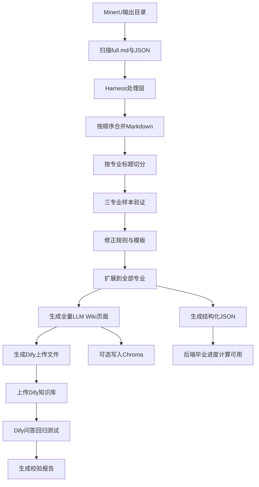

> **文档同步（2026-04-30）**：上方 YAML `todos` 已与仓库现状对齐（`scripts/knowledge_pipeline/`、`data/*.json`、`knowledge/wiki/`、`knowledge/dify_upload*`、`reports/` 等产物已存在）。**仍为 `pending` 的仅 `optional-chroma`**（脚本 `09_ingest_chroma_optional.py` 存在，属可选增强，主链路以 Dify 为准）。

# MinerU 到 LLM Wiki 知识库全量处理计划

## 自托管 Dify 访问基址（与云端 Knowledge API 的关系）

- **自托管控制台与 Web 入口（浏览器）**：`https://dify.maplexian.cn`（首次部署后管理员初始化路径为 `https://dify.maplexian.cn/install`）。根域名 `https://maplexian.cn` 预留给毕设主站，不再承载 Dify。
- **云端批量上传脚本**：`scripts/dify_upload/upload_markdown_to_dify.py` 仍通过项目根目录 `.env` 中的 `DIFY_KNOWLEDGE_API_BASE`、`DIFY_DATASET_API_KEY`、`DIFY_DATASET_ID` 等访问 **Knowledge API**；该基址可与自托管控制台域名不同（例如继续指向 Dify 云端数据集），按需二选一或分库存档。
- **运维备忘**：自托管实例在服务器 `/opt/dify/docker`；边缘 TLS 由 Caddy（`/etc/caddy/Caddyfile`）终结，Dify 内置 nginx 仅绑定本机 `127.0.0.1:18080`（HTTP）供反代。插件调试端口应通过 Compose `ports` 绑定 `127.0.0.1`，勿将 `127.0.0.1:5003` 写入要求整数的 `EXPOSE_PLUGIN_DEBUGGING_PORT`。`web` 容器重建后若出现 502，可 `docker compose restart nginx` 刷新上游。

## 背景与目标

当前知识库原料位于 `D:\study\case\毕业设计\docs\人才培养方案`。该目录由 MinerU 从《广东海洋大学2021版本科专业人才培养方案（上册）》转换而来，包含多个转换结果目录，每个目录中有 `full.md`、`content_list_v2.json`、`layout.json` 等文件。

本计划的目标不是只做一个最小可行版本，而是建立一套可重复、可校验、可扩展的知识库处理流水线，一次性产出可用于系统落地的全量知识资产：

- 可上传 Dify 的 Markdown 专业知识页，并按 Dify 文件大小限制生成细粒度上传文件。
- 标准 LLM Wiki 层：按专业、概念、总览组织知识。
- 结构化 JSON：供后端建表、导入 MySQL 和毕业进度计算。
- 校验报告：确保专业覆盖、关键字段和问答效果可追踪。
- 可选 Chroma 本地 RAG：作为 Dify 效果不稳定时的兜底方案和论文技术亮点。

最终服务于以下问题：

- 某专业毕业总学分是多少？
- 某专业必修、选修、实践分别要求多少学分？
- 某专业有哪些课程模块？
- 某门课属于哪个类别、多少学分、建议第几学期开设？
- 学生毕业进度分析时，后端应对照哪些毕业要求？

## 总体策略

采用“harness 先验证，随后全量扩展”的方式：

1. 先建立 harness 层，把扫描、合并、切分、生成、抽取、校验串成可重复流程。
2. 先用三个重点专业验证流程：
   - 计算机科学与技术
   - 软件工程
   - 数据科学与大数据技术
3. 修正切分规则、表格摘要规则、字段抽取规则和 Dify 分段策略。
4. harness 验收通过后，批量扩展到 PDF 中所有专业。
5. 生成全量 Wiki 页面、Dify 上传层 Markdown、全量结构化 JSON 和处理报告。
6. 上传 `knowledge/dify_upload/` 中的细粒度 Markdown 到 Dify 知识库，执行问答回归测试。

## 总体流程



## Harness 层设计

### Harness 的定位

Harness 层是知识库构建阶段的质量保障层，不是最终业务系统的一部分。它负责把 MinerU 输出变成可重复处理的流水线，并通过报告判断结果是否可靠。

### Harness 的职责

- 统一读取 `docs/人才培养方案` 下所有 MinerU 输出目录。
- 自动识别所有 `full.md` 中的专业标题。
- 合并多个 `full.md`，并记录来源文件与行号。
- 按专业标题切分原始 Markdown。
- 检测跨文件断裂和未归属片段。
- 对三个重点专业先执行完整链路验证。
- 按统一模板生成 LLM Wiki 专业页。
- 按 Dify 限制生成更细粒度的上传版 Markdown 文件。
- 从专业页或原始表格中抽取结构化 JSON。
- 自动校验关键字段是否存在。
- 输出处理报告，供人工抽查与后续全量扩展。

### Harness 第一批验证专业

这三个专业不是最终范围，而是第一批验证样本：

- 计算机科学与技术
- 软件工程
- 数据科学与大数据技术

选择原因：

- 都属于信息类/计算机相关专业，符合毕设系统的主要演示场景。
- 专业名称和课程体系较容易向用户解释。
- 后续毕业进度计算与选课建议场景更直观。

### Harness 验收标准

三个专业样本必须同时满足：

- 能正确识别专业标题。
- 能抽取专业代码、专业类、授予学位。
- 能抽取总学分、理论教学学分、实践教学学分。
- 能抽取通识教育、专业基础课、专业课、实践教学等模块学分。
- 能生成 `knowledge/wiki/majors/<专业名>/README.md` 与必要子页面。
- 能生成 `data/graduation_requirements.json` 中对应专业记录。
- Dify 上传后能回答毕业学分、课程模块、实践教学要求。
- Dify 上传文件单文件大小稳定低于限制，不能接近 15MB 上限。
- 关键字段有校验报告，不能只靠人工肉眼确认。

## Dify 上传层切分策略

### 设计原因

Dify 知识库支持 Markdown 文件上传，但云端上传存在单文件大小与单次上传数量限制。截图中当前环境显示“每个文件不超过 15MB，单次最多 1 个文件”。因此不能将全校专业合并成一个 Markdown，也不建议把一个专业的全部表格都塞入单个文件。

本项目采用三层知识产物：

- `knowledge/wiki/`：标准 LLM Wiki 层，面向人类维护与后续 Chroma/RAG。
- `knowledge/dify_upload/`：细粒度 Dify 上传层，按“专业 + 主题模块”切细，保留为归档、调试和云端小额度环境使用。
- `knowledge/dify_upload_major/`：正式问询用 Dify 上传层，按“一个专业一个 Markdown”组织，文档首屏固定包含“毕业条件速查卡”，覆盖学分、必修/选修、实践、毕业实习/设计和需个人数据判断的事项，避免检索命中专业总览却漏掉关键毕业条件。

### 文件大小规则

- 单个 Markdown 上传文件硬性上限：必须小于 15MB。
- 项目内部目标大小：单个 Markdown 控制在 200KB 以内。
- 如果单个文件超过 500KB，必须继续拆分。
- 原始超长 HTML 表格不直接作为主上传文件内容，应转换为摘要列表或拆分为多个模块文件。

### 推荐切分粒度（历史细粒度方案）

每个专业拆成多个 Dify 上传文件：

```text
knowledge/dify_upload/
├── 计算机科学与技术_00_专业总览.md
├── 计算机科学与技术_01_毕业要求与学分结构.md
├── 计算机科学与技术_02a_思政与通识课程.md
├── 计算机科学与技术_02b_专业基础课程.md
├── 计算机科学与技术_02c_专业课程.md
├── 计算机科学与技术_03_实践教学.md
└── 计算机科学与技术_04_课程体系矩阵.md
```

其中 `04_课程体系矩阵.md` 可单独上传、单独测试；如果对检索污染较大，可先不放入主 Dify 知识库。

### 正式问询知识库粒度（当前决策）

自托管 Dify 已解除云端免费版 50 文档与小文件额度限制后，正式问询知识库改用 **一个专业一个 Markdown**：

```text
knowledge/dify_upload_major/
├── 电子科学与技术.md
├── 计算机科学与技术.md
├── 软件工程.md
└── ...
```

每个专业档案的开头必须包含：

- 专业检索关键词：专业名称、专业代码、专业类、授予学位、常见简称。
- 毕业条件速查卡：总学分、理论教学、实践教学、通识教育必修/选修、专业基础课、专业必修、专业限选、专业任选。
- 必修与选修修读要求：提示必修课程必须通过，选修类课程需要分别满足通识选修、专业限选、专业任选等模块最低学分。
- 实践与毕业环节要求：列出实践教学、实习实训、毕业实习、毕业设计/论文等关键要求。
- 毕业能力要求：概述工程知识、问题分析、设计/开发、研究、现代工具、职业规范、沟通、项目管理、终身学习等能力维度。
- 个人数据判断边界：当用户问“我能不能毕业”“还差多少”“学分够不够”时，必须说明还需要已修课程、成绩、重修、实践环节和毕业设计状态等个人学业数据。

随后再拼接专业总览、课程设置、实践教学和课程体系矩阵。这样用户问“电科毕业条件”时，只要检索命中 `电子科学与技术.md`，同一文档内就能同时提供专业解释和具体学分数字，降低跨文档召回失败概率。

### 每个上传文件必须包含的上下文头

每个 Dify 上传文件开头都必须重复专业元信息，避免 Dify 分段后丢失上下文：

```markdown
# 计算机科学与技术 - 毕业要求与学分结构

- 专业名称：计算机科学与技术
- 专业代码：080901
- 专业类：计算机类
- 授予学位：工学学士
- 文档类型：毕业要求与学分结构
- 来源：广东海洋大学2021版本科专业人才培养方案（上册）
```

### 上传优先级

优先上传：

- `00_专业总览.md`
- `01_毕业要求与学分结构.md`
- `02a_思政与通识课程.md`
- `02b_专业基础课程.md`
- `02c_专业课程.md`
- `03_实践教学.md`

暂缓或单独知识库上传：

- `04_课程体系矩阵.md`
- 原始 HTML 大表格
- 未清洗的 `full.md`
- 未归属片段

### Harness 校验项

Harness 需要额外检查：

- `knowledge/dify_upload/` 是否覆盖所有专业。
- 每个上传文件是否包含专业名称、专业代码、文档类型。
- 每个上传文件是否低于目标大小。
- 是否存在超过 500KB 的待拆分文件。
- 是否存在文件名重复、专业名缺失、模块缺失。

## Harness 脚本拆分建议

为避免后续写成难以维护的大脚本，知识库处理流程建议拆成可独立运行、可单步重跑的脚本模块。脚本统一放在 `scripts/knowledge_pipeline/` 下：

```text
scripts/knowledge_pipeline/
├── 01_inventory_sources.py          # 扫描 MinerU 输出，生成 source_inventory/source_index
├── 02_merge_full_md.py              # 合并多个 full.md 为 master.md，并写入来源边界
├── 03_split_by_major.py             # 按专业标题切分 majors_raw
├── 04_build_wiki_pages.py           # 生成标准 LLM Wiki 专业页
├── 05_build_dify_upload.py          # 按 Dify 限制生成专业+模块级上传文件
├── 06_extract_structured_json.py    # 抽取 majors/courses/graduation_requirements 等 JSON
├── 07_validate_outputs.py           # 校验字段完整性、文件大小、专业覆盖
└── 08_generate_reports.py           # 汇总生成 Markdown/JSON 报告
```

执行原则：

- 每个脚本只负责一个阶段，输入输出路径固定。
- 每个脚本支持重复运行，失败后可从当前阶段继续。
- 脚本输出必须写入 `knowledge/`、`data/`、`reports/`，不修改原始 MinerU 目录。
- 每个脚本执行后应输出简短日志，说明处理数量、异常数量和输出路径。

## 结构化 JSON Schema 约定

为方便后端建表与毕业进度计算，结构化 JSON 字段需要在执行前固定，避免后续前后端反复改字段。

### `data/majors.json`

```json
{
  "major_code": "080901",
  "major_name": "计算机科学与技术",
  "major_category": "计算机类",
  "degree": "工学学士",
  "source_file": "knowledge/wiki/majors/计算机科学与技术/README.md",
  "needs_review": false
}
```

### `data/graduation_requirements.json`

```json
{
  "major_code": "080901",
  "major_name": "计算机科学与技术",
  "total_credits": 160,
  "theory_credits": 134,
  "practice_credits": 26,
  "general_required_credits": 22.5,
  "general_elective_credits": 12,
  "major_basic_credits": 35.5,
  "major_required_credits": 22,
  "major_limited_elective_credits": 17.5,
  "major_optional_credits": 12.5,
  "source_file": "knowledge/wiki/majors/计算机科学与技术/01_毕业要求与学分结构.md",
  "needs_review": false
}
```

### `data/courses.json`

```json
{
  "course_code": "14522204",
  "course_name": "产品设计程序与方法",
  "major_code": "080901",
  "module": "专业课",
  "course_type": "必修",
  "credits": 3,
  "hours": 48,
  "lecture_hours": 32,
  "practice_hours": 16,
  "semester": "4",
  "assessment": "考试",
  "remark": "",
  "source_file": "knowledge/wiki/majors/计算机科学与技术/02c_专业课程.md",
  "needs_review": false
}
```

### `data/practice_courses.json`

```json
{
  "practice_code": "j1450212",
  "practice_name": "毕业设计",
  "major_code": "080901",
  "module": "毕业实习与论文(设计)",
  "credits": 5,
  "weeks": 10,
  "semester": "7-8",
  "organization": "校内外分散进行",
  "source_file": "knowledge/wiki/majors/计算机科学与技术/03_实践教学.md",
  "needs_review": false
}
```

Schema 原则：

- 所有专业都使用相同字段名。
- 数字字段尽量保存为 number，不保存为带单位的字符串。
- 不确定或无法自动确认的字段必须标记 `needs_review: true`。
- 每条记录保留 `source_file`，方便回溯原始知识页。

## Dify 分段验收标准

Dify 文件上传成功不代表知识库质量合格。上传 `knowledge/dify_upload/*.md` 后，需要在 Dify 控制台检查分段预览和检索命中效果。

### 分段预览标准

- 每个分段应保留专业名称或能从上下文判断所属专业。
- 每个分段尽量只属于一个专业，不应跨专业混杂。
- “毕业学分要求”不应被切成多个缺少上下文的片段。
- 课程表可以按模块拆分，但课程名称、课程编号、学分不能被切开。
- 超长课程矩阵文件应单独处理，必要时不进入主问询知识库。

### 检索验收标准

上传后需要测试 Dify 检索命中片段，而不只看最终回答：

- 问“计算机科学与技术专业毕业总学分是多少？”，命中片段应来自计算机科学与技术相关文件。
- 问“软件工程专业实践教学多少学分？”，命中片段不应来自计算机科学与技术或其他专业。
- 问“通识选修要求”，应命中包含通识选修学分与规则的片段。
- 如果命中片段专业混乱，需要继续调整文件切分、标题层级或上传文件命名。

### 回归记录

每次上传后记录到：

- `reports/dify_upload_manifest.json`：记录上传文件名、大小、专业、模块、是否上传。
- `reports/dify_qa_regression_report.md`：记录问题、期望命中专业、实际回答、是否通过。

## 执行保护策略

知识库处理会批量生成大量文件，执行前需要约束写入范围，避免污染原始资料或混淆新旧结果。

### 不可修改目录

- 不修改 `docs/人才培养方案/` 下任何 MinerU 原始输出。
- 不覆盖根目录正式文档，如 `技术文档.md`、`需求文档.md` 等。

### 允许写入目录

- `knowledge/markdown/`
- `knowledge/wiki/`
- `knowledge/dify_upload/`
- `data/`
- `reports/`
- `docs/Dify配置说明.md`（需要时）
- `plan/Dify问答测试清单.md`（需要时）

### 运行记录

每次执行 harness 需要记录：

- 运行时间。
- 输入 MinerU 目录列表。
- 输入文件的修改时间或 hash。
- 处理专业总数。
- 成功专业数。
- 失败或待人工复核专业数。
- 输出目录。

建议输出：

- `reports/knowledge_pipeline_report.md`
- `reports/run_metadata.json`

### 旧结果处理

- 每次全量执行前，将旧生成物移动到 `reports/archive/<timestamp>/` 或明确清理。
- 不允许新旧 `dify_upload` 文件混在一起上传。
- `dify_upload_manifest.json` 必须和当前 `knowledge/dify_upload/` 内容一致。

## 阶段一：确认 MinerU 输出结构

目标：确认哪些文件是有效输入，避免处理重复或残缺文件。

主要工作：

- 遍历 `docs/人才培养方案` 下所有 MinerU 输出目录。
- 记录每个目录中的核心文件：
  - `full.md`：主要文本与表格来源。
  - `content_list_v2.json`：结构化块数据，包含标题、表格 HTML、页码等。
  - `layout.json`：版面信息，当前优先级较低。
- 统计每个 `full.md` 中包含的专业标题，例如 `# 计算机科学与技术专业人才培养方案`。
- 建立处理清单，记录每个文件覆盖的专业范围、起始行号、结束行号和来源路径。

建议输出：

- `knowledge/markdown/source_inventory.md`：记录所有 MinerU 文件及覆盖专业。
- `knowledge/markdown/source_index.json`：记录文件路径、专业名、起始行号等元数据。
- `reports/source_inventory_report.md`：便于人工阅读的源文件覆盖报告。

验收标准：

- 能明确每个 `full.md` 负责哪些专业。
- 能识别是否存在“文件开头是上一个专业后半段”的情况。
- 能统计 PDF 上册中可识别的专业总数。

## 阶段二：合并与切分专业内容

目标：将多份 `full.md` 整理为按专业划分的原始 Markdown。

主要问题：

- 部分 `full.md` 开头可能不是专业标题，而是 `九、课程结构比例表`、`十、课程设置和安排` 等章节，说明它可能是上一个专业的尾部内容。
- 如果直接按单个文件切分，可能造成某些专业缺失课程结构表或课程设置表。

处理策略：

- 先按 MinerU 输出目录顺序读取所有 `full.md`。
- 合并为一个临时总文档 `master.md`。
- 合并时在文档中插入来源边界注释，便于追踪：

```markdown
<!-- source: xxx/full.md -->
```

- 以正则规则识别专业开始位置：
  - `^# .+专业人才培养方案$`
- 每个专业块从该专业标题开始，到下一个专业标题前结束。
- 对于第一个专业标题之前的内容，先标记为 `orphan_prefix`，人工判断它属于哪个专业。
- 如果无法确认归属，则放入 `knowledge/wiki/summaries/未归属片段.md`，不直接上传 Dify 主知识库。

建议输出：

- `knowledge/markdown/master.md`：合并后的总 Markdown。
- `knowledge/markdown/majors_raw/*.md`：每个专业的原始切分结果。
- `reports/split_validation_report.md`：记录专业切分是否完整。

验收标准：

- 每个专业文件包含完整的培养目标、毕业要求、课程结构比例表、课程设置、实践教学等主要章节。
- 对开头残缺片段有明确处理记录。
- 三个重点专业必须优先人工抽查确认完整。

## 阶段三：生成 LLM Wiki 专业知识页

目标：将原始专业块整理为适合 Dify 检索和问答的结构化知识页。

每个专业生成一个主页面：

```text
knowledge/wiki/majors/计算机科学与技术/README.md
```

推荐页面结构：

```markdown
# 计算机科学与技术专业

## 基本信息
- 专业代码：080901
- 专业类：计算机类
- 授予学位：工学学士

## 培养目标
...

## 毕业要求摘要
...

## 毕业学分要求
- 总学分：...
- 理论教学：...
- 实践教学：...
- 通识教育必修：...
- 通识教育选修：...
- 专业基础课：...
- 专业必修：...
- 专业限选：...
- 专业任选：...

## 课程分类与课程清单摘要
...

## 实践教学要求
...

## 可回答的问题
- 本专业毕业需要多少学分？
- 本专业专业必修课需要多少学分？
- 本专业实践教学有哪些要求？

## 来源
- 原始文件：...
- MinerU目录：...
- 原始行号：...
```

处理原则：

- 不把超长 HTML 表格原样全部塞进正文主区域。
- 对关键表格生成“摘要版”，保留原始表格作为附录或来源。
- 学分、课程类别、开设学期等数字信息必须显式写成列表，便于 Dify 检索。
- 专业名、专业代码、课程编号等字段统一格式。
- 同一字段在所有专业页面中保持同名，便于批量检查。

建议输出：

- `knowledge/wiki/majors/<专业名>/README.md`：全量专业主知识页。
- `knowledge/wiki/majors/<专业名>/*.md`：按主题拆分的标准 Wiki 子页面。
- `knowledge/wiki/concepts/毕业学分要求.md`：通用概念说明。
- `knowledge/wiki/concepts/课程分类说明.md`：课程模块口径说明。
- `knowledge/wiki/summaries/广东海洋大学2021版培养方案上册总览.md`：总览页。
- `knowledge/dify_upload/*.md`：按 Dify 限制生成的专业+模块级上传文件。

验收标准：

- 每个专业主知识页能独立回答毕业要求类问题。
- 页面中数字字段清晰，不依赖模型从复杂 HTML 表格中推理。
- 三个重点专业页面通过人工抽查后，再批量生成全部专业页面。
- Dify 上传层文件不超过大小阈值，且每个文件开头带专业上下文。

## 阶段四：抽取结构化数据给 MySQL 使用

目标：将适合代码计算的内容从 Wiki 中拆出来，避免毕业进度依赖大模型生成。

建议抽取的数据：

- 专业信息：专业代码、专业名称、学位、专业类。
- 毕业要求：总学分、理论教学学分、实践教学学分、各课程模块学分。
- 课程信息：课程编号、课程名称、课程类别、学分、学时、开设学期、考核方式。
- 实践教学：实践环节名称、学分、学期、组织形式。

建议输出：

- `data/majors.json`
- `data/graduation_requirements.json`
- `data/courses.json`
- `data/practice_courses.json`

处理原则：

- MySQL 用于确定性计算，例如毕业进度、缺口学分。
- Dify/Wiki 用于解释性问答，例如培养目标、规则说明。
- 两者来源一致，避免 Dify 回答和后端计算结果冲突。
- 如果字段无法自动确认，应标记为 `needs_review: true`，不要静默写入错误值。

验收标准：

- 能通过 JSON 找到某专业的总学分与各模块学分。
- 能通过课程编号或课程名找到课程学分与类别。
- `graduation_requirements.json` 覆盖全部已识别专业。
- 三个重点专业的字段准确率必须先达到可用标准，再扩展全量。

## 阶段五：Dify 知识库上传与 Chatflow 配置

目标：让 Dify 成为主要自然语言问询入口。

主要工作：

- 若问询与 Chatflow 使用 **自托管** 实例，在 `https://dify.maplexian.cn` 控制台创建数据集、复制 API Key，并将项目根 `.env` 中 `DIFY_KNOWLEDGE_API_BASE` 指向该实例的 **控制台同源 API 基址**（与官方文档一致）；若仍使用 **云端** 数据集，则保持现有云端 `DIFY_KNOWLEDGE_API_BASE` 不变。两种环境不要混用同一 `DIFY_DATASET_ID` 与 Key。
- 使用 `scripts/dify_upload/upload_markdown_to_dify.py` 调用 Dify Knowledge API 批量上传 `knowledge/dify_upload/*.md`。
- 脚本读取项目根目录 `.env` 中的 `DIFY_KNOWLEDGE_API_BASE`、`DIFY_DATASET_API_KEY`、`DIFY_DATASET_ID` 和 `DIFY_UPLOAD_CONCURRENCY`。
- 上传方式优先使用官方 `POST /datasets/{dataset_id}/document/create-by-text`，逐个 Markdown 作为文档写入，避免云端 UI 单文件/单次上传限制。
- 每个文档上传后使用返回的 `batch` 调用 `GET /datasets/{dataset_id}/documents/{batch}/indexing-status` 轮询索引状态。
- 支持 `--dry-run`、`--limit`、`--include`、`--force`、`--no-poll` 等参数，先小批量验证，再全量上传。
- 不直接上传未经清洗的 `full.md`，避免表格过长影响检索效果。
- 不直接上传 `knowledge/wiki/majors/<专业名>/README.md` 的全量聚合页，除非文件较小且分段效果稳定。
- 正式问询知识库优先使用 `scripts/dify_upload/build_and_upload_major_markdown.py` 生成并上传 `knowledge/dify_upload_major/*.md`。该目录每个专业 1 个 Markdown，首屏固定“毕业条件速查卡”，用于提升“电科毕业条件”“要修多少分”等问题的召回稳定性。
- 上传后在 Dify 控制台预览分段效果。
- 根据分段效果调整 Markdown 标题层级、页面长度和表格摘要方式。
- 设置索引方法与检索参数，例如 TopK、相似度阈值、是否开启混合检索。
- 当前推荐 Embedding：通义 `text-embedding-v4`。若知识库已经在 Dify 控制台选择模型，脚本不额外传 embedding 参数；如需通过 API 指定，可在 `.env` 中补充 `DIFY_EMBEDDING_MODEL` 与 `DIFY_EMBEDDING_MODEL_PROVIDER`。
- Chatflow 系统提示词说明：
  - 你是学业问询助手。
  - 回答必须基于知识库和后端传入上下文。
  - 涉及毕业进度、已修学分等个性化计算时，以后端传入的 `graduation_progress` 为准。
  - 不确定时说明无法从知识库确认，不编造。

### Chatflow 会话记忆与 FastAPI / OpenClaw 分工（架构决策）

**结论（毕设主线）**：问询助手采用 **Dify Chatflow + 开启内置会话记忆**；**FastAPI + MySQL** 负责登录鉴权、学生身份、已修课程与毕业审核等确定性数据；**OpenClaw 不作为当前主链路的会话托管方**，仅在技术文档中保留为「后续可选的智能体编排扩展」，避免 Dify 记忆、外部 Agent 记忆、后端 Session 三处同时维护同一会话状态导致不一致与调试成本陡增。

**为何 Chatflow 需要记忆**：培养方案问询存在大量指代与追问（例如先问某专业总学分，再问「那软件工程呢」「实践教学呢」）。若 Chatflow 关闭记忆，除非 FastAPI 在每次请求中自行拼接完整对话历史并注入变量，否则模型无法理解省略主语。开启记忆后，由 Dify 维护自然语言层面的上文衔接；后端仍应在每轮 API 调用中传入稳定业务变量（如 `user_id`、`student_no`、`major_code`、`major_name`），**不把身份与成绩等关键事实仅依赖 Dify 记忆**。

**FastAPI 调用 Chatflow API 时的约定**：

- 首次对话不传或传空 `conversation_id`，由 Dify 返回会话标识；后续同一聊天窗口沿用同一 `conversation_id`，与 Chatflow 内置记忆配合。
- 每轮请求通过变量或请求体传入当前用户与专业上下文，供知识检索与提示词使用；个性化毕业审核结果必须由后端计算后以只读上下文注入 LLM，而非由模型凭记忆推断。

**若未来引入 OpenClaw（可选分叉）**：可改为由 OpenClaw（或 FastAPI 统一编排层）托管会话摘要与工具调用顺序，**Dify Chatflow 退化为无状态或弱记忆**（每轮由上游拼装完整上下文再调用）。届时应关闭或弱化 Chatflow 内置记忆，并删除重复的会话状态源，**禁止** OpenClaw 与 Chatflow 同时对同一会话写两套长期记忆。

**与「Agent 应用」的取舍**：官方 Agent 适合模型自主选工具、多步推理；本毕设以培养方案解释 + 后端确定性计算为主，**优先 Chatflow 可视化编排 + 知识检索节点 +（后续）HTTP/自定义工具**，可控性与答辩可解释性更好。Agent 可作为实验应用单独验证，不写入当前主交付路径。

- 配置测试问题集并记录回答结果。

建议输出：

- `docs/Dify配置说明.md`：记录知识库名称、上传文件、分段策略、索引参数、提示词、变量说明。
- `plan/Dify问答测试清单.md`：记录测试问题、期望答案、实际答案。
- `reports/dify_qa_regression_report.md`：Dify 问答回归测试报告。
- `reports/dify_upload_manifest.json`：记录每个上传文件的大小、专业、模块、是否上传。
- `reports/dify_upload_result.json`：记录 API 上传结果、document_id、batch、索引状态、错误信息和重试次数（云端数据集场景）。
- `reports/dify_upload_result_selfhosted.json`：自托管知识库批量上传时的断点续传报告（与云端报告二选一或并存，勿混用 `DIFY_DATASET_ID`）。
- `reports/dify_upload_major_result_selfhosted.json`：分专业档案式知识库上传报告，用于正式问询知识库。

验收标准：

- Dify 能回答典型问题：
  - “计算机科学与技术专业毕业需要多少学分？”
  - “软件工程专业专业必修课有多少学分？”
  - “通识选修课有什么要求？”
- 回答中能引用或说明来源专业。
- 不同专业之间不混淆关键学分数字。
- 上传文件均满足 Dify 文件大小限制，且分段预览没有明显跨专业混杂。
- 小批量试跑（建议 3 个文件）成功后，细粒度归档库可执行 240 个有效 Markdown 全量上传；正式问询库执行 48 个分专业 Markdown 全量上传。

## 阶段六：可选写入 Chroma 作为本地 RAG 兜底

目标：为论文和系统稳定性保留自建 RAG 能力。

主要工作：

- 将 `knowledge/wiki/majors/<专业名>/*.md` 或 `knowledge/dify_upload/*.md` 分段写入 Chroma。
- 每个 chunk 保留 metadata：
  - `major_name`
  - `major_code`
  - `page_type`
  - `source`
  - `section`
- 实现检索测试：输入问题，返回 top_k 相关段落。

建议输出：

- `knowledge/chroma_db/`：Chroma 本地向量库目录。
- `docs/Chroma检索测试记录.md`：记录检索效果。

验收标准：

- 给定专业名和问题，能检索到正确专业页的毕业学分要求段落。
- Chroma 仅作为可选方案，不影响 Dify 主问询链路。

## 阶段七：全量质量校验与人工抽查

目标：避免知识库答错关键数字，确保一次性全量落地可用。

校验清单：

- 专业名是否完整。
- 专业代码是否正确。
- 总学分是否正确。
- 通识教育、专业基础、专业课、实践教学学分是否正确。
- 课程编号、课程名称、学分是否错列。
- 文件开头或结尾残缺片段是否处理。
- Dify 回答是否会混淆不同专业。

建议测试问题：

- “计算机科学与技术专业毕业总学分是多少？”
- “软件工程专业实践教学需要多少学分？”
- “数据科学与大数据技术专业有哪些专业基础课？”
- “某专业通识选修课最低要求是多少？”
- “工业设计专业课程结构比例表中专业任选多少学分？”

验收标准：

- 三个重点专业 100% 完成字段人工抽查。
- 全量专业生成专业覆盖报告。
- 抽查至少 5 个非重点专业，关键学分字段准确。
- 抽查至少 20 个 Dify 问答，主要问题回答正确率达到可演示水平。

## 推荐执行顺序

1. 建立 harness 层，完成扫描、切分、Wiki 生成、JSON 抽取和校验报告的基础框架。
2. 使用三个重点专业进行打样验证：计算机科学与技术、软件工程、数据科学与大数据技术。
3. 修正切分规则、表格摘要规则、字段抽取规则和 Dify 分段策略。
4. harness 验收通过后，批量扩展到 PDF 中所有专业。
5. 生成全量标准 Wiki 页面、Dify 上传层 Markdown、全量结构化 JSON 和处理报告。
6. 检查 `knowledge/dify_upload/` 中每个文件大小与上下文头，生成上传清单。
7. 在 Dify 云端知识库中选择 Embedding 模型，推荐通义 `text-embedding-v4`，索引方式使用高质量模式。
8. 使用 `python scripts/dify_upload/upload_markdown_to_dify.py --dry-run --limit 3` 检查待上传文件。
9. 使用 `python scripts/dify_upload/upload_markdown_to_dify.py --include 计算机科学与技术 --limit 3` 小批量试传。
10. 小批量索引成功后，执行 `python scripts/dify_upload/upload_markdown_to_dify.py` 全量上传细粒度 Markdown 到 Dify 知识库。
11. 执行 Dify 问答回归测试，重点检查专业混淆、学分数字错误、表格信息遗漏。
12. 后端使用 `graduation_requirements.json` 等结构化数据进行毕业进度计算。

## 风险与兜底

- 风险：跨文件专业内容断裂。
  - 兜底：harness 记录 source 边界，重点专业先人工抽查完整性。
- 风险：HTML 表格太长，Dify 检索不稳定。
  - 兜底：把表格总结为显式 Markdown 列表和简化表。
- 风险：Dify 单文件大小限制导致上传失败。
  - 兜底：生成 `knowledge/dify_upload/` 上传层，按专业+模块拆分文件，超过 500KB 自动继续切分。
- 风险：Dify 回答混淆专业。
  - 兜底：每个专业页标题和元信息中重复写明专业名、专业代码。
- 风险：结构化 JSON 抽取出现错位。
  - 兜底：字段级校验报告，异常字段标记 `needs_review: true`。
- 风险：全量专业处理耗时较长。
  - 兜底：harness 支持从三个专业样本扩展到全量，失败时可定位到具体专业重新处理。

## 预计最终产物

```text
knowledge/
├── markdown/
│   ├── master.md
│   ├── source_inventory.md
│   └── majors_raw/
├── wiki/
│   ├── majors/             # 全量专业标准 Wiki 页面
│   ├── concepts/
│   └── summaries/
├── dify_upload/            # 面向 Dify 限制切分后的上传文件
└── chroma_db/              # 可选

data/
├── majors.json
├── graduation_requirements.json
├── courses.json
└── practice_courses.json

schemas/
├── majors.schema.json
├── graduation_requirements.schema.json
├── courses.schema.json
└── practice_courses.schema.json

scripts/
├── knowledge_pipeline/
│   ├── 01_inventory_sources.py
│   ├── 02_merge_full_md.py
│   ├── 03_split_by_major.py
│   ├── 04_build_wiki_pages.py
│   ├── 05_build_dify_upload.py
│   ├── 06_extract_structured_json.py
│   ├── 07_validate_outputs.py
│   └── 08_generate_reports.py
└── dify_upload/
    ├── README.md
    └── upload_markdown_to_dify.py

reports/
├── source_inventory_report.md
├── split_validation_report.md
├── knowledge_pipeline_report.md
├── run_metadata.json
├── field_validation_report.json
├── dify_upload_manifest.json
├── dify_upload_result.json
└── dify_qa_regression_report.md

docs/
├── Dify配置说明.md
└── Chroma检索测试记录.md

plan/
└── Dify问答测试清单.md
```

## 第一轮 Harness 验证范围

第一轮不是最小可行版本，而是全量流水线的验证阶段。优先验证以下三个专业：

- 计算机科学与技术
- 软件工程
- 数据科学与大数据技术

第一轮交付目标：

- 3 个专业完整走通 `MinerU full.md → 专业切分 → Wiki 页面 → Dify 上传层 → 结构化 JSON → Dify 问答` 链路。
- 生成 harness 校验报告，证明规则可扩展。
- 后续使用同一套规则批量处理 PDF 中所有专业。

## 全量落地目标

最终交付不止三个专业，而是 PDF 上册中所有可识别专业：

- 全量专业 LLM Wiki 页面。
- 全量 Dify 上传层 Markdown 文件，按“专业 + 主题模块”切分并满足文件大小限制。
- 全量专业 `graduation_requirements.json`。
- 全量课程结构与课程清单 JSON。
- Dify 知识库可面向所有专业进行问答。
- 后端可基于结构化数据计算毕业进度。
