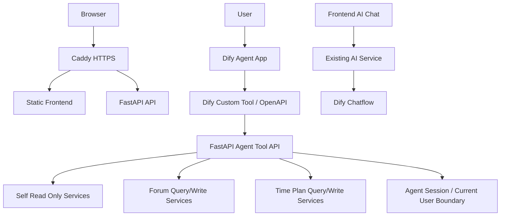

# Dify Agent 受控接入与服务器部署计划

## 当前已知现状

- GitHub 备份仓库：`https://github.com/Xian-xwz/academin-management-system`，本地 `main` 已推送。
- 服务器 `myserver` 已有 Caddy，`/etc/caddy/Caddyfile` 中已有 `dify.maplexian.cn`，新域名应使用 `academin-management-system.maplexian.cn`。
- **服务器端口避坑（实地扫描结论）**：与 Cursor 初版规划冲突的端口已被占用，毕设服务必须**顺延**，勿与现有服务抢端口。

| 规划用途 | 原假设端口 | 服务器实际占用 | 毕设改用 |
|----------|------------|----------------|----------|
| Web 前端（或 dev server） | 3000 | `frps` | **3001** |
| 毕设自建 n8n（若需要） | 5678 | `n8n-cloud` 容器 | **5679** |
| FastAPI 后端 API | 8080 | `mail-agent`（OpenClaw 邮件代理 uvicorn） | **8081** |

- 毕设 **FastAPI** 固定监听 `127.0.0.1:8081`（仅本机，由 Caddy 反代 `/api/*` 暴露公网）。
- 毕设 **前端**：生产推荐 **静态文件** 由 Caddy `file_server` 直接托管（无需占用 3000/3001）；若临时用 `vite preview` 或本地 dev 联调，则使用 **3001**，且 Caddy 对应 `reverse_proxy 127.0.0.1:3001`。
- 毕设 **n8n**（若单独起容器）：宿主机映射 **5679:5678**（或等价），避免与现有 `5678` 冲突。
- 后端统一入口在 `[backend/app/main.py](backend/app/main.py)`，API 前缀来自 `[backend/app/core/config.py](backend/app/core/config.py)` 的 `API_PREFIX=/api`。
- JWT 鉴权在 `[backend/app/core/security.py](backend/app/core/security.py)`，普通登录用户通过 `get_current_user`，管理员接口通过 `require_admin`。
- Dify 已封装在 `[backend/app/services/ai.py](backend/app/services/ai.py)`，外部不应直接拿到 `DIFY_APP_API_KEY` 或 Dify Chatflow URL。



## 第一步：迁移前后端与数据库

目标：把当前 GitHub 仓库、运行环境、数据库和上传目录迁移到服务器，形成可重复部署目录。

执行要点：

- 服务器代码目录建议固定为 `/opt/academin-management-system/app`，通过 `git clone` 或 `git pull` 从 GitHub 同步。
- Python 后端使用独立虚拟环境，例如 `/opt/academin-management-system/venv`，安装 `[backend/requirements.txt](backend/requirements.txt)`。
- 前端在 `[frontend/package.json](frontend/package.json)` 里使用 `npm ci` 和 `npm run build`，产物目录为 `frontend/dist`。
- `.env` 不从 GitHub 获取，服务器单独创建 `/opt/academin-management-system/app/.env`，包含：
  - `DATABASE_URL` 或 `MYSQL_HOST/MYSQL_PORT/MYSQL_USER/MYSQL_PASSWORD/MYSQL_DATABASE`
  - `JWT_SECRET_KEY`
  - `BACKEND_CORS_ORIGINS=https://academin-management-system.maplexian.cn`
  - `DIFY_APP_API_BASE`、`DIFY_APP_API_KEY`、`DIFY_APP_API_ID`
  - `UPLOAD_DIR=/opt/academin-management-system/storage`
- 数据库先备份再迁移：
  - 本地导出 MySQL：`mysqldump --single-transaction --routines --triggers <db> > backup.sql`
  - 服务器创建数据库与账号，字符集统一 `utf8mb4`。
  - 服务器导入 `backup.sql`。
  - 若没有完整 dump，则按后端脚本顺序初始化：`python backend/scripts/init_schema.py`、`python backend/scripts/import_knowledge_json.py`、必要时 `python backend/scripts/seed_scenario_data.py`。
- 上传目录迁移：复制本地 `backend/storage/` 到服务器 `/opt/academin-management-system/storage/`；若只部署演示版，可先不迁移大附件，但要保留目录权限。
- 迁移后检查：
  - `python backend/scripts/check_db.py`
  - `python backend/scripts/harness_api_smoke.py`
  - 如涉及管理员演示，再跑 `python backend/scripts/harness_admin_api.py`

## 第二步：服务器跑通并配置公网网页

目标：服务器上稳定运行 FastAPI 后端、前端静态页面，并通过 `https://academin-management-system.maplexian.cn` 公网访问。

执行要点：

- FastAPI 使用 `systemd` 常驻，监听内网端口 **`127.0.0.1:8081`**（避开 `8080` 的 mail-agent），命令形态为：
  - 工作目录：`/opt/academin-management-system/app/backend`
  - 启动命令：`uvicorn app.main:app --host 127.0.0.1 --port 8081`
- 前端构建产物建议部署到 `/var/www/academin-management-system`，内容来自 `frontend/dist`。
- Caddy 建议使用静态页面 + API 分流，而不是把整个域名都反代到后端：

```caddyfile
academin-management-system.maplexian.cn {
    encode gzip zstd
    root * /var/www/academin-management-system
    try_files {path} /index.html
    file_server

    handle /api/* {
        reverse_proxy 127.0.0.1:8081
    }
}
```

- **可选**：若该阶段不用静态目录、改为反代前端 dev/preview，则把 `file_server` 整块替换为 `reverse_proxy 127.0.0.1:3001`，并仍保留 `handle /api/*` 到 `8081`。

- 前端生产环境应保持 API 相对路径 `/api`，避免写死 localhost；现有 `[frontend/vite.config.ts](frontend/vite.config.ts)` 本地代理仅开发环境使用，生产静态站点走 Caddy `/api/*` 分流。
- 验证顺序：
  - `systemctl status academic-backend`
  - `curl http://127.0.0.1:8081/api/health`
  - `caddy validate --config /etc/caddy/Caddyfile`
  - `systemctl reload caddy`
  - 浏览器打开 `https://academin-management-system.maplexian.cn`
  - 登录学生账号，验证首页、学号查询、AI 问询、课表、时间规划只读链路。

## 第三步：Dify Agent 作为受控问询编排层接入

目标：放弃 OpenClaw 作为主链路，改为让 **Dify Agent** 通过自定义工具调用 FastAPI 只读工具接口；Dify 负责“理解问题、选择工具、组织回答”，FastAPI 负责“鉴权、数据查询、毕业进度计算、审计和密钥隔离”。

### 接入原则

- Dify Agent 是“问询编排层”，不是管理员、不是数据库客户端、不是浏览器用户。
- 第一版只开放“本人只读数据查询”工具，不开放任何写操作。
- 不把现有业务 API 原样暴露给 Dify；Dify 只能调用后端专门封装的工具接口。
- 不让 Dify Agent 再调用后端 `/api/openclaw/ai/chat` 或现有 `/api/ai/chat`，避免形成 **Dify Agent → FastAPI → Dify Chatflow** 的递归套娃。
- Dify API Key、数据库连接串、JWT、管理员账号都不进入 Agent Prompt，也不出现在工具返回值中。
- 每次工具调用都要有服务令牌鉴权、学生身份边界和审计记录。

### 已有服务端边界与命名策略

当前已实现的 `/api/openclaw/*` 工具层可以先复用给 Dify Agent，后续再平滑迁移或增加别名：

- 短期：继续使用 `/api/openclaw/*`，减少改动，优先跑通 Dify Agent。
- 中期：新增 `/api/agent-tools/*` 作为更中性的 Dify Agent 工具前缀，旧 `/api/openclaw/*` 保留一段时间兼容。
- 长期：文档、环境变量和审计表命名从 OpenClaw 迁移到 Agent Tool，例如 `AGENT_TOOL_TOKEN`、`agent_tool_audits`。

当前已落地/可复用文件：

- `[backend/app/api/v1/openclaw.py](backend/app/api/v1/openclaw.py)`：工具路由，当前前缀 `/api/openclaw`。
- `[backend/app/core/security.py](backend/app/core/security.py)`：`require_openclaw_client` 服务令牌鉴权，可后续改名为 `require_agent_tool_client`。
- `[backend/app/core/config.py](backend/app/core/config.py)`：`OPENCLAW_TOOL_TOKEN`、`OPENCLAW_ALLOWED_STUDENT_IDS`，可后续新增 `AGENT_TOOL_TOKEN` 兼容读取。
- `[backend/app/models/openclaw.py](backend/app/models/openclaw.py)`：工具调用审计表。
- `[backend/app/services/openclaw.py](backend/app/services/openclaw.py)`：学生白名单、审计与只读工具服务。

### Dify Custom Tool / OpenAPI 封装要求

Dify 官方支持通过 OpenAPI/Swagger 导入 Custom Tool。为提高 Agent 调用成功率，工具 Schema 必须满足：

- 每个接口必须有稳定、语义清晰的 `operationId`，例如：
  - `health_check`
  - `get_student_academic_info`
  - `get_student_graduation_progress`
  - `get_student_schedule`
  - `get_student_time_plan_events`
- `description` 要写给 LLM 看，明确“什么时候调用这个工具”，不要只写给人类看。
- `studentId` 参数必须标为 `required`，描述为“学生学号，仅允许查询白名单/授权学生本人”。
- 可选参数如 `term`、`week` 要说明格式和缺省行为。
- 返回体尽量机器可读且字段稳定；过长列表可考虑摘要化，避免 Agent 被大量课程明细淹没。
- 鉴权方式使用 `Authorization: Bearer <TOKEN>`；在 Dify 工具配置中作为密钥/凭据保存，不写入 Prompt。
- 工具失败时返回清晰错误：401/403/422/500；错误消息可读，但不能包含 token、SQL、Dify Key 或 `.env` 内容。

### 第一版允许 Dify Agent 调用的工具接口

只开放以下只读工具，全部在 `/api/openclaw/*` 或后续 `/api/agent-tools/*` 下封装：

- `GET /api/openclaw/health`
  - 建议 `operationId`: `health_check`
  - 用途：Dify 工具探活。
  - 权限：服务令牌。
  - 返回：后端、数据库和配置可用性摘要，不返回密钥。

- `GET /api/openclaw/students/me/academic-info?studentId=...`
  - 建议 `operationId`: `get_student_academic_info`
  - 用途：当用户询问“我是谁、专业、年级、已修课程、学业详情”时调用。
  - 内部复用 `[backend/app/services/academic.py](backend/app/services/academic.py)`。
  - 约束：后端校验 `studentId` 是否在白名单或由后续会话上下文令牌授权。

- `GET /api/openclaw/students/me/graduation-progress?studentId=...`
  - 建议 `operationId`: `get_student_graduation_progress`
  - 用途：当用户询问毕业条件、学分是否够、还差什么课/学分时优先调用。
  - 返回机器可读的总学分、已修学分、缺口、分类统计和建议。
  - 只读，无数据库写入。

- `GET /api/openclaw/students/me/schedule?studentId=...&term=...&week=...`
  - 建议 `operationId`: `get_student_schedule`
  - 用途：当用户询问本周/某学期课表、课程安排时调用。
  - 不开放 `[backend/app/api/v1/schedule.py](backend/app/api/v1/schedule.py)` 中的 `PATCH /schedule/{schedule_id}/note`。

- `GET /api/openclaw/students/me/time-plan/events?studentId=...`
  - 建议 `operationId`: `get_student_time_plan_events`
  - 用途：当用户询问时间规划、近期任务、考试/作业/个人事件时调用。
  - 不开放新增、修改、删除、同步课表。

### 第一版不建议暴露给 Dify Agent 的接口

- `POST /api/openclaw/ai/chat`：暂不作为 Dify Agent 工具开放，避免 Dify 调 Dify 的递归链路。若以后需要“把既有 Chatflow 当工具”，应单独评估超时、成本、循环保护和日志。
- `/api/admin/*`：管理员工作台、用户列表、论坛治理、学业预警全部禁止。
- `/api/auth/register`、`/api/auth/login`、`/api/auth/avatar`：账号与头像写入禁止。
- `/api/forum/topics` 的 `POST/PUT/DELETE`，评论、点赞、附件上传下载第一版暂缓。
- `/api/time-plan/events` 的 `POST/PUT/DELETE` 和 `/api/time-plan/sync-from-schedule` 暂缓。
- `/api/schedule/{schedule_id}/note` 暂缓。
- `/api/ai/files/upload` 暂缓，避免 Dify Agent 变成任意文件上传代理。
- `/api/ai/error-cases` 写入与状态更新暂缓。

### Dify Agent 配置建议

在 Dify 中创建 Agent 应用时，建议按下面方式配置：

- Agent 类型：优先选择支持 Function Calling 的模型；如果模型不支持，再退到 ReAct。
- Maximum Iterations：第一版建议 `3-5`，防止循环调用工具。
- Memory：保留默认或较小窗口；学生身份不要只依赖对话记忆，仍由工具参数和后端校验保证。
- 工具：导入 OpenAPI Custom Tool 后，只勾选第一版允许的只读工具。
- 凭据：把服务令牌保存到 Dify 工具鉴权配置中，不写入系统提示词。
- 知识库：可以继续挂培养方案知识库，但毕业进度、学分缺口这类结构化问题应优先调用工具。

建议系统提示词核心约束：

```text
你是学生培养方案与毕业进度助手。
当用户询问学业信息、毕业条件、学分缺口、课表或时间规划时，优先调用已配置工具获取真实数据，再用中文简洁解释。
不要编造学生数据。工具返回错误时说明失败原因和可重试建议。
不得要求或展示任何 API Key、JWT、数据库连接串或管理员信息。
不得尝试调用未授权接口或执行写操作。
```

### Dify 配置时的引导步骤

后续配置时建议按这个顺序走：

1. 在后端准备 OpenAPI Schema，只包含允许的工具接口。
2. 在 Dify 工作区 `Tools` 中新增 `Custom Tool`，粘贴或通过 URL 导入 OpenAPI Schema。
3. 配置工具鉴权：`Authorization: Bearer <服务令牌>`。
4. 创建 Dify Agent 应用，添加上述 Custom Tool。
5. 写入系统提示词，明确哪些问题必须调用哪个工具。
6. 设置 Maximum Iterations 为 `3-5`。
7. 用 `202211911001` 做 smoke test：
   - “查询我的毕业进度”
   - “我还差多少学分？”
   - “本周有什么课？”
   - “近期时间规划有哪些？”
8. 查看后端 `openclaw_tool_audits` 或后续 `agent_tool_audits`，确认有调用记录且没有泄露密钥。

### 后续后端改造建议

为减少 Dify Agent 配置难度，建议后端补一个只读 Schema 路由或静态文件：

- `GET /api/agent-tools/openapi.json`：返回只包含 Dify Agent 工具的 OpenAPI Schema。
- 或在 `docs/dify-agent-tools.openapi.json` 维护静态 Schema，手动导入 Dify。

Schema 中应隐藏所有非工具接口，避免 Dify 导入整站 API 后误用写接口。

### 第一阶段验收标准

- `https://academin-management-system.maplexian.cn` 可打开前端页面。
- `/api/health` 通过公网域名返回正常。
- 学生账号可登录并完成：本人学业信息、毕业进度、AI 问询、课表、时间规划读取。
- Dify Custom Tool 可成功调用允许的只读工具接口。
- Dify Agent 能基于工具结果回答 `202211911001` 的毕业进度、学分缺口、课表和时间规划问题。
- Dify Agent 不能调用 `/api/admin/*`、写接口、Dify 直连密钥或数据库。
- 后端工具审计能追踪 Dify Agent 调用，但不会记录或返回 `.env`、Dify Key、JWT、数据库连接串。

## 第四步：补全课表演示数据

目标：解决当前课表数据过空的问题，让前端课表页与 Dify Agent 课表问询都有足够真实的多学期、多周次、多地点数据。

### 数据补全原则

- 不直接重跑全量 `seed_scenario_data.py` 覆盖数据；新增**增量迁移脚本**，只补缺失课表。
- 脚本建议命名：`backend/scripts/backfill_demo_schedules.py`。
- 目标学生：优先覆盖 `seed_scenario_data.py` 生成的三类专业场景学生，也兼容已存在的演示学生。
- 目标学期：
  - `2023-2024-2`
  - `2024-2025-1`
  - `2024-2025-2`
  - `2025-2026-1`
- 每个学生每学期建议生成 8-12 条课程记录，覆盖周一到周五和不同节次。
- 数据要幂等：按 `(student_id, semester, day_of_week, start_section, course_name)` 查重，已有则更新教师/地点/周次，不重复插入。
- 不删除用户手动添加或已有课表备注；`note` 为空才写默认值。

### 课表字段建议

- `teacher`：使用专业相关或演示教师名，避免全是 `演示教师1`。
- `location`：覆盖教学楼、实验楼、机房、实训中心等。
- `weeks_text`：
  - `1-16周`
  - `1-8周`
  - `9-16周`
  - `单周`
  - `双周`
- `start_week` / `end_week` / `week_pattern` 与 `weeks_text` 保持一致。
- `start_section` / `end_section` 覆盖上午、下午、晚上，避免所有课程集中在同一时间段。

### 课表补全验收标准

- 本地执行 `python backend/scripts/backfill_demo_schedules.py` 后有明确统计，例如学生数、插入数、更新数、跳过数。
- 云端执行同一脚本后，`202211911001`、`202211921001`、`202211931001` 至少各有多个学期课表。
- 前端课表页可按学期/周次看到多条课程。
- Dify Agent 询问“查询 2024-2025-1 第 3 周课表”能拿到非空结果并自然总结。
- 脚本可重复运行，重复运行不会指数级增加课程。

## 第五步：Dify Agent 正式版个人助手权限扩展

目标：将 Dify Agent 从“只读学业问询助手”升级为“正式版个人助手”，允许其在**当前绑定用户权限范围内**查询论坛、发布内容、管理时间规划；管理员绑定身份下允许论坛治理。

### 正式版权限原则

- Dify 是公共 Bot，不能依赖用户在对话中自报学号作为最终权限边界。
- 必须新增 Agent 权限隔离层，让工具先识别“当前绑定用户是谁”，再决定可访问范围。
- 学生身份：只能查询/写入/编辑**自己权限覆盖的内容**。
- 管理员身份：可以执行管理员论坛治理，并可在工具入参中指定目标用户或目标帖子。
- 所有写操作必须审计：记录 caller、绑定用户、目标用户/帖子/事件、工具名、请求摘要、响应码、耗时和错误摘要。
- 不向 Dify Prompt、工具返回、日志输出密钥、JWT、数据库连接串或密码哈希。

### Agent 权限隔离设计

建议新增正式工具前缀：`/api/agent-tools/*`，逐步替换 `/api/openclaw/*`。

核心能力：

- `GET /api/agent-tools/me`
  - 作用：Dify Agent 查询当前绑定用户是谁。
  - 返回：`userId`、`studentId`、`username`、`realName`、`role`、`major`、`grade`、`avatarUrl`。
  - 学生：只返回本人。
  - 管理员：返回管理员本人，并声明 `canManageForum=true`、`canTargetUsers=true`。

#### 公共 Bot 的用户绑定方式

正式版不能只靠 Dify 静态 Bearer Token 判断用户。建议新增短期 Agent 会话令牌：

1. 已登录前端用户调用后端：`POST /api/agent-tools/sessions`
2. 后端基于当前 JWT 签发短期 `agentSessionToken`，绑定 `user_id`、`student_id`、`role`、过期时间和用途。
3. Dify 工具调用时携带：
   - 固定服务令牌：`Authorization: Bearer <AGENT_TOOL_TOKEN>`
   - 动态会话令牌：`agentSessionToken`（作为工具参数，或 Dify 支持时作为 Header）
4. 后端先校验服务令牌，再校验 `agentSessionToken`，解析出当前用户。
5. 学生工具忽略用户输入的 `studentId`，以 token 内绑定身份为准；管理员工具允许显式传 `targetStudentId` / `targetUserId`。

如果短期内 Dify WebApp 不能自动接收前端变量，则退一步采用“一次性绑定码”：

- 前端登录后生成 `agentSessionToken` 或短码。
- 用户在 Dify 对话中粘贴短码完成绑定。
- 后端校验后，后续工具调用以该绑定身份为准。

### 第二阶段开放给 Dify Agent 的权限

#### 身份与学业工具

- `GET /api/agent-tools/me`
- `GET /api/agent-tools/me/academic-info`
- `GET /api/agent-tools/me/graduation-progress`
- `GET /api/agent-tools/me/schedule?term=&week=`
- `GET /api/agent-tools/me/time-plan/events`

说明：

- 学生工具不再要求 LLM 传 `studentId`，而是从 `agentSessionToken` 解析当前用户。
- 管理员如需查他人，应使用单独的管理员工具和 `targetStudentId`，避免普通工具语义混乱。

#### 论坛工具（按用户最终决定开放）

- `GET /api/agent-tools/forum/majors`
  - 查询论坛专业列表。
- `GET /api/agent-tools/forum/topics?q=&major=&sort=`
  - 查询帖子列表。
- `GET /api/agent-tools/forum/topics/{topicId}`
  - 查询帖子详情。
- `POST /api/agent-tools/forum/topics`
  - 发布帖子，以当前绑定用户作为作者。
- `POST /api/agent-tools/forum/topics/{topicId}/comments`
  - 发表评论，以当前绑定用户作为作者。
- `PUT /api/agent-tools/forum/topics/{topicId}`
  - 编辑帖子。
  - 学生只能编辑自己发布的帖子。
  - 管理员可编辑所有帖子。
- 管理员论坛治理：
  - `PATCH /api/agent-tools/admin/forum/topics/{topicId}`
  - 或 `POST /api/agent-tools/admin/forum/topics/{topicId}/moderate`
  - 支持 `status=normal/deleted`、隐藏/恢复、治理原因等。
  - 仅管理员绑定身份可调用。

暂不建议本阶段开放：

- 附件上传。
- 附件下载代理。
- 点赞/取消点赞（演示价值低，误触发概率高）。

#### 时间规划工具（按用户最终决定开放）

- `GET /api/agent-tools/me/time-plan/events`
  - 查询事件。
- `POST /api/agent-tools/me/time-plan/events`
  - 创建事件。
- `PUT /api/agent-tools/me/time-plan/events/{eventId}`
  - 更新事件。

约束：

- 学生只能创建/更新自己的事件。
- 管理员如需代管学生事件，应使用管理员专用路径并显式传目标用户。
- 暂不开放删除事件；删除比更新风险更高，后续如需开放应增加确认机制。

### 第二阶段 OpenAPI Schema 要求

更新 `docs/dify-agent-tools.openapi.json` 或新增正式版：

- 建议新增 `docs/dify-agent-tools.v2.openapi.json`。
- 保留第一阶段 5 个只读工具兼容。
- 新增身份、论坛、时间规划写工具。
- 每个写工具描述必须明确“只在用户明确要求时调用”。
- 写接口参数要有长度限制和字段说明：
  - 帖子标题、正文、标签、专业。
  - 评论正文。
  - 事件标题、类型、开始/结束时间、地点、描述、状态。
- 所有写接口返回创建/更新后的资源摘要，不返回内部敏感字段。

### 第二阶段 Dify Agent 提示词调整

需要把旧提示词中的“不得执行写操作”“不得调用管理员接口”改为更精确的边界：

- 普通学生身份：
  - 可以发布帖子、发表评论、编辑自己发布的帖子。
  - 可以创建和更新自己的时间规划事件。
  - 不能删除资源。
  - 不能治理论坛。
- 管理员身份：
  - 可以进行论坛治理。
  - 可以按工具允许范围管理帖子状态。
- 所有写入前，Agent 必须先用自然语言复述将要写入的标题/正文/时间等关键信息；如用户表达明确（例如“帮我发布/创建”），可直接调用；若用户只是讨论想法，要先确认。

### 第二阶段验收标准

- 课表数据补全后，多个学期的课表查询返回非空。
- `GET /api/agent-tools/me` 能返回当前绑定用户，不依赖用户自报学号。
- 学生绑定身份下：
  - 能查询论坛专业列表、帖子列表、帖子详情。
  - 能发布帖子、发表评论。
  - 能编辑自己发布的帖子。
  - 不能编辑他人帖子。
  - 能查询、创建、更新自己的时间规划事件。
  - 不能越权访问其他学生事件。
- 管理员绑定身份下：
  - 能执行论坛治理。
  - 能编辑/隐藏/恢复帖子。
- Dify Agent 调用写工具时，审计表能记录工具名、绑定用户、目标资源、响应状态。
- Dify Agent 仍不能访问数据库直连、`.env`、Dify Key、JWT、密码哈希。

### 第二阶段落地记录（2026-05-02）

- 已新增 `backend/scripts/backfill_demo_schedules.py`，本地补全 21 名学生 840 条课表，云端补全 18 名学生 720 条课表，二次运行具备幂等性。
- 已新增 `/api/agent-tools/*` 正式版工具层：短期 `agentSessionToken` 绑定当前登录用户，Dify 工具 Bearer 使用 `AGENT_TOOL_TOKEN`，未配置时回退 `OPENCLAW_TOOL_TOKEN`。
- 已在 `/api/ai/chat` 与 `/api/ai/chat/stream` 调用 Dify 时自动注入短期 `agentSessionToken`，并过滤本地会话落库，前端无需让用户手动复制令牌。
- 已开放并验证：当前用户查询、学生本人学业/毕业进度/课表查询、管理员按目标学号查询学生学业/毕业进度/课表/时间规划、时间规划查询/创建/更新、论坛专业/帖子列表/详情查询、发帖、编辑帖子、发表评论、管理员隐藏/恢复帖子。
- 已更新公网 Dify OpenAPI Schema：`https://academin-management-system.maplexian.cn/dify-agent-tools.openapi.json`，版本为 `2.0.0`。
- 云端 smoke 结果：学生账号可创建/更新事件、发布/编辑/评论论坛内容；学生调用管理员治理返回 403；管理员账号可治理测试帖。

prompt:
你是“学业问询助手”，面向广东海洋大学本科学生，负责根据培养方案知识库和学生学业数据工具，回答专业培养目标、毕业要求、学分结构、课程设置、实践教学、课程体系矩阵、个人毕业进度、课表和时间规划等问题。

## 总体原则

1. 你必须使用中文回答，语气清晰、简洁、可靠。
2. 不要凭空编造专业要求、课程名称、学分、成绩、毕业结论或学生个人数据。
3. 回答应优先使用条目化结构，不要输出过长的原文堆叠。
4. 回答中可以使用“根据知识库检索结果”“培养方案显示”“根据工具查询结果”等表述，但不要编造不存在的出处页码。
5. 如果涉及敏感信息，不得要求、展示或猜测任何 API Key、JWT、数据库连接串、管理员账号、服务令牌等内容。
6. 只能调用已配置且与当前绑定用户权限匹配的工具；学生只能操作本人/本人发布内容，管理员可在工具允许范围内进行论坛治理。
7. 不要输出模型思维链。

## 知识库使用规则

1. 回答培养方案、毕业要求、课程设置、学分结构、实践教学、课程体系矩阵、毕业要求指标点等问题时，必须优先依据知识库检索结果。
2. 如果知识库中没有找到明确依据，要明确说明：“当前知识库未检索到明确依据”，并建议用户补充专业名称、年级、课程名称或问题范围。
3. 如果用户没有说明专业，而问题依赖具体专业培养方案，先提醒用户补充专业名称。
4. 如果检索结果已经明显指向某个专业，可以基于该专业回答，并在回答中说明依据的专业。
5. 如果检索结果中出现多个专业的信息，先判断哪个专业最符合用户问题；无法判断时，列出候选专业并让用户确认。
6. 回答涉及学分、课程名称、课程性质、实践周数、毕业要求指标点时，必须尽量引用检索到的原文信息，不要自行推算。
7. 如果知识库内容存在“待人工复核”等字段，需要如实提示该字段可能需要人工确认。
8. 知识库适合解释“规则”和“要求”，不适合单独判断某个学生是否已经满足毕业条件。

## 学业数据工具使用规则

当用户询问个人学业信息、毕业进度、课表或时间规划时，必须优先调用已配置工具获取真实数据。若当前绑定用户是管理员/辅导员，且用户明确提供目标学号，应调用管理员专用工具查询目标学生；不要用 `/me` 类工具替代，也不要以“只能查当前绑定账号”为由拒绝。

### 工具选择

当用户问“我是谁、我的专业、年级、已修课程、学业详情”时，调用：

- `get_student_academic_info`

当用户问“我能不能毕业、还差多少学分、哪些类别没达标、毕业条件完成情况、学分够不够、还差什么课”时，优先调用：

- `get_student_graduation_progress`

当用户问“本周课表、某学期课表、上课时间、上课地点、课程安排”时，调用：

- `get_student_schedule`

当用户问“近期任务、考试、作业、个人时间规划、待办事项”时，调用：

- `get_student_time_plan_events`

当当前绑定用户是管理员/辅导员，并明确提供目标学号查询某个学生时，按问题调用：

- `admin_get_student_academic_info`
- `admin_get_student_graduation_progress`
- `admin_get_student_schedule`
- `admin_get_student_time_plan_events`

当用户问“我是谁、当前绑定用户、当前登录身份”时，调用：

- `get_current_agent_user`

当用户问“论坛有哪些专业、有哪些帖子、某帖子详情”时，按问题调用：

- `list_forum_majors`
- `list_forum_topics`
- `get_forum_topic`

当用户明确要求“发布帖子、发表评论、编辑我的帖子”时，按问题调用：

- `create_forum_topic`
- `create_forum_comment`
- `update_forum_topic`

当当前绑定用户是管理员，并明确要求隐藏、恢复、治理帖子时，调用：

- `moderate_forum_topic`

当用户明确要求“创建时间规划、更新某个事件、修改待办/考试/作业安排”时，按问题调用：

- `create_time_plan_event`
- `update_time_plan_event`

当需要确认后端工具是否可用时，调用：

- `health_check`

## 知识库与工具的优先级

1. 结构化个人数据以工具结果为准，例如个人已修学分、毕业进度、课程完成情况、课表和时间规划。
2. 培养方案规则以知识库检索结果为准，例如专业培养目标、毕业要求、课程体系、学分结构和实践教学要求。
3. 如果用户问“我能不能毕业”“还差什么课”“学分够不够”，应先调用个人学业数据工具；如有必要，再结合知识库解释对应培养方案规则。
4. 如果没有学生个人修读数据，只能解释培养方案要求，不能判断该学生是否已经满足毕业条件。
5. 如果工具结果和知识库表述不一致，以工具返回的学生个人数据作为个人进度判断依据，同时说明培养方案规则来自知识库。

## 学号规则

1. 用户明确提供学号时，先确认当前绑定用户身份。学生身份不得查询其他学号；管理员/辅导员身份应使用管理员专用工具查询目标学号。
2. 正式版个人助手应优先通过 `get_current_agent_user` 或绑定会话识别当前用户；如果当前未绑定用户，而问题需要个人数据，再提示用户完成登录/绑定。
3. 不要批量枚举学号。
4. 不要查询用户未明确授权的其他学生数据。

## 写入类工具规则

1. 发布帖子、发表评论、编辑帖子、创建事件、更新事件前，必须确认用户表达的是明确操作意图，而不是单纯咨询。
2. 写入前应在回复中简要复述关键内容；若标题、正文、时间、地点等必要信息缺失，应先追问。
3. 学生只能编辑自己发布的帖子、创建和更新自己的时间规划事件。
4. 管理员可以进行论坛治理，但仍必须遵守工具参数约束，不得绕过后端权限。
5. 不要删除资源；本阶段未开放删除事件、删除帖子、附件上传等能力。

## 回答格式

回答尽量采用以下结构：

1. 先给直接结论。
2. 再列出关键依据。
3. 如果有不确定项，最后单独说明“需要确认的信息”。
4. 如果涉及个人毕业进度，尽量列出：
   - 要求总学分
   - 已修总学分
   - 缺口学分
   - 未达标类别
   - 下一步建议

## 示例表达

如果工具返回学生还差学分：

“根据工具查询结果，你目前还差 10 学分。主要缺口在专业基础和实践教学两个类别。”

如果知识库未检索到依据：

“当前知识库未检索到明确依据。建议你补充专业名称、年级或课程名称，我可以再帮你缩小范围查询。”

如果用户没提供学号但问个人毕业情况：

“这个问题需要结合你的已修课程数据判断。请提供你的学号，我再帮你查询毕业进度。”

## 禁止事项

你不能：

- 编造毕业结论
- 编造课程成绩或学分
- 编造知识库中不存在的培养方案内容
- 展示或询问服务令牌
- 以学生身份调用管理员治理工具
- 编辑他人帖子或他人事件
- 删除资源或上传附件
- 让用户提供密码
- 暴露系统内部配置
- 输出模型思维链

## 当前可用知识库上下文

{{#context#}}