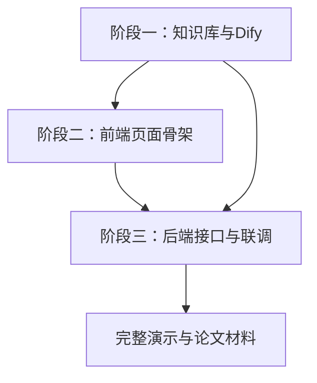

# 毕设三阶段实施计划

## 阶段一：LLM Wiki 知识库整理与 Dify Chatflow 搭建

目标：先把培养方案 PDF 变成可问答的知识库，跑通 AI 问询主线。

主要工作：
- 整理 `knowledge/raw/` 中的人才培养方案 PDF，确认需要覆盖的专业范围。
- 将 PDF 转为 Markdown，沉淀到 `knowledge/markdown/`，保留原文来源。
- 参考 LLM Wiki 思路，将培养方案整理为结构化知识页：专业页、毕业要求页、课程分类页、总览页。
- 将 PDF 或整理后的 Markdown 上传到 Dify 知识库。
- 创建 Dify Chatflow，设定“学业问询助手”系统提示词。
- 通过 FastAPI 预留 Dify Chatflow 调用接口，前期可先用 Postman/Apifox 验证。

阶段交付物：
- 初版培养方案知识库。
- Dify Chatflow 可回答毕业要求、课程分类、选课规则等问题。
- `docs/Dify配置说明.md`（索引入口）与 `plan/Dify问答测试清单.md`、`docs/mine/技术文档.md` 中 Dify 相关章节；密钥与 Dataset 等仅记录在根目录 `.env`。

## 阶段二：前端页面快速搭建

目标：用 AI Studio 或其他 AI 工具快速搭出可演示的 Web 页面骨架。

主要工作：
- 按 `技术文档.md` 中的页面划分，先搭建登录页、首页、学号查询页、AI 问询页。
- 再补论坛、课表、时间规划页面的基础 UI。
- 前端先使用 mock 数据，保证页面流程能点通。
- 封装统一 API 请求层，后续替换为真实后端接口。
- 统一基础样式和响应式布局，确保电脑浏览器和手机浏览器可用。

阶段交付物：
- `frontend/` 初版页面工程。
- 登录/首页/学号查询/AI 问询主流程可演示。
- 各模块页面入口完整，后端未完成时可用 mock 数据展示。

## 阶段三：后端建表、接口创建与分模块实现

目标：用 FastAPI + MySQL 实现真实业务数据与接口，逐步替换前端 mock 数据。

主要工作：
- 先完成数据库建表：用户、专业、课程、学生选课、毕业要求、课表、时间规划、论坛等核心表。
- 实现认证模块：注册、登录、JWT 校验。
- 实现学号查询模块：学生信息、毕业要求、已修课程、课程分类统计。
- 实现毕业进度计算：总学分、必修/选修/实践学分缺口，由代码计算，不依赖模型生成。
- 实现 AI 问询接口：后端查询学生上下文后调用 Dify Chatflow。
- 实现课表模块：周视图查询、备注编辑、学期切换。
- 实现时间规划模块：事件增删改查，后续可扩展自然语言创建事件。
- 实现论坛模块：发帖、列表、详情、评论、文件上传下载。
- 前后端逐页联调，替换 mock 数据。

阶段交付物：
- `backend/` FastAPI 工程可运行。
- MySQL 初始化脚本或迁移记录。
- 前端主要页面接入真实接口。
- 可完整演示：登录 → 学号查询 → 毕业进度 → AI 问询 → 课表/日历/论坛基础功能。

## 推荐执行顺序

## 关键原则

- AI 问答优先用 Dify Chatflow + 知识库跑通，不把简单 CRUD 强行放进 Dify 工作流。
- 毕业进度、学分缺口、课表、日历等确定性逻辑用 FastAPI 代码实现。
- 前端先 mock，后端分模块替换，避免一开始卡在全链路联调。
- LLM Wiki + Chroma 作为自建 RAG 技术亮点，可先保留方案，后续视时间决定实现深度。

---

## 与仓库同步说明（2026-04-30）

- **阶段一～三**：仓库内已具备 `knowledge/`、`data/`、`schemas/`、`scripts/knowledge_pipeline/`、`frontend/`、`backend/` 等主线产物；前端主要页面已对接真实后端，不再依赖 mock 跑通主流程。
- **阶段二交付物表述**：历史文档中「先用 mock」仍描述早期策略；当前实现以**真实接口**为准。
- **阶段四（integration-demo）**：联调与可演示链路在仓库内已可跑；**论文、答辩 PPT、部署说明定稿**仍属个人结题材料，故 YAML 中该项保持 `pending`，由你结题前勾选完成。