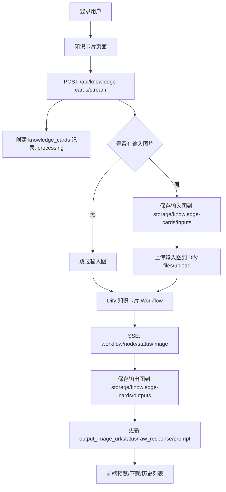

# 知识卡片功能接入计划

## 功能定位

知识卡片功能单独作为一条产品线，不合并进现有 AI 问询。

原因：

- 现有 AI 问询负责学业数据、培养方案知识库、Dify Agent 工具调用和多轮问答。
- 知识卡片负责内容视觉化、图片资产生成、结果预览/下载、历史记录管理。
- 两者输入输出差异很大：AI 问询产物是文本回答，知识卡片产物是图片和 prompt。
- 单独页面更利于答辩说明“AI 学习辅助”中的视觉化创作模块，也能避免 AI 问询页面职责过重。

后续可做轻量联动：AI 问询结果旁增加“生成知识卡片”按钮，跳转到知识卡片页面并带入文本；但第一版不把知识卡片生成逻辑嵌进 AI 问询流。

## 已知基础

- Dify 工作流已由用户搭好，仓库内已有模板说明：
  - `docs/dify/知识卡片模板.md`
  - `docs/dify/知识卡片模板节点.py`
- 模板当前包含 7 套单图版式：
  - 框架方法论
  - 人文剪贴簿
  - 阶段沿革手帐
  - 理科公式手账
  - AI 工具工作流手绘海报
  - 复古科学百科图鉴
  - 涂鸦思维导图
- 第一版明确不支持多图输入，只支持：
  - 纯文本输入
  - 单张图片输入
  - 文本 + 单张图片混合输入
- 第一版不允许用户选择风格、模板或模板编号；Dify 工作流根据内容自动路由到合适模板，后端只保存最终采用的 `template_id` / `image_number` 用于历史展示和排查。

## 总体链路



## Dify 工作流契约（落地前确认）

实现前必须确认以下信息，并写入 `.env`：

```env
DIFY_KNOWLEDGE_CARD_API_BASE=https://dify.maplexian.cn/v1
DIFY_KNOWLEDGE_CARD_API_KEY=app-xxx
DIFY_KNOWLEDGE_CARD_WORKFLOW_ID=xxx
DIFY_KNOWLEDGE_CARD_TIMEOUT_SECONDS=180
```

当前 Dify 知识卡片应用实测输入变量：

| 变量名 | 类型 | 说明 |
|--------|------|------|
| `content` | string | 用户输入的知识文本，可为空但不能和图片同时为空 |
| `prompt` | string | 可选，用户补充要求 |

后端会同时兼容发送旧计划变量：

| 变量名 | 类型 | 说明 |
|--------|------|------|
| `input_text` | string | 用户输入的知识文本，可为空但不能和图片同时为空 |
| `input_image` | file 或 file id | 单张输入图片；由后端先上传到 Dify `/files/upload` 后传入 |
| `template_id` | string | 内部可选变量；第一版前端不传，由 Dify 工作流自动路由 |
| `image_number` | string/int | 内部可选变量；第一版前端不传，和现有模板节点兼容 |
| `extra_prompt` | string | 可选，用户补充要求 |

建议 Dify 工作流输出字段：

| 字段名 | 类型 | 说明 |
|--------|------|------|
| `title` | string | 卡片标题 |
| `prompt` | string | 最终发给生图模型的完整 prompt |
| `template_id` | string | 最终采用的模板 ID |
| `image_number` | string | 最终采用的模板编号 |
| `image_url` | string | 生成图片 URL，优先使用 |
| `image_base64` | string | 生成图片 base64，若无 URL 则后端解码落盘 |
| `summary` | string | 可选，知识内容摘要 |

实际 Dify 输出示例为：

```json
{
  "answer": "https://dify.maplexian.cn/files/tools/xxx.png?...",
  "files": []
}
```

后端已适配从 `answer` 文本中提取图片 URL；如果实际字段切换为 `image_url` 或 `image_base64`，后端也会继续兼容，不要求前端感知 Dify 细节。

## 数据库设计

第一版使用一张主表，不拆多资产表，因为明确只支持单张输入图和单张输出图。

表名：`knowledge_cards`

| 字段 | 类型建议 | 说明 |
|------|----------|------|
| `id` | bigint PK | 自增主键 |
| `user_id` | bigint index | 生成用户 ID |
| `title` | varchar(150) null | 卡片标题，Dify 返回或从输入摘要生成 |
| `input_type` | varchar(20) | `text` / `image` / `mixed` |
| `input_text` | text null | 用户输入的知识文本 |
| `input_image_path` | varchar(255) null | 后端保存的输入图片相对路径 |
| `input_image_url` | varchar(255) null | 前端可访问输入图片 URL |
| `input_image_mime` | varchar(80) null | 输入图片 MIME |
| `input_image_size` | bigint null | 输入图片大小 |
| `template_id` | varchar(100) null | 采用的模板 ID |
| `image_number` | varchar(20) null | 模板编号 1～7 |
| `route_reason` | varchar(255) null | Dify 自动选择模板的简要原因，可选 |
| `prompt` | mediumtext null | 最终生图 prompt |
| `extra_prompt` | text null | 用户补充要求 |
| `status` | varchar(30) | `pending` / `processing` / `succeeded` / `failed` |
| `dify_workflow_run_id` | varchar(100) null | Dify workflow run id |
| `dify_task_id` | varchar(100) null | Dify task id |
| `output_image_path` | varchar(255) null | 生成图片后端相对路径 |
| `output_image_url` | varchar(255) null | 生成图片前端访问 URL |
| `raw_response` | json null | Dify 关键原始响应，需过滤密钥 |
| `error_message` | text null | 失败原因 |
| `created_at` / `updated_at` | datetime | 沿用 `TimestampMixin` |

索引建议：

- `idx_knowledge_cards_user_created`：`user_id, created_at`
- `idx_knowledge_cards_status`：`status`
- `idx_knowledge_cards_template`：`template_id`

迁移策略：

- 仓库当前没有完整 Alembic 体系，已有 `backend/scripts/migrate_forum_comment_files.py` 采用幂等脚本。
- 新增 `backend/scripts/migrate_knowledge_cards.py`：
  - 检查 `knowledge_cards` 是否存在，不存在则建表。
  - 检查索引是否存在，不存在则创建。
  - 本地和云端均可重复运行。

## 后端设计

### 文件结构

建议新增：

```text
backend/app/models/knowledge_card.py
backend/app/schemas/knowledge_card.py
backend/app/services/knowledge_card.py
backend/app/api/v1/knowledge_card.py
backend/scripts/migrate_knowledge_cards.py
```

同时更新：

```text
backend/app/models/__init__.py
backend/app/api/v1/router.py
backend/app/core/config.py
backend/README.md
.env.example
logs/开发日志/YYYY-MM.md
```

### 配置项

在 `Settings` 中新增：

```python
knowledge_card_dify_api_base: str
knowledge_card_dify_api_key: str | None
knowledge_card_dify_workflow_id: str | None
knowledge_card_timeout_seconds: float
```

`.env.example`：

```env
DIFY_KNOWLEDGE_CARD_API_BASE=https://dify.maplexian.cn/v1
DIFY_KNOWLEDGE_CARD_API_KEY=
DIFY_KNOWLEDGE_CARD_WORKFLOW_ID=
DIFY_KNOWLEDGE_CARD_TIMEOUT_SECONDS=180
```

不要复用 `DIFY_APP_API_KEY`，避免学业问询 Agent 和知识卡片工作流互相影响。

### API 设计

#### `POST /api/knowledge-cards/stream`

主要生成接口，使用 SSE，避免 Dify 工作流/生图超时导致前端一直无反馈。

请求形式建议使用 `multipart/form-data`：

| 字段 | 必填 | 说明 |
|------|------|------|
| `inputText` | 否 | 知识文本 |
| `image` | 否 | 单张图片 |
| `extraPrompt` | 否 | 用户补充要求 |

约束：

- `inputText` 和 `image` 至少一个存在。
- 第一版只允许一张图片。
- 第一版不接收 `templateId`、`imageNumber`、`style` 等用户选择项；模板选择交给 Dify 工作流自动路由。
- 图片限制建议：`jpg/png/webp`，大小不超过 `10MB`。
- 需要 JWT 登录，用户只能看到自己的卡片；管理员可后续扩展查看全部。

SSE 事件：

| event | 字段 | 说明 |
|-------|------|------|
| `status` | `message`, `cardId` | 阶段提示，例如保存输入、调用 Dify、生成图片 |
| `workflow` | `node`, `message`, `cardId` | Dify 节点开始/结束，供前端展示路径 |
| `preview` | `imageUrl`, `cardId` | 已拿到输出图时立即预览 |
| `done` | `card` | 生成成功，返回完整卡片 |
| `error` | `message`, `cardId` | 失败并落库 |

后端应解析 Dify 工作流 streaming 事件：

- `workflow_started`
- `node_started`
- `node_finished`
- `workflow_finished`
- `error`
- `ping`

并转成上述前端 SSE。

#### `POST /api/knowledge-cards`

可选的非流式接口，作为后续脚本/移动端备用。第一版可以暂缓，避免重复维护。

#### `GET /api/knowledge-cards`

分页查询当前用户历史：

参数：

- `page`
- `pageSize`
- `status`
- `q`

返回字段：

- `items`
- `total`
- `page`
- `pageSize`

列表项只返回轻量字段：

- `id`
- `title`
- `status`
- `inputType`
- `outputImageUrl`
- `templateId`
- `imageNumber`
- `createdAt`

#### `GET /api/knowledge-cards/{card_id}`

详情接口，返回：

- 输入文本
- 输入图 URL
- prompt
- 输出图 URL
- Dify run id
- status
- error message
- createdAt / updatedAt

#### `GET /api/knowledge-cards/{card_id}/image`

可选。若输出图通过 `/storage/knowledge-cards/outputs/...` 静态暴露，可以不做该接口。

#### `DELETE /api/knowledge-cards/{card_id}`

第一版建议先做软删除或暂不开放。若开放，需只允许删除当前用户自己的记录，不删除物理图片，避免历史引用失效。

### 图片存储

沿用后端 `settings.upload_dir`，建议目录：

```text
backend/storage/knowledge-cards/
  inputs/
  outputs/
```

URL 建议：

```text
/api/knowledge-cards/{card_id}/files/input
/api/knowledge-cards/{card_id}/files/output
```

落地实现采用授权接口读取，不直接暴露 `storage` 目录：

- 数据库存储 `input_image_path` / `output_image_path` 作为服务器本地相对路径。
- 数据库存储 `input_image_url` / `output_image_url` 作为前端可访问 API 路径。
- 前端使用 `fetch` 携带 JWT 获取图片 blob，再转换为 `ObjectURL` 展示和下载。
- 这样即使 Dify/Gemini 返回的是短期签名 URL，系统也只在生成完成后立即拉取一次，长期展示依赖本地落盘图片。

输出图保存逻辑：

1. 如果 Dify 返回 `image_url`：
   - 后端下载图片到 `outputs/`。
   - 保存本地 `output_image_path` / `output_image_url`。
   - 不长期依赖 Dify 临时 URL。
2. 如果 Dify 返回 `image_base64`：
   - 后端解码并写入 `outputs/`。
3. 如果 Dify 返回文件 ID：
   - 调 Dify 文件接口或可访问 URL获取二进制，再落盘。

### Dify 调用细节

文本输入：

```json
{
  "inputs": {
    "content": "...",
    "prompt": "...",
    "input_text": "...",
    "extra_prompt": "..."
  },
  "response_mode": "streaming",
  "user": "student_id_or_user_id"
}
```

说明：

- 当前 Dify 知识卡片应用的主输入变量是 `content`，补充要求变量是 `prompt`。
- 后端同步发送 `input_text` / `extra_prompt` 作为兼容字段，方便未来切回标准 Workflow 变量名。
- 第一版不从前端传 `template_id`、`image_number` 或 `style`；Dify 工作流内部根据 `content` / `input_image` 路由模板，并在输出中返回最终采用的模板信息。
- 若 Dify Key 对应的不是 Workflow App，后端会从 `/workflows/run` 自动降级到 `/chat-messages`。

图片输入：

1. 后端保存原始图片。
2. 调 Dify `/files/upload` 获取 `upload_file_id`。
3. 调 workflow 时传入文件变量，具体字段以 Dify 工作流输入节点为准。

注意：

- 不把 Dify API Key 返回给前端。
- raw response 落库前过滤 Authorization、API Key、临时文件 token。
- Dify 超时或失败时，记录 `failed`，前端可看到失败原因。
- SSE 过程中如果客户端断开，后端仍应尽量把当前任务状态落库为 `failed` 或保持 `processing` 并提供后续补偿脚本。

## 前端设计

### 文件结构

建议新增：

```text
frontend/src/views/KnowledgeCard/index.vue
frontend/src/api/modules/knowledgeCard.ts
frontend/src/types/knowledgeCard.ts
```

同时更新：

```text
frontend/src/router/index.ts
frontend/src/components/Layout/index.vue
frontend/src/components/AdminLayout/index.vue（如管理员也展示）
frontend/README.md
```

### 页面入口

学生端/通用侧边栏新增菜单：

- 名称：`知识卡片`
- 路径：`/knowledge-cards`
- 图标：可用现有图标库中的 picture / magic / document 图标。

管理员端是否显示：

- 第一版建议学生和管理员都可使用该功能，管理员生成的是自己的卡片历史。
- 若需要管理员查看全站卡片，后续单独做管理页。

### 页面布局

默认页是 `Knowledge Gallery`，不是生成表单。

顶部操作栏：

- 搜索框：按标题、摘要、输入文本关键词搜索历史卡片。
- 分类标签：第一版仅作为筛选展示项，来源于后端返回的 `template_id` / `image_number` 映射名称；用户不能在生成前选择风格。
- `+ 新建卡片` 按钮：打开 Drawer。

主体展示区：

- 使用网格画廊，第一版不做复杂瀑布流；知识卡片基本为 3:4 竖图，统一网格更稳。
- 每张卡片展示缩略图、标题、生成时间、状态、模板类型。
- `processing` 卡片显示骨架屏和“生成中”状态，用户可以离开页面后回来继续看到历史状态。
- `failed` 卡片展示失败原因和“重试”入口。
- 点击卡片打开预览弹窗，展示高清图、prompt、输入摘要，并提供下载、复制 prompt。
- 详情弹窗优先复用画廊已经加载好的 `cardImageUrls[id]`，避免同一张图片重复请求；如果缓存不存在，再通过 `outputImageUrl` 重新拉取授权图片。
- 详情弹窗拉图失败时保留页面可用状态并提示用户刷新画廊，不应因为一次图片 fetch 失败就把已生成卡片误判为“无输出图”。

新建 Drawer：

- 文本输入框：`inputText`
- 单图上传：限制 1 张
- 补充要求：`extraPrompt`
- 生成按钮
- 流式状态列表：展示保存输入、调用 Dify、节点执行、图片落盘等过程。
- 结果预览：生成成功后在 Drawer 内立即展示图片，并同步刷新画廊。

明确删除：

- 不展示风格选择。
- 不展示模板选择。
- 不展示模板编号选择。
- 不允许用户直接指定 `templateId` / `imageNumber` / `style`。

### 前端流式处理

新增 `generateKnowledgeCardStream(form, handlers)`：

- 使用 `fetch` + `ReadableStream`，参考现有 `frontend/src/api/modules/ai.ts` 的 `sendMessageStream`。
- 解析后端 SSE：
  - `status`：加入状态列表。
  - `workflow`：展示 Dify 节点路径。
  - `preview`：立即展示图片。
  - `done`：更新完整 card。
  - `error`：展示错误。

前端不要直接调用 Dify，不保存 Dify Key。

### 表单交互

基础校验：

- 文本和图片至少填一个。
- 图片最多 1 张。
- 文本建议最多 8000 字，超出前端提示压缩内容。
- 图片大小建议不超过 10MB。
- 生成中禁用按钮，显示“正在生成知识卡片”。

错误提示：

- Dify 未配置：提示“知识卡片工作流未配置，请检查服务端配置”。
- 生成超时：提示“生成耗时较长，可稍后在历史记录查看结果”。
- 图片格式不支持：提示支持格式。

## 流式与防超时策略

优先使用 SSE，不让前端等待一个长 HTTP JSON 响应。

后端策略：

1. 接到请求后立即创建数据库记录，状态 `processing`。
2. 立即发 `status: 已创建知识卡片任务`。
3. 保存输入图并发 `status: 已保存输入素材`。
4. 调 Dify 工作流 streaming。
5. Dify 每个节点事件都转成 `workflow/status`。
6. 拿到图片后落盘并发 `preview`。
7. 更新数据库为 `succeeded` 并发 `done`。
8. 捕获异常，更新数据库为 `failed` 并发 `error`。

超时策略：

- 后端 `httpx.AsyncClient(timeout=None)` 或分阶段 timeout，避免大图生成被 60 秒截断。
- 配置 `DIFY_KNOWLEDGE_CARD_TIMEOUT_SECONDS=180` 作为最大业务等待。
- 如果超过最大等待：
  - 数据库状态改为 `failed` 或 `processing_timeout`。
  - 前端提示用户稍后重试。
- 如果 Dify 支持任务查询接口，第二阶段可把超时任务保留为 `processing`，通过后台补偿轮询更新。

第一版建议简单可靠：超时标记 `failed`，保留输入、prompt 和错误信息，用户可一键重试。

## 权限与隐私

- 所有接口需要登录 JWT。
- 普通用户只能查自己的知识卡片记录。
- 管理员第一版也只查自己的记录，不做全站审核。
- 输入图片和输出图片不要暴露真实磁盘路径。
- Dify API Key、Dify 原始 Authorization、上传临时 token 不落库、不返回前端。
- prompt 可以展示给用户，但要确认 prompt 中不包含密钥或后端内部路径。

## 与 AI 问询的关系

第一版不集成进 AI 问询页面，只单独做功能页，范围锁定为：画廊 + 新建 Drawer + 流式生成 + 历史留存。

首版不做 AI 问询回答“一键萃取”、静默后台生成、Toast 完成通知或导航小红点；这些都放到第二阶段，避免首版范围失控。

第二阶段可做轻量联动：

- AI 问询回答下方加“生成知识卡片”按钮。
- 点击后跳转 `/knowledge-cards?from=ai&conversationId=...` 或通过 store 带入文本。
- 知识卡片页面自动填充输入文本，用户确认后生成。
- 再后续才考虑“静默后台生成 + Toast/小红点提醒”。第一版不做后台任务列表。

不建议：

- 让 AI 问询的 Dify Agent 直接调用知识卡片工作流。
- 在同一个聊天窗口里混合图片生成任务和学业工具调用。

原因：

- 生图耗时长，容易影响问答体验。
- 历史记录和产物管理不同。
- 工具链复杂后，Agent 更容易选错工具。

## 实施顺序

### 第一步：确认 Dify Workflow 契约

- 确认 API Key、Workflow ID、输入变量、输出字段。
- 用 curl 或 Python 脚本直接跑一次 workflow streaming。
- 明确输出图片是 URL、base64 还是 file id。

验收：

- 后端可拿到 prompt 和输出图片。
- 记录 Dify 成功与失败时的返回样例。

### 第二步：建表与后端模型

- 新增 `KnowledgeCard` model。
- 新增 schema。
- 新增幂等迁移脚本。
- 更新 `models/__init__.py`。

验收：

- 本地迁移可重复运行。
- 表和索引存在。

### 第三步：后端生成接口

- 新增 `/api/knowledge-cards/stream`。
- 新增历史列表和详情接口。
- 接入 Dify workflow streaming。
- 图片落盘。
- raw response 过滤敏感信息。

验收：

- 文本输入可生成图片。
- 单图输入可生成图片。
- 失败会落库并返回 SSE error。
- 历史列表能看到成功/失败记录。

### 第四步：前端页面

- 新增画廊页面与路由。
- 新增 API 模块和类型。
- 实现搜索、分类筛选、卡片网格、预览弹窗。
- 实现新建 Drawer、文本输入、单图上传、状态流、预览、下载、历史刷新。

验收：

- 用户可从菜单进入页面。
- 页面默认展示卡片画廊。
- 点击 `+ 新建卡片` 后 Drawer 打开。
- 生成过程中能看到节点进度。
- 成功后能预览和下载图片。
- 刷新后历史仍可查看。
- 页面不出现风格/模板选择控件。

### 第五步：云端部署

- 同步代码。
- 云端 `.env` 添加 Dify 知识卡片配置。
- 执行迁移脚本。
- 重启后端。
- 构建前端并发布静态资源。

验收：

- 公网登录后可生成知识卡片。
- 生成时间较长时页面不白屏、不超时。
- 服务器 storage 中有输入/输出图片。
- 数据库有 prompt、状态、输出图 URL。

## 风险点

- Dify 工作流输出图片字段不固定，需要先确认契约。
- 生图接口耗时可能超过常规 HTTP 超时，必须用 SSE。
- Dify 返回的图片 URL 可能是临时 URL，必须后端落盘保存。
- 图片文字可能出现错别字，前端应允许复制 prompt 或重新生成。
- 用户输入大段文本可能导致工作流成本和时长上升，需要限制长度。
- 图片上传体积过大可能影响后端内存，应限制大小并流式写文件。

## 第一版不做

- 多图输入。
- 批量生成。
- 用户选择风格、模板或模板编号。
- 管理员查看全站知识卡片。
- 图片编辑器。
- AI 问询内直接调用知识卡片工具。
- 后台异步队列和任务补偿。

## 后续增强

- AI 问询回答一键转知识卡片。
- 支持多模板预览和重生成。
- 支持公开/收藏/分享卡片。
- 管理员审核优秀卡片。
- 卡片生成失败自动重试。
- 接入对象存储，避免本地磁盘膨胀。
